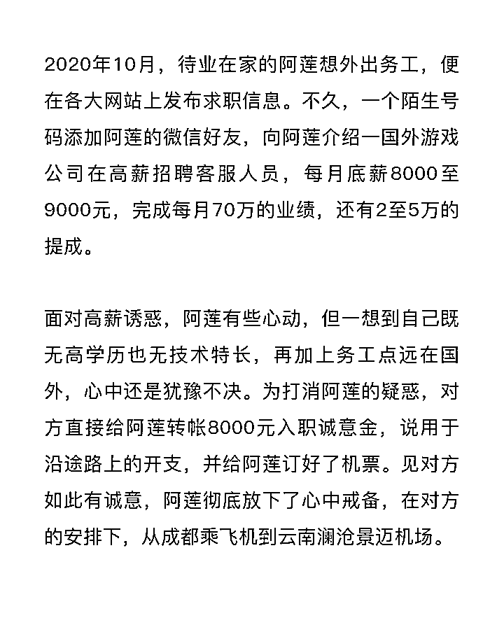
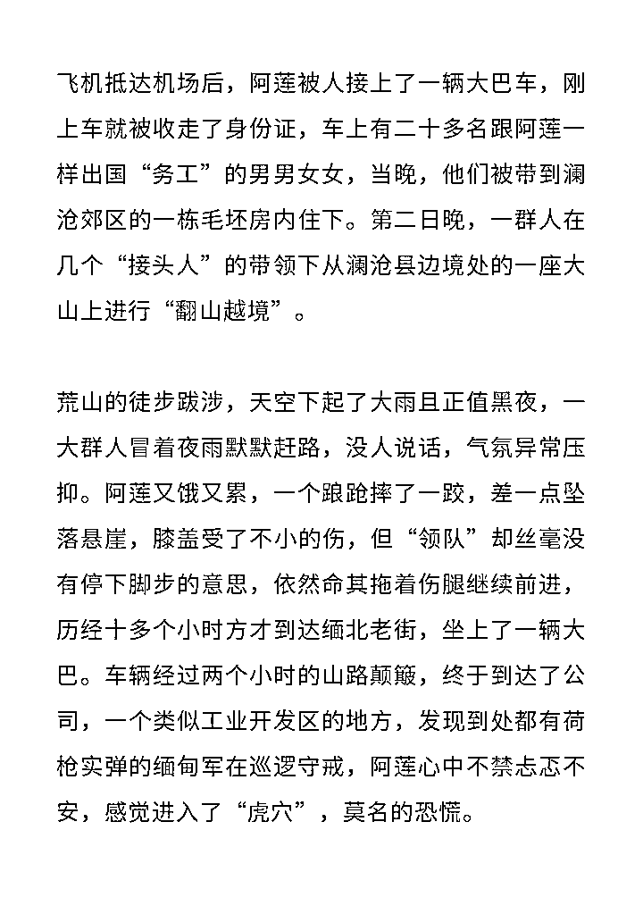
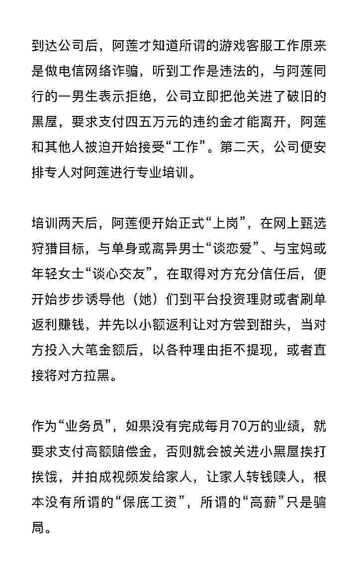
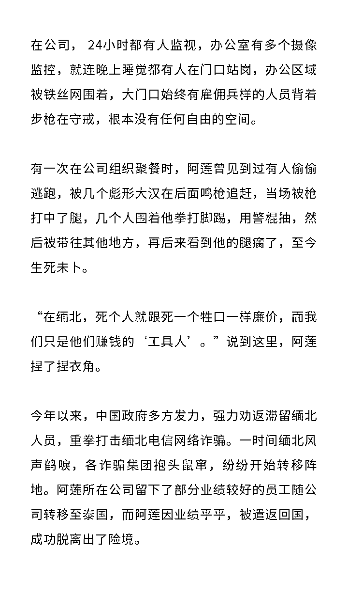

# 川妹子阿莲在缅北那段不堪回首的日子……

> 原文：[`mp.weixin.qq.com/s?__biz=MzIyMDYwMTk0Mw==&mid=2247518577&idx=1&sn=dd57aac3e35cb3f3d3cb4f52bdfa9ac8&chksm=97cb4249a0bccb5f2911e90f58f6e21920e83400ea2e8f1dded2258bb7b096c61fb60a3e5799&scene=27#wechat_redirect`](http://mp.weixin.qq.com/s?__biz=MzIyMDYwMTk0Mw==&mid=2247518577&idx=1&sn=dd57aac3e35cb3f3d3cb4f52bdfa9ac8&chksm=97cb4249a0bccb5f2911e90f58f6e21920e83400ea2e8f1dded2258bb7b096c61fb60a3e5799&scene=27#wechat_redirect)

“到缅甸以后，24 小时被人持枪监禁，人身基本没有自由，过去了之后就后悔被骗了。”这位在“断卡”行动中被自贡富顺警方抓获的缅北归国者阿莲说道。在缅北到底经历了什么？让她对自己的这段务工经历心有余悸。让我们来听听——缅北归国者的诉说。

# 01

**高薪诱惑，远赴缅北“淘金”**

[`mp.weixin.qq.com/mp/readtemplate?t=pages/video_player_tmpl&action=mpvideo&auto=0&vid=wxv_1985799722086776833`](https://mp.weixin.qq.com/mp/readtemplate?t=pages/video_player_tmpl&action=mpvideo&auto=0&vid=wxv_1985799722086776833)

# 02

**偷越边境，被骗掉入“虎穴”**

[`mp.weixin.qq.com/mp/readtemplate?t=pages/video_player_tmpl&action=mpvideo&auto=0&vid=wxv_1985819915966038018`](https://mp.weixin.qq.com/mp/readtemplate?t=pages/video_player_tmpl&action=mpvideo&auto=0&vid=wxv_1985819915966038018)

[`mp.weixin.qq.com/mp/readtemplate?t=pages/video_player_tmpl&action=mpvideo&auto=0&vid=wxv_1985830989348028424`](https://mp.weixin.qq.com/mp/readtemplate?t=pages/video_player_tmpl&action=mpvideo&auto=0&vid=wxv_1985830989348028424)

# 03

**深陷囹圄，沦为诈骗“工具”**

[`mp.weixin.qq.com/mp/readtemplate?t=pages/video_player_tmpl&action=mpvideo&auto=0&vid=wxv_1985829334191783945`](https://mp.weixin.qq.com/mp/readtemplate?t=pages/video_player_tmpl&action=mpvideo&auto=0&vid=wxv_1985829334191783945)

[`mp.weixin.qq.com/mp/readtemplate?t=pages/video_player_tmpl&action=mpvideo&auto=0&vid=wxv_1985835243949342721`](https://mp.weixin.qq.com/mp/readtemplate?t=pages/video_player_tmpl&action=mpvideo&auto=0&vid=wxv_1985835243949342721)

# 04

**风声鹤唳，逃离险境“回家”**

[`mp.weixin.qq.com/mp/readtemplate?t=pages/video_player_tmpl&action=mpvideo&auto=0&vid=wxv_1985854304309559298`](https://mp.weixin.qq.com/mp/readtemplate?t=pages/video_player_tmpl&action=mpvideo&auto=0&vid=wxv_1985854304309559298)

[`mp.weixin.qq.com/mp/readtemplate?t=pages/video_player_tmpl&action=mpvideo&auto=0&vid=wxv_1985869264821501954`](https://mp.weixin.qq.com/mp/readtemplate?t=pages/video_player_tmpl&action=mpvideo&auto=0&vid=wxv_1985869264821501954)

缅北归来梦方醒。“还是中国好”、“我希望大家不要相信国外高薪招聘的信息，也不要铤而走险去挣昧心钱，很可能钱没挣到，还把自己的命搭进去了。”这是阿莲对那些想到国外淘金者的最真实告诫。

[`mp.weixin.qq.com/mp/readtemplate?t=pages/video_player_tmpl&action=mpvideo&auto=0&vid=wxv_1985858636606160899`](https://mp.weixin.qq.com/mp/readtemplate?t=pages/video_player_tmpl&action=mpvideo&auto=0&vid=wxv_1985858636606160899)

来源：自贡市反诈中心，熊猫反诈，昆明反电信网络诈骗中心

← 向右滑动与灰产圈互动交流 →

