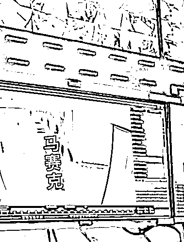
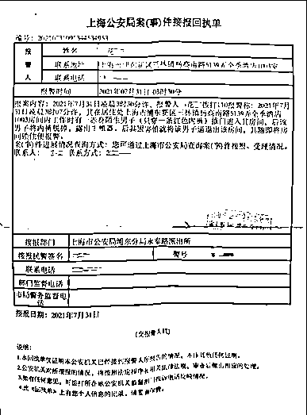
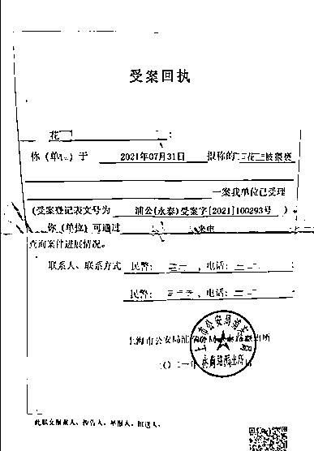
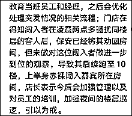
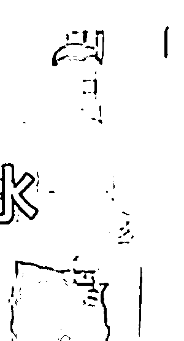
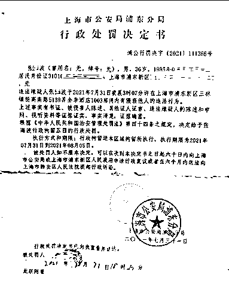
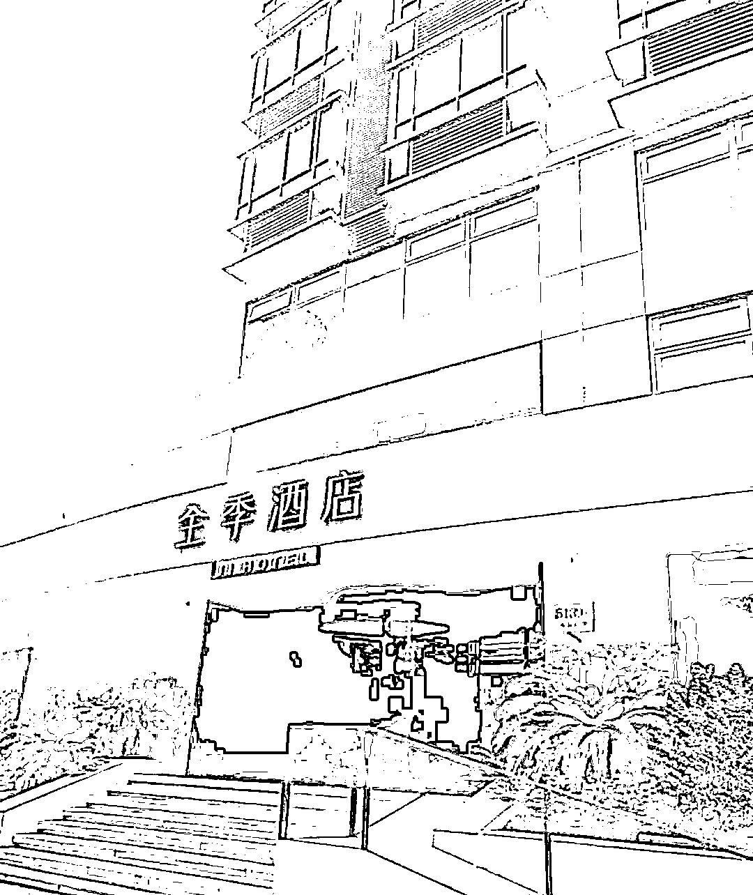
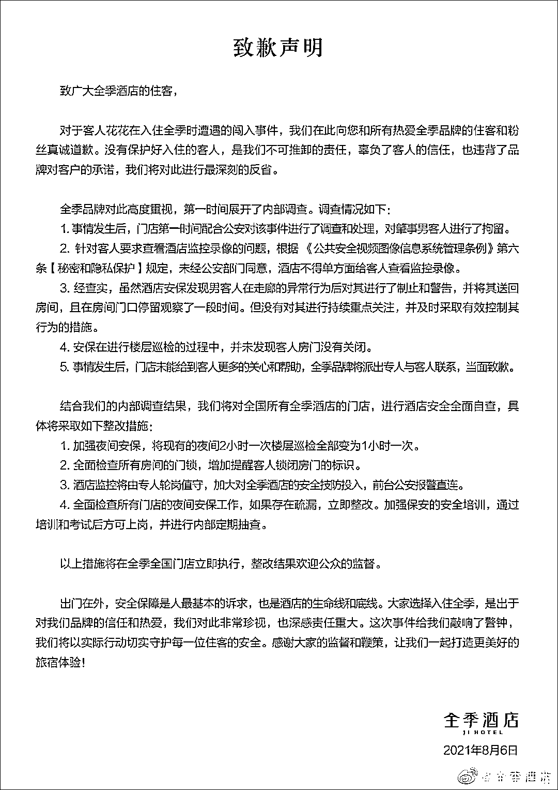

# 裸男半夜闯入女住客房间，全季酒店道歉！

> 原文：[`mp.weixin.qq.com/s?__biz=MzIyMDYwMTk0Mw==&mid=2247518577&idx=2&sn=6956807664678ed149fa0a9effe4bd30&chksm=97cb4249a0bccb5f4ac63b9755178cd88c5674113cc84bc7df39ceeb9ae0e2f1903a193d3ae4&scene=27#wechat_redirect`](http://mp.weixin.qq.com/s?__biz=MzIyMDYwMTk0Mw==&mid=2247518577&idx=2&sn=6956807664678ed149fa0a9effe4bd30&chksm=97cb4249a0bccb5f4ac63b9755178cd88c5674113cc84bc7df39ceeb9ae0e2f1903a193d3ae4&scene=27#wechat_redirect)

“夜半三点，男子光着闯入我房间，请给我一个说法！”

8 月 5 日晚，网友@fiore 花花 花女士微博发声，讲述了自己 7 月 30 日晚在上海浦东新区三林镇杨高南路全季酒店的遭遇。7 月 31 日凌晨 3 时许，一赤身男子闯入花女士房间，脱掉内裤，并且露出生殖器。花女士又惊又怕，将该男子赶出并报警。

花女士称，**自己房间的门是关着的，但该男子却打开了房门**。而酒店监控显示，该男子自凌晨 2 时 21 分，就从酒店 7 楼开始，赤身尝试打开每个房间的房门，整个过程持续将近 50 分钟，而**期间酒店安保及工作人员根本没有发现制止**。

在事发后，**全季酒店工作人员开始不愿让她看监控；直到她离开酒店，全季也没有给出处理方案**。花女士称，自己将维权到底，追究涉事男子及全季酒店的责任。

6 日下午，观察者网就此事致电涉事酒店，对方工作人员表示不便回应。警方则对媒体回应表示，确有此事，具体细节不便透露，目前，**涉事男子因猥亵他人被处以行政拘留 5 日的处罚。**

6 日下午，全季酒店官方微博发布致歉声明，对花女士表示歉意，并且在第一时间展开内部调查，颁布整改措施。

<mpvideosnap class="js_uneditable custom_select_card channels_iframe" data-pluginname="videosnap" data-id="export/UzFfAgtgekIEAQAAAAAAJpsZ35JpEgAAAAstQy6ubaLX4KHWvLEZgBPE04J0OD1EKKP-zNPgMIv3PG1UWHaGzFFrzMc-igpY" data-url="https://findermp.video.qq.com/251/20350/stodownload?encfilekey=XGocBFxVWK5dcyOOqpEU47RpBHQIvlhnHKyj2aXmBJLKRtlOoMbQVpyWFbPlLR4DAKEPXChbb7Vl7UO7DZG8ul2iaZkS1ViakBmPAyr2DoodC8f76TJ3Pnlzj5BMdvE3TyGVZG99dCD1MicJsdhdhpdkSHqzpLfZtqTCtrUhqbfToJDg5sq5xps1w&amp;adaptivelytrans=0&amp;bizid=1023&amp;dotrans=0&amp;hy=SH&amp;idx=1&amp;m=8529d68948651ebf43607831f5d96a3d&amp;token=x5Y29zUxcibClIMfm7IWMPhulNnEXKQXVzyiaepQdjFovPyjTM4EUQRUj7Ec9tNeiaYZpjPDSsiaSuw" data-headimgurl="http://wx.qlogo.cn/finderhead/PiajxSqBRaEISAKibugHhUQs74zK9sdqn9QvawbxCzU7AuxCgU4kpS0A/0" data-username="v2_060000231003b20faec8cae18b1bcad5cb00e937b0779ef044c516b0481d185bbca60dd9c21f@finder" data-nickname="灰产圈" data-desc="全季酒店男子夜半赤身闯入女顾客房间@灰产圈 " data-nonceid="6847743501821304787" data-type="video"></mpvideosnap>

据花女士在视频中讲述，7 月 30 日晚，她待在自己入住的全季酒店房间内办公，31 日凌晨 3 时 9 分，她正在与客户沟通工作时，突然发现床尾站着一陌生男子，浑身赤裸，提着一条红色内裤，并且试图靠近。花女士惊声喊道：“你是疯了吗？”

而该男子竟然言语侮辱：“装什么装呀，你门开着不就是让人进的吗？不就是为了让人来玩的吗？”

来源：@fiore 花花

花女士表示，**自己是关了房门的，酒店的门锁可能感应不是很灵敏。**此外，花女士还说道，监控显示该男子 3:07 就进入了房间，而自己 3:09 分才发现，这两分钟该男子在玄关处确认房间里只有自己一个人。

花女士一直喊人，该男子可能害怕了，就退出了房间。

花女士称，事情发生后，自己马上和前台沟通，表示要立刻报警，并且要求酒店调出当晚监控。但前台工作人员表示，酒店监控只有经理可以调取。而在经理到场后，拒绝给她看监控，表示只能提供给警方看。

最终在花女士的强烈要求下，酒店经理同意让当事人花女士看监控视频。

警方事件接报回执单 来源：@fiore 花花

受案回执 来源：@fiore 花花

花女士称，监控记录显示，**从凌晨 2:21 开始，该赤裸男子便从酒店 7 楼开始，尝试打开每间房间的房门，直到该男子打开自己房门为止，将近 50 分钟的时间内，全季酒店的安保和工作人员无人发现和制止。**

花女士还表示，事发前，该男子就已经被其他顾客投诉举报过一次，但酒店只是安排前台和安保人员将该男子送回房间内，并在其门外停留几分钟，发现该男子没有再走出房间后，酒店工作人员便离开了。

全季事后给出的事件回执片段 来源：@fiore 花花

确认完监控后，警察和花女士到 7 楼找到该男子房间，发现该男子正在睡觉。随后，警察与该男子交涉了 20 多分钟，期间该男子还能淡定喝水。

31 日上午九点，花女士接到警方电话前往派出所，涉事男子的家属表示希望可以私了此事，但遭到花女士拒绝。

花女士在视频中的录音信息显示，该男子的妻子称当时他只是喝醉了，他现在非常害怕；花女士还说道，该男子的岳父称此事毕竟没有造成什么实质性伤害，恳请她原谅。

与警方交涉时 涉事男子淡定喝水  来源：@fiore 花花

31 日下午 6 时，花女士接到派出所通知，对该男子的处理结果已经作出。根据花女士视频中提供的上海市公安局浦东分局开场的《行政处罚决定书》显示，违法嫌疑人张某某于 2021 年 7 月 31 日凌晨 3 时 7 分，在上海浦东新区三林镇杨高南路 5139 弄全季酒店 10xx 房间内有猥亵他人的违法行为，相关证据确凿、事实清楚。

最终，警方根据《中华人民共和国治安管理处罚法》第四十四条之规定，**决定给予张某某行政拘留 5 日的处罚**，执行期限为 2021 年 7 月 31 日至 2021 年 8 月 5 日。

来源：@fiore 花花

花女士称，全季酒店对此事的处理也让自己十分愤怒，不仅事发时不让自己看监控，直到自己搬离全季酒店时，该酒店负责人端了一盘水果来赔礼道歉。当花女士问及酒店对此事的具体处理方案时，该负责人回应称，此事等警方出具最终的处理结果后决定。

花女士称，自己一定要追责到底，追究该男子和全季酒店的责任。

涉事的全季酒店  来源：大众点评

8 月 6 日下午，观察者网就此事致电涉事的全季酒店，求证花女士反映的事件是否属实，全季酒店工作人员表示不便回应此事，之后会有负责对接媒体的同事联系回应。随后，观察者网致电全季酒店所属的华住酒店集团，但无人接听。

据极目新闻报道，上海市公安局浦东分局永泰路派出所工作人员表示确有此事，至于其他内容及细节不便透露。

6 日下午 14:47，全季酒店官方微博发布致歉声明，**对花女士真诚道歉，并且进行深刻反省。**

此外，全季酒店还在声明中公布了关于此事的内部调查结果。声明称，事件发生后，涉事的全季酒店第一时间配合公安调查处理，对肇事的男客人进行拘留；针对花女士所说的酒店不准其查看监控，全季酒店表示，根据《公共安全视频图像信息系统管理条例》第六条规定，未经公安部门同意，酒店不得单方面给客人查看监控录像。

对于花女士所说的安保人员未制止、房间门锁被打开、酒店处理态度消极等问题，全季酒店表示，酒店安保人员发现并制止了该男子的异常行为，但没有持续重点关注和及时有效制止；安保在楼层巡检中，并未发现客人房门没有关闭；全季酒店将派出专人与花女士联系，当面致歉。

全季酒店也颁布了整改措施，包括加强夜间安保、全面检查所有门锁并增加提醒客人关门的标示、酒店监控将由专人轮岗值守等措施。

来源：观察者网

← 向右滑动与灰产圈互动交流 →

