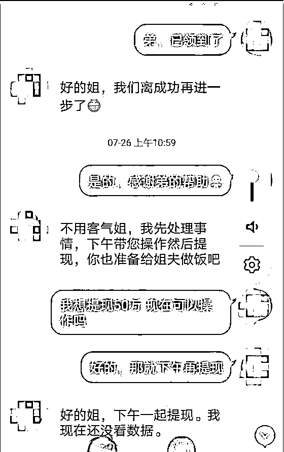
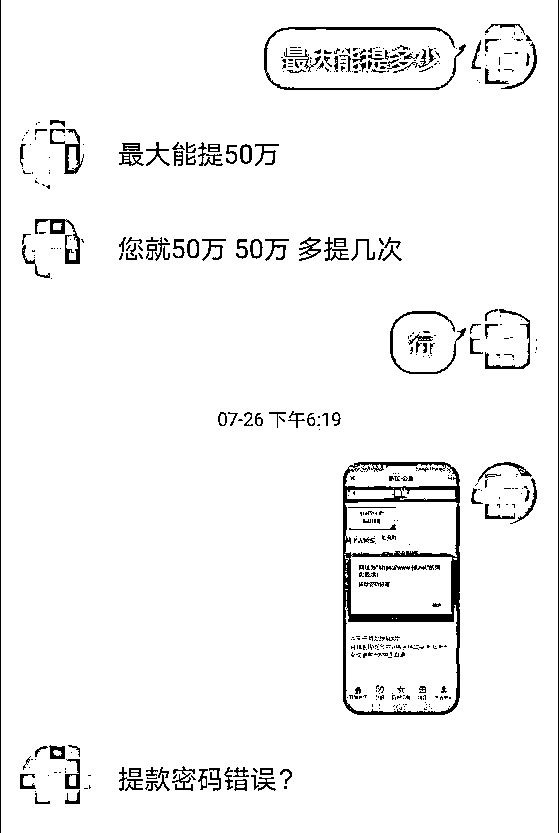
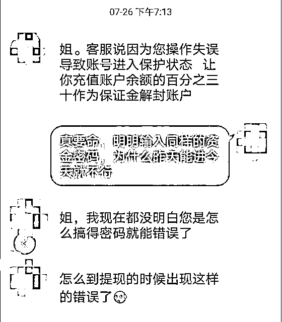
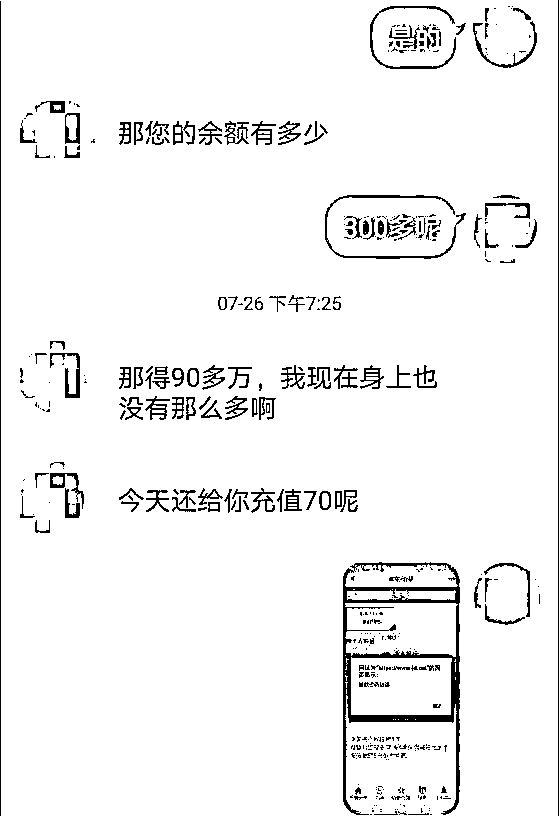
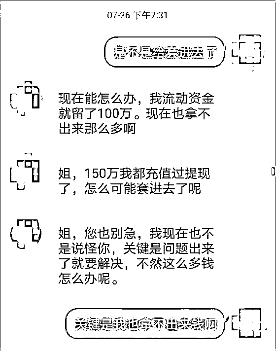
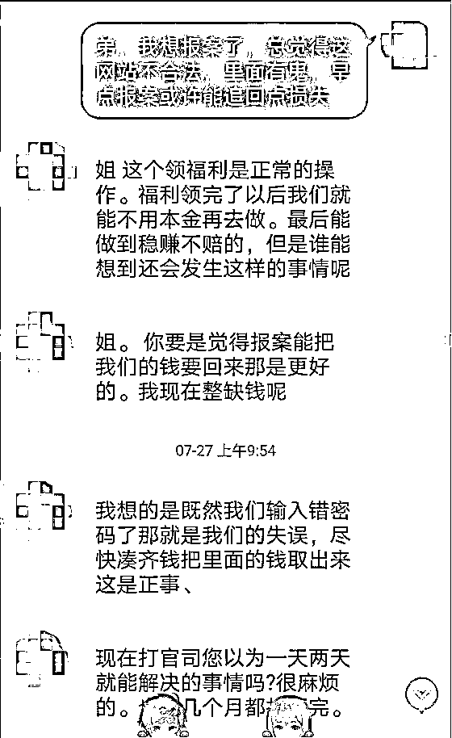
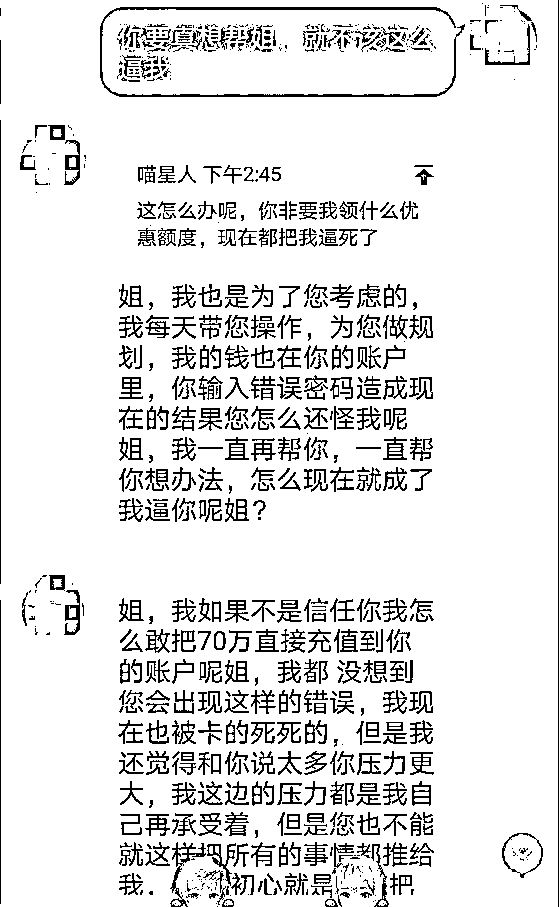
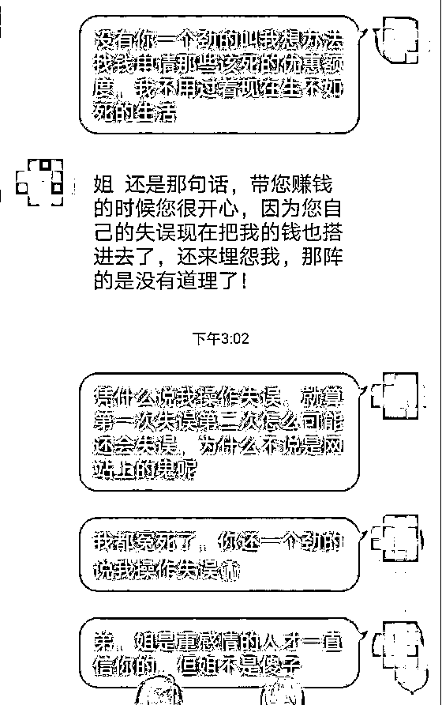

# 女子四年前被骗 170 万，遭遇“杀猪盘”又被骗走 80 万

> 原文：[`mp.weixin.qq.com/s?__biz=MzIyMDYwMTk0Mw==&mid=2247518577&idx=3&sn=f0492da329146393fbfa7803a83cd124&chksm=97cb4249a0bccb5f42f406c1eef7f1e5d7082c246e2efc7a026e58c8829bcf316c266ff1fc1a&scene=27#wechat_redirect`](http://mp.weixin.qq.com/s?__biz=MzIyMDYwMTk0Mw==&mid=2247518577&idx=3&sn=f0492da329146393fbfa7803a83cd124&chksm=97cb4249a0bccb5f42f406c1eef7f1e5d7082c246e2efc7a026e58c8829bcf316c266ff1fc1a&scene=27#wechat_redirect)

 四年前，家住芜湖市弋江区的李女士在网上投资虚拟币，被人骗取了 170 万元。

此事对李女士造成了巨大的伤害，她一直无法释怀。没想到四年后，李女士又遭遇“杀猪盘”骗局，又被骗走 80 万元。

今年 7 月初，李女士上网通过社交软件结识了一名男子周某，双方聊的很投缘。李女士向周某诉说自己曾经被骗的经历，谁知周某竟也告诉李女士自己在网上同样遭人诈骗。

“同是天涯沦落人”，两人惺惺相惜，李女士与周某瞬间拉近了距离，周某很会安慰人，一来二去，李女士很快便认定他为“知心”的弟弟。

7 月 23 日，几天没有消息的“弟弟”突然给李女士发来消息，称他知道有个投资网站有漏洞，想带着姐姐一起挣钱。

接着，周某给李女士发送了一条网页链接，让其注册。李女士抱着试试看的心态，点击了链接完成注册并绑定了自己的银行卡。

注册成功后，“知心弟弟”竟直接往李女士账户充值了 1000 元，在“弟弟”的一番指导下，李女士当天就“赚了”200 元。

为打消'姐姐"的疑虑，周某提议李女士尝试提现。1200 元提现后，轻松赚了 200 元的李女士打算将本金 1000 元还给“好弟弟”，可对方没有接收，并告诉李女士：姐弟俩今后要一起赚大钱，这 1000 元不算什么！李女士心存感激之余觉得这个“知心弟弟”真的靠谱！

在“弟弟”的操作指引下，李女士 3 天时间陆续向平台充值了 80 余万元。

可是到了提现环节，李女士总是提现失败。

骗子称是因为李女士操作失误导致的，并始终充当受害人角色，谎称通过充值保证金就能把钱拿出来，让李女士去贷款充值，去拿房产抵押！

此时，所有积蓄都被套光的李女士这才意识到了不对劲，连忙向警方报警。

民警接到报警后告知李女士，她落入的正是“杀猪盘”陷阱！

目前此案正在侦办中。

来源：新安晚报 安徽网 大皖新闻

← 向右滑动与灰产圈互动交流 →

