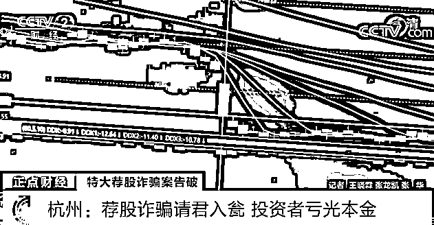
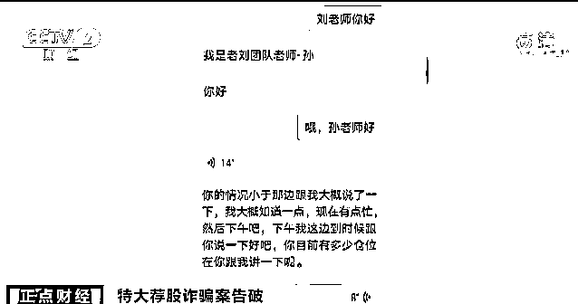
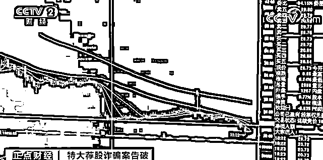
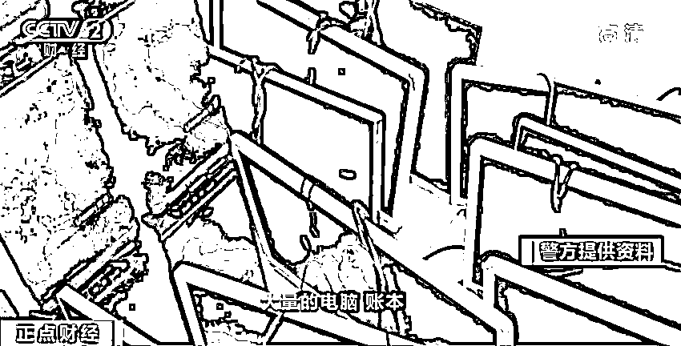
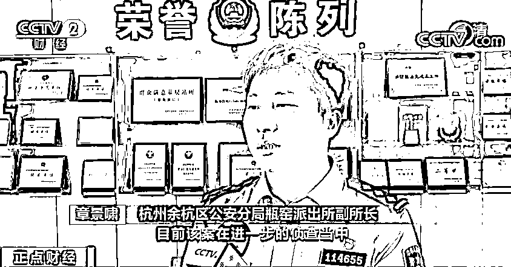

# “荐股团伙”被抓！这种“炒股平台”千万别碰！资金全部流入骗子口袋！

> 原文：[`mp.weixin.qq.com/s?__biz=MzIyMDYwMTk0Mw==&mid=2247518577&idx=4&sn=12020b29a5f330d2a48f8efd3c277a35&chksm=97cb4249a0bccb5f575b30d36a1ed8abfcfeff3c9e1ec772b5df5ab72352379ce4c031fc76d3&scene=27#wechat_redirect`](http://mp.weixin.qq.com/s?__biz=MzIyMDYwMTk0Mw==&mid=2247518577&idx=4&sn=12020b29a5f330d2a48f8efd3c277a35&chksm=97cb4249a0bccb5f575b30d36a1ed8abfcfeff3c9e1ec772b5df5ab72352379ce4c031fc76d3&scene=27#wechat_redirect)

近日，杭州警方摧毁了一个特大荐股诈骗团伙，该团伙通过所谓的大师荐股，引诱投资者进入团伙开设的炒股平台骗取钱财，涉案金额达 1000 万元。

杭州：荐股诈骗请君入瓮 投资者亏光本金

[`mp.weixin.qq.com/mp/readtemplate?t=pages/video_player_tmpl&action=mpvideo&auto=0&vid=wxv_1990396517504843777`](https://mp.weixin.qq.com/mp/readtemplate?t=pages/video_player_tmpl&action=mpvideo&auto=0&vid=wxv_1990396517504843777)

△央视财经《正点财经》栏目视频

家住杭州市的洪先生，平时喜欢自己炒炒股票，今年二三月份的一天，一位自称姓余的先生给他打来电话表示可以推荐股票，和洪先生加了好友之后，便时常给洪先生发送一些涨势喜人的股票截图，在洪先生心动后，又向他推荐了一个炒股平台。 

**受害者 洪先生：**他说我这里操作，比普通账户操作赚钱来得快，就是说有配资。 

 想着有荐股老师，又有 10 倍杠杆配资的平台，巨大的诱惑面前，洪先生在该平台投入了两万元，跟着小余推荐的苏老师开始炒股。 

**受害者 洪先生：**第二个礼拜就不行了，有很多跌了 7.5%，平仓了三只票，基本上这两万元平得差不多了。 

10 倍的杠杆也使得平仓来得猝不及防，洪先生随后找到一开始联系他的小余询问情况，对方称，10 倍杠杆如果赚了钱，现在的亏损都是小钱，并且为了帮他挽回损失，还可以给他推荐更加厉害的“专门出好票”的刘老师荐股团队。在追随刘老师荐股团队的高级荐股老师后，对方又开始催着他加大投资。 

**受害者 洪先生：**他说入到五万给我免息，他这个是每一天有利息的，他给我免息一周或者是两周，他说有这个活动，我后来陆陆续续又入了三万，总共当时是入了五万。 

不过洪先生渴望赚钱的想法并没有实现，在新的荐股老师的指导下，洪先生买入的三只股票中有一只第二天就直接跌到平仓，另外两只也是持续亏损。在诈骗团伙的层层话术下，洪先生前前后后将手头上的八万元全投了进去，直到此时，洪先生仍旧觉得亏损是自己的炒股技术不行，丝毫没有察觉，一直在跟自己沟通的其实是一个诈骗团伙。直到他接到了余杭区民警的电话，才知道这个诈骗团伙已经被警方抓获，自己一直以来都被骗了。 

炒股平台完全虚拟 投资资金流入骗子口袋

[`mp.weixin.qq.com/mp/readtemplate?t=pages/video_player_tmpl&action=mpvideo&auto=0&vid=wxv_1990392159170002947`](https://mp.weixin.qq.com/mp/readtemplate?t=pages/video_player_tmpl&action=mpvideo&auto=0&vid=wxv_1990392159170002947)

△央视财经《正点财经》栏目视频

据警方披露，该诈骗团伙假装自己是炒股高手，将不少像洪先生一样的受害者骗进他们的炒股平台。然而这个平台不仅是非法的，竟然还是完全虚拟的，受害者投入的资金根本没有流入股市。

今年 5 月，杭州市余杭区公安分局瓶窑派出所接到陈先生报案，称在某炒股平台上投资持续亏损，怀疑遭遇了诈骗。

警方于是迅速成立了专案组展开侦查。经过侦查发现，受害者一直持续投资的平台，竟然是一个完全虚拟的平台，资金并没有流入股市而是进入了平台方的账户。 

**杭州余杭区公安分局刑侦大队电商中队侦查员 蒋金鑫：**这些股票大多都是会跌的，受害者买了以后再加上十倍的杠杆，所以本金很快就会亏损掉，受害人以为是在股市里亏掉的，其实这个钱就到了犯罪嫌疑人的口袋里面 。 

 值得注意的是，从一开始联系受害者的业务员，到后期的荐股老师，全都是该炒股平台找来的，负责寻找客户的股票代理扮演的。 

警方侦查中也发现，该炒股平台和荐股团伙，并没有集中办公地点，分散在多地的居民楼中。在多方线索清晰后，警方分别前往杭州、惠州、南昌、赣州等地对诈骗团伙实施了抓捕。 

**杭州余杭区公安分局瓶窑派出所副所长 章景啸：**共抓获嫌疑人 50 余名，目前采取强制措施的有 48 名，并且扣押了相关的大量电脑、账本，以及大量话术单，目前该案在进一步的侦查当中。 

来源：央视财经

← 向右滑动与灰产圈互动交流 →

