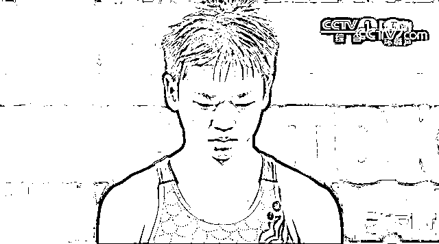
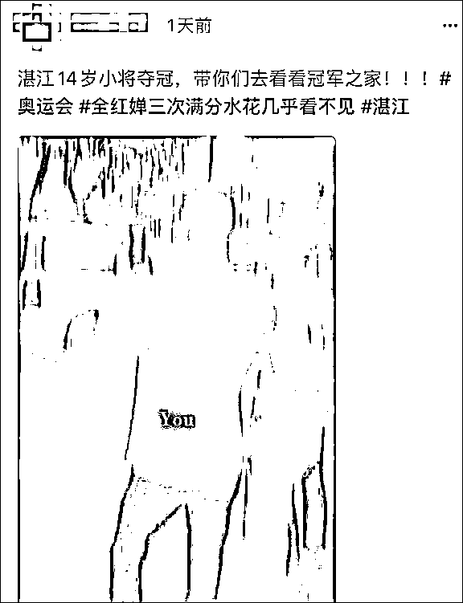
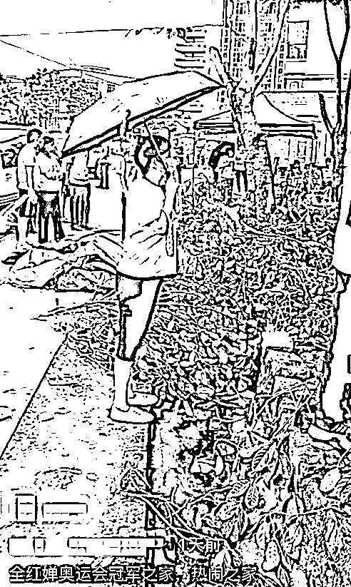
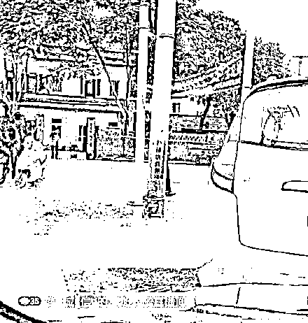
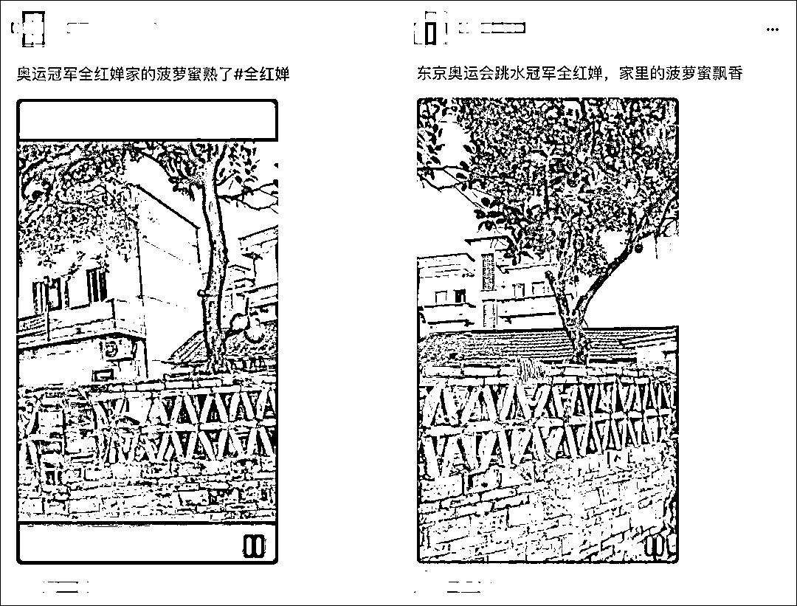
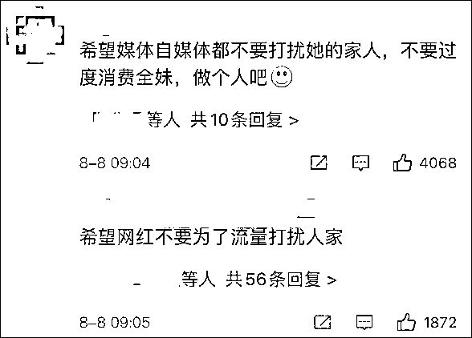
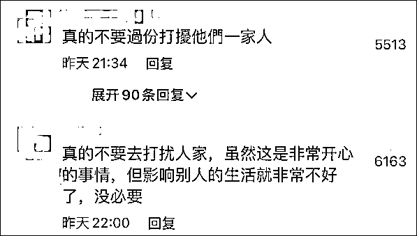

# 全红婵家人请求网红…

> 原文：[`mp.weixin.qq.com/s?__biz=MzIyMDYwMTk0Mw==&mid=2247518670&idx=3&sn=1cdf238f8e183ca013c0c8fb0f16d287&chksm=97cb42f6a0bccbe04d4bc11ea2299f4ddc4235796a4dec3566368faf508f45292808a1edfe50&scene=27#wechat_redirect`](http://mp.weixin.qq.com/s?__biz=MzIyMDYwMTk0Mw==&mid=2247518670&idx=3&sn=1cdf238f8e183ca013c0c8fb0f16d287&chksm=97cb42f6a0bccbe04d4bc11ea2299f4ddc4235796a4dec3566368faf508f45292808a1edfe50&scene=27#wechat_redirect)

14 岁女孩全红婵碾压式夺冠后，一些网红跑到她广东湛江的家门口，或直播或录像，严重影响到了其家人的生活。据广东电视台《DV 现场》昨日（7 日）报道，面对家门口的一众网红，其家人无奈请求，“请你们小声一点，已经骚扰到老人家两天没有睡了”。 

[`v.qq.com/iframe/preview.html?width=500&height=375&auto=0&vid=d3266h0upq0`](https://v.qq.com/iframe/preview.html?width=500&height=375&auto=0&vid=d3266h0upq0)

视频来源：广东电视台《DV 现场》 

5 日，“2020 东京奥运会”女子十米跳台比赛，全红婵决赛三次跳出满分，并以 466.20 分的总分打破了师姐陈若琳在北京奥运会上创造的该项目 447.40 的最高分纪录，技惊四座。

赛后接受采访时，她一句“妈妈生病了，就想赚很多钱，去给她治病，治好她”，也让全网为这个天才少女的质朴和孝顺流泪。

就这样，全红婵的家乡——广东湛江热闹了起来，善心人士纷纷送房、送车、送辣条、送游乐园门票，村民们也拉起横幅，开始像过节一样庆祝，紧接着，一批网红“嗅”到了热点，大量涌进她家门口直播、参观。

一开始，全妈妈忙前忙后，热情接待，有时要一边接电话一边配合网友合影，忙到恨不得能分身。

可后来，每天几十上百人到这里拍照。据佛山日报，从早到晚，全红婵家门口都有人在徘徊，进村的车辆络绎不绝，直到深夜，有人差点就要爬进人家的院子里去了； 

还有网红冒雨在其家门口进行直播；

短视频平台上，以“冠军之家”为题的短视频一度刷屏；

全红婵家门口有棵菠萝蜜树，这也成为了网红们的焦点，据@N 视频，有些网红甚至一边直播一边带货，还扬言要把全红婵家里的菠萝蜜摘走。

在这种情况下，全红婵一家已经不堪其扰，昨天，其家人无奈表示，“请你们小声一点，不管你是直播还是在录像，你们也要理解一下老人家，已经骚扰她两天没有休息了。”

这一幕，网友们也看不下去了，“夺冠是很开心的事情，影响人家的生活真没必要。”

昨天，@中国新闻网 发表评论指出，别让全红婵成为下一个大衣哥，“全红婵值得所有人点赞，但对于一个未成年的孩子而言，整个社会更应保护好那份难得的纯真，而不是把一些饭圈乱象、对流量的追逐带入其中。全红婵父亲拒绝了一位老板奖励的 20 万现金，并称‘不能消费女儿的荣誉’。广东省体育局相关人员也对媒体说，‘这孩子太纯真了，希望媒体能好好保护她。’我们也希望，所有人都能一起保护好这名 14 岁的奥运冠军。”

同日，中国妇女报也发文称，全红婵该“红”，但是请勿骚扰和消费。文章指出，当祝福参杂着目的，当围观带着利益，这一切都变了味。那些堵在全红婵家门口、即使影响了全红婵家人的正常生活也要直播带货的人，早就以利益当先，以流量为重，他们在乎的不是全红婵本人，而是企图瓜分全红婵身上巨大的关注度。这种行为当然是丑陋的，全红婵本人需要的是健朗快乐的成长，是继续专心投入训练在跳水路上越走越远。而她家人需要的，是不被骚扰的正常生活。

平台的默许和不作为也应被谴责。作为平台，有义务维持社会公序良俗，维护公共利益，而不是“流量至上”。如果热衷于靠自导自演博眼球，无所不用其极收割流量，最终只会被流量反噬。平台切实负起把关责任，靠优质内容赢得流量，才是健康发展的正道。

“全红婵的跳水路以一个完美的亮相开场了，而她的人生之路还很长。如果真的关心她，就请给她和家人一些空间，或许，不打扰，就是最好的支持。”

目前，当地已在村口设置疫情防控点，并派保安维持秩序。当地政府工作人员也呼吁大家理性“打卡”。

来源：观察者网

← 向右滑动与灰产圈互动交流 →

