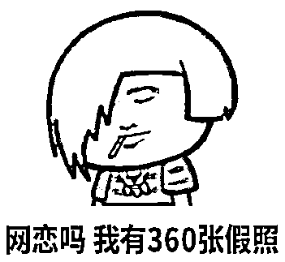

# “同城女护士”相约开房， 未见面先被骗走 4000！

> 原文：[`mp.weixin.qq.com/s?__biz=MzIyMDYwMTk0Mw==&mid=2247518670&idx=6&sn=8548a8e2689c9c628f2d5b90fd87a3aa&chksm=97cb42f6a0bccbe012cb6c979284cb3db2dd0bbb0a2dfc5cc59d0fbf29c6b7c848f4b5ce4582&scene=27#wechat_redirect`](http://mp.weixin.qq.com/s?__biz=MzIyMDYwMTk0Mw==&mid=2247518670&idx=6&sn=8548a8e2689c9c628f2d5b90fd87a3aa&chksm=97cb42f6a0bccbe012cb6c979284cb3db2dd0bbb0a2dfc5cc59d0fbf29c6b7c848f4b5ce4582&scene=27#wechat_redirect)

你以为有了懂你的“**小可爱**”

其实你只是对方的“**下酒菜**”

网恋需谨慎

**小心小姐姐变大叔叔**

 

近日，南京警方通报了一起诈骗案件

嫌疑人利用模拟器设置虚假位置

改为与受害人同城以便取得信任

实施诈骗

案件回顾

今年 6 月 6 日，南京市民佟先生报警称，自己遭遇网络诈骗。佟先生称在社交平台上认识了一名年轻女子，自称是南京某医院的护士。佟先生看到对方对方整个社交软件的位置显示确实是南京某医院，经常发一些平时的工作及生活动态，就相信了对方。

两人相谈甚欢，彼此都有好感，对方主动提出见面，佟先生便同意了。5 日，对方称先行预订好房间，晚上在南京某酒店内见面，佟先生直接去便可。

随后，对方称希望酒店费用由佟先生来出，佟先生同意后，便转给对方**900 元**。没多久，对方称房间已订好，但第一次见面想浪漫些，买漂亮衣服，红酒、水果，又让佟先生支付打车费。佟先生认为第一次见面想给对方留个好的印象，对对方要求有求必应，先后支付了**4000 余元**。

对方称自己已到酒店并给佟先生发送了位置，佟先生到达酒店，前台却告知，并没有对方所称的预定好的房间，对方也迟迟没有现身。等佟先生短信询问时，**已被对方拉黑**。

通过掌握的线索，民警很快锁定海南省某县城一名男子具有重大作案嫌疑，随后赶赴当地耐心蹲守，最终于 6 月 17 日将嫌疑人田某成功抓获。

到案后，田某对自己的犯罪行为供认不讳。据田某交代，他在网上**买了 20 多个社交账号**，然后从网上**盗来视频和图片**，将自己伪装成年轻护士。

为取得受害人的信任，田某使用一款模拟器将自己的定位设置成虚假位置，与受害人同城，所有账号用同一个头像。为不搞混账号方便作案，田某**将所有实施诈骗的账号拉到一个群里，自己管理**。

将账号编辑成 001、002、003 号，以此类推，每个号对应哪个城市的受害人，以及编造的医院和约见酒店。等时机成熟，田某会主动邀请对方开房见面，等对方同意，**再以开房费、购物费等各种理由向对方要钱。**

经查，田某共诈骗**7 名受害人**，涉案金额**3 万余元**。目前，田某因涉嫌诈骗已被刑事拘留。

警方提醒

1、**网络交友要谨慎，网上信息真假难辨**，在无法甄别对方真实身份的情况下，**不可轻信其甜言蜜语和各种说辞**。

 2、不要轻易添加陌生人 QQ、微信，凡是**涉及转账汇款**都要提高警惕，保持理性，避免因一时冲动而造成经济损失。

 3、一旦发觉遭遇诈骗，应当**妥善保存转账凭据、聊天记录等证据**，**及时拨打 110 报警或反欺诈中心**止损。

来源：南京网警、江苏网警、反诈骗先锋

← 向右滑动与灰产圈互动交流 →

