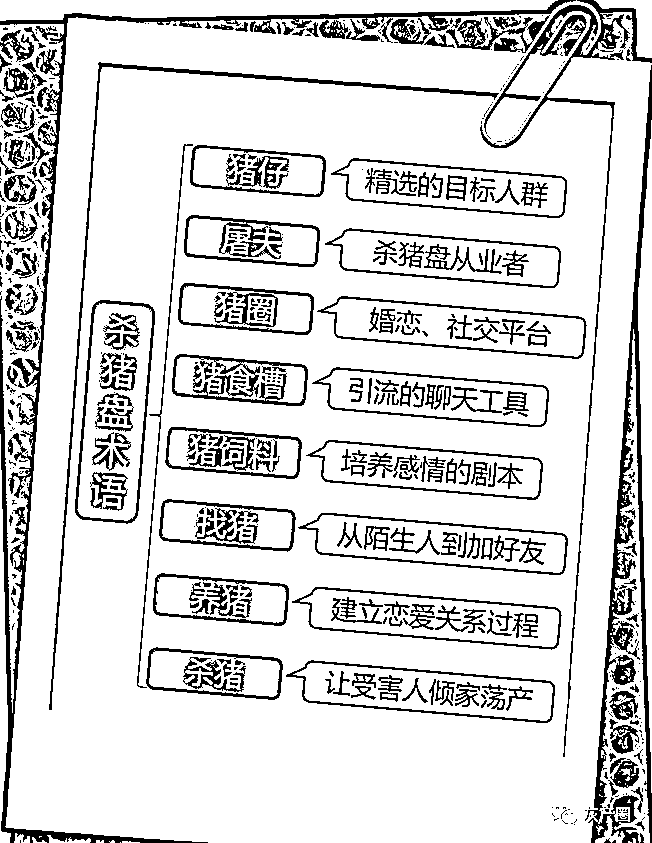
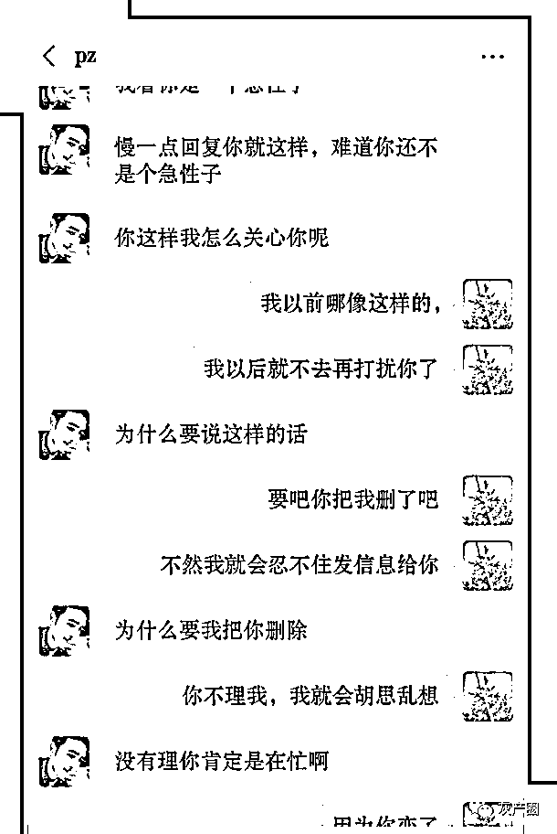
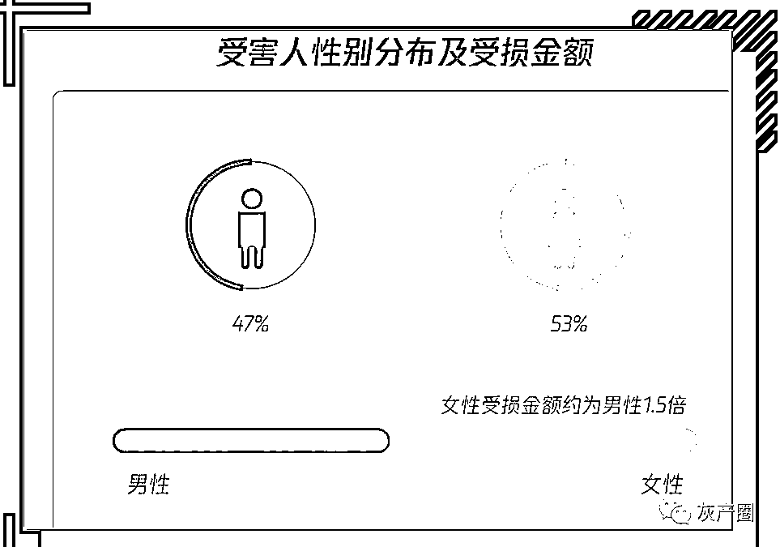
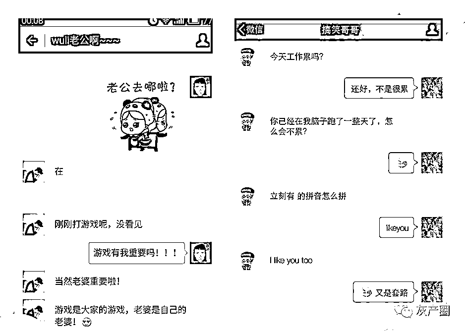
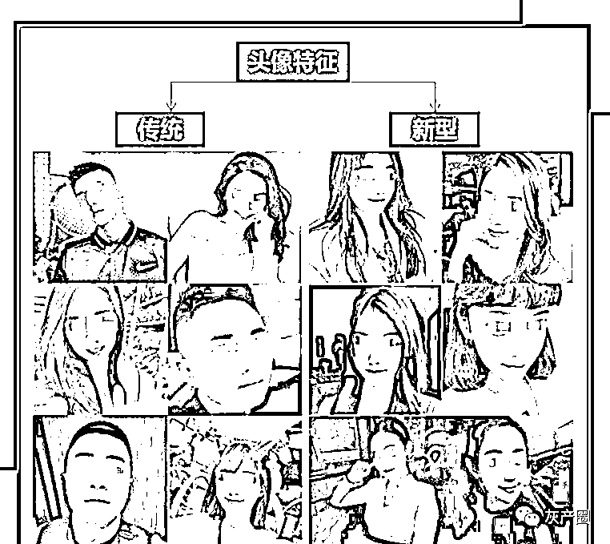
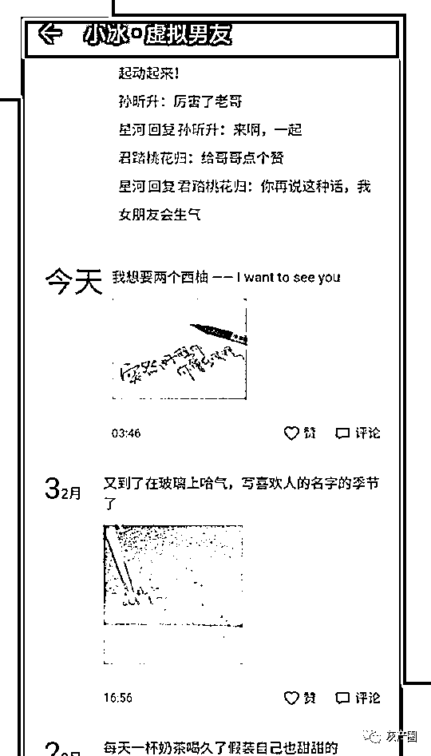
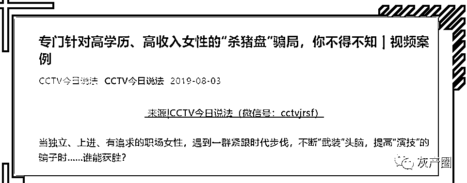
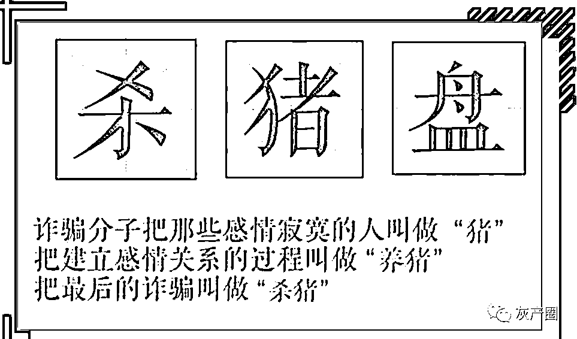

# 公安详解：“什么是杀猪盘”？

> 原文：[`mp.weixin.qq.com/s?__biz=MzIyMDYwMTk0Mw==&mid=2247518670&idx=7&sn=33cb1ef3a30712bcf6c05ce06c41bf3f&chksm=97cb42f6a0bccbe0658cd253bec6067dbabc4c2e00195649b51f281fe4821f279177279d3caf&scene=27#wechat_redirect`](http://mp.weixin.qq.com/s?__biz=MzIyMDYwMTk0Mw==&mid=2247518670&idx=7&sn=33cb1ef3a30712bcf6c05ce06c41bf3f&chksm=97cb42f6a0bccbe0658cd253bec6067dbabc4c2e00195649b51f281fe4821f279177279d3caf&scene=27#wechat_redirect)

hello 大家好

这里是每天都在反诈骗的小编

最近每天直逼 40℃的体感温度

和严峻的疫情防控形势

让很多人都宅在家里没事干

**“只要你有一部手机 在家也能赚到零花钱”**

**“哥哥哥哥 进来看会我直播呗~”**

**“30 岁有房有车 想找一个温柔体贴的人结婚”**

**“......”**

近日，不断有群众向小编举报

有不法分子利用网络隔空投送上述信息

**“这典型的杀猪盘诈骗”**

**“这典型的杀猪盘诈骗”**

**“这典型的杀猪盘诈骗”**

重要的事情说三遍！

大家一定要清醒一点

如有遇到这类信息直接拉黑举报

既然说起了“杀猪盘”

今天小编就为大家详细讲解一下

何为“杀猪盘”诈骗

**“杀猪盘”是什么**

杀猪盘其实是一种新兴的网络诈骗形式，犯罪分子把受害人叫猪，管一些社交网站叫猪槽，把聊天剧本叫做猪饲料，把谈恋爱叫养猪，把诈骗钱财叫杀猪。

杀猪盘诈骗主要以情感需求为诱饵，诱骗被害人产生情感依赖以此建立信任，因为一系列的操作所以杀猪盘比一般诈骗时间更长，更难以让人察觉。

另外犯罪分子往往会编造虚假身份，人均高富帅白富美，能掌握赚钱秘方发掘致富秘密，还会毫不吝啬地分享给你，带你一块赚钱。

但当局者迷，面对甜言蜜语嘘寒问暖的柔情攻势，很难不破防。

随着“婚恋诈骗”竞争越来越激烈，骗子的手段都在不断升级，企图打破行业壁垒，杀猪盘不仅仅以女性为切入点，也开始针对想要利用基金股票投资赚钱的人进行”杀猪“。

**“杀猪盘”的惯用剧本**

“ 

受害人多为

  女性  ”

据数据显示，杀猪盘中的被害者，女性占比过半，受损金额也比男性更多，约为男性的 1.5 倍，特别是 30 岁以上具有一定经济基础的女性，是杀猪盘重点围猎对象。

犯罪分子大多挑选 80，90 后女生，这个年龄段女生大多数有一定的经济基础，交友网站上的女生又多数处于情感空白的状态，因此，以情感需求作为切入点很容易获得女生的信任。

大多数人往往在被骗以后才醒悟过来，当然也有比较谨慎的女孩，在对方说出”投资挣钱“的时候已经能够及时止损。

**放长线钓大鱼**

首先对方在杀猪之前会对自己的身份人设进行全方位的包装，小到小名网名，大到事业状况家人信息。
头像不用说，清一色的帅哥美女，而且真的不一定都是网图，也有可能是网图加高 P，一般人根本识别不出来。
男的大多温柔多金，全天 24 小时随时待命，早安晚安随叫随到；女的更是明眸皓齿，体贴入微！

一般加了一个人好友，想要了解一下第一反应肯定是看对方的朋友圈。犯罪分子深谙其道在塑造人设方面样样俱全，朋友圈肯定也不会落下。
一般会在朋友圈秀秀才艺，发发不露脸自拍，说说暧昧模糊的情话；之后可能还会加入一些赚钱了之类的有目的性的朋友圈。

在长时间的嘘寒问暖之后，你和对方感情逐渐升温，他（她）可能会直接在朋友圈官宣你们的恋爱关系，并带着一众好友美好祝福的截图向你证明。
和受害者确定关系之后，对方会按照剧本无意间透露赚钱的方法，例如什么自己家是做生意的，无意间发现了金融网站的漏洞，能够稳赚不赔；或者是借口开会没空，让你帮忙操作股票。

让你潜意识了解到这人正在赚钱，结合盈利截图再进一步和你共同畅想未来美好生活，共同理财一起赚钱，和你一屋两人，三餐四季等等”美好的未来“。

**杀猪盘最大的特点，总结下来不过三句话** 

**一：他阳光帅气多金，但你只看过照片** 

**二：他成熟稳定对未来有规划，说要和你一起理财买房**

**三：他甚至是个投资高手，能找到投资漏洞保证你稳赚不赔！**

**如何防范**

资料显示，杀猪盘的受害者并不是大家想象当中那种天真单纯，学历不怎么高的女孩子，相反，被视作”猪仔“的受害者当中不乏社会地位优越学历优秀的女孩子。

并不是受害者有多愚蠢，而是骗子的招数过于高明，为了骗人骗子能够连续半年一年地持续和你聊天，所有聊天内容全部合你口味，可谓是一个完美的”恋爱对象“，谁会在恋爱时怀疑对方是诈骗犯呢？

杀猪盘团伙内部往往分工明确，有负责钓鱼排查杀猪对象的，有专门负责营造人设的，有制作诈骗投资网页的，也有后续负责转账洗钱的。
团伙作案地点一般在境外，追捕是件大问题，即便被骗及时报警，由于地域受限也很难追回被骗钱财。

对付杀猪盘的最好方法就是**绝不转账**！不要点击对方给的任何链接，不要轻信对方说的赚钱方法，天上没有掉馅饼的事情，金融机构的漏洞即便你发现了也是非法收入！

来源：兴山公安

← 向右滑动与灰产圈互动交流 →

