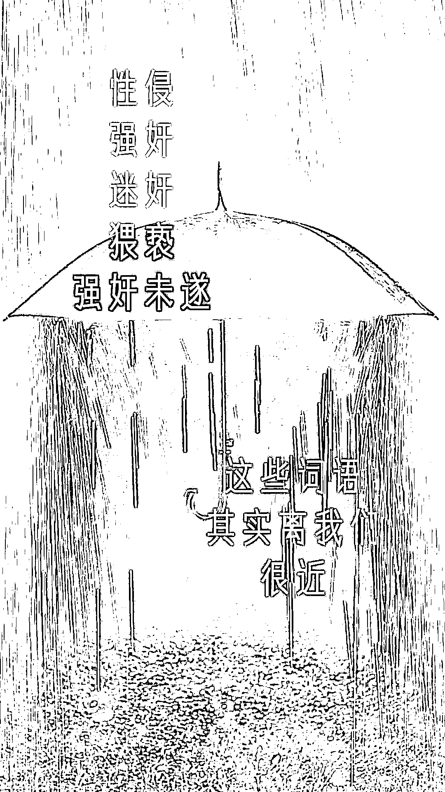
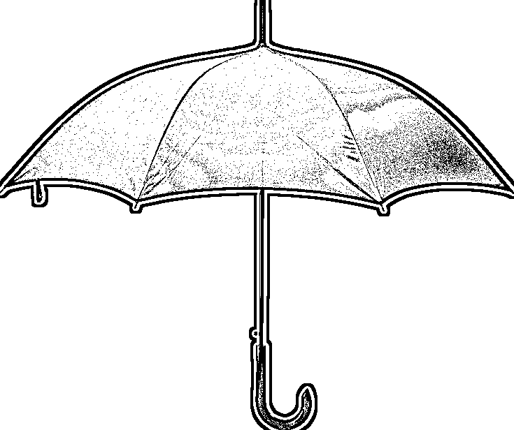
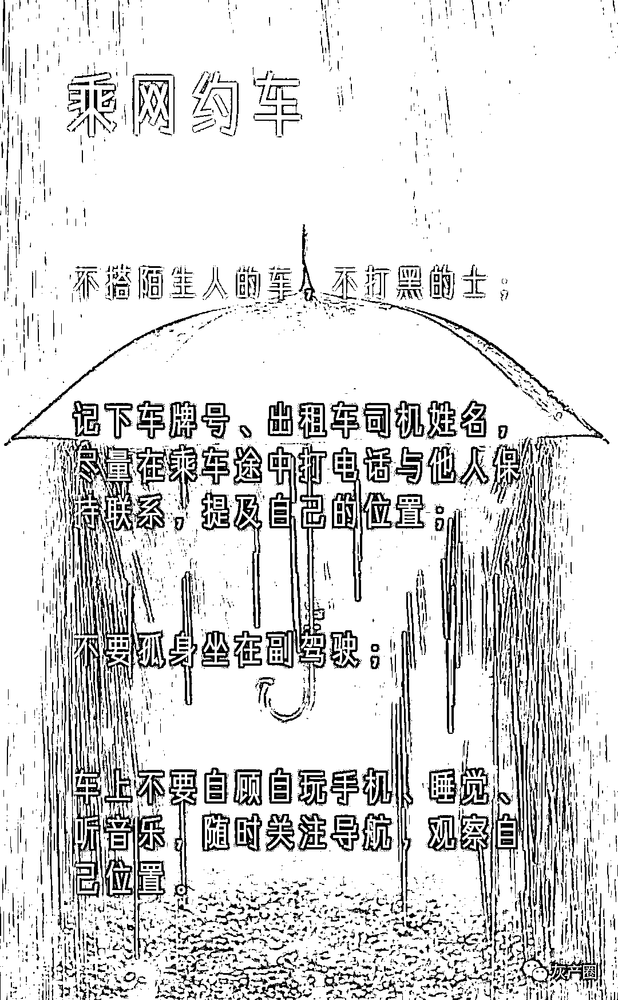
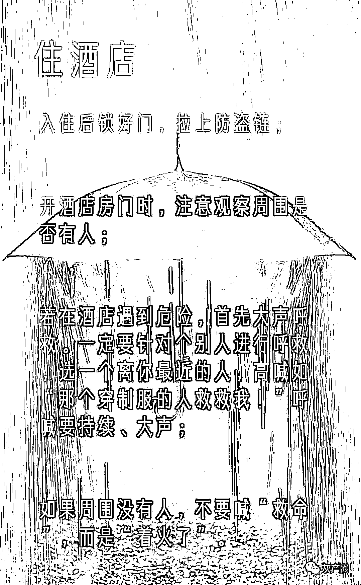
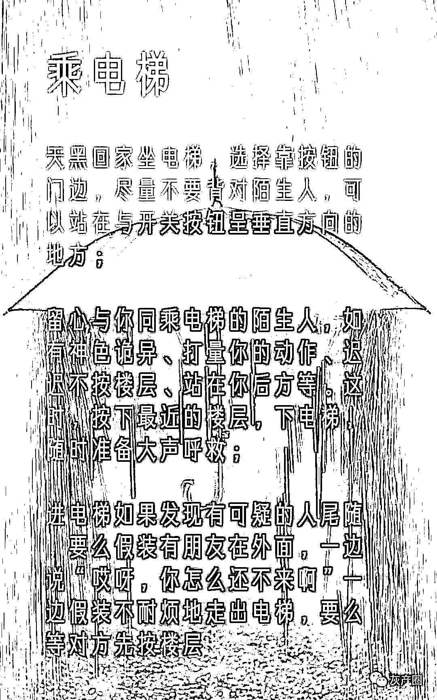
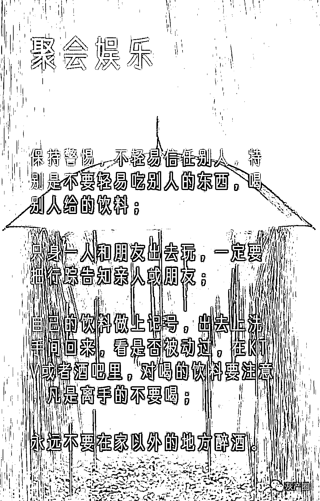
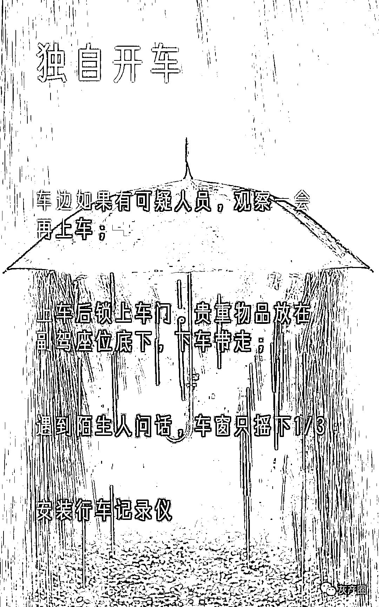
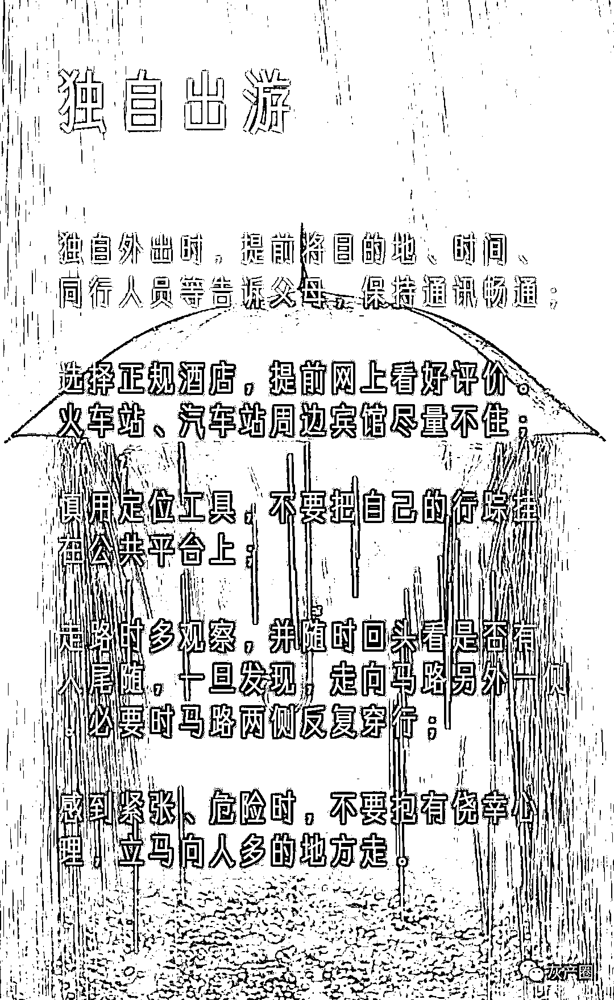

# 科普贴！遭遇性侵如何取证

> 原文：[`mp.weixin.qq.com/s?__biz=MzIyMDYwMTk0Mw==&mid=2247518720&idx=1&sn=7b01a422de0525642769fd055b4232c3&chksm=97cb4138a0bcc82e7647685d122e66f5aeb304aebebbf9d67da7457b820284e9214244708dd0&scene=27#wechat_redirect`](http://mp.weixin.qq.com/s?__biz=MzIyMDYwMTk0Mw==&mid=2247518720&idx=1&sn=7b01a422de0525642769fd055b4232c3&chksm=97cb4138a0bcc82e7647685d122e66f5aeb304aebebbf9d67da7457b820284e9214244708dd0&scene=27#wechat_redirect)

**** 

****编者按****

**每年，遭受性侵的人不在少数，性侵犯罪难以取证、难以界定几乎是一个极为普遍的问题。而且一般遭遇这样的事情，作为受害者，心理和身体都遭受极大创伤，因此取证变成了很多人容易忽视的一件事。**

 **[`mp.weixin.qq.com/mp/readtemplate?t=pages/video_player_tmpl&action=mpvideo&auto=0&vid=wxv_1994692586493575172`](https://mp.weixin.qq.com/mp/readtemplate?t=pages/video_player_tmpl&action=mpvideo&auto=0&vid=wxv_1994692586493575172)** ****

****遭遇性侵****

****如何第一时间取证？****

****01****

****1、立即报警****

**发现自己被性侵，最有利的一个维权手段就是立即报警，在警察的指导之下来搜集和固定证据。**

****2、搜集保存证据****

**如果现场情况不具备立即报警的条件，作为被侵害人，要有意识地去搜集和保存证据：**

**不要立即清洗，保留我们身体上留下来的一些痕迹，比如精液或者毛发；**

**如果有抓挠，我们的指甲里可能留存有一些痕迹；**

**有意识地尽可能留存更多证据，如现场有擦拭或留有痕迹的纸巾、避孕套之类东西。**

****

****猥亵罪和强奸罪****

****是如何界定和区分的？****

****02****

****

**要认定强奸这个行为存在，至少要有几方面的证据来证明。**

**1、确实发生了性关系；**

**2、发生性关系的时候，一定是存在着暴力威胁或者一些其他的手段的；**

**3、性关系的发生和违背了妇女的意愿。**

**对于猥亵而言，只要是以暴力威胁或者其他方法实施了一个猥亵行为，就可能构成了强制猥亵罪。**

**猥亵的对象也不仅仅限于女性，还包括男性。**

****

****这些场景如何保护自己****

****03****

********************

****

**来源：央视网、央视网快看**

****

**← 向右滑动与灰产圈互动交流 →**

****