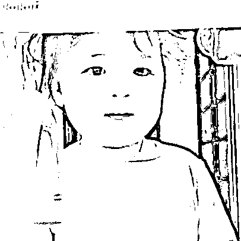
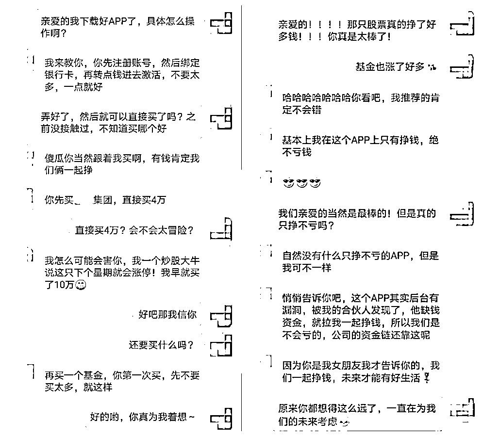
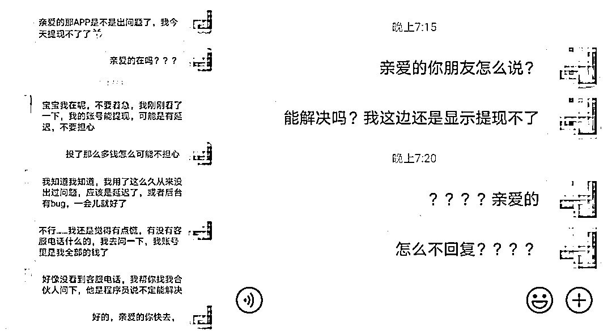
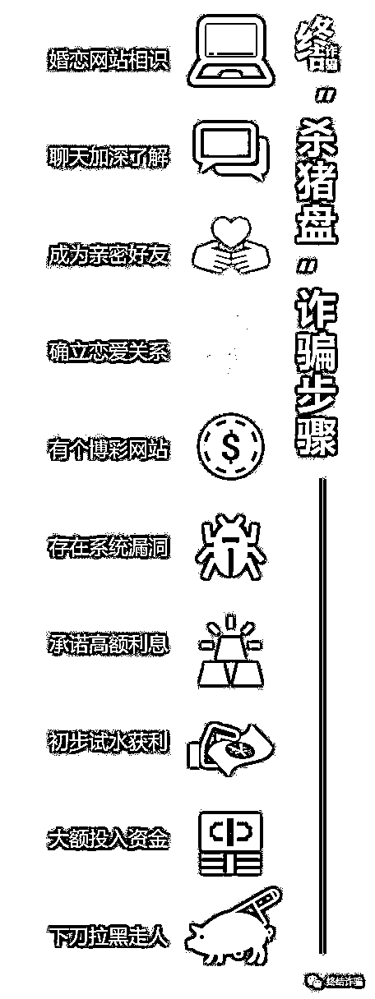
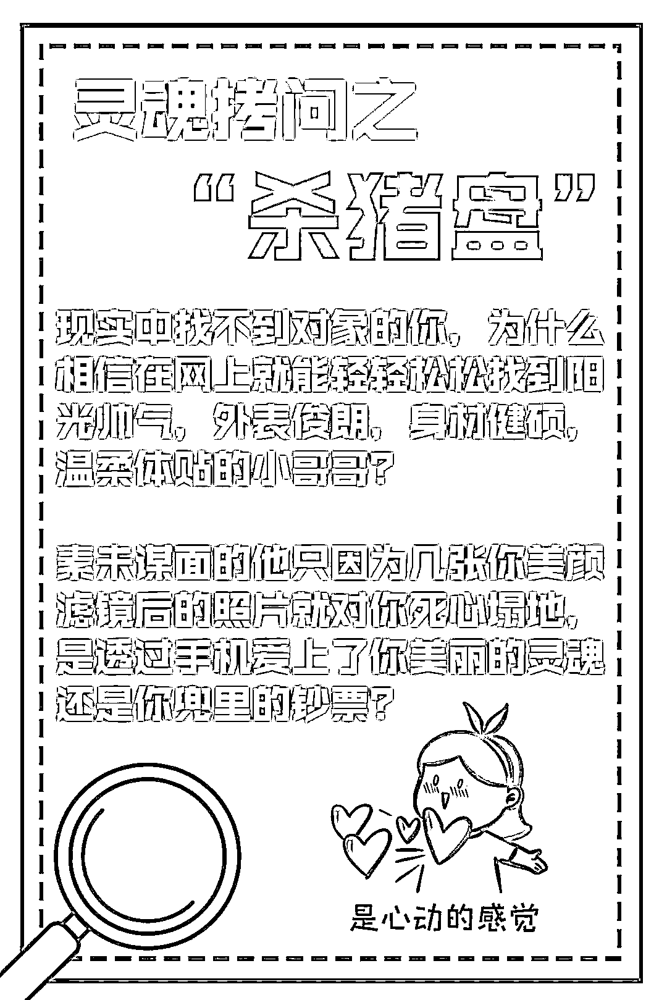

# 恋爱还是陷阱？揭秘让你人财两空的“杀猪盘”

> 原文：[`mp.weixin.qq.com/s?__biz=MzIyMDYwMTk0Mw==&mid=2247518720&idx=3&sn=d68ce3e135aef3a0d3ad1e8a42cd7562&chksm=97cb4138a0bcc82ec64033dfa2b0021ec965a571f258c0495e659dd177c4e48991de3c7f945e&scene=27#wechat_redirect`](http://mp.weixin.qq.com/s?__biz=MzIyMDYwMTk0Mw==&mid=2247518720&idx=3&sn=d68ce3e135aef3a0d3ad1e8a42cd7562&chksm=97cb4138a0bcc82ec64033dfa2b0021ec965a571f258c0495e659dd177c4e48991de3c7f945e&scene=27#wechat_redirect)

**在网络上你可能遇到这样的人：**

**他的声音充满磁性，那么摄人心魄。**

**他的语言温柔体贴，带着满满柔情。**

**他的事业蒸蒸日上，同时热爱生活。**当你遇见他时，尘封已久的内心逐渐被打开，产生了奇妙的反应，不禁感慨：“爱情来得太快就像龙卷风~”但其实，爱情并未到来，你可能正遭遇“杀猪盘”骗局，网络那头令你魂牵梦萦的人，ta 的目标可能仅仅是你账户里的资金。

**向往“金钱爱情双丰收”**

**不料杀猪匠的“温柔刀”**

***01***

李女士平时忙于工作，一直单身，常常感到压力巨大在现实中却又找不到人倾诉。一次偶然的机会，她在网上结识了男子陈某。

陈某介绍自己在经营一家公司，之前创业失败后，他总结经验和团队吃了很多苦，最终取得了如今的成功，业绩良好。

聊天中李女士还发现，陈先生是个近乎完美的男人，高大帅气、温柔体贴还幽默风趣。

于是两人聊天越来越频繁，李女士也喜欢把生活中的小事分享给他，不到一周的时间两人就确定了情侣关系，感情也在嘘寒问暖中火速升温。

**骗子的温柔刀，是女人的迷魂药**

感情的升温稳定，为“杀猪”提供了锋利的作案工具，陈某也缓缓掏出了“温柔一刀”。

陈某开始在聊天当中有意无意的透露自己在一款金融 APP 上投资，并且收益不低！

**稳赚不赔的投资，竟是糖衣炮弹**

出于对男友的信任和高收益的诱惑，李女士逐渐放松警惕，下载了这款投资 APP，并在陈某的指导下开始投资。

前期不过是几千块的小金额，每次都能小有收益，有时候甚至能得到成倍回报。

李女士向陈某表达过疑惑，陈某 却解释说这个 APP 存在漏洞，公司合伙人发现了这个漏洞并和自己分享了利用方法，保证稳赚不赔。

陈某倾囊相授的架势和坦荡的态度说服了李女士，彻底打消疑虑，相信陈某是真心带自己一起挣钱。

只要是陈某介绍的，无论是投资还是赌博都能挣钱，李女士越发信任陈某，下注时也越来越大胆，金额越来越高。

帅气温柔的恋人加上稳赚不赔的投资，一时间爱情和金钱的双丰收使李女士开心不已，似乎能看见未来幸福的生活。

**梦醒时分夜，人财两空时**

然而好景不长，在一次大额下注后，李女士突然发现自己无法提现！

慌张的李女士立马找到陈某询问，得到的不过是“APP 后台操作有点问题”“你再等等看”“我已经联系公司那个程序员帮忙解决了”之类的敷衍。

恋人冷淡的态度和亏损的金钱像一盆冷水，让李女士发热的脑袋逐渐冷静。

再也联系不上陈某之后，李女士不得不承认自己被骗了，立马报了警，而此时前前后后投入的金额，累计高达 240 多万。

**放长线钓大鱼**

**乘虚而入，防不胜防**

***02***

毫无疑问，李女士这是遇到“杀猪盘”了。

“杀猪盘”是近年来兴起的混合骗局，在不法分子的眼中，受害人就是用“爱情”圈养的“猪”，待养肥后就应该被“杀掉”。

不同于其他骗局的“短平快”，杀猪盘最大的特点就是放长线“养猪”，养得越久，杀得越狠，“找猪-养猪-杀猪”是“杀猪盘”的一般流程。

犯罪分子“找猪”的策略清晰明确，将受害者锁定在 30+的单身女性。

一是因为这个年龄段的女性一般都有不错的经济基础——“够肥”；

二是因为这类型的单身女性对于感情的需求较大，犯罪分子有可乘之机——“好得手”。

在成功添加好友之后，犯罪分子就开始了“养猪之旅”。

劣迹斑斑的罪犯摇身一变，成为高大帅气，温柔多金的“优质单身男”，在受害者空窗期时乘虚而入。

对受害者展现全天 24 小时 360 度无微不至的关怀，偶尔采用“半糖主义”若即若离让受害者深陷温柔乡不可自拔，只要让受害者信任和依赖自己，犯罪分子的“养猪”目的就达到了。

经过一段时间，“猪”养熟了，也养肥了，就到了犯罪分子“杀猪”的时候。

依靠着之前建立的信赖，引诱受害人通过犯罪团伙搭建的赌博或投资平台进行投注。

一开始受害人均能获取一定数量的盈利，在加大投资金额后，犯罪团伙就通过修改后台数据的方式，使受害人逐步将投资金额输尽，然后拉黑受害者的联系方式，携款潜逃。

不单单是 30+单身女性，各个年龄层的男女都有可以成为“杀猪盘”的受害者。

女装大佬诈骗青年单身宅男、空巢老人“养儿”痛失百万等等案件屡见不鲜。

大家千万不能掉以轻心，一定要擦亮眼睛，保护好自己的财产安全。 

**谨慎交友 **

**远离爱情的“屠宰场”**

***03***

犯罪分子善于造梦，无论是“幸福美满的爱情”还是“唾手可得的金钱”，只要你有需求，他们都可以为你编织一个完美的梦境。

然而梦终究是虚无，他们真正的目的是让受害者“赔了夫人又折兵”。

如果你在交友过程中，发现了以下几个典型特征，注意了！那你可能已经成为了“杀猪盘”的目标猎物。

**01**

相识于网络，没有任何现实接触；

**02**

对方为莫名出现的“优质对象”，迅速陷入爱河；

**03**

对方找一切借口拒绝视频、见面等提供真实身份信息的要求；

**04**

在恋爱过程中，对方有邀请你一起进行投资、挣钱、做副业等一切需要你掏钱的行为。“杀猪盘”之所以会让这么多人上当，是因为犯罪分子利用了人们渴望感情和对金钱的欲望。

如何才能避免落入“杀猪盘”的陷阱？小侦在这里给大家一份**防骗小贴士:**

1.在使用网络的时候，一定要保护好自己的个人信息，避免信息泄露，不给犯罪分子可乘之机；

2.提高甄别能力，对于网络上陌生人的接近保持警惕，没有确认身份情况下绝对不进行“金钱交易”；

3.保持正确的金钱观，不要奢望“天下掉馅饼”，不要轻信别人的投资建议，通过自己努力获取的财富才是最安全可靠的。

如果真的不慎被骗，要立刻报警，争取将损失降到最低。

来源： 珠海刑侦

← 向右滑动与灰产圈互动交流 →

