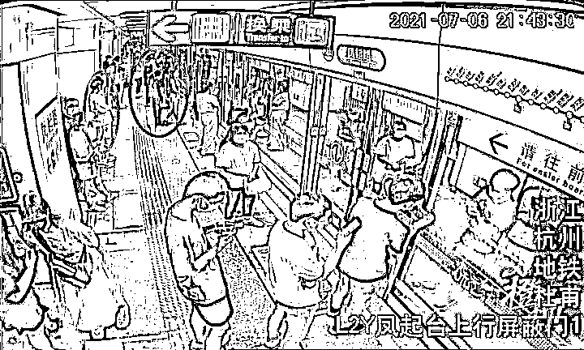
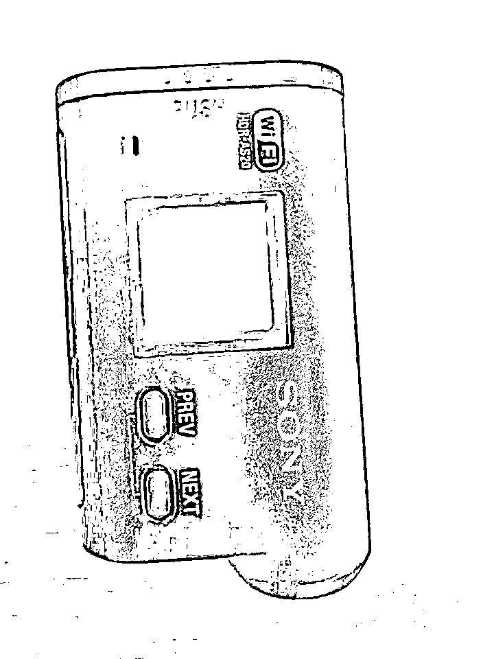
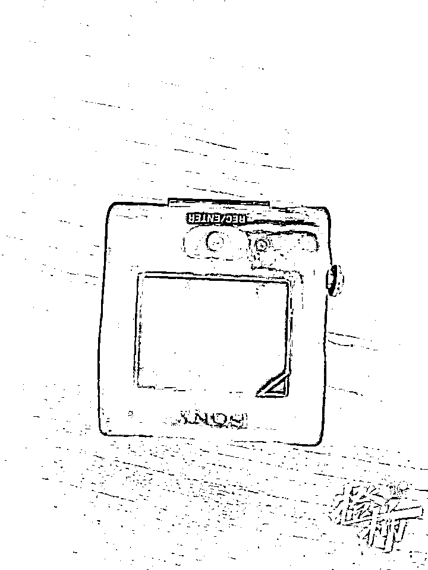
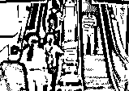
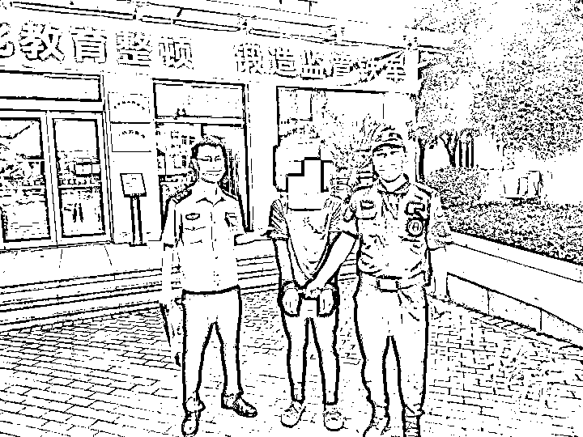
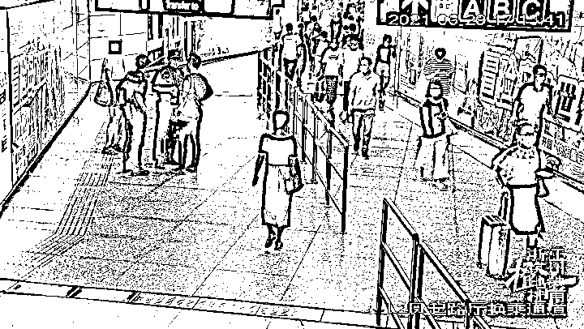
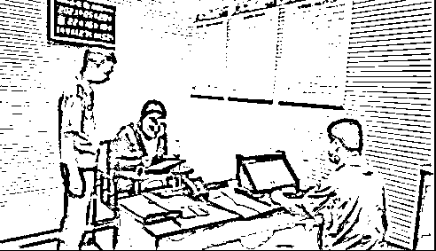
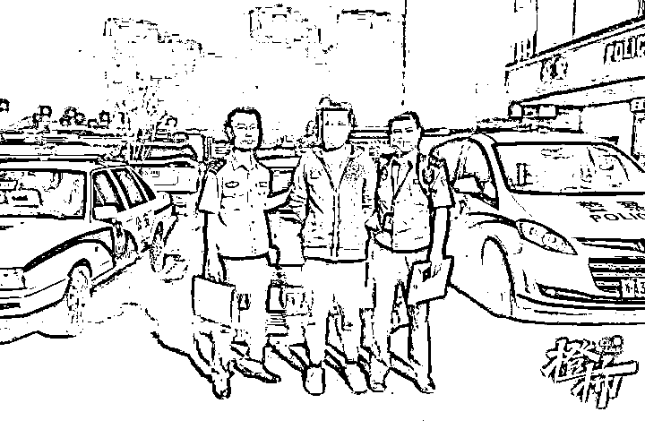
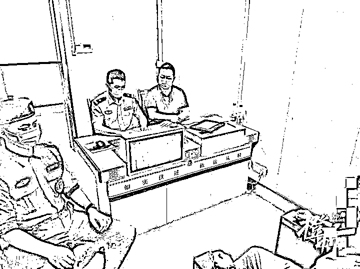

# 太猥琐！黑纸袋藏摄录机偷拍、用手故意碰女子臀部……杭州公安抓了 19 名地铁色狼

> 原文：[`mp.weixin.qq.com/s?__biz=MzIyMDYwMTk0Mw==&mid=2247518720&idx=4&sn=c868b1e8f4b981b217d9ea47e687e3e2&chksm=97cb4138a0bcc82e50546a5c09416ac9704b76edbc46a3718fbe6a8b67d046650cee2fff85ef&scene=27#wechat_redirect`](http://mp.weixin.qq.com/s?__biz=MzIyMDYwMTk0Mw==&mid=2247518720&idx=4&sn=c868b1e8f4b981b217d9ea47e687e3e2&chksm=97cb4138a0bcc82e50546a5c09416ac9704b76edbc46a3718fbe6a8b67d046650cee2fff85ef&scene=27#wechat_redirect)

该公众号已被封禁

今天上午，杭州警方召开新闻通报会，公布“打狼”专项行动战果以及破获的 4 起典型案进行通报。会上通报，自 4 月 21 日，杭州公安地铁“打狼”专项行动开展以来，地铁警方共办结猥亵、侵犯隐私案 39 件，依法拘留 19 人。 

办案民警介绍，近年来受理的猥亵、侵犯隐私等案件，主要集中在“咸猪手”和“偷拍狼”两类，前者多在拥挤车厢内作案，后者多利用自动扶梯高低落差进行偷拍，时间集中在早晚高峰人流量大、人员拥挤时段。警方在现场还公布了几个典型案例——

**“7.6”侵犯隐私案：黑纸袋中藏玄机**

2021 年 7 月 6 日晚上 9 时 30 分左右，杭州地铁 2 号线凤起路站，突然出现一黑衣男子惊慌失措跑上站厅，其身后一男一女紧追不舍。地铁工作人员发现这一异常情况，立即追了上去。在站厅换乘通道，三人一同将黑衣男子拦截，并将该男子带至凤起路站警务室。

警方根据受害人的情况反映和追赶热心群众证实，经审讯，嫌疑人该黑衣男子朱某奇，对自己侵犯他人隐私的行为供认不讳，并如实交代了作案过程。

当天，朱某奇精心准备了作案工具。其随身携带一黑色袋子，袋中装有一台数码摄录一体机，纸袋下端开有一小孔，摄像头从小孔中伸出用于拍摄。朱某奇想趁着地铁龙翔桥站人多拥挤的“便利环境”，伺机寻找机会进行偷拍。

他在龙翔桥站站台徘徊了 3 至 5 分钟后，身着短裙、身材纤细的受害人李某某进入了他的视线。于是他立即跟了上去，并试探性的用纸袋靠近李某某腿部，调整拍摄角度。

接着，他跟着李某某上了地铁车厢。因车厢内人员拥挤，朱某奇一直没有找到下手机会。地铁运行停靠到凤起路站站台时，朱某奇找准时机，又一次靠近受害人李某某进行偷拍。这时，其怪异举动被热心市民马先生当场发现，马先生不露声色，立即用手机拍照固定证据，并上前告知被偷拍的女子李某某……

经调查，去年 8 月，朱某奇在下沙曾以同样的方式作案，被警方依法行政拘留过 3 天。

**“6.29”猥亵案：“我帮你抓他！”**

2021 年 6 月 29 日下午 5 时左右，正值下班高峰，地铁站内人头攒动。在地铁 2 号线凤起路站站台，一列地铁刚刚到达，车厢门一打开，人群蜂拥而出。人群中，一名青年男子大幅摆动着手臂，**手“不经意间”触碰到了前面的一名女子**。女子察觉到了异样，转身回看。该男子狠狠地瞪了女子一眼，继续大步向前走，该女子无奈只好默不作声。

这一幕被巡逻的特保队员朱赢看在眼里。他立即跑上前，问道：“姑娘，刚才那男的是不是摸你？我帮你抓他！”

该女子委屈地说：“好！”

朱赢快步追上前，在出闸机前就将嫌疑人抓获。打铁关站派出所民警立即展开调查。

 

面对民警的讯问，该男子龙某全起初拒不承认，一直狡辩称自己只是无意中碰到。

民警通过监控查看，并结合受害人供述和特保队员的有力指证。在确凿的证据面前，嫌疑人龙某全被警方依法处行政拘留 10 日的处罚。

** “5.19”侵犯隐私案：**

**民警守株待兔式成功捕“狼”**

5 月 19 日 19 时 30 分左右，地铁湘湖站派出所接到曹女士的报警称，在近江站出站时被一个陌生男子偷拍。

接到报警后，民警立即展开调查。据受害人曹女士反映，就在曹女士乘坐电扶梯准备出站时，感觉身后有一名男子靠自己很近，好像还拍了裙底的照片。警觉的曹女士当场呵斥该男子，并要求其删掉照片。该男子在手机上装模做样滑动了几下表示已经删除，就离开了。

曹女士仍不放心，于是便报了警。民警根据曹女士的描述，调取站内监控，很快锁定了该男子的作案过程。通过数字警务支撑和信息综合研判，民警判定该男子每天都会在固定时间乘坐地铁，有继续作案的可能。于是决定在第二天的同一时间在此等候嫌疑人出现。

次日，嫌疑人果然再次出现：“你好，我们是地铁公安民警，你昨天是不是在这个地方偷拍了一个女孩子？”

“什么？”嫌疑人面对突然出现的民警，闪过一丝慌张。

“你昨天是不是在这个电梯上偷拍了一个女孩子的裙底？”民警提高了嗓音再次询问。

   “是的，我拍了。”王某承认。

**“6.15”侵犯隐私案：**

**男子站在扶梯上偷拍……**

6 月 15 日 13 时，在地铁 7 号线江东二路站 D 通道处，嫌疑人项某达看见一名长发飘飘、身着碎花长裙的女子走过，很是心动，环顾四周，一个人都没有，便起了邪念。 

嫌疑人项某达赶紧跟了上去，在站厅出站的上行扶梯上，他紧跟在女子后两个台阶的位置，采用一脚跨上一个台阶，俯下身子的方式，将手机悄悄伸到女子裙底进行偷怕。因紧张，嫌疑人项某达一不小心碰到了女子的脚后跟，该女子立即回头狠狠地瞪了他一眼。

此时，电梯正好到达出站口，嫌疑人项某达一下子就逃跑了。该女子顿时不知所措，等回到家后决定报警。

下沙江滨站派出所民警接警后立即展开调查。根据受害女子廖某某的反映，民警调取监控进行大数据研判，不久就精准锁定嫌疑人的身份信息，很快将嫌疑人项某达抓获。

项某达被警方依法处以处罚款 200 元的处罚

* * *

夏天，小姐姐都穿得很清凉，偷拍怎么防呢？

民警说，偷拍者主要是利用扶梯等位置的高低落差。所以，如果穿低胸的可以把包包挡在胸口，超短裙、或者长裙的可以把包包放在后面遮住，如果坐在地铁座位上，可以把包包放在腿上，把包包或其他遮挡物放在胸前，一旦发现有人偷拍，马上报警。

来源 ：都市快报

← 向右滑动与灰产圈互动交流 →

