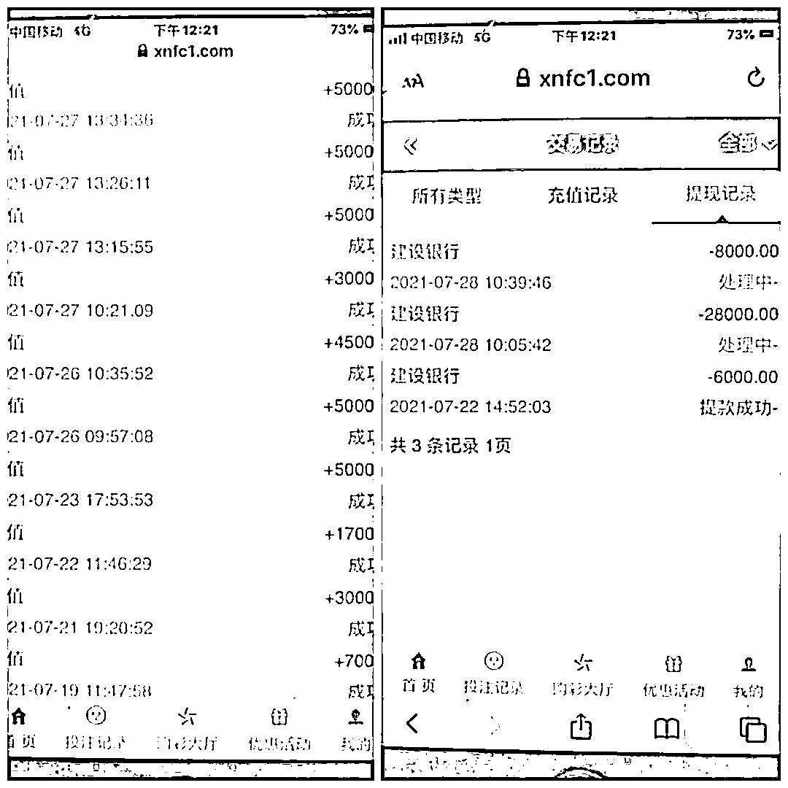
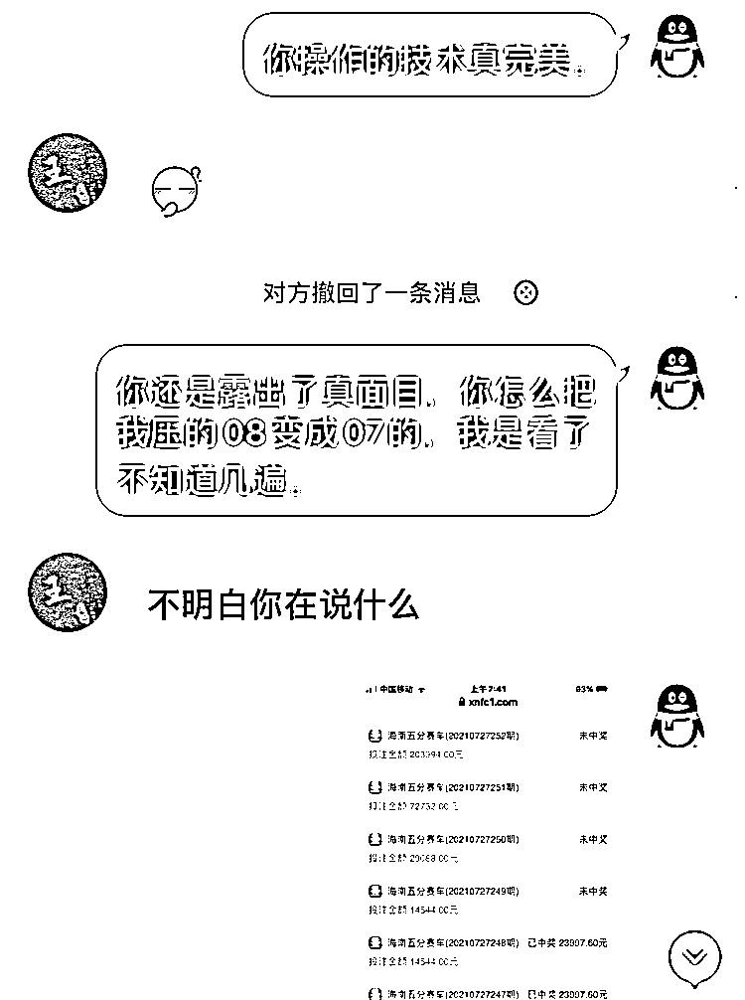

# 网络赌博遇上“变戏法”，38000 元全打了水漂！

> 原文：[`mp.weixin.qq.com/s?__biz=MzIyMDYwMTk0Mw==&mid=2247518720&idx=5&sn=419fbefb42e45d89dde44fa73814ea7f&chksm=97cb4138a0bcc82ea29fbcd33f5555b55ab8ab286ecb811a4943b0a1dbae522e937b6e3624c8&scene=27#wechat_redirect`](http://mp.weixin.qq.com/s?__biz=MzIyMDYwMTk0Mw==&mid=2247518720&idx=5&sn=419fbefb42e45d89dde44fa73814ea7f&chksm=97cb4138a0bcc82ea29fbcd33f5555b55ab8ab286ecb811a4943b0a1dbae522e937b6e3624c8&scene=27#wechat_redirect)

赌徒的命运

“骰子一摇，便会千金散去”

十赌九输，久赌必输

但偏偏还是有人不信

锦屏街道的朱先生深陷网赌

**38000 元****在“变戏法”中全打了水漂！**

案件回顾

7 月中旬，朱先生接到一个陌生电话，对方询问朱先生是否参与炒股。交谈中，朱先生表示，他曾经炒过股，而现在并没有参与。对方称目前行情挺好，邀请朱先生加入一个有“老师”讲课的炒股微信群，群中会免费分享一些“内幕消息”，即使不炒股，也可以试着听一下。朱先生想着听听也没有损失，就接受了邀请，加入了微信群。

在之后的一段时间里，朱先生发现“老师”讲的炒股技术、股市分析等内容都还不错，于是闲下无事的时候就会听听。 

听了几天后，群中突然有人（**托**）在群里建议“老师”介绍其他的赚钱方式，“老师”分享了一个链接，称该平台操作简单，赚钱很快。好奇的朱先生点进去看了一下，发现该平台实际就是一个赌博平台。

7 月 17 日，联想到之前“老师”讲的都挺靠谱，怀着这份信任，朱先生决定试试，联系平台客服充值了 1000 元。

朱先生首次交易的转账记录 

朱先生在平台中选择了名为“海南五分赛车”的项目进行赌博。该赌博的玩法是参赌人员选择 6 个数字进行投注，开奖时会公布一个由 10 个数字组成的中奖号码，投注的 6 个数字中，只要有一个数字与中奖号码的第 1 个数字相同，就算中奖。

朱先生陆续充值的记录 

赌博的时候，“老师”给予了朱先生无微不至的“照顾”，每期开奖前，“老师”都会在群里给朱先生安排赌博计划，包括每期的投注金额和投注的 6 个数字，朱先生也没有怀疑，完全跟着“老师”的计划赌。

截至 7 月 28 日，朱先生一共赌了 12 天，虽然期间有输有赢，但总体上是输的，累计输掉 38000 元。

一开始，朱先生觉得是自己运气不好，愿赌服输。但在进行认真复盘后，他恍然大悟，悔不当初，连忙向分局大桥派出所报了警。

朱先生与“老师”的聊天记录

原来，朱先生曾碰到过多次系统“bug”，比如中奖的数字是 8，投注的数字为 1.2.3.4.5.8，按规则他已中奖，但他回头查看订单，发现投注的数字像变了戏法一般，变成了 1.2.3.4.5.7。该赌博平台明面上是一个讲究公平公正的牌桌，**实际是却是一个可以后台暗改数据的黑赌场。**

**网络赌博 想要赢你太简单**

根据目前破获的

多起相关网络赌博案件

警方也揭秘了几种

常见的网络赌博形式和

组织者的惯用伎俩 

**4 种网络赌博形式最为常见**

**第一种：**互联网赌场，利用网站（包括各种 APP）为工具，以直播的方式进行，赌客可实时看到赌桌上的一些情况。用户只要通过注册个人账户并且充值，就可参加赌博，如百家乐等。

**第二种：**利用体育竞技，包括福利彩票和六合彩等作局，通过某种规定的公式去算出一种赌博标的，再通过网络平台进行下注，比如赌球。

**第三种：**利用带有红包功能的平台组织赌博，也会出现在多个社交网络平台上出现的一种赌博形式。

**第四种：**利用一些休闲游戏的平台来进行赌博，常见于一些棋牌类游戏里。

**3 种组织者的惯用伎俩**

**手段 1：**一输就跑。网络赌博的服务器隐秘性强，参与者与组织者互不相识，甚至参与者之间也素未谋面。在公安机关破获的案件中，不乏这样的情况，庄家与参与者在一场大额的赌局对敲过程中，比如比大小或者猜数字，一揭盖，众多的参与者赢了，庄家输了，筹码算下来达上百万元。这样的结局岂是庄家能接受的——人家干脆溜之大吉，彻底人间蒸发。赢者空欢喜一场。庄家重设 IP，另起炉灶接着骗。

**手段 2：**只赚“平台费”。此种网络赌博中，组织者不“坐庄”，只提供平台服务，但收平台费、佣金，就像线下赌场那样收“水钱”。这意味着不管参与者谁输谁赢，彼此之间如何厮杀，只要有交易，人家都有钱挣。当网络赌博的赌资像滚雪球一样越滚越大，平台方可躺着挣钱。

**手段 3：**“网络出千”。几乎所有的网络赌博，组织者在后台都有技术控制的权限。比如，一种猜数字类的赌博，参与者根据此前的概率计算，很多人都认为这一次押某个数的概率高达 90%，于是都押宝在这个数上。组织者或者庄家一看情况不妙，就会让程序员在后台巧妙地更改结果，参与者却蒙在鼓里，最终只能感叹自己运气太差。

**警方提醒**

拒绝赌博，不要参与或组织任何形式的网络赌博活动，不要随便点击陌生链接或下载来路不明的 app 应用，以免落入诈骗陷阱。如发现疑似网络赌博等违法行为，请及时拨打 110 报警。

来源 ：都市快报

← 向右滑动与灰产圈互动交流 →

