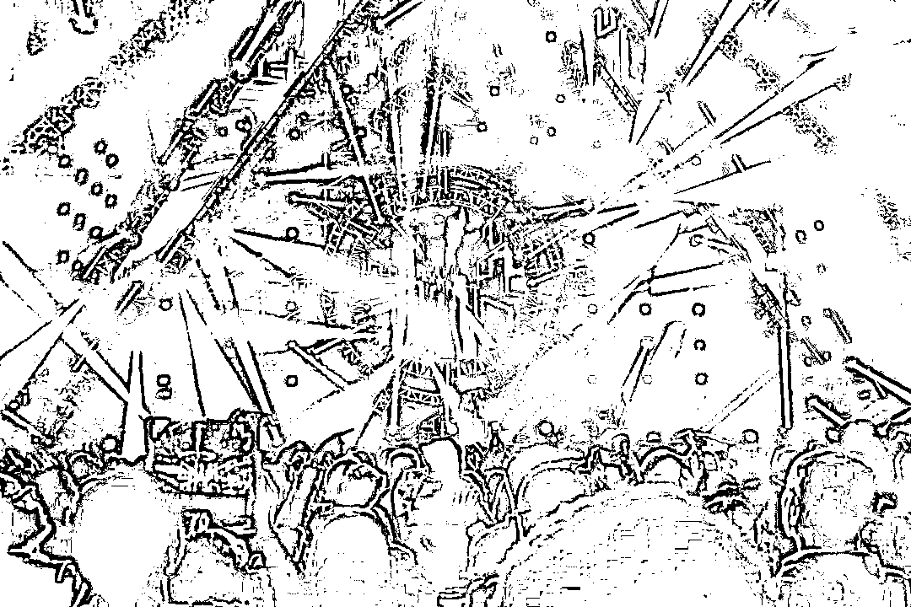

# 揭秘“吴亦凡”们背后的灰色产业链：流量经济扭曲饭圈文化

> 原文：[`mp.weixin.qq.com/s?__biz=MzIyMDYwMTk0Mw==&mid=2247518778&idx=2&sn=b65c3e90f89bb849d93734d8d18bb9a1&chksm=97cb4102a0bcc81453f097ccbf1774e9905a6c41c716006c2b46f114e39660842be9022312d6&scene=27#wechat_redirect`](http://mp.weixin.qq.com/s?__biz=MzIyMDYwMTk0Mw==&mid=2247518778&idx=2&sn=b65c3e90f89bb849d93734d8d18bb9a1&chksm=97cb4102a0bcc81453f097ccbf1774e9905a6c41c716006c2b46f114e39660842be9022312d6&scene=27#wechat_redirect)

“今天没有在群中看到他赞美××，按照群规将他从本群中踢除。” 

“××代言了新的产品，我已经入手了，你们也赶紧买，然后发截图。”

“又有人说哥哥的坏话了，大家按照之前统一要求赶紧去评论区反击。”

……

记者近日以粉丝身份加入多位当红明星的粉丝群中，每天都会看到上述类似的对话。这些粉丝群的成员大多是青少年，有些群里的“00 后”甚至占了八九成。

饭圈（指粉丝圈子）乱象频现，已成为当下最受关注的社会现象之一。从偶像选秀类节目中有选手的粉丝集资超百万元涉嫌非法集资，到为“爱豆”投票购买大量酸奶饮品扫码后将酸奶倒掉，再到当红艺人涉嫌违法犯罪时仍有不少粉丝为其摇旗呐喊，今年以来，因粉丝追星而曝出的各种新闻事件层出不穷，饭圈乱象也将粉丝文化推到了舆论的风口浪尖。

多位专家接受记者采访时说，在资本和平台的推波助澜之下，一些粉丝投入大量金钱和时间打榜追星，部分艺人忘乎所以，道德、法律底线双双失守，让**“三观跟着五官走”的错误价值观愈演愈烈**，给大众尤其是青少年的身心健康带来巨大危害，甚至为非法集资、流量造假等违法犯罪提供了土壤，需多方发力及时止住这种歪风邪气。

图片来源：摄图网  

关卡诸多入群严格

架构清晰分工明确

刚开始，记者申请加入多位当红明星的粉丝群，却处处碰壁；偶尔加入的，很快又被踢出了群。 

15 岁的北京初三学生小可告诉记者，要顺利**加入一个当红明星粉丝群，需要越过重重关卡**：**微博超话等级不低于 10 级，不仅要关注明星本人还要关注工作室，个人微博中关于该明星的微博数不少于 50 条**；就这样，申请核验后还不一定能通过，即使通过后还有一大堆群规要遵守，稍不注意就会被踢出群。

而想要达到微博超话 10 级，**即使天天签到、发帖，至少也要两三个月时间**。

后来，记者通过各种途径加入了 5 个明星粉丝群，发现这些**粉丝群均组织分工明确**，下设打投组、宣传组、反黑组、净化组等。其中，**反黑组负责搜索整理明星在网上的“黑料”，便于和其他粉丝一起向平台客服投诉；净化组主要负责微博和其他搜索平台的词条排序**。

“**有时候明星的单曲关键词是‘难听’，我们就会使用难听进行造句**，‘××新歌真的不难听懂’，‘××新歌太好听了，果然像我这样唱歌难听的驾驭不了’，来**降低单曲与‘难听’一词的负面关联**。”天津高一学生小芸在某当红明星粉丝群净化组，她对于“净化工作”颇有心得。

中国传媒大学文化产业管理学院学术委员会副主任、法律系主任李丹林介绍说，“饭”即“fan（粉丝）”的音译，他们组成的圈子就叫饭圈。事实上，这种组织架构清晰明确的饭圈组织，早已成了饭圈文化中的一种常态。

人们对饭圈乱象的诟病，**控评是重要因素之一**：一旦有网络平台涉及明星的负面消息，该明星的粉丝群就会组织粉丝想尽办法一拥而上抢占评论前排进行反击。记者看到，粉丝群里充斥着这样的言论——**“宁愿自己被骂，也不愿哥哥被骂****”**“如果不控评，让黑料满天飞，会影响哥哥的口碑和商业价值”。

阶层分明拒绝异见

流量造假畸形追星

除控评外，对流量的盲目追捧还衍生出大量的“数据注水”事件。几年前就发生过某明星一条微博转发量过亿的情况，在网上引发一片哗然。随后相关部门对此的监管力度不断加强，在公安部组织开展的“净网 2019”专项行动中，北京警方抓捕涉嫌研发上线名为“星援”App 用于制造假流量的团伙。 

记者调查发现，**饭圈有完善的等级规则，内部阶层分明，少部分核心粉丝掌握圈内话语权****，当个别普通粉丝发表不同意见时就会遭到围攻**。

前几天，在粉丝群里，记者首先肯定了某明星为救灾作出的努力，随后提出一线救灾应当由更专业的人来做的观点。群里立马炸开了锅，不少群友出来指责记者，甚至还有人发私信辱骂记者。

记者在这 5 个粉丝群里发现，**对明星及其行为，都不能有反对哪怕是质疑的声音，即便是提出一些建设性意见，也可能被群起而攻之**。

李丹林认为，随着互联网的发展，粉丝和明星发展为可以近距离深度互动的关系，但在这个过程中产生了许多畸形现象，粉丝会出现一些超越社会伦理底线甚至构成违法犯罪的行为。近年来不断出现的“黑粉”“私生饭”很能说明这一问题。

四川矩衡律师事务所律师郭小明解释说，“黑粉”是指恶意抹黑偶像的粉丝群体；“私生饭”则是指时时刻刻跟踪明星、偷窥“爱豆”，侵犯明星隐私权的粉丝。这些粉丝的行为都是病态的，干扰了明星的正常生活，还有可能涉嫌违法犯罪。

今年 7 月 15 日，某明星在车中发现疑似定位追踪器，其所属公司发布声明，表示已经报警处理，谴责倒卖艺人家庭住址、拍摄地点等个人信息的行为，劝大家不要相信甚至参与付费获取此类信息。

**在某流量明星近期被刑事拘留后，还有很多粉丝在网上留言发表“哥哥是无辜的”“要去劫狱”等言论**。“是不是要给××一个机会，官宣请他做代言人，告诉大家还是要给他一个机会，坏人也需要机会，你们觉得呢？”一张某品牌微信群截图激起众怒，品牌方迅速发布声明称，开除所有发表不当言论人员。

资本黑手盲目推动

反复收割粉丝钱袋

**艾瑞咨询发布的《中国红人经济商业模式及趋势研究报告》指出，2020 年粉丝经济关联产业市场规模超过 4.1 万亿元，2023 年预计超 6 万亿元。** 

****集资应援、倒卖门票等都可以作为圈钱的名目**。在饭圈，很多粉丝都是通过网络自发建立粉丝会，还分地区设分支，有后援会总会和分会，根据会员的专长特点，进行“站姐、反黑、打投、宣传、文案”等分工。但随着资本的涌入和利益的诱惑，许多粉丝会不再纯粹。**

**在饭圈里流传着这样一句话：**没钱不要追星**。而粉丝们为偶像花的钱，最后很可能落入“粉头”的口袋。**

****所谓“粉头”，是指最具有号召力的粉丝**，熟知艺人的行程安排，所有的现场应援、打榜投票、发布会应援集资等都是由“粉头”进行组织。近年来，**经常会曝出“粉头”贪污、卷款跑路等消息**。**

**据了解，“饭圈集资应援”大致可以分三类：一是包含实物回报的，如卖专辑、周边产品，将所得利润用于支持偶像的相关活动；二是不提供实物回报，但承诺把粉丝的真金白银用于选秀投票、给偶像送礼物；三是说好了为偶像集资，承诺提供回报却不兑现的诈骗行为。**

**2018 年，某明星贴吧吧主在进行交接时，存在一笔算不清的账款，有粉丝质疑吧主贪污了近 209 万元的宣传费用。随后吧主发布微博澄清并辞职，最终不了了之。**

**李丹林说，**明星实际上不是一个人，背后也不仅只有一个工作室，还有很多资本方支持，他们要借助明星效应来实现商业目的**。“比如牛奶打榜事件，资本方为了获取商业利益，不惜设计一些违反一般伦理甚至法律的规则去实施相应行为。**同时对于那些有问题的明星，他们可能还会动用相关资源和力量，帮他们洗白劣迹**。”**

**郭小明也认为，正是因为有利可图，一些资本方无视应承担的社会责任，组成了各种利益集团，想方设法收割粉丝的“钱袋子”；对饭圈的一些乱象，不仅不闻不问，甚至在“黑红也是红”的错误观念引导下推波助澜，用炒作、数据作假等方式激化粉丝间的矛盾。**

**在中国政法大学传播法研究中心副主任朱巍看来，**造成饭圈乱象最重要的一个原因就是流量经济**。“流量能代表一个明星的商业价值和变现能力，在一定程度上成了该明星的‘作品’。而在社交媒体广泛发展尤其是自媒体迅速发展的情况下，饭圈经济拉开大幕，**明星或背后的资本可以通过传销式营销、洗脑式追星的方式，形成巨大的粉圈来为自己服务**。”**

**“除了网络平台，**有的卫视台也应承担责任**。一些卫视台举办的综艺节目实际上是一种造星运动，不讲究表演水平、真才实学，而是以颜值、话题等方式让明星出道，容易导致过度娱乐化，在客观上加剧饭圈乱象。”朱巍说。**

**圈乱象影响恶劣**

**误导青少年价值观**

****

****目前，饭圈中已经有大量未成年人的身影，这些不正当的价值导向对他们影响巨大。**** 

****《2020 年全国未成年人互联网使用情况研究报告》显示，通过互联网进行粉丝应援成为未成年网民一种新的网上社交与休闲娱乐活动。被调查的所有学历段中，**初中生网民在网上进行粉丝应援活动的比例达 11%，高中生网民达 10.3%，小学生网民有 5.6%**。****

****李丹林说，一名合格的艺人，首先在专业技能方面要达到相应的程度。但不少明星，问他有什么优秀的音乐作品，塑造过哪些经典角色，没人能回答出来，他却长期占据网络热搜榜，靠炒作等吸引粉丝，这给青少年提供了错误的价值导向。****

****朱巍告诉记者，饭圈乱象对青少年产生的最大影响在于，其形成的价值观游离于主流价值观之外。一些人靠粉丝经济盈利，所做的一切核心是为资本服务，**很多青少年表面上是在追星，实质上却是被资本利用进行“传销式洗脑”**，让自己深陷其中不能自拔。****

****“如今，饭圈乱象已经辐射到各个方面，这种因为追星引起的不理性行为，导致一些人对待其他人和事也容易偏激。其危害绝不单纯是对未成年人意识的影响，而是可能培养社会极端情绪，因为在许多饭圈语境中，不允许有反对意见，这是非常可怕的一种现象，再不及时整治，后果不堪设想。”朱巍说。****

****协力立规矩划红线****

****斩断灰色产业链条****

********

****在郭小明看来，**整顿饭圈，并不是整顿粉丝，而是饭圈背后的灰色产业链**。明星要自律，平台要尽职，粉丝要理性，社会要参与，法律要出手。****

****今年 6 月，中央网信办部署开展为期两个月的“清朗·‘饭圈’乱象整治”专项行动，重点打击诱导未成年人应援集资、高额消费、投票打榜等行为。****

****近日，中央网信办、国家广播电视总局等部门整治不良粉丝文化工作的阶段性成效公布：累计清理负面有害信息 15 万余条，处置违规账号 4000 余个，关闭问题群组 1300 余个，解散不良话题 814 个，拦截下架涉嫌集资引流的小程序 39 款。****

****此外，网络平台也在积极行动。****

****自 6 月 15 日起，快手对饭圈乱象开展专项整治，全面清理有害信息和内容，抵制饭圈不良风气，重点整治“诱导未成年人无底线追星”行为，切实营造清朗网络空间，共处置违规视频 290 条，违规账号 110 个。****

****8 月 1 日晚，腾讯发布公告，通过用户举报和安全巡查发现，在某明星被依法刑事拘留一事中，存在部分网络水军在平台造谣攻击、诱导集资、制造话题等有害行为。平台对于发布传播相关不良信息的账号进行了严肃处置。****

****8 月 6 日下午，微博管理员发文称，最近一年来部分明星粉丝群体非理性应援、刷榜等问题愈演愈烈，对明星势力榜评分机制形成挑战，榜单不能全面客观地反映明星的社会影响力，也与健康的星粉互动生态产生偏离，微博决定将“明星势力榜”下线，进行多维度改造升级。****

****“在治理饭圈乱象时，除了对艺人行为进行规范之外，还可以考虑通过行业协会对粉丝群体加强管理。比如，由行业协会对相关的粉丝组织进行规范。”李丹林说。****

****但李丹林也指出，一个现实问题是，如何监管粉丝应援组织、后援会？这个原本由粉丝自发组织的群体，现在很多人看到了其中的利益和商机，甚至从中获得不当、不法利益。“**应当有相应规范，但这个规范由谁来制定，成规模的粉丝组织需不需要依法注册、受相关部门监管等都是需要考虑的问题**”。****

****李丹林认为，当艺人存在一些不触犯法律的失范行为时，公权力机关很难介入，这时就需要网络平台履行社会责任。“平台将明星和粉丝连接起来，负有一定的管理责任，应当及时对劣迹艺人作出预警和调整，促使他们规范自身行为。”****

****朱巍则建议，对参加应援会的青少年应该有年龄限制。18 岁以下的青少年不应该线下参加活动；线上活动也应该严格按照网信办的相关规定，以及信息服务管理办法、平台规定等进行。对一些问题群组，资本方或平台应该及时制止。****

****来源：每日经济新闻****

********

****← 向右滑动与灰产圈互动交流 →****

********