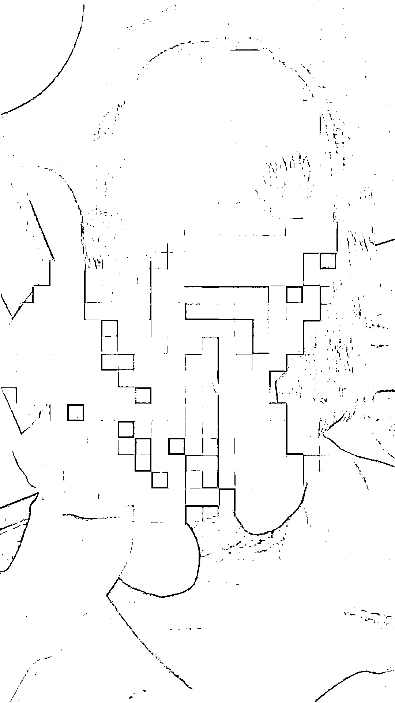
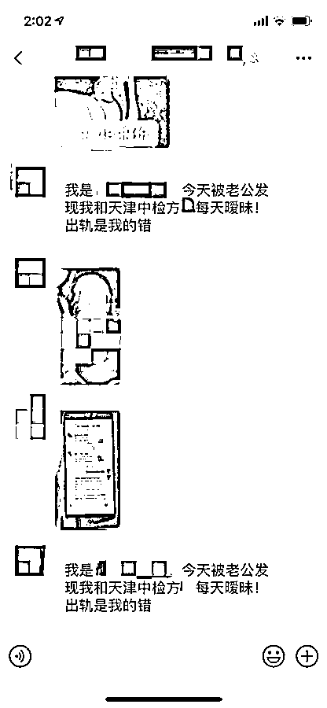
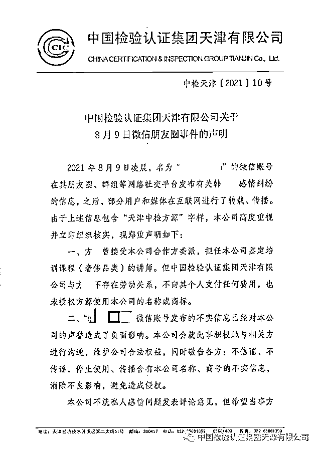

# 女子被剃秃头承认出轨视频疯传！警方最新通报

> 原文：[`mp.weixin.qq.com/s?__biz=MzIyMDYwMTk0Mw==&mid=2247518818&idx=4&sn=2ccc9501ce6b1fa7529bb1ba12e8731c&chksm=97cb415aa0bcc84c2a73f7029930c3fac46dd35f946e8fd410b1fda263b2650c7bf987099a07&scene=27#wechat_redirect`](http://mp.weixin.qq.com/s?__biz=MzIyMDYwMTk0Mw==&mid=2247518818&idx=4&sn=2ccc9501ce6b1fa7529bb1ba12e8731c&chksm=97cb415aa0bcc84c2a73f7029930c3fac46dd35f946e8fd410b1fda263b2650c7bf987099a07&scene=27#wechat_redirect)

8 月 9 日，河北保定一女子被剃秃头承认出轨的视频及聊天截图在网上热传。当事女子称，自己是被逼的。

[`mp.weixin.qq.com/mp/readtemplate?t=pages/video_player_tmpl&action=mpvideo&auto=0&vid=wxv_1996415680866320384`](https://mp.weixin.qq.com/mp/readtemplate?t=pages/video_player_tmpl&action=mpvideo&auto=0&vid=wxv_1996415680866320384)

8 月 10 日，当事女子韩女士告诉极目新闻记者，视频是其丈夫在家中拍摄并流传出去，她在视频中承认出轨是被逼无奈。

**最新消息！**8 月 11 日，保定市公安局高新区分局发布警情通报称：

2021 年 8 月 9 日凌晨 2 时许，保定市高新区警方接报一起殴打他人的警情，辖区派出所民警立即出警调查处置。

**经查，冯某（男）与韩某某（女）系夫妻关系，**2021 年 8 月 8 日 23 时许，**因家庭矛盾，冯某对韩某某实施殴打并使用理发器剃掉其头发，致韩某某受伤，随后又拍摄照片、视频发布到网上。**

目前，高新区警方**已对冯某依法行政拘留**，案件正在进一步办理中。

保定市公安局高新区公安分局 2021 年 8 月 11 日

据韩女士称，视频被丈夫发在微信朋友圈和微信群后，9 日凌晨 2 点多，有警察上门询问，其丈夫向警察承认将她头发剃秃的事实，还称是因为她出轨。“我不敢说话，警察就说让我们协商解决。”

韩女士说，其丈夫平日对男女聊天比较敏感，微信中聊天的男子与她有生意往来。**“我说我老公回来了，不要再发消息。”**韩女士称，丈夫仅从这一句话判断她出轨。

**“我现在很不好，身上还有很多伤。视频承认出轨是被他逼的，不这样说就会被他打，目前我正在找律师处理此事。”**韩女士称，事情的详情，她不想透露太多。

极目新闻记者多次向韩女士询问其丈夫的联系方式试图求证有关情况，她表示暂不方便提供。

8 月 10 日上午，极目新闻记者致电保定 110，接警的工作人员称，此前已接到报警，民警已出警。

辖区派出所工作人员告诉极目新闻记者，韩女士反映遭遇家暴一事，接到警情后同事已出警。8 月 9 日，同事再次联系了韩女士和其丈夫。“这事涉及双方隐私，我们不便透露，但事情还在调查。”该民警说。

保定市妇联相关负责人称，目前已经跟市公安局取得联系，正在关注此事。

湖北今天律师事务所资深刑事律师付成晨表示，首先韩女士可以进行伤情鉴定，轻伤以上则属于刑事案件，需追究其丈夫的刑事责任。如果不属于长期的虐待行为，则韩女士丈夫涉嫌故意伤害罪。最后，韩女士的头发被暴力剃秃，头上有血迹，视频和照片被发到朋友圈，涉嫌构成侮辱罪。

付成晨还称，根据婚姻法的规定，合法的婚姻，产生夫妻之间特定的人身和财产关系，但法律并没有允许丈夫可以对妻子的人身进行攻击，纵然夫妻之间有忠实的义务，但这并不是丈夫可以用私力达到目的的借口，如果男方已经严重侵犯女方的合法权益，即使双方具有夫妻关系，警方依然需要对男方进行处罚。

10 日下午，韩女士告诉极目新闻记者，她已接到警方通知，目前正在派出所录口供，市局正在了解情况。

11 日，保定市公安局高新区分局发布通报称，其丈夫冯某已被行政拘留。

**中检天津回应“遭丈夫剃秃头承认出轨”事件****与涉事男无劳动关系**

在该事件中，网上热传的一张微信聊天截图显示，当事女子的微信在一微信群中说：“今天被老公发现我和天津中检方某每天暧昧，出轨是我的错。”

8 月 10 日，“中国检验认证集团天津有限公司”公众号发布声明称，8 月 9 日凌晨，一微信账号在其朋友圈、群组等网络社交平台发布有关韩某感情纠纷的信息，之后，部分用户和媒体在互联网进行了转载、传播。由于上述信息包含“天津中检方某”字样，经公司组织核实，方某曾接受该公司合作方委派，担任该公司鉴定培训课程（奢侈品类）的讲师。中国检验认证集团天津有限公司与方某不存在劳动关系，不向其个人支付任何费用，也未授权方某使用本公司的名称或商标。

声明还称，上述微信账号发布的不实信息已经对该公司的声誉造成了负面影响。公司会就此事积极地与相关方进行沟通，维护公司合法权益，同时敬告各方：不信谣、不传谣，停止使用、传播含有本公司名称、商号的不实信息，消除不良影响，避免造成侵权。

同时该公司还表示不就私人感情问题发表评论意见，但希望当事方保持理性克制。

目前，当事女子已看到中国检验认证集团天津有限公司发布的这份声明。极目新闻记者就此多次联系当事女子，电话均被挂断。

来源  极目新闻

← 向右滑动与灰产圈互动交流 →

