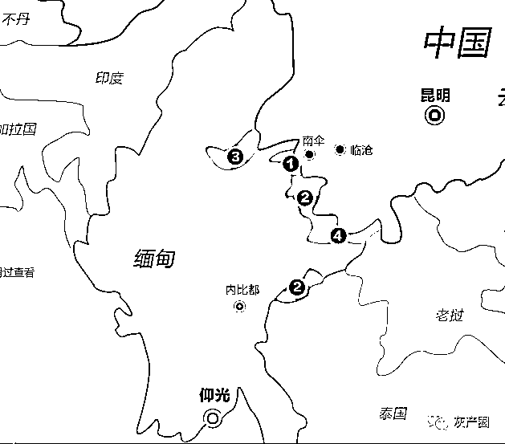

# 在缅北深陷诈骗窝点的日子——一名缅北“寻梦者”的亲身讲述

> 原文：[`mp.weixin.qq.com/s?__biz=MzIyMDYwMTk0Mw==&mid=2247518882&idx=1&sn=38564e54315820a802240884024863f2&chksm=97cb419aa0bcc88cc423c09f4dbaa31f896f3764affd0695d7b0dd410551e2fbca96a5ba5a2a&scene=27#wechat_redirect`](http://mp.weixin.qq.com/s?__biz=MzIyMDYwMTk0Mw==&mid=2247518882&idx=1&sn=38564e54315820a802240884024863f2&chksm=97cb419aa0bcc88cc423c09f4dbaa31f896f3764affd0695d7b0dd410551e2fbca96a5ba5a2a&scene=27#wechat_redirect)

被骗、挨打，恐惧、绝望，身无分文，只身在异国他乡，眼望国门却不能归家。32 岁的大男人坐在广场上，无助得像个孩子，眼泪不知不觉就流了下来。几个月的经历，回想起来是一场噩梦。阿贤，这位从国内被骗到缅北从事电信诈骗的“寻梦者”，在老乡的帮助下，靠着一辆三轮车、一个煤气炉，开始了他卖炒饭的日子。最终，阿贤回到祖国，投案自首。这段经历让他明白，靠自己的劳动获得收入才是最踏实的。

**网友提议出国捞金**

2020 年，新冠疫情突如其来，疫情期间，家住湖北孝感的阿贤几乎每天都宅在家，玩游戏成了他唯一的消遣。随着疫情形势逐渐好转，全国各地都在复工复产。4 月的时候，阿贤在家待不住了，决定外出找工作。“我的脚受过伤，有钢钉在里面，在工地里重活干不了。”文化不高，不能干重活，阿贤的工作找得并不顺利。“在家玩游戏时，我认识了一个叫小军的。”阿贤与小军经常一起打游戏，有一天阿贤在微信里跟小军聊天时，提起自己工作一直没着落。“他问我有没有去国外打工的想法，有的国家博彩、娱乐业很多，做个保镖、酒保、司机都可以。”阿贤听了觉得不错，小军这个朋友似乎很有能力，而且很“够哥们”，很快就帮阿贤介绍了每月工资 1 万多元的“工作”，还给了 1000 多元路费，让他到了云南后再联系具体的出境事宜。对于出国务工，阿贤心里没底。“我对小军说听说国外有些地方还是挺乱的，他说没问题的，路费都包了，现在都是法治社会，你怕什么。”小军称这工作绝对没问题，让阿贤尽管放心。最终，对高薪工作的渴望还是战胜了内心的不安，阿贤于 8 月初到了昆明。在昆明，同村的姐姐听说他要去邻近的国家，极力劝阻。“她说现在疫情严重，国外不比国内有保障，要是没工作，可以到她店里打工。”但阿贤耐不住高薪诱惑，在昆明根本无心工作，9 月底终于下定决心去国外捞金。

**跋山涉水偷越国境**

阿贤的出国路可谓历尽千辛。“我跟小军联系后，他让人开车送我到普洱，然后转乘面包车到孟连。”这趟行程下来十多个小时，虽然累，阿贤觉得还能接受，可接下来的行程实在大出他所料。“休息后，我们被拉到一座大山脚下，跋山涉水十多个小时，越走越偏僻，这时我才知道这就是偷渡。”这段路程，阿贤不止一次打退堂鼓，有点害怕了，可想回头却已是不行，山高林密、羊肠小道，如不跟着向导根本无法原路返回。与阿贤同行的约有 20 多人，不少是跟阿贤一样懵懵懂懂初次出国务工的。“最后，我们坐橡皮艇渡河到达对岸，具体什么地方我不清楚，有当地武装人员开着‘军车’来接我们。”坐上车的那刻，阿贤心里稍微安定了下来，总算是到了目的地缅北了。

**高墙电网枪兵站岗**

阿贤被送到一栋民房，陆陆续续又来了三四批偷渡过来的人。第二天一早，民房里 60 多人被集中送去医院体检办暂住证。阿贤心里又不安起来，他给小军打电话。小军要他别担心，服从安排，办好手续会有人接他去公司的。“在当地办好暂住证后，来了辆面包车，把我拉到了公司。进去以后我就呆住了，高墙、电网、枪兵站岗。我以前坐过牢，那地方给我的感觉就是监狱。”如果说偷渡的经历让阿贤萌生退意，那到了公司后他简直悔得肠子都青了。“当时有个人跟我们说越境过来走了十多个小时也辛苦了，要我们先休息，把手机、身份证拿出来给他登记。”阿贤他们把证件、手机都上交后，被安排到一楼的一间宿舍休息。宿舍里约有七八人，此外还有两名武装人员同住。武装人员负责看管他们，舍友间不允许交谈，也不能随意外出。

**入伙诈骗不干就打**

阿贤无法静下心来休息，这“监狱”跟小军形容的工作相差十万八千里，怎么看也不可能是月收入一万元的工作。这时已无法联系上小军，自由也被限制，阿贤隐约明白了，即使联系到小军也于事无补，这可能本就是对方设的一个局。当天晚上，便有工作人员前来跟阿贤几个聊天，问他们有没有听说过“杀猪盘”“刷单”，告知他们这公司其实就是从事这些业务的。阿贤一听，这不是诈骗嘛！自己曾经坐过牢，发誓再也不做违法犯罪的事情了。“我说我不做这些，我要走，结果马上就有人来把我带出去。”阿贤被单独关在一个小黑屋里，事后他才发现那是门口一排矮小的房子，专门给他这些刚来不愿意从事诈骗的人、在诈骗过程中捣乱的人（比如提醒事主报警）、逃跑的人准备的。“我被关进去后，他们就打我，用枪托打我，说花了那么多钱让我偷渡过来，不干活怎么回本。”阿贤在小黑屋里度过了毕生难忘的一周，每天只有三个馒头两瓶自来水，不答应入伙就挨打，要么被打到爬不起来，要么是前来教训他的人打累了才停歇。七天后，陆续来了几个有相同被打经历的人，劝阿贤放弃抵抗，称只有加入并做出业绩才可能被放走，否则便是被打死才能离开。被一轮劝说后，阿贤仍未点头同意加入，于是又被折磨了十多天。阿贤内心绝望了，不知道什么时候是个头，身体跟精神都崩溃了，他怕自己真的会被打死，再也没有机会回家了。万般无奈之下，阿贤只得同意加入。在跟班学习了十多天后，阿贤正式上岗。

**话术操作诈骗工厂**

“8 点起床吃早餐，8 点半一定要到二楼的办公区，9 点的时候组长会过来派发已经添加了一些客户的手机。”阿贤干活的地方就在宿舍的二楼，他们被分为几个组，每组 8 至 10 人，被分在一个房间，每间房都有武装人员看守。每组配一个组长负责管理，一个“财务”负责打钱给点赞的客户，一个“客服”专门处理产生怀疑后要求退钱的客户，其他是工作人员。“我们有一个‘话术本’，照着话术引导客户去短视频平台点赞，点赞会有 5 元的佣金。客户尝到甜头了，我们就以‘抢更多单赚更多钱’为由，诱导他们下载公司的 APP，说进行充值后才能优先抢单。随着客户充钱多了，公司就会冻结账号，把钱转走。”阿贤称自己“业务能力”不强，主要是自己本人也抗拒行骗。他按照话术，一步步引诱客户踏入骗局，一个月下来，也做成了几个单子。阿贤回忆，最大的一单，是骗了广州增城一个 20 来岁的女孩子 1 万多元，用的也是刷单、充值、冻结本金无法提现的套路。

**疫情爆发回国无门**

“2020 年 11 月底的时候，公司所在的地区疫情也严重了，当地政府要求做诈骗的都要关停。公司要我向家里要钱赎身，赔钱给公司补偿路费和生活费，我说没有，就又被打了几天。”2021 年元旦那天，看实在榨不出阿贤“油水”了，公司的车把阿贤放在边境口岸附近的广场。“他们把身份证还给我，手机没还，让我自己想办法回国。”本想出国务工赚钱，到头来身无分文，不过相比过往几个月的经历，阿贤觉得自由才是最宝贵的。当他排队前往边境的时候，当地政府武装人员告诉他，回中国需要缴纳报名费 9000 元，否则不予办理。“我当时就傻了，很无助，一个人在国外，身上没钱没有手机，不知道怎么办。”在广场眼望国门却不能回去，阿贤抹着眼泪，不知道自己该何去何从。“这时我遇到一个中国人，他问我怎么回事，我说被人骗过来做诈骗，他说像你这种事情并不少见。”这位好心人提醒阿贤，不仅是要交给当地武装 9000 元，回国还要缴纳偷渡罚款。阿贤一筹莫展。好心人告诉阿贤，前面有间湖北人开的理发店，是阿贤老乡，让他去看看能不能获得帮助。

**炒饭赚钱回国自首**

“我找到理发店的老板，他跟我是一个县城的，我把情况说了，请求他借钱给我，回国后再还。”理发店的老板坦称，自己不会拿几万元出来借给一个不熟悉的人，不过可以帮阿贤想办法。他建议阿贤靠自己手艺或劳动找份活干，赚够路费再回国。“他问我会不会做些小炒、小吃，在这里摆个小摊，能赚点钱。”阿贤以前在酒店上过班，学过点烹饪。于是，他拿着理发店老板借的 2000 元，买了个推车和煤气灶，开始卖炒饭的日子。摊子就在理发店门口，一份炒饭 20 元，加肉 40 元左右，利润还可以。可因为疫情的影响，其间还经历了封城，阿贤收入并不可观。理发店老板开解他，让他坚持一下。“真的很感谢他，不仅借钱给我做小生意，还让我住在他家里，房租都没要我的。”在阿贤最困难的时候，理发店老板向他伸出了援手，阿贤每每回忆起来心里都充满感激。2021 年春节过后，随着疫情形势的好转，阿贤的生意渐渐好起来。到 4 月份的时候，他已经攒了 4 万多元。阿贤不仅把钱还给理发店老板，还重新买了部手机，跟家人取得了联系。虽然凭手艺赚钱收入不错，可家里人都非常担心他。通过手机，阿贤还了解到，国家对自己这种在境外从事诈骗的人员回国自首从轻从宽处理的政策。反复权衡后，阿贤决定回国自首。5 月 4 日，阿贤从孟连口岸回国，隔离 14 天后，于 5 月 18 日向公安部专案组自首，供述了自己在他国诈骗多人的事实。目前，阿贤因涉嫌诈骗已被依法逮捕。

**劳动赚钱才最踏实**

“这段经历真的一辈子都不会忘记，比坐牢还苦。我曾经想过自杀，可是那里连自杀的机会都不会给你。如果有一次重来的机会，打死我都不会去了。”如果不是老乡伸出援手，如果不是自己还有炒饭的一技之长，阿贤的回国路将更加坎坷。“用自己的双手赚的钱，永远都是踏实的。现在回想起来，理发店老板当时没有直接借钱给我，而是让我靠双手赚钱，这才是对我最大的帮助。”阿贤让家人帮忙筹款积极退赃。在增城区看守所，阿贤心里很平静，只想快点开庭。“出去后，抓紧时间跟女朋友把婚结了，以后老老实实打工，本本分分赚钱，踏踏实实过日子，这辈子再也不想什么发财梦了。”“寻梦者”阿贤，轻信网友高薪招聘谎言，从而深陷诈骗窝点，经历了无助、恐惧、绝望，甚至是生死。一路走来，最后明白，靠自己的劳动获得收入才是最踏实的。自从各地加大劝返缅北电信网络诈骗违法犯罪人员的宣传力度后，人们都知道缅北不是天堂，也知道从事电信网络诈骗是违法犯罪，可面对形形色色的诱惑，还需要理性辨别。**警方提醒广大群众**，千万不要轻信陌生人、网络上所谓的“高薪招聘”，找工作要到正规、合法的劳务中介。来源：平安广州 编辑：小嗡

← 向右滑动与灰产圈互动交流 →

