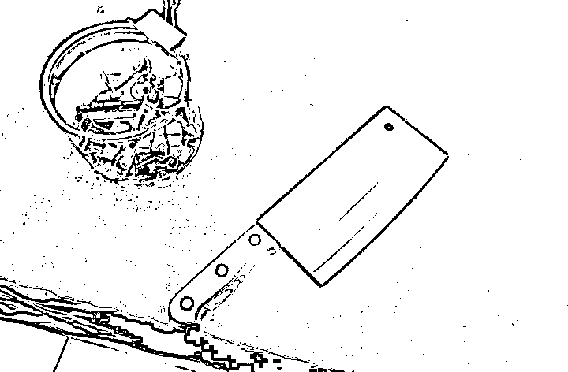
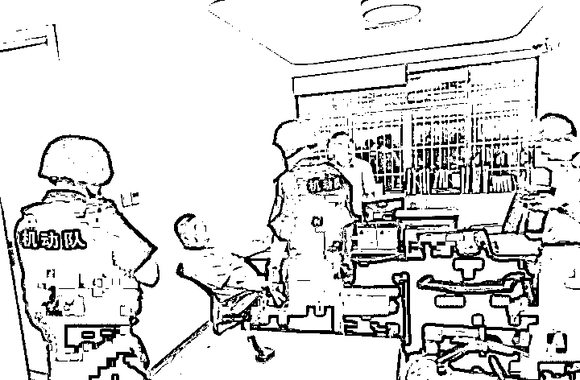
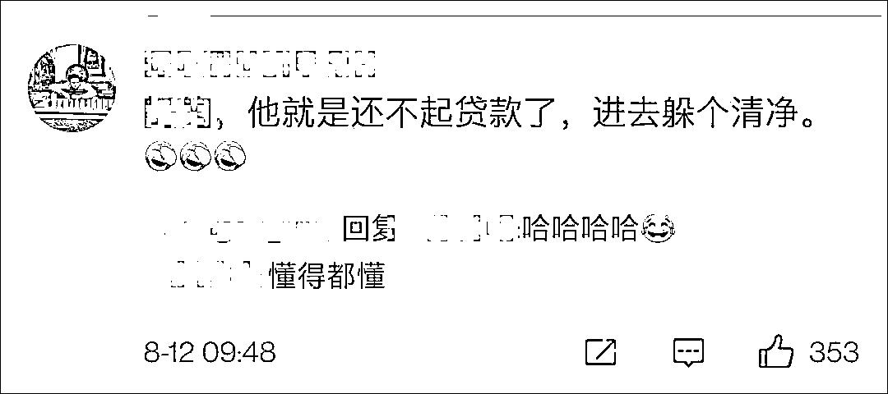

# 劫匪：这位银行经理，你礼貌吗？

> 原文：[`mp.weixin.qq.com/s?__biz=MzIyMDYwMTk0Mw==&mid=2247518882&idx=3&sn=9e35f6e0cbbeac8ccd3d002ce4227309&chksm=97cb419aa0bcc88c5bb74bdbe007fa2f4060c8792761aec2907edec3cf5f8cac3f073ee8efb7&scene=27#wechat_redirect`](http://mp.weixin.qq.com/s?__biz=MzIyMDYwMTk0Mw==&mid=2247518882&idx=3&sn=9e35f6e0cbbeac8ccd3d002ce4227309&chksm=97cb419aa0bcc88c5bb74bdbe007fa2f4060c8792761aec2907edec3cf5f8cac3f073ee8efb7&scene=27#wechat_redirect)

“严肃点，严肃点，不许笑，我们这儿打劫呢！”

还记得电影《天下无贼》里笨贼抢劫的名场面吗？万万没想到，现实生活中还真有这样的桥段！

近日，杭州一男子因无力偿还贷款，酒后持菜刀抢银行，结果银行经理压根儿不信。**两人面对面坐着，劫匪转着菜刀，经理玩着手机，谈笑风生**。

末了，银行经理说身边根本没钱，劝该男子离开算了，**结果该男子反而担心他走了会罪加一等，强烈要求银行经理报警……**

目前，该男子被警方依法行政拘留。

[`v.qq.com/iframe/preview.html?width=500&height=375&auto=0&vid=g3267vh0x3d`](https://v.qq.com/iframe/preview.html?width=500&height=375&auto=0&vid=g3267vh0x3d)

该视频号不可引用

据《钱江晚报》8 月 11 日报道，8 月 9 日，浙江杭州余杭一徐姓男子因贷款到期无力归还，去酒吧借酒消愁，正好看到旁边有一家银行，于是心生歹念。

据悉，徐某是一名厨师，他当天先后四次进入银行。

徐某  图源：钱江晚报

第一次进银行，徐某问能不能跨行取钱，银行工作人员告知徐某旁边 ATM 机就可以，徐某去了 ATM 机，但并未取钱；

第二次进银行，徐某问能不能贷款，希望通过贷款解决燃眉之急，但他被工作人员告知不符合要求，于是再次走出银行；

第三次，徐某特意在手机上查了“抢银行要咋判？”，然后他找到银行经理，表示自己要抢银行，但是经理不相信。于是徐某出门，去买菜刀；

徐某所购菜刀 图源：钱江晚报

第四次，徐某提着菜刀进入银行，找到经理，再次表明自己要抢银行，但银行经理还是不信，并且继续忙自己的事，之后还玩起了手机；而徐某则在旁边坐着，拿菜刀包装纸垫在桌子上，转刀玩儿。

俩人就这样坐着，聊着天，银行经理告诉徐某，他们是信贷部的，身边根本没钱，并且劝他离开算了；但徐某却担心自己真走了被警察抓到会罪加一等，非要让经理报警……

8 月 9 日晚 9 点半左右，余杭公安分局接到银行经理报警，3 分钟后，警方赶到现场，立即将徐某控制，并夺下菜刀。**徐某全程十分配合。**

警方到达现场  图源：钱江晚报

如此让人啼笑皆非的“抢银行”，着实逗乐了一众网友。

“经理：这一天天可真难，又要聊天又要报警的。”

“好歹你带个丝袜呀，都没个样儿。”

有网友调侃：“他就是还不起贷款了，进去躲个清净。”

“想不开的时候找个人聊聊其实挺好，别带刀。”

还有的网友的关注点却跑偏了：“拿着菜刀抢银行的同时还带着口罩，防疫意识杠杠滴。”

据悉，徐某目前已被警方依法行政拘留。

来源：观察者网综合

← 向右滑动与灰产圈互动交流 →

