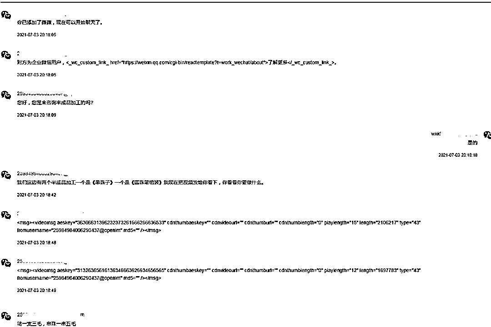
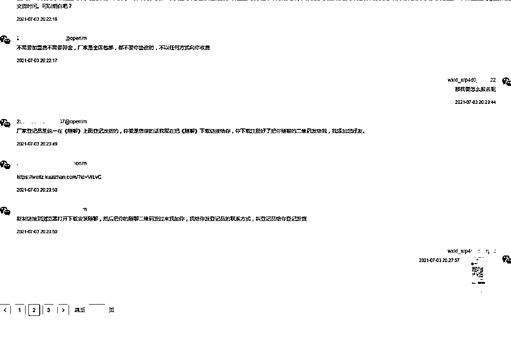
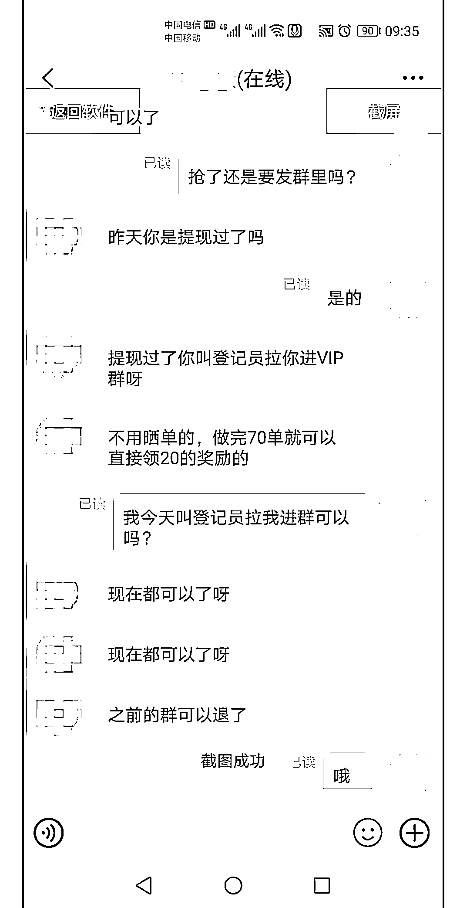
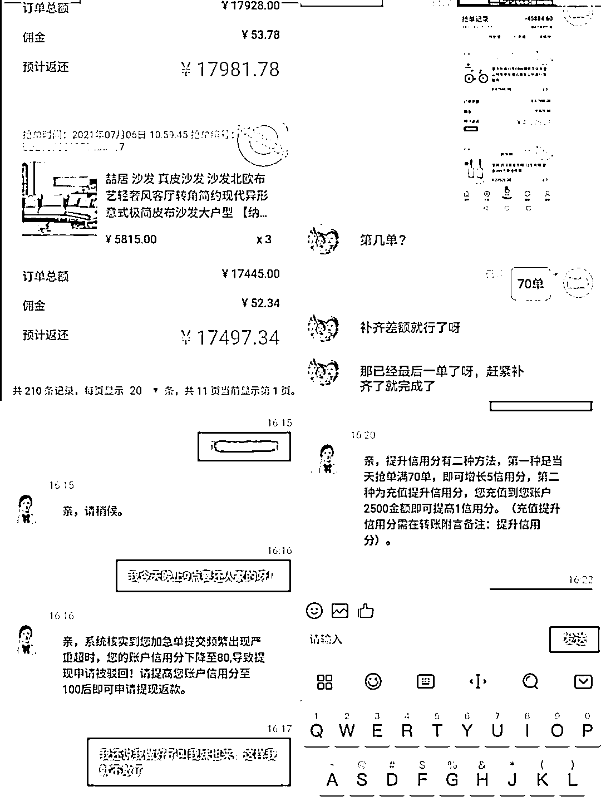

# 宝妈刷单三天，被骗二十五万！

> 原文：[`mp.weixin.qq.com/s?__biz=MzIyMDYwMTk0Mw==&mid=2247518882&idx=7&sn=f9dc012db6cc39a7328ffaf76bd88255&chksm=97cb419aa0bcc88c89aff30ad3ce2c9a49a90e91f310a97a8df6e375e1aca4a0376f62aeb1f5&scene=27#wechat_redirect`](http://mp.weixin.qq.com/s?__biz=MzIyMDYwMTk0Mw==&mid=2247518882&idx=7&sn=f9dc012db6cc39a7328ffaf76bd88255&chksm=97cb419aa0bcc88c89aff30ad3ce2c9a49a90e91f310a97a8df6e375e1aca4a0376f62aeb1f5&scene=27#wechat_redirect)

**在网络兼职的种种骗局中**

**刷单最为常见**

**而就是这个最为常见的骗局**

**让一些人不断“掉坑”……**

刷单返利类诈骗易被骗群体为学生群体、待业群体。骗子通过网络平台发布兼职广告，以“零投入”“无风险”“日清日结”等方式作为诱饵，同时承诺完成刷单业务后返费用，并额外提成，以此招募人员进行刷单；作案手法虽然简单，但不少人会因为尝到刚开始完成刷单业务时骗子给的小额返利，而栽进更大的刷单骗局。

**发布兼职广告 诱惑添加好友**

2021 年 7 月 9 日，雅安市宝兴县在家带娃的宝妈李某无意间看到一个做“手工兼职”的二维码，心想闲暇无事可以在网上做手工赚点钱补贴家用，于是添加了对方为好友。

添加之后，对方向李某发了两个半成品加工视频链接让李某观看怎么加工，并向李某说明加工一支笔 3 毛，串珠一串 5 毛，称不需要加盟费、不需要押金、不需要垫资、全国包邮。

随后，对方向李某发来一个名叫“随聊”的 APP 下载链接，称厂家“登记员”都在该 APP 上登记发货下任务。李某安装好“随聊”APP 后，按对方发送过来的联系方式添加“登记员”为好友。

**骗取信任，诱惑充值开展刷单**

在该 APP 中，“登记员”昵称显示为淘品优客服 008，他告知李某，目前手工任务较少，但是可以做其他任务来赚钱。随后，李某在“客服”的引导下，下载了“淘品优”APP，“客服”将一个登录账号、密码发给李某，告诉李某可以先用这个账号在“淘品优”开展刷单。

李某登录对方账户后，按提示开始第一次刷单，共计刷完 70 单，系统显示获得收益 170 元；第二次刷 70 单，系统显示获得收益 200 元。此次“客服”让李某注册登录自己的账号，然后将该两笔收益发到李某淘品优账户，李某按要求登录后发现 APP 账户里面有余额 450 元。

此时，对方告知李某使用自己的账号开展刷单收益要高些，李某便使用其本人淘品优账号充值 500 元，刷完 70 单，此时系统显示账户余额 1000 元，李某成功提现 900 元。第二天对方询问李某是否提现，在得知李某提现后便告知李某其叫登记员将李某拉入 VIP 群，该群不用晒单，做完 70 单直接领 20 元奖励。

** 编造理由，引导“刷客”大额充值激活账户**

次日，李某继续刷单。这次她先后充值 2000 元、4400 元、10000 元、20900 元、10000 元、40000 元完成刷单任务，但提现时被“客服”告知信用度低了 20 点。为了提现，李某充值 5000 元钱将信用度提高到 100%。却再次被告知充值时未备注提高信用度，要求继续充值。李某又按要求充值 30000 余元，“客服”又称其账户被司法局冻结，需充值解冻。李某充值 30000 余元后又被告知当天四次提现机会已用完需等第二天完成 70 单后一并返还。第二天李某充值 49000 余元完成 70 单，仍然被告知因超时、信用度降低等问题而无法取现。李某这时才发现被骗，此时李某已损失 251360 元。

** 骗术揭秘：**

一、在最开始的时候，骗子会以练习刷单业务流程为幌子，让“刷客”购买百元左右的商品，等购买成功后，骗子会快速将购物本金和刷单佣金返还给“刷客”。随后按此流程多操作几次，逐渐赢得“刷客”的信任。

二、骗子在赢得“刷客”的信任后，会要求“刷客”继续开展刷单，且每单转款额度越来越大，当然，承诺的佣金也会越来越高。不过这时，骗子就不会很快兑付本金和佣金了，而是忽悠“刷客”说需要完成连续任务才能一次性返还。

三、等到“刷客”完成连续任务后，骗子们又以各种系统故障、转账延迟、账户冻结、信用度低等理由，引导“刷客”向诈骗账户汇入一定金额激活账户。用这种套路，“刷客”的被诈骗金额将越来越高，直到被骗子们“拉黑”后才发觉上当受骗。

[`mp.weixin.qq.com/mp/readtemplate?t=pages/video_player_tmpl&action=mpvideo&auto=0&vid=wxv_1984658453981626373`](https://mp.weixin.qq.com/mp/readtemplate?t=pages/video_player_tmpl&action=mpvideo&auto=0&vid=wxv_1984658453981626373)

** 警方提醒：**

1、凡是打着“网络兼职”旗号，要求下载刷单、聊天软件以刷单形式做任务返佣金，都是骗局。

2、不点击陌生链接，不扫描陌生二维码，不要随便进聊天群，诈骗分子往往会通过先给一点“甜头”作为诱饵引诱你陷入骗局。

3、网络刷单本身就是一种违法行为，市民如遭遇类似诈骗请立即报警，及时向警方提供对方 QQ、微信、电话号码、聊天记录等，以便迅速破案及时挽回损失。

来源：雅安市反诈中心，熊猫反诈

← 向右滑动与灰产圈互动交流 →

