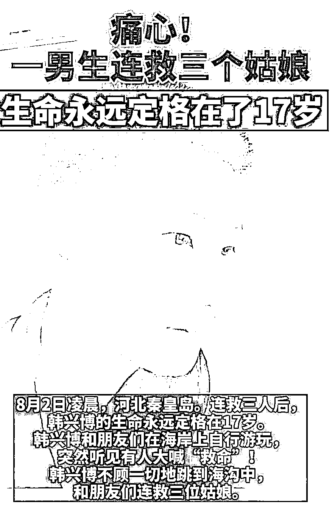
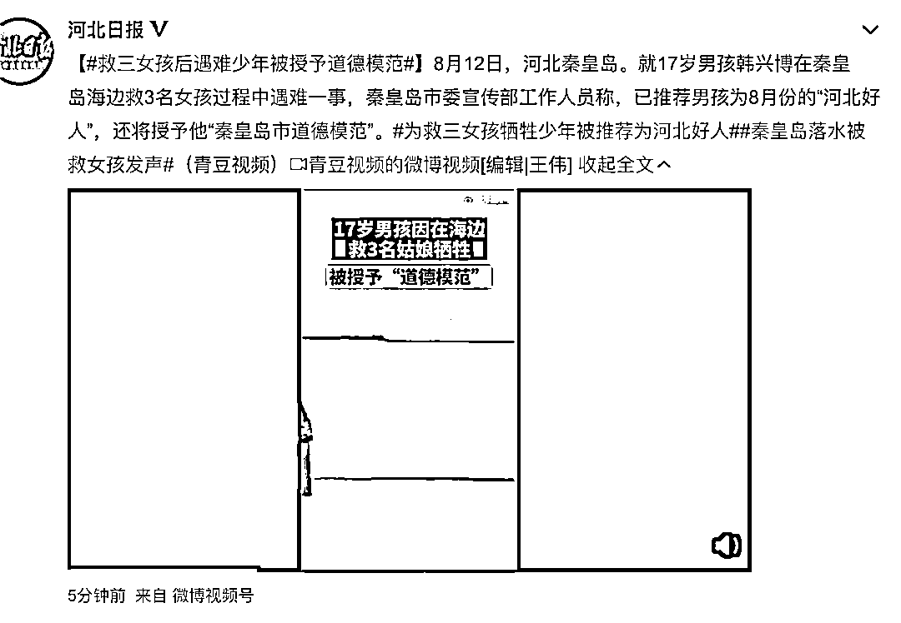
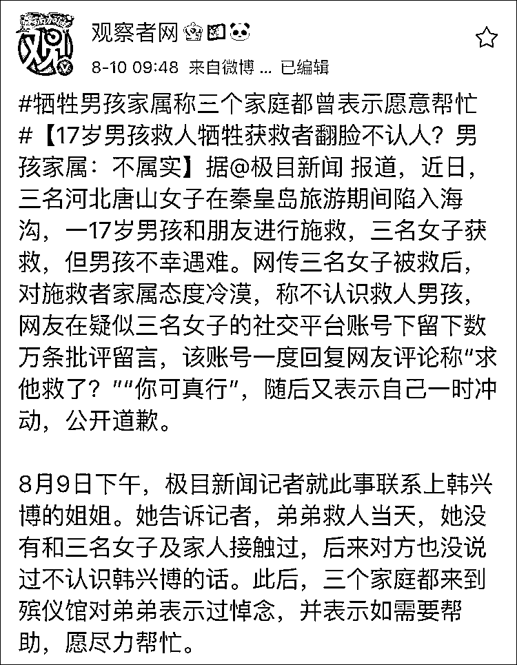
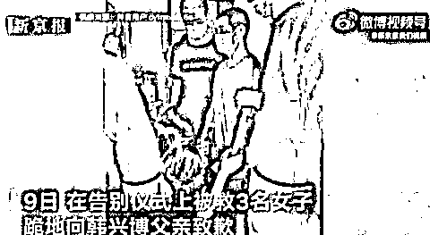
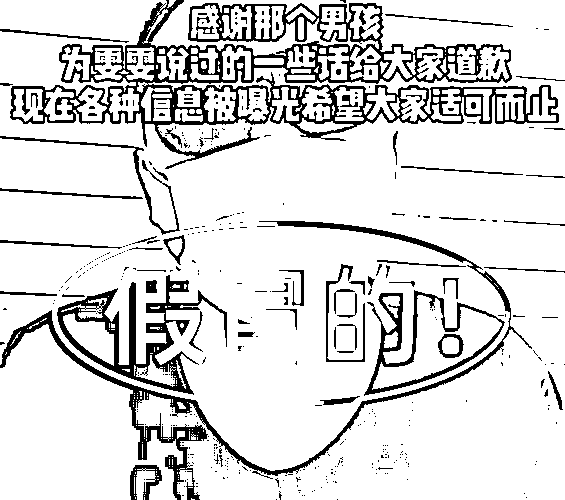
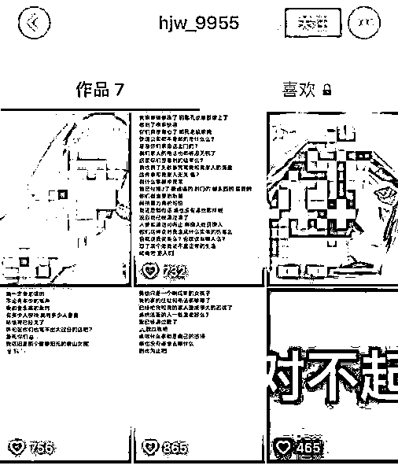
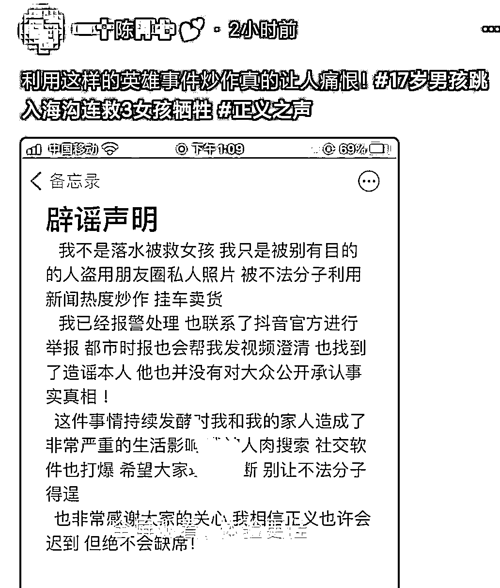

# “被救女孩哥哥”竟是冒充！账号被永久封禁，但还没完……

> 原文：[`mp.weixin.qq.com/s?__biz=MzIyMDYwMTk0Mw==&mid=2247518940&idx=1&sn=3bffdddfc76397fc756cd268c0034555&chksm=97cb41e4a0bcc8f27bdbb69465af315ced481c76e08892eef67d946595d9d63bb4a8d83f3ed1&scene=27#wechat_redirect`](http://mp.weixin.qq.com/s?__biz=MzIyMDYwMTk0Mw==&mid=2247518940&idx=1&sn=3bffdddfc76397fc756cd268c0034555&chksm=97cb41e4a0bcc8f27bdbb69465af315ced481c76e08892eef67d946595d9d63bb4a8d83f3ed1&scene=27#wechat_redirect)

近日 

河北秦皇岛 17 岁男生韩兴博和朋友

从海中救起 3 名落水女子

自己却不幸遇难。

事件引发众多网友关注。

据最新报道，8 月 12 日，秦皇岛市委宣传部工作人员表示，**已****将韩兴博推荐为 8 月份的河北好人，还将授予他“秦皇岛市道德模范”。**

然而就在人们为少年英雄惋惜难过之际，网络上一些纷乱嘈杂的声音冒了出来，有自称医院护士的，有自称是被救女孩的，还有自称被救女孩家属的。这些未经证实的流言在网络发散，令当事人遭受舆论讨伐。

**被救女孩：那些难听的话我们从未说过**

****

****此间，网传三名女孩获救后态度冷漠，还有所谓“好友”在网上发表“求他救了？”等言论，致使三个女孩一天收到几百个质问电话和短信。****

****据多家媒体报道，韩兴博姐姐曾回应，**被救女孩主动联系她表达感谢，女孩家属也都来过殡仪馆，表示有任何需要都会全力配合。******

******同时，韩兴博姐姐表示，3 个女孩刚被救上来的时候都惊魂未定，很快送往医院了，并没想到韩兴博会遇难。姐姐为此呼吁网友，不要盲目攻击别人。******

************

******9 日，三个女孩在葬礼上下跪道歉。其中一名女孩说：**“英雄为我们牺牲了，我们真的很难过。我跪下道歉是因为英雄的牺牲，并不是因为网络暴力，那些难听的话我们从未说过。”********

********

******男子冒充“被救女孩哥哥”，账号被封、警方介入******************

******还有一些人为博取流量而造谣，甚至牵连到与事件毫无关系的人。****** 

******8 月 9 日，一男子在直播中声称自己是秦皇岛其中一个被救女孩的哥哥，他代替自己的妹妹向网友道歉。男子戴着眼镜和口罩，称自己的妹妹还在叛逆期，所以想怼网友，本心不是如此。******

************

******男子不走心的“道歉”更引起网友们的反感，他主页里展示的女孩照片，也被网友误认为“获救女孩”之一。但照片里的陈女士并非事件当事人，随后陈女士遭到网络搜索和攻击，手机被打爆。******

************

********陈女士发现照片被盗用后，随即向警方报警和向直播平台举报。****陈女士向都市时报记者讲述，她并不是被救女孩，该男子也不是被救女孩的哥哥，**他盗用了自己的照片称自己是被救女孩，对自己的生活造成了很多困扰，自己是受害者。******

********

****10 日，涉事直播平台向媒体表示，**该网络主播仿冒被救女生家属已被永久封禁，目前警方正在调查此事。******

****虽然该男子在主页上删除了相关信息，账号也被封禁，但陈女士说，他并没有为恶意炒作蹭热点行为的公开道歉，很多网友还不知道真相。****

******网络不是法外之地！******

******借势炒作、恶意造谣******

******早晚****凉凉！******

****来源：中国青年报、利箭在出击、新闻晨报、都市时报、观察者网、新京报、河北日报****

********

****← 向右滑动与灰产圈互动交流 →****

********