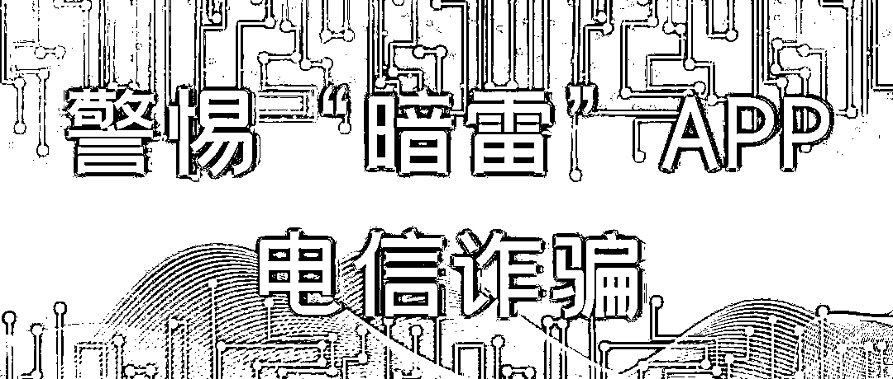
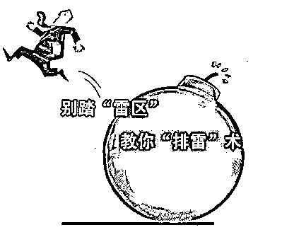
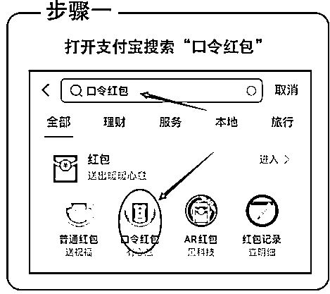
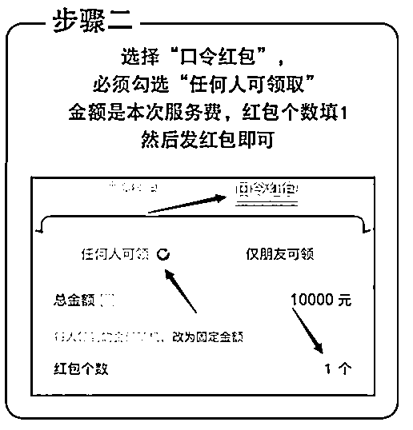
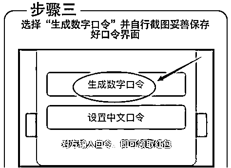
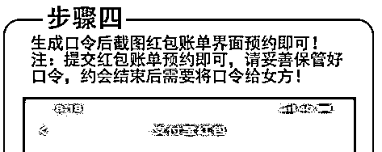
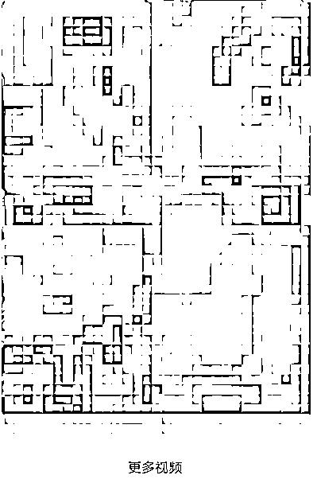
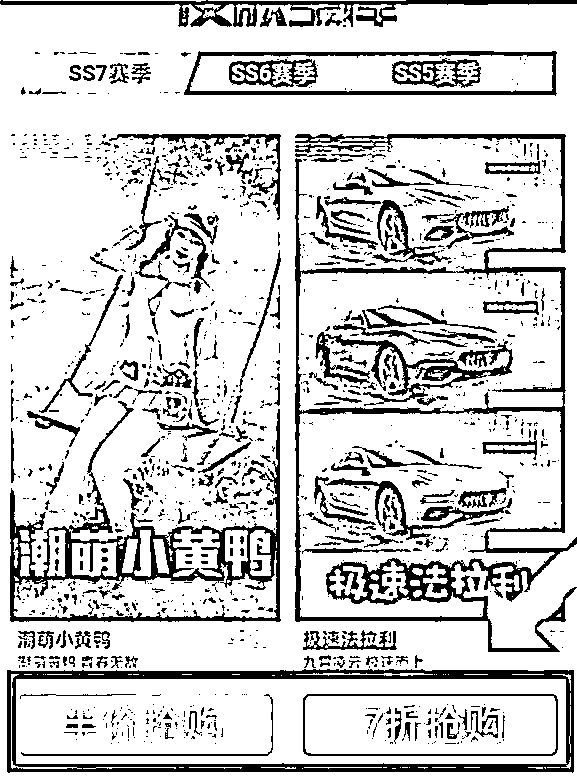

# 最具迷惑性的诈骗：“暗雷”APP 电信诈骗，再不了解 100%被骗！

> 原文：[`mp.weixin.qq.com/s?__biz=MzIyMDYwMTk0Mw==&mid=2247518940&idx=3&sn=0ece35bcbdd3e06b0fe68e2ac07b2e30&chksm=97cb41e4a0bcc8f2404a532b54edf03ce8483638cc26ca4a377fa4635348ee93a95866d4548a&scene=27#wechat_redirect`](http://mp.weixin.qq.com/s?__biz=MzIyMDYwMTk0Mw==&mid=2247518940&idx=3&sn=0ece35bcbdd3e06b0fe68e2ac07b2e30&chksm=97cb41e4a0bcc8f2404a532b54edf03ce8483638cc26ca4a377fa4635348ee93a95866d4548a&scene=27#wechat_redirect)

‍

‍

****随着****在线支付已逐渐成为主流****

****一时间各种交易 APP 百花齐放****

**然而** 

**被吸引来的**

**还有电诈分子**

**和他们早已准备好的**

****“暗雷”APP****

****

**这里整理了**

**三种 “暗雷”手段**

**望大家注意提防**

****

**01**

****隔空取物****

****支付口令还在手中红包款已被领取****

**深夜，为了找点乐子，空虚寂寞的王某搜寻网不良站时，一则广告引起了他的注意——**同城美女在线约，快速上门**。点开广告，屏幕上出现各种各样的美女图片供其挑选，可再次点击页面时却要求其先下载 APP。让王某没想到的是，**从下载 APP 的那一刻起，他就踩上了网络诈骗的“地雷”。**平台要求**采用**支付宝的口令红包**，男方必须**先发对应金额的口令红包再进行预约**。“约会”结束后将口令发给女方**，一方面是防止有人逃单，另一方面是可以验证男方的资金能力。口令红包 24 小时内不领取将自动退回。**

****************

**王某按照要求将截图通过 APP 发给对方。付款后，王某期待着“女神”到来。可是，**最后连美女的影子也没看到，等来的是被提前领取的口令红包。****

**# **“ 雷区”解读 ** #**

****此类暗雷为****“口令红包雷”**， 诈骗分子隐藏制作的“超限采集暗雷”手机 APP，打着线下交友、色情交易的幌子，以显示诚意为由，让被害人先准备好支付口令红包并提供截图。被害人以为只要口令在自己手中，红包就不会支付成功，所以轻易就提供了截图。**

**殊不知，犯罪团伙开发的手机 APP，**在被害人下载安装时就已经在不知不觉中进行了各种授权**，比如授权该 APP**可以访问手机相册、通讯录等内容。**口令红包在生成时，支付平台会**在相册里自动保存含有支付口**令的截图****。此时，即使被害人未将口令给予对方，但犯罪团伙可以**利用已经授权的超限采集将口令截图窃取，最终达到获得红包内钱款的目的****。****

**02**

****镜花水月****

****支付界面无异常钱款数倍被扣****

**梅某在家刷短视频，发现其微信被陌生人拉进了一个刚建立的群里。正当梅某准备退出时，群里发来一连串视频。视频里的美女各个搔首弄姿，看的梅某心痒痒的。然而，每段视频一到最关键的地方便结了，让他非常失望。**

**不久，上传视频的人再次发话：**“想看后面的内容吗？下载我们的 APP 继续观看。”**之后，对方便发来一串网址。下载好 APP 后，系统传来提示：新人注册会员首月仅需一元，全平台视频免费看。**

****

**想到一元钱不算什么，梅某立马点击付款按钮。可是，刚想继续观看视频的他却被随后收到的短信彻底浇灭了欲火。短信提示：**支付宝成功支付 1000 元**。**

**# **“** **雷区”解读 ** #**

****这是使用最多的一种暗雷****“****虚假链接雷”。****

**这种“雷”**以网络色情、网络刷单等内容为诱饵**，诱导被害人下载不法 APP，**

**待被害人欲获取相关物品或者内容，**

****点击支付页面为 1 至 2 元不等的支付链接**时，**

**实则支出百元至千元不等的交易金额。**

**03**

****贪小便宜****

****半价购物钱已付货未到****

**刘女士是一名热爱手机游戏的大学生。最近，她看上一款游戏皮肤，因价格过高只好作罢。一天，刘女士刷贴吧时，正好看到一名网友晒皮肤的截图，并留言说自己仅用一半的钱就买到这款皮肤。早就想要这款皮肤的刘女士赶紧询问该网友，在哪里可以用半价买到。网友说，他在一款名为“优惠购”的 APP 里购买的，并热心地发来下载链接。刘女士根据链接成功下载了 APP，果然在首页看到“半价抢购”选项。**

****

**刘女士毫不犹豫地点击支付按钮并输入支付密码，随后便登录游戏等待领取皮肤，接着皮肤没等到，**等到的只有微信支付成功提醒****。****

****#  “雷区”解读  #****

****此类 APP 是暗雷中的“购物平台雷”。****

**不法分子通过搭建**仿真知名购物网站**，**

**让受害人下载后误以为自己在使用真实网站，**

**在购物付款过程中，钱实际**支付到了不法分子提前搭建的支付通道中。****

****

**“暗雷”类 APP 表面上与一般 APP 无异，但被害人在下载安装之后，由于犯罪团伙的事先设置了 APP，被害人往往会掉入**“超限采集”、“虚假链接”**等陷阱。**

**而且，犯罪分子在后台进行操作时，无论是盗取红包、修改金额等，受害人的手机界面上都不会有跳转页面等反应，毫无痕迹，极具迷惑性。**只有收到扣款短信**，受害人才发觉自己受骗了。**

 **1\. 上网时注意保护个人信息，**不随意透露身份证、银行卡等重要信息**；**

 **2\. 下载软件应通过正规应用市场，**不点击、扫描、安装**来历不明的链接、二维码、软件****；**

 **3.一旦遭受不法侵害，**要及时留存相关电子证据并拨打“96110”报警‍****

**‍

来源：兰州公安，反诈骗先锋** ****

**← 向右滑动与灰产圈互动交流 →**

****