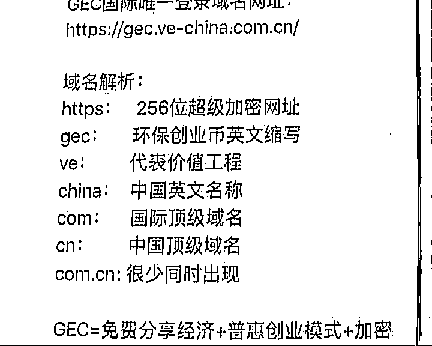
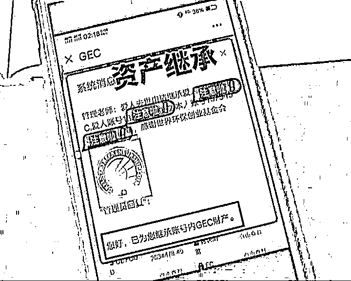

# GEC 环保币：是天上馅饼，还是地上陷阱？

> 原文：[`mp.weixin.qq.com/s?__biz=MzIyMDYwMTk0Mw==&mid=2247518940&idx=4&sn=fdb599f4b1c4115806d77d89696a077c&chksm=97cb41e4a0bcc8f21148dd20a924157505bdb40bef82a81ac57577fd71c41923b3329ff6a671&scene=27#wechat_redirect`](http://mp.weixin.qq.com/s?__biz=MzIyMDYwMTk0Mw==&mid=2247518940&idx=4&sn=fdb599f4b1c4115806d77d89696a077c&chksm=97cb41e4a0bcc8f21148dd20a924157505bdb40bef82a81ac57577fd71c41923b3329ff6a671&scene=27#wechat_redirect)

市区的黄先生平时跟妈妈生活在一起，之前母子两个关系还蛮融洽的，不过从去年开始，他跟妈妈的关系就越来越紧张了。

黄先生：我现在跟我妈关系比较紧张，如果说这个事情发展下去，搞不好就家庭破裂了。 

究竟是什么事情，让黄先生说出这种话呢？黄先生告诉我们，不是因为旁的，就是因为一个叫 GEC 的项目。

黄先生：我妈之前有朋友介绍她一个叫 GEC 环保币的项目，就是先注册，然后投入一笔钱，可以买环保币，用这个币买矿机挖矿，然后币就更多了。

黄先生说的，所谓的 GEC 全名叫世界环保创业基金会，注册之后，就可以免费获得一个矿机，每天都可以获得一定数量的环保币。如果要获得更多的环保币，就需要花钱来买矿机。

黄先生：这个问题就是在于，人总是贪婪的，看到有钱赚，就想投入更多的钱。

黄先生说的，他妈妈在这个项目里头投入了 2 万块，并且告诉他这个项目一直在赚钱。而他观察之后发现，环保币的价格总体趋势一直都是在上涨，他认为这个里头有猫腻。虽然并不认可妈妈的行为，但也没有阻止干预。哪晓得前段时间，他妈妈主动找他了。

黄先生：当时说的，这个项目可以传承下去，也就是上一代人不在了，下一代人还可以继续持有，等于就是拉我入伙。

黄先生认为,这个 GEC 项目就是一个打着环保的名义,实质上进行传销的组织，所以他并不同意加入。为此他也报了好几次警，但是警察上门依然没有说动他妈妈，为此他跟妈妈吵了好几次，关系也越来越紧张。

黄先生：他们打着公益环保的名义宣传这个项目，意思就是他们赚到钱了，没事做了，就可以过来做公益了。我觉得怎么可能呢，在家什么都不做，就玩玩手机就赚钱了？

那么这个 GEC 项目究竟是什么样的呢？根据黄先生提供的网址，我们记者就尝试进行注册，但是却发现没有注册入口。这个时候黄先生的妈妈进来了，她说的，这个网站需要会员邀请才能注册。在她的邀请之下，我们记者才完成注册，发现所有项目都必须进行实名认证才能进入。随后黄先生的妈妈给我们记者提供了她的账号，里头可以看到，所谓的环保币只能在这个网站里头进行交易，交易网站号称不赚取任何利润，只抽取 30%的环保币作为手续费。这块黄先生的妈妈还给记者推销起了这个项目。

黄先生的妈妈：这个项目可以赚钱呢，大多数人都不理解，之前警察也来了，他也不理解，你也不理解，你们都没有福报。

在黄先生的妈妈看来，只有加入了这个项目才是有福报的人。无论是之前上门的民警还是记者都不相信这个项目，都不得这个福报。不过当我们记者问到，这个项目如何能够持续不断赚钱的时候，她是这么回答的。

记者：你花钱买币，然后拿币来买矿机，矿机挖矿，就有跟多的币。那这么多币怎么换成钱呢？

黄先生的妈妈：这个币一直在升值啊，那些赚几千万的太多了。

记者：你怎么知道这个交易是真实的呢？ 

黄先生的妈妈：他不可能作假的，他又不赚钱，怎么作假呢？

那么这个 GEC 项目究竟是不是合法的呢？我们记者查询之后发现，早在 2019 年 6 月份，浙江省民政厅就发布了关于打击整治非法社会组织情况的公告，里头明确把世界环保创业基金会列为非法社会组织。而有些地方的公安机关也已经介入到这个项目当中来。不过面对如此证据，黄先生的妈妈依然不相信这个项目是假的，临走的时候，她还在极力拉拢记者入伙。

黄先生的妈妈：这个币五年减产，今年是第四年，明年就减产了，现在是买入的好时机，你投入 3 万块买个矿机，就去挖去吧。   

看过这个片子，我终于见识到了什么叫“执迷不悟”。老人家面对证据依然认为项目不得问题，等到哪天崩盘了血本无归，就真的怪不得任何人了。说道这个数字货币，也是最近几年被人们晓得的一个新名词，到底是个什么概念，其实很简单，看哪个发行的，要是国家或者央行发行的，流通、兑换就比较靠谱，而另外一些数字货币的骗局，都局限于某一个平台，一旦离开了这个平台，数字货币就连废纸都不如，废纸好歹有张纸呢哎，这个什么都不得。就拿我小马来说，今天也发行一个小马币，但是小马币只能到我小马这块来兑换，其他地方一概不行，这个有什么价值呢？说到底，就是骗局一场。

[亲妈逼迫女儿做小姐赚钱，竟是为买 GEC 环保币！！！](http://mp.weixin.qq.com/s?__biz=MzIyMDYwMTk0Mw==&mid=2247505562&idx=1&sn=beb6fe67d710c565ed42ebd6e7f78c2f&chksm=97cb1da2a0bc94b4f66ed85fc08aac274aa1f2ab9b5304dd9c51b74b33d3b84b71d30af983fb&scene=21#wechat_redirect)

来源：今日生活，利箭在出击

← 向右滑动与灰产圈互动交流 →

