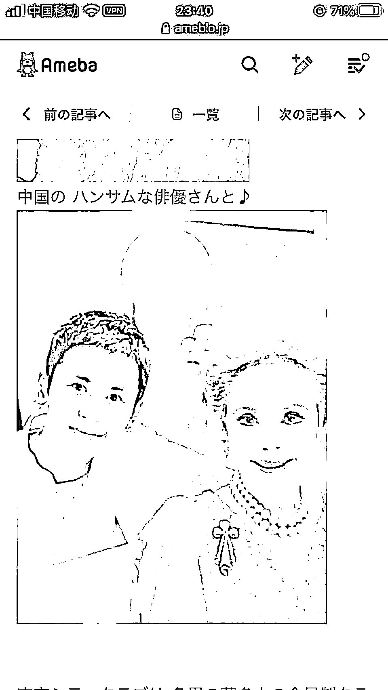
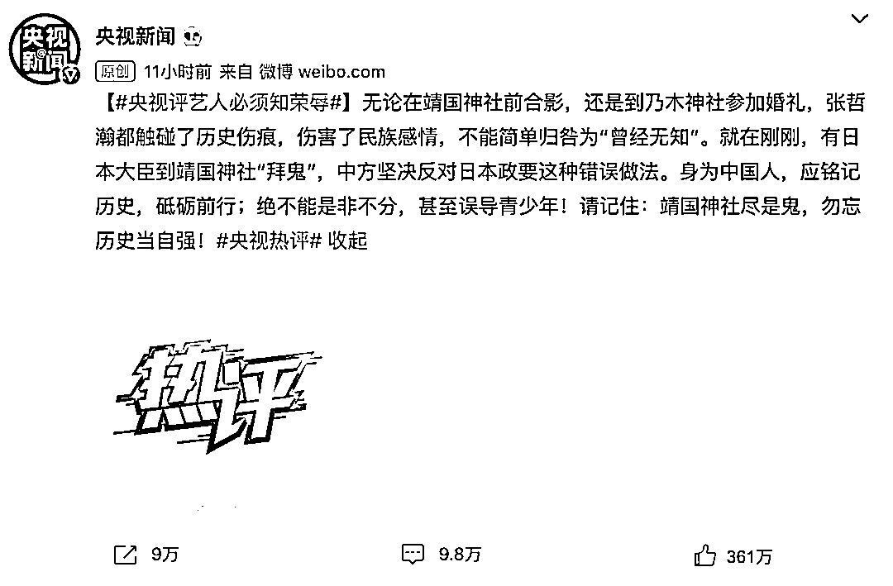

# 男星刚爆红 4 个月，就被扒出参观靖国神社，官媒发声，瞬间凉凉了！

> 原文：[`mp.weixin.qq.com/s?__biz=MzIyMDYwMTk0Mw==&mid=2247518982&idx=1&sn=755eb9f8c61630b6f605f7dc708b489d&chksm=97cb403ea0bcc928af9dc87eccfd293fd2bc3ef5059c1aa120df755d36fb549298d19ffe8d83&scene=27#wechat_redirect`](http://mp.weixin.qq.com/s?__biz=MzIyMDYwMTk0Mw==&mid=2247518982&idx=1&sn=755eb9f8c61630b6f605f7dc708b489d&chksm=97cb403ea0bcc928af9dc87eccfd293fd2bc3ef5059c1aa120df755d36fb549298d19ffe8d83&scene=27#wechat_redirect)

近日，有网友爆料称，凭借耽美剧《山河令》大火的演员张哲瀚曾在日本“乃木神社”“靖国神社”拍照。靖国神社这种供奉法西斯战争中的人类公敌，美化历史上死亡人数最多的世界战争的地方，就是纯反人类的，是深深铭刻于每个中国人的记忆中，是罪恶、血债的代名词
并在供奉旅顺大屠杀战犯的乃木神社（供奉乃木希典，血债累累的日军侵华大将）参加婚礼新郎担任法人的公司官网照片放了靖国神社且婚礼邀请了印尼屠华的始作俑者之一黛薇夫人。之前他微博也发过旭日旗，删除后也并未道歉，还在国庆的时候发了在日本的照片写着“回归祖国”。拍照玩“纳粹礼”，非蠢即坏了 影响真的太差了
怎么会有那么多人模仿打卡粉丝这么洗，只能越洗越黑 “历史有两支笔。一支写尸骨未寒，一支写锣鼓喧天。”安 倍看了洗地的都后悔没去演耽改如果现在的中学生真的已经不知道什么是“靖国神社”了，那这确实是一个巨大的值得我们警醒的问题。张哲瀚那边曾经一度嘴硬，给网友发了律师函但是，律师函是掩盖不了他所犯的错误他后来用“无知”来解释自己的做作所为一个非蠢即坏的偶像，一群是非不明的粉丝，这正是最近严打的粉圈乱象。 更让人恶心的是日本那边又去拜鬼了！ 所以，各大重量级官媒纷纷发声，不接受这种“无知”的偶像！ 各种品牌方和拍摄方纷纷和他解约 爱奇艺综艺《最后的赢家》终止与张哲瀚的合作。

TASAKI 塔思琦、吕 Ryo、Costa、雪鹿啤酒、一叶子、美宝莲和淘宝逛逛发声明终止与张哲瀚的合作关系。

浪琴表发声明与张哲瀚的合作已于 2021 年 6 月结束。Living Proof 缕灵发声明与张哲瀚的合作早已结束。

至此，张哲瀚所有代言皆与之解约了，出道 12 年了，靠演耽美剧“老婆”火了 4 个月后，演艺事业终止。2021 年的娱乐圈，已有郑爽、吴亦凡、霍尊、张哲瀚等艺人接连凉凉。这其中有道德问题的，有法律问题的，也有原则问题的。 但无论是哪一种问题，艺人都必须要明白，身为公众人物，拿着高额收入，顶着明星光环，享受着鲜花与掌声，本就必须以身作则，不仅要起到积极健康的表率作用，且要约束自己的行为规范，更要时刻接受大众的审视与监督，一旦有恶劣影响的言行举止，就应该受到相应的惩罚。

娱乐圈是一个名利场。一夜走红，有时候或许只需要一点运气就可以，但若想长红，除了专业能力过硬外，人品与素养同样重要。

* * *

环球网：那个拜鬼的靖国神社里，藏着日本最脏的灵魂。

一颗甜果儿 tt:终于看到一篇不买“无知”账的评论了。没错，明星不能以无知来洗地，在大是大非面前，假装无知是不可原谅的！ 

zezeyueer:明星拿着这个社会最好的福利，受万众瞩目，时时刻刻就该谨言慎行。

来源：微博那些事儿

← 向右滑动与灰产圈互动交流 →

