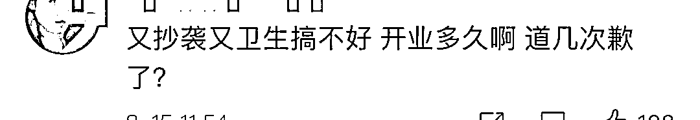

# 热搜第一！知名男演员的火锅店道歉！后厨看吐了…

> 原文：[`mp.weixin.qq.com/s?__biz=MzIyMDYwMTk0Mw==&mid=2247518982&idx=3&sn=14530b204705ada90c8fe995563a97d6&chksm=97cb403ea0bcc928a61b5c4ba3c42fb5241863d5e67d2a730e144c66e726b7b1e3c1ed990c52&scene=27#wechat_redirect`](http://mp.weixin.qq.com/s?__biz=MzIyMDYwMTk0Mw==&mid=2247518982&idx=3&sn=14530b204705ada90c8fe995563a97d6&chksm=97cb403ea0bcc928a61b5c4ba3c42fb5241863d5e67d2a730e144c66e726b7b1e3c1ed990c52&scene=27#wechat_redirect)

**今天中午** 

**“郑恺火锅店道歉”冲上热搜第一**

**▼**

近日，博主@内幕纠察局

“暗访”郑恺的火锅店火凤祥

**随后发布了后厨视频** 

**让人大跌眼镜**

**▼**

先来看看博主拍摄的视频

**▼**

[`mp.weixin.qq.com/mp/readtemplate?t=pages/video_player_tmpl&action=mpvideo&auto=0&vid=wxv_2003397516418940929`](https://mp.weixin.qq.com/mp/readtemplate?t=pages/video_player_tmpl&action=mpvideo&auto=0&vid=wxv_2003397516418940929)

视频来源：@内幕纠察局 

拍摄者晒出多段现场画面

后厨内卫生条件令人堪忧

**▼**

**号称上午切下午卖的“招牌新鲜牛肉”**

****▼****

实际却是

**▼**

号称“每天现熬”的骨汤锅底 

**▼**

实际却是

**▼**

对此，8 月 14 日晚

郑恺经营的连锁火锅店

在官方微博发出公开致歉信

回应被指卖变质食材的质疑

致歉信内容如下：

针对 813 晚上流出的有关火凤祥某门店的厨房员工操作不规范和食品安全隐患问题，深表歉意且高度重视。

**视频发出后四小时内公司已经连夜成立督查小组，对全国范围内所有连锁店进行核查，确定涉事门店后将对其进行处罚、停业整顿，并开除涉事岗位负责人。** 
同时，对全国范围内的连锁店都展开食品质量与安全排查，严厉打击食品安全违法违规操作行为，以避免类似事件发生。

同时，强调公司对食品安全卫生问题零容忍，会对涉事门店进行严肃处理，绝不姑息。在处理涉事门店后，也会改进火凤祥品牌管理有限公司的管理机制，此后将制定完善的工作自检标准，保障消费者食品卫生安全。

最后，再次向消费者，合作伙伴及社会各界真挚致歉，并欢迎大家随时监督。

## **而这**

## **已经不是这家火锅第一次上热搜了**

## **2020 年 7 月 18 日**

## **郑恺的宁波火锅店开业**

**第二天，#郑恺火锅店 抄袭#**

**就登上热搜第一**

四川成都吼堂老火锅店发文称，

火凤祥鲜货火锅店内装修风格

疑似抄袭其火锅店，

还表示其招商宣传册

直接使用成都吼堂老火锅的实景图 

↓↓↓

几天后，火凤祥宁波品牌管理有限公司发表声明，**将相关部分陈设全部撤下**，并对此加强监督，杜绝此类事件再次发生。此事以双方发声明和解告知。

**目前，郑恺的火凤祥**

**已在宁波、杭州开出多家分店** 

▲宁波

▲杭州

**网友评论： **

来源：央视网、钱江晚报、 @内幕纠察局、微博、网友评论

← 向右滑动与灰产圈互动交流 →

