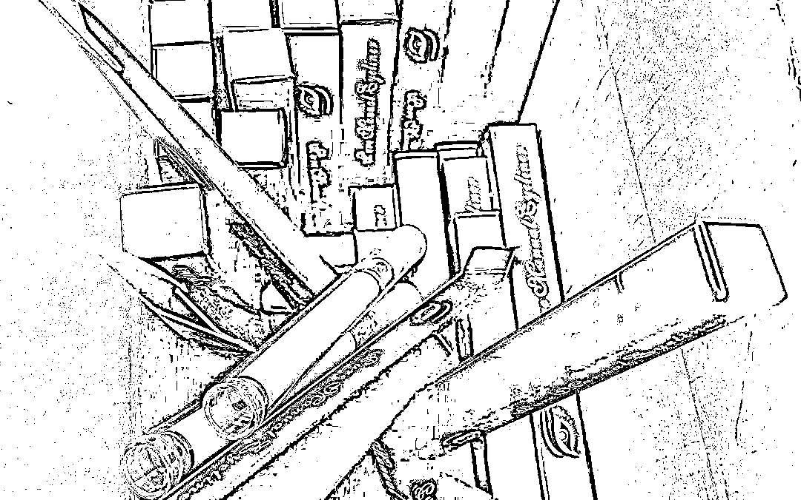

# 警惕！这种“上头电子烟”竟是新型毒品！

> 原文：[`mp.weixin.qq.com/s?__biz=MzIyMDYwMTk0Mw==&mid=2247518982&idx=4&sn=2e234db8edfc734e78d365e94542e022&chksm=97cb403ea0bcc9285af0c54535fe41f80dae898352dfafdc60d526d80e2074fdab01f1625751&scene=27#wechat_redirect`](http://mp.weixin.qq.com/s?__biz=MzIyMDYwMTk0Mw==&mid=2247518982&idx=4&sn=2e234db8edfc734e78d365e94542e022&chksm=97cb403ea0bcc9285af0c54535fe41f80dae898352dfafdc60d526d80e2074fdab01f1625751&scene=27#wechat_redirect)

听说过电子烟吗？ 

是那种特~别~带~劲的！

一口就能立刻上头保证你抽了还想抽要不要试试？**这种“上头电子烟”****千万碰不得！**

[`mp.weixin.qq.com/mp/readtemplate?t=pages/video_player_tmpl&action=mpvideo&auto=0&vid=wxv_1996318327060660233`](https://mp.weixin.qq.com/mp/readtemplate?t=pages/video_player_tmpl&action=mpvideo&auto=0&vid=wxv_1996318327060660233)

**毒**

**2021 年 5 月 11 日，国家禁毒委、公安部、国家卫生健康委和国家药品监督管理局联合发布公告，决定正式整类列管合成大麻素类新精神活性物质。公告自 2021 年 7 月 1 日起施行。**

****

**迅速出击 一举抓获******

**近日，无锡市公安局禁毒部门根据线索，果断开展经营研判，先后组织近百余名警力，用短短**10 天**时间，抓获并处理了涉案人员**110 余名**，极大遏制了销、吸“上头电子烟”的不法行径。**

****************

**面对民警的到场问询，这些违法行为人一开始往往不以为然，辩解自己是守法公民。在民警的教育下，方才意识到自己已经对“上头电子烟”上了瘾。据民警统计，在到案的违法人员中，有**近八成**为 20 周岁以下青少年，他们多是在旅馆、酒吧等场所，因朋友间猎奇介绍，初次吸食而后逐渐上瘾，造成了极大的社会负面影响。**

****

**不法分子在贩卖“上头电子烟”时**

**往往宣称安全合法**

**对人体无危害无副作用**

**然而，事实真是如此吗？**

****到底什么才是“上头电子烟”？****

******普通电子烟的主要成分是水、丙二醇****甘油、尼古丁和调味剂等****而“上头电子烟”却被不法分子掺入了******四氢大麻酚******或**合成大麻素类新精神活性物质************

****△含有合成大麻素类新精神活性物质的常见毒品****

****这种所谓的“上头”********就是毒品吸入人体后产生的短暂“快感”********而“上头电子烟“毒品********会比传统毒品更具有迷惑性和成瘾性********对人体危害也更大************************滥用者在吸食后会影响中枢神经系统功能，常出现幻视、焦虑、抑郁、情绪突变、妄想狂躁、意识不清等反应，长期吸食会导致免疫力低下，诱发精神错乱和自杀倾向。********如何谨慎辨别“上头电子烟”？************************随着近年来电子烟的兴起********特别是“水果口味”烟弹的推出********吸引了一批青年群体对于电子烟的追捧********其中********“上头电子烟”因外表酷似普通电子烟**** ****而对青少年具有强烈的欺骗性********往往一群人聚在一起**** ****以猎奇为由就开始吸食************************“上头电子烟”长度大概 30cm，外形为无色、黄色至褐色粘稠液体，与普通电子烟外表看起来没有太大差别。但是如果你发现你接触到的电子烟，关联上了“**上头**”“**飞行**”“**快感**”等毒品圈黑话，请务必警惕，并及时联系公安机关。****

****毒品带来的快感只是一瞬间****

****但是它造成的伤害****

****需要你用一辈子去承担****

****健康人生，绿色无毒****

****远离新型毒品侵蚀！****

****来源：无锡公安微警务，反诈骗先锋****

********

****← 向右滑动与灰产圈互动交流 →****

********