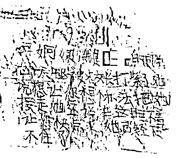
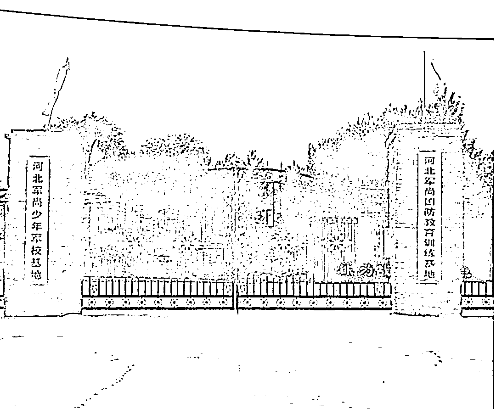
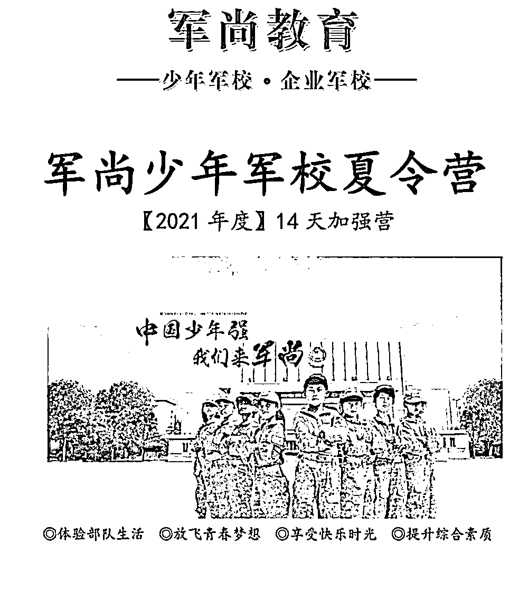
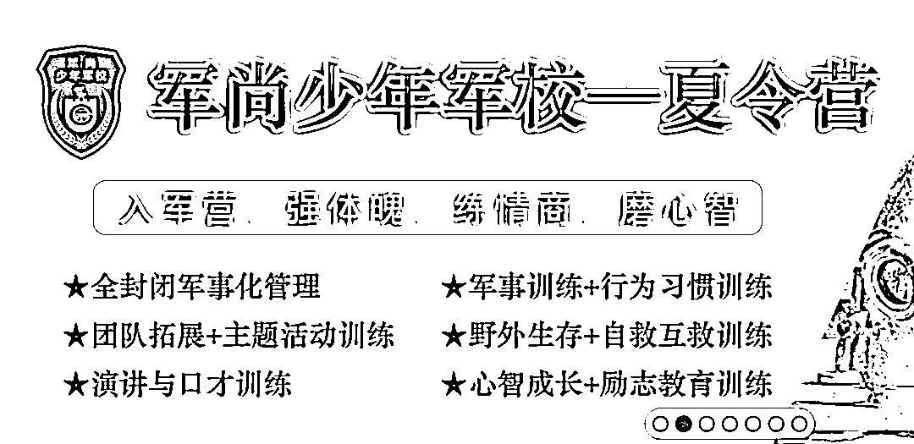
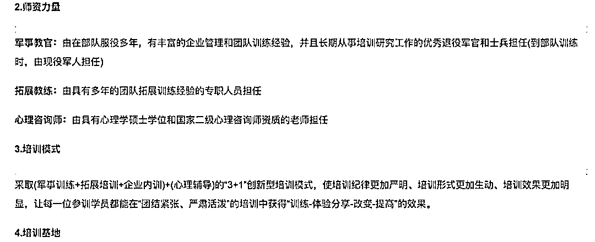
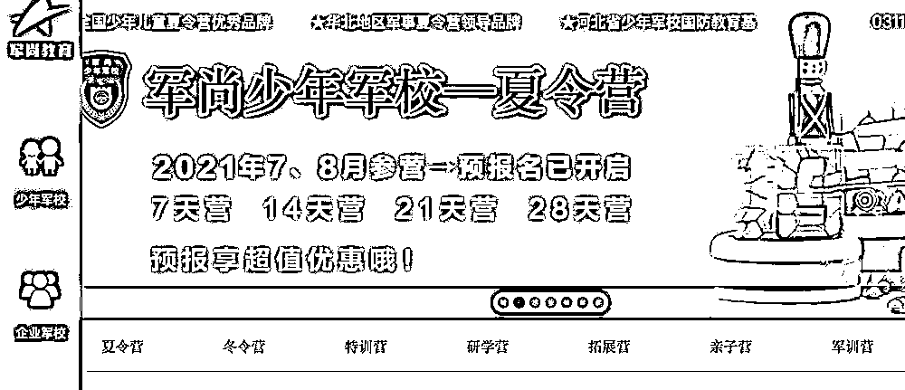

# 多名孩子遭暴力殴打，写纸条求救！涉事“夏令营”被曝光

> 原文：[`mp.weixin.qq.com/s?__biz=MzIyMDYwMTk0Mw==&mid=2247518982&idx=5&sn=9ec03282061eaccc0a76973cf705ca43&chksm=97cb403ea0bcc928d2f2529cf874ff579c84a623953bb8dfd48d9ca5e915def6660ac97b32f1&scene=27#wechat_redirect`](http://mp.weixin.qq.com/s?__biz=MzIyMDYwMTk0Mw==&mid=2247518982&idx=5&sn=9ec03282061eaccc0a76973cf705ca43&chksm=97cb403ea0bcc928d2f2529cf874ff579c84a623953bb8dfd48d9ca5e915def6660ac97b32f1&scene=27#wechat_redirect)

正值暑假，一些家长出于锻炼孩子的目的，给孩子报名各种名头的夏令营或者研学活动。但最近在河北石家庄市元氏县的一所“夏令营”，却被曝出多名少年在这里遭遇殴打。

遭遇“暴力夏令营”：

至少 3 名孩子被负责人暴力殴打

“夏令营”刚刚开始时，一位家长手机上收到了孩子的被打图片，但消息马上又被撤回。家长意识到问题后，赶紧去“夏令营”找回孩子。发现不仅自己孩子被打，还有其他孩子被打，并且孩子们写纸条传递给这位家长，希望父母把自己接回去。

学生家长供图

根据伤情鉴定，三名孩子被司法鉴定为轻微伤。**目前，打人的“夏令营”校长全某某已被行政拘留。**这是一所什么性质的“夏令营”？事情发生经过又是怎样的呢？ 

**“夏令营”不允许探视 家长报警求助******

****一想起把女儿送到那个“夏令营”的决定，孙先生就后悔不已。女儿才 11 岁，五年级，去了刚几天的时间，孙先生就得知女儿在这里被暴力殴打的消息。孙先生着急忙慌地赶到位于元氏县北褚镇的河北军尚少年军校基地，没想到大门都进不去。****

****基地确实有不允许家长探视的规定，但得知孩子被虐待的消息，还不允许家长探视，孙先生认为情况非常不正常，于是报警求助。****

********

****位于石家庄元氏县的军尚少年军校基地对外挂牌的名称****

****孙先生说：“孩子去了第二天就一直被辱骂。孩子就反感不想在这儿了，偷偷地给我们打了个电话，就这事让校长知道了。孩子说校长拿铁棍子在宿舍里、楼道里打，之后又被拖到办公室接着打，打了孩子将近一个小时。孩子说，到办公室打的时候是拿 PVC 管打在腿上、腰上、胳膊上，两腿都打肿了。”****

****把女儿从“夏令营”接出来几天后，出于警方立案的要求，孙先生带女儿做了伤情鉴定，结果显示轻微伤。****

****同样是为了让孩子多一些离家锻炼的经历，田女士也给 13 岁儿子报名参加了为期 14 天的军尚少年军校夏令营。8 月 5 日晚上 8 点多，她突然接到一起参加“夏令营”的其他家长电话，说孩子在“夏令营”被打了。也是在报警求助的情况下，田女士才见到了儿子。****

****田女士 13 岁的儿子是被打孩子中，受伤最严重的一个。由石家庄市第三医院出具的诊断证明书显示，其头部受创，多处皮肤及软组织挫伤，CT 诊断报告单显示其盆腔内有少量积液。****

****田女士说：“白天孩子见到教官打别人了，就挺害怕，几个孩子就商量着，不想在那待想要离开‘夏令营’。因为教官不给电话，也不让和家里联系。我家孩子只是整理了行李，教官去检查宿舍的时候问他怎么穿着衣服，是不是要走，就逼问他，孩子刚开始没有承认，后来就给拽出去揍了，回宿舍以后他就开始吐血了。”****

********

****被暴打的孩子照片（家长供图）****

********

****被暴打的孩子照片（家长供图）****

****元氏县北褚派出所所长付作朋此前接受媒体采访时说：“根据调查，全某某打人情况属实，被害人伤情鉴定结果也出来了，属于轻微伤，我们现在已经对违法人作出了行政拘留 15 天的处理。”****

****涉事的“夏令营”实为一家旅游公司主办****

****当地教育部门已责令其停业整顿****

********

******记者调查发现，涉事的“夏令营”实为一家旅游公司主办，其官网宣称，公司主营企业军事拓展培训和青少年素质教育培训。******

************

******元氏县教育局相关负责人介绍，该“夏令营”已被责令停业整顿，所有小孩都被家长接回。这家“夏令营”有没有相关资质，老师们有没有资格证，这些还需要进一步调查核实。******

******而元氏县委宣传部相关负责人却称，该“夏令营”的举办方并不是一所学校，从目前的情况来看，这就是一起简单的打人事件，“就是一个打人事件，跟别的牵涉不到”。******

******但多位家长认为，该事件性质恶劣。他们正在和警方深入对接，提供更多的法律证据。******

******河北乔烽律师事务所主任乔烽认为，根据此案已披露的事实，培训机构和责任人涉嫌构成虐待被监护、看护人罪：**“致未成年人三人以上受伤，视其情节恶劣（程度）定罪及量刑，本罪可以依据刑法第三十七条之一的规定，并处培训机构和责任人禁止从事监护看护行为 3 至 5 年的处罚。”********

****该旅游公司并无教育培训业务****

****暑期夏令营乱象丛生缺乏有效监管****

********

******送孩子入营时，家长们曾收到一份带有河北军尚研学旅游服务有限公司公章的协议书，协议书显示河北军尚研学旅游服务有限公司为主办单位，其对“夏令营”的时间、费用、安全、培训管理及其他事宜作出规定。******

************

************

******河北军尚研学旅游服务有限公司官网宣传******

******工商注册登记信息显示，河北军尚研学旅游服务有限公司成立于 2011 年。登记机关：新华区工商行政管理局。经营范围包括研学旅游服务、旅游信息咨询、国内旅游和出入境旅游业务等，并没有教育培训业务。但其位于元氏县的训练基地却挂牌：河北军尚少年军校基地、河北军尚国防教育训练基地。******

************ 

******教育学者熊丙奇表示，社会上以各种名头举办的夏令营或者研学活动，责任主体太多，打教育培训的擦边球，往往乱象频出，缺乏有效监管。如果没有办学许可证，是不能开展培训业务的。******

******记者多次联系涉事“夏令营”的所属公司，均未得到回应。这家旅游公司可以举办以国防教育为特色的“夏令营”吗？是否经过了相关部门的许可或审批？有关事情进展，我们将持续关注。******

******来源：中央广电总台中国之声、央广网******

************

******← 向右滑动与灰产圈互动交流 →******

************