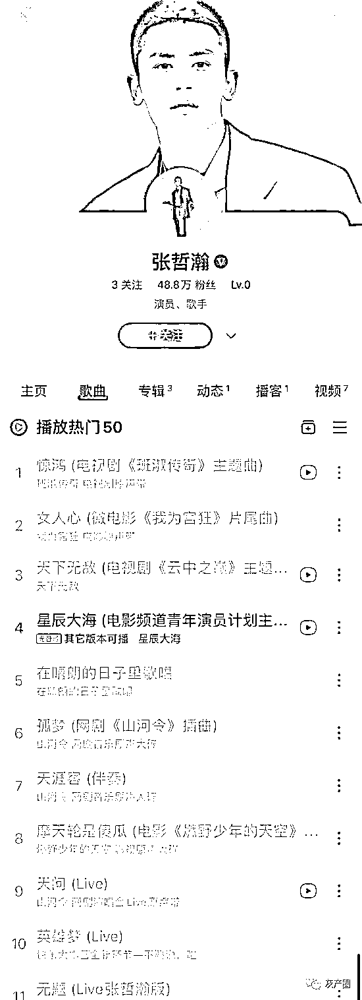
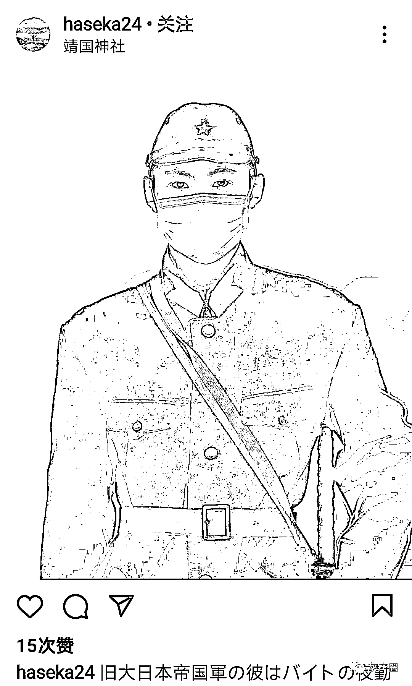

# 全网封杀张哲瀚！他的脑残粉言论太惊人了！狗日的又拜鬼！

> 原文：[`mp.weixin.qq.com/s?__biz=MzIyMDYwMTk0Mw==&mid=2247519050&idx=2&sn=4a5beb04850129c6b207dfc530956e90&chksm=97cb4072a0bcc96478bf99b6822fb22c05e26b037de0705d0473e04ebd8bdc13f7b30897011d&scene=27#wechat_redirect`](http://mp.weixin.qq.com/s?__biz=MzIyMDYwMTk0Mw==&mid=2247519050&idx=2&sn=4a5beb04850129c6b207dfc530956e90&chksm=97cb4072a0bcc96478bf99b6822fb22c05e26b037de0705d0473e04ebd8bdc13f7b30897011d&scene=27#wechat_redirect)

近日，因在日本参观靖国神社等不当行为，张哲瀚先后被人民日报、人民网、央视批评。虽然本人连续两次道歉，但并没有用，要求他退圈的声浪一浪高过一浪，人民网的措辞更严厉：伤害民族感情，必须凉凉！ 
中央纪委国家监委网站发文评张哲瀚事件，称“无知”“失察”“欠缺对相关场所的历史背景知识”不可以作为自己犯错的挡箭牌，表示此次事件也再次提醒大家，艺人的准入门槛必须提高，把劣迹艺人挡在门外，“德不配位，必有灾殃，德艺双馨是终身的修炼，首先系好演艺生涯的第一颗扣子，起码的底线必须恪守——政治底线、法律底线、道德底线、历史底线，在民族大义面前决不能有丝毫含糊、动摇。过线者，必受惩戒。”中国演出行业协会发布公告，要求会员单位对其进行从业抵制。再不整治，他的粉丝就无法无天了 他的粉丝都疯狂了，彻底疯狂了这才是真正清醒的粉丝 微博这次立场很坚定，张哲瀚微博和其工作室微博都被封其他平台也开始封杀他张哲瀚抖音账号也被封禁网易云音乐 QQ 音乐下架张哲瀚音乐作品日本对靖国神厕得态度，让网友们见识到了这个国家的无耻，和对张哲瀚的全网封杀是及时的，是正确的！ 昨天，日本投降 76 周年，大量日本公民冒雨前往靖国神社过后还要在公共平台喊冤叫屈，言行之中全部在感激这些发动侵略战争的人。其中不少穿日本军队的军装还有非常有组织的团队共同前往，更有很小的孩子身上也穿着旭日旗！当一个侵略者以受害者自居，这种行径无耻又卑劣！日本这个民族，最最自私最最恶毒没有人性，原子弹下无冤魂！

* * *

**纳兰无羁：**说去靖国神社游玩不进去，只看樱花和建筑。相当于祖上被邻居杀到家破人亡，百年后你跑到他家墓园外玩，还夸他家坟头上的草长得好看。你没见过坟上长草吗？贱不死你。

喜宝呗：20 年前中国人齐心协力声讨靖国神社的存在，10 年前外交部强烈谴责日本官员参拜靖国神社，而今天竟然到了持不同观点的人为「中国人该不该参拜靖国神社」而唇枪舌战的地步，再过 10 年呢，谁又能保证不会出现「靖国神社拍照攻略」

**mua 那就无忧无虑:**忘记历史等于背叛

来源：微博那些事儿

← 向右滑动与灰产圈互动交流 →

