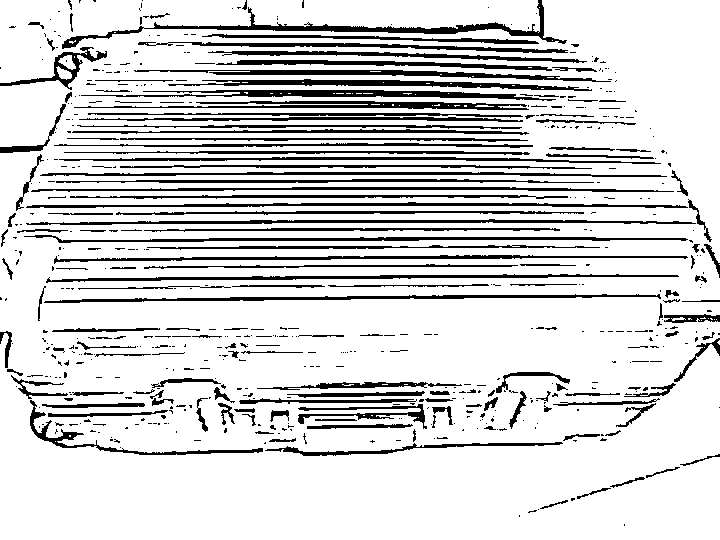
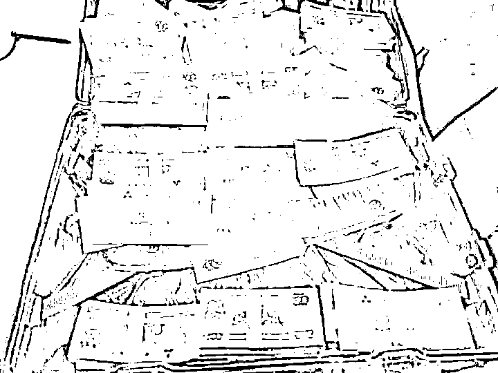
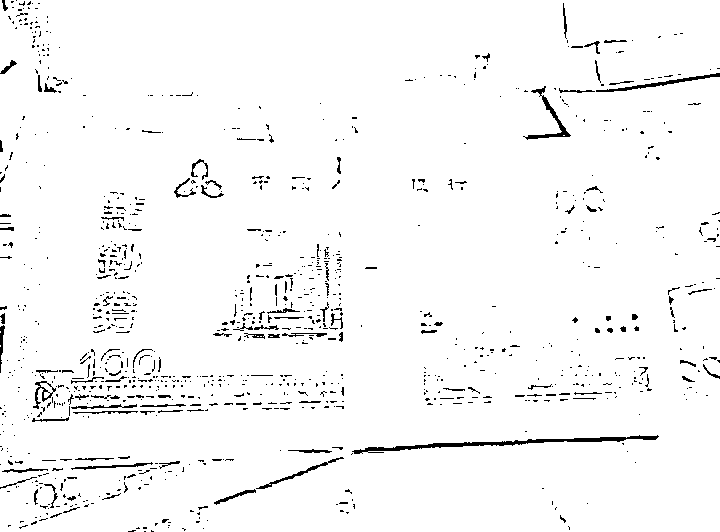
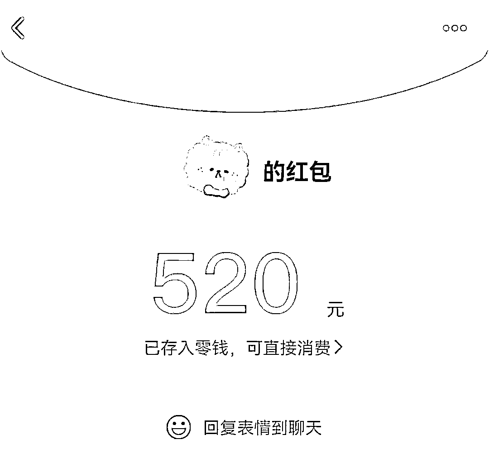

# 未婚夫送出 1314520 元“天价彩礼”，女子打开一看崩溃！更扎心的是…

> 原文：[`mp.weixin.qq.com/s?__biz=MzIyMDYwMTk0Mw==&mid=2247519050&idx=4&sn=f0fbda98ead5c286fad886a4da4d11a2&chksm=97cb4072a0bcc964dde0da9676c0d1bad5da1a0674171d2c8c61d017421e921974bd2a753764&scene=27#wechat_redirect`](http://mp.weixin.qq.com/s?__biz=MzIyMDYwMTk0Mw==&mid=2247519050&idx=4&sn=f0fbda98ead5c286fad886a4da4d11a2&chksm=97cb4072a0bcc964dde0da9676c0d1bad5da1a0674171d2c8c61d017421e921974bd2a753764&scene=27#wechat_redirect)

该公众号已被封禁

“我只是为了考验她，她回礼的 13 万元我没打算用，我本来就准备坦白的。”面对讯问，杨某振振有词，送未婚妻面值 1314520 元的点钞券作为订婚礼金，在他看来，不过是情人间的一场恶作剧罢了。 

近日，经浙江省台州市黄岩区检察院提起公诉，**法院以诈骗罪判处杨某有期徒刑 3 年 6 个月，并处罚金人民币 4 万元。**

****

这起“天价彩礼”婚恋闹剧，

最终尘埃落定！

**1314520 元“天价彩礼”**

2020 年底，黄岩的张女士在婚恋网站上认识了 50 岁的同龄网友杨某，聊了半年多后，他们“奔现”了。见面、交往，一切进展顺利，杨某很快求婚。虽然感觉突然，但想到对方事业有成、态度诚恳，张女士同意了。

**杨某主动提出要给 1314520 元的彩礼，寓意“一生一世我爱你”。**为了讨个好彩头，两人商定在农历二月初二“龙抬头”的好日子订婚，恰巧这一天也是 2021 年 3 月 14 日，谐音“爱你一生一世”。

**订婚当天，杨某交给张女士一个红色行李箱，称里面装着 1314520 元彩礼。**他还特地嘱咐：“按我们老家的习俗，订婚分成小订、大订，现在只是小订，这个行李箱要大订的时候在长辈的祝福下才能打开，所以暂时别打开！”颇受感动的张女士此后从银行取出 131452 元现金作为回礼，交给了杨某。

张女士还第一时间向亲友分享了这个“喜讯”，经他们关切提醒，当晚，经过艰难心理斗争的张女士，打开了行李箱，然而她发现，箱子里满满一叠叠纸币不是人民币，而是银行的点钞券。

震惊之余的张女士选择了报警，警方很快将杨某抓获。搜查杨某租住处时，民警发现，张女士的部分回礼已被杨某装到了自己的皮夹里，**所幸 131452 元被全部追回。**

**是****感情纠纷还是骗局？**

这究竟是一起情感婚姻的民事纠纷，还是一场精心设计的骗局？案发后，黄岩区检察院提前介入侦查，指导案件侦查方向，事情的全貌逐渐浮出水面。

杨某自称某金属有限公司法定代表人，是当地的“白银大王”，公司月生产白银 2 吨，底下工人有上百人。经查实，杨某平时靠回收废旧 X 光片，提纯里面的白银卖给厂里维持生计，“他只是和我们厂有一点零散的白银交易，按他白银回收的量看，**一年的利润也就 3 万多一点。**”回收厂工作人员说。

此外，杨某向张女士出示的公司营业执照上，**1000 万元的注册资金压根没有实缴，只是他注册的一个空壳公司而已。**杨某曾在微信朋友圈发布复工复产消息，然后自己再在评论区公开评论：“感谢各位领导对公司的支持。”

经进一步查证，杨某自称买的临海湖畔尚城住房也是租的，椒江紫薇花园 297 平方米套房的“房产证”是花 160 元买的，13 万余平方米的厂房更是连影子都没有。

**他的“女友”不止一个**

与此同时，听过杨某山盟海誓的，不止张女士一人。

警方调查发现，在与张女士交往期间，杨某通过婚恋网站，还与其他多名女性交往，在她们口中，杨某事业有成，“有房子、有车子、有票子”。其中有几位说，杨某也曾突然向她们提出订婚，说要给巨额彩礼。

更讽刺的是，就在与张女士“订婚”当天，杨某拿到回礼后，**还给其中一名“女友”发去了 520 元的微信红包。**

面对讯问，杨某一次次编造谎言，否认自己故意诈骗。在审查起诉阶段，承办检察官将事实和证据摆在他面前后，他才自知没法蒙混过关，如实供述了犯罪事实。 

据悉，**除去每个月支付给前妻孩子的抚养费，杨某还欠有几十万元的外债。**入不敷出的他就假借交往之名，以“订婚”为幌子，骗取女方的高额回礼为己用。

审讯、庭审过程中，杨某数度痛哭流涕、表达悔恨，但等待他的，将是法律的严惩。 

来源 ：浙江法制报、黄岩检察、广州日报

← 向右滑动与灰产圈互动交流 →

