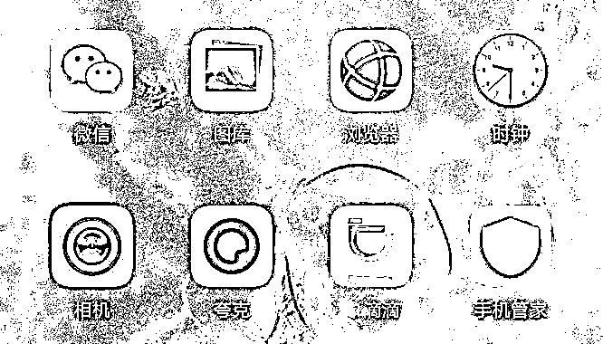
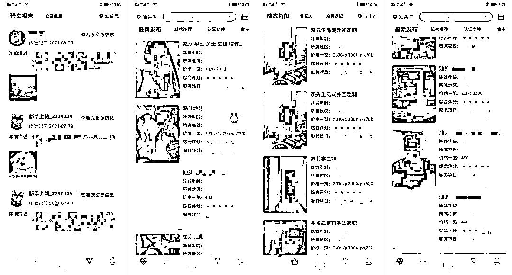
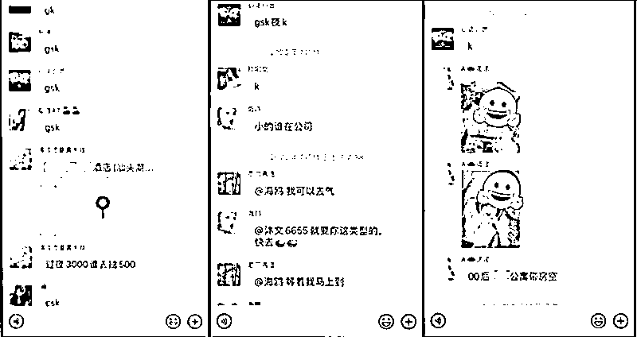

# “打车软件”竟是招嫖 App？！255 人被抓！

> 原文：[`mp.weixin.qq.com/s?__biz=MzIyMDYwMTk0Mw==&mid=2247519050&idx=5&sn=c6ba2f35fa592be9d7f78cf56a1737a7&chksm=97cb4072a0bcc96488fba3cf9ff3f2c115391c26219cb1c3dc4cb1e9cfcb9e665d9be5e84ee6&scene=27#wechat_redirect`](http://mp.weixin.qq.com/s?__biz=MzIyMDYwMTk0Mw==&mid=2247519050&idx=5&sn=c6ba2f35fa592be9d7f78cf56a1737a7&chksm=97cb4072a0bcc96488fba3cf9ff3f2c115391c26219cb1c3dc4cb1e9cfcb9e665d9be5e84ee6&scene=27#wechat_redirect)

“互联网+”时代

网约车、网约跑腿……

似乎一切皆可“网约”！

不过，今天小编要说的这个“网约”

却恰恰是法律所不允许的！

↓↓↓

乍一看到上图中被圈出的图标，相信很多人都会把它当成“滴滴”打车 APP，可再仔细辨认一下，就会发现有些不太一样，更可况在“滴滴”前还有俩字儿，这妥妥的就是山寨版啊！

更让人吃惊的是，这款“xx 滴滴”不仅是山寨的，甚至不是用来叫车的，而是一款**境外网络招嫖手机 APP。**

2020 年 12 月，广东汕头公安局网警支队民警在对一名嫌疑人手机进行勘验取证时，发现了这款名为“xx 滴滴”的境外非法 APP，里面还存着涉及本地的网络招嫖信息。

据了解，点击图标进入后，仍会让人产生是打车软件的错觉——**“验车报告”、“上车”**——这不都是打车用语吗？错！这些其实都是黑话，是犯罪分子用来掩人耳目、逃避打击的伎俩。

办案民警经过进一步侦查后，一个以境外的非法 APP 为载体，再通过境内互联网即时通讯工具进行通联，并将汕头市区内多个高档星级酒店作为场地，组织、介绍卖淫的特大犯罪团伙逐渐浮出水面。

据了解，该团伙联合汕头市区多家娱乐场所酒水销售经理，并通过层层介绍关系，以线上、线下相结合的方式，频频开展各种网络招嫖活动。

经查，由上述销售经理负责介绍嫖客，团伙内的骨干人员则通过组建互联网即时通讯群，对失足妇女进行公司化的管理，再利用即时通讯群，第一时间“派单”给失足妇女从事卖淫活动。

更有甚者，犯罪团伙还长期租用公寓作为卖淫场所，不仅收取组织卖淫嫖娼的介绍费，还赚取房间的租用费用。

经过半年之久的缜密侦查，2021 年 5 月 25 日，广东省汕头市公安局组织警力 810 名，分成 87 个抓捕小组，在龙湖、澄海、金平、潮阳、濠江等辖区下的多个高档星级酒店、公寓，开展集中的收网行动。

在这次行动中，成功抓获目标对象 255 人。目前，该案件仍在进一步侦办中。

来源 ：公安部网安局、广东网警

← 向右滑动与灰产圈互动交流 →

