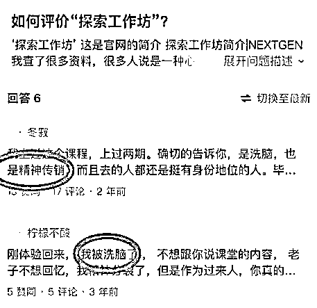

# 32 岁女投资人之死：精英课程还是精神控制？

> 原文：[`mp.weixin.qq.com/s?__biz=MzIyMDYwMTk0Mw==&mid=2247519085&idx=1&sn=0cd46a0c97b07e0662e0dd945b379d54&chksm=97cb4055a0bcc943e13f84aa8282cada0eb10e43ff9d06e95f04056b84ce61c58696c3d7f056&scene=27#wechat_redirect`](http://mp.weixin.qq.com/s?__biz=MzIyMDYwMTk0Mw==&mid=2247519085&idx=1&sn=0cd46a0c97b07e0662e0dd945b379d54&chksm=97cb4055a0bcc943e13f84aa8282cada0eb10e43ff9d06e95f04056b84ce61c58696c3d7f056&scene=27#wechat_redirect)

魏萌之死，需要一个答案。

▲魏萌个人简介。图/DCM 官网简介截图

8 月 16 日，DCM 董事总经理魏萌（Sara Wei）去世，年仅 32 岁。多名风险投资业内人士发文悼念，消息一经传出引发网友关注。

据界面新闻报道，8 月 14 日，魏萌曾在里程 LEGACY 飞跃力工作坊学习课程，并在教室中晕倒。8 月 15 日，LEGACY 诚泉北京微信公众号发布求助信寻求征集有关脑部、心血管方面的专家以备会诊，以及有关老人、婴幼儿意外心理创伤方面的专家，以便能帮助到该学员的家庭。8 月 16 日，据媒体获悉，魏萌在医院中离世。

消息一经传出，不少人都为这位年轻有为的女投资人感到惋惜。年纪轻轻已是两个孩子的母亲，却因为参加一堂“无关紧要”的课程而去世，这对魏萌的家庭来说无疑是一个巨大的打击。但与此同时，她的非正常死亡也让网友产生疑问：这是怎样一家“神秘”的机构，年轻的投资人魏萌到底因何而死？

无论如何，在该事件中，里程 LEGACY 飞跃力工作坊有五个问题不能回避。

▲8 月 15 日，北京诚泉文化发展有限公司发布求助信。图/北京诚泉文化发展有限公司官方公众号

**一问：魏萌死因为何？******

****这也是网友最为困惑之处。魏萌究竟是因为情绪激动引发的并发症死亡？还是猝死？还是其他原因？从目前的公开信息来看，并不清晰。****

****不少媒体提到，魏萌“因情绪激动发生了突发状况不幸去世”，这个“突发状况”到底为何，关切此事的人在等待一个答案。****

****显然，魏萌之死，不仅仅需要一个医学方面的答案，事关人命，也需要一个来自法律的说法。****

******二问：事发当时，******

******魏萌是否正在经历“四人辱骂一人”的情况？******

************

********魏萌去世后，她的一位朋友在朋友圈中描述：LEGACY 课程打着“你要去拯救你的朋友和爱人”的旗号，曾让魏萌等学员反思“自己对不起谁，为什么工作这么忙，不照顾孩子，就是烂人”，这令魏萌情绪激动崩溃。********

********而据界面报道，记者从参加过相关课程的学员中获悉，魏萌是在上 LEGACY 里程课四人辱骂一人的互动环节中，因情绪激动发生突发状况，不幸离世。********

********这一情况是否属实？如果确实存在“四人辱骂”环节，谁辱骂了魏萌？又骂了什么？********

********搞清这些问题，也有助于厘清涉事机构以及课程学员的法律责任。********

****************

********▲某社交平台对“探索工作坊”的评价。图/某社交平台截图********

********三问：这家机构的课程是否涉嫌精神控制？************************

********随着关于魏萌之死的相关聊天截图陆续流出、散布在网络，这些“旁证”给人的印象是，这个机构开设的课程并非正常为创业者答疑解惑，而是采用“精神控制”之类的手法，让学员极度“迷信”乃至臣服于讲师权威。********

********据媒体报道，有学员透露，很多投资人都被发展到这个“恐怖”课程之中。自他今年 3 月加入后，至少有四批人发展进来。他表示：“这类课程是利用心理学经验和场域优势，来打击学员，非常不道德。”********

********该机构课程是否如网友爆料和媒体报道所言，打着“拯救、蜕变”的旗号，用放大人性缺点和阴暗面的方式对学员施行“摧毁再塑造”的上课模式？********

********如果是先打压再治愈，这可能涉及精神洗脑、精神操控，既有违道德，也可能触犯法律。********

****************

********▲网友评论截图。图/微博截图********

**********四问：课程内容保密，究竟是想隐瞒什么？******************************

**********据报道，参加 LEGACY 相关课程的学员被要求不能分享工作坊中特定的练习与过程，并且对其他参与者的行为和说话绝对保密。**********

**********这其中的缘由是机构因为课程专利而保密，还是因为用了“不敢为外人道”的上课方式？**********

**********但毫无疑问，这种所谓的保密要求，会将培训机构的“恶”掩盖了起来。令其涉嫌违法的行为更加难以被大众知晓，也更容易躲过监管。**********

********************

**********▲里程 LEGACY 飞跃力工作坊课程图。图/北京诚泉文化发展有限公司官方公众号截图**********

********问：涉事机构是否为合法经营？************************

********据报道，LEGACY 相关课程价格不菲，三期课程收费就高达 7 万元，可以说学员都“不差钱”，但是在课程之外，LEGACY 会要求学员去拉人，被拉的人称为“海星”，越往后拉人就越强制。作为一个创办长达 21 年的企业，又有众多分公司，开设此类课程是否符合资质？收费如此之高是否符合要求？以“拉人头”发展下线的方式推销课程，是否属实，又是否合法？********

********这些问题，伴随着这名年轻投资人的去世，给公众留下一个巨大的问号。********

********而此时关于这家公司的经营性质与经营内容，已经有不少网友指其违法。在此情形下，有关部门也不妨对此保持密切关注，并在必要时及时介入，查一查这家公司的“底数”，到底是真如宣传中称的那样是精英课程还是“纯粹的”精神控制？********

********如果一旦发现这家公司涉及违法犯罪行为，也该依法惩处，绝不姑息。********

**********来源：新京报********** 

********************

**********← 向右滑动与灰产圈互动交流 →**********

********************