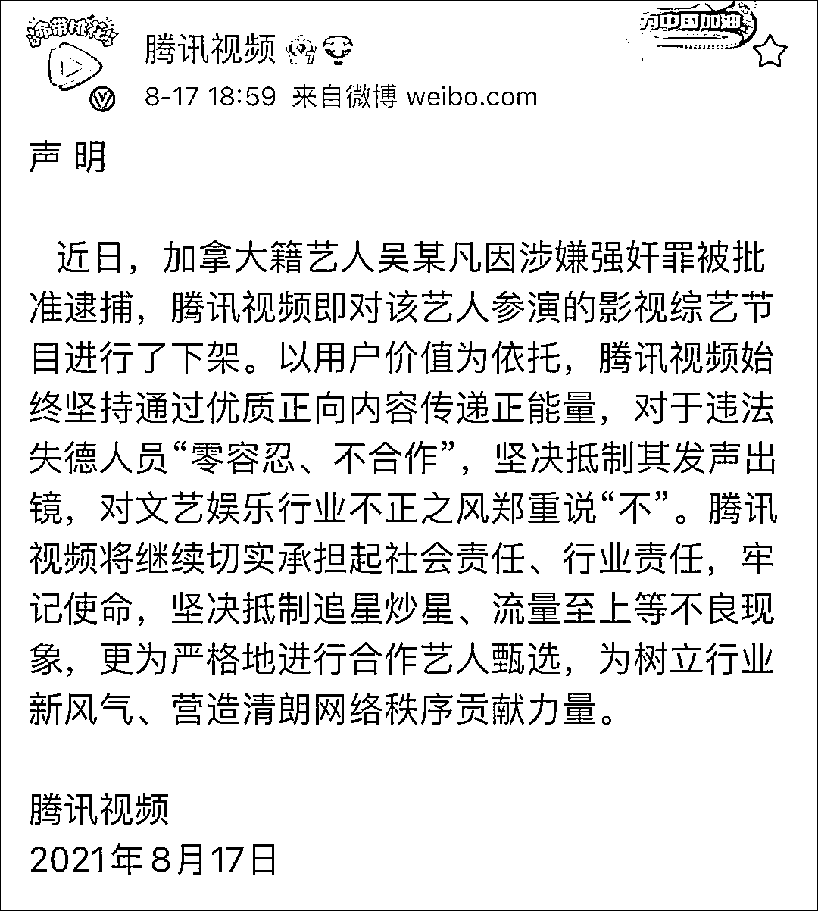
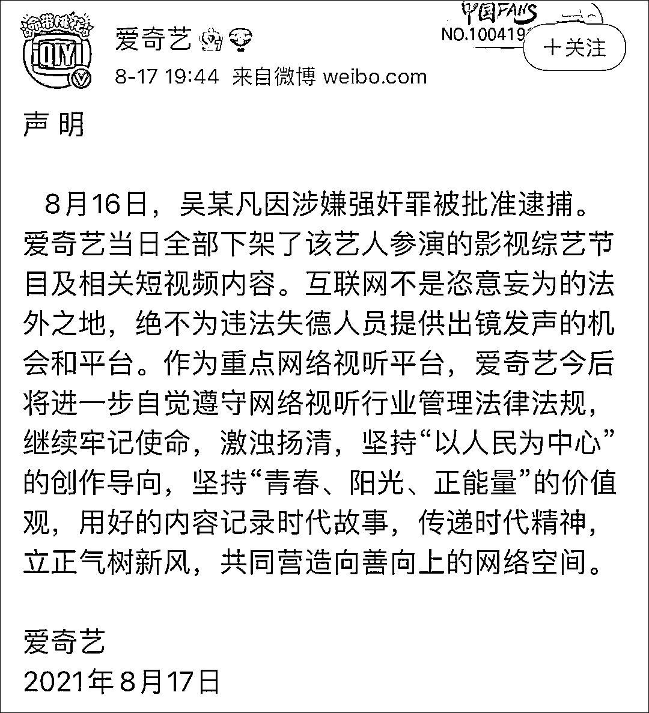
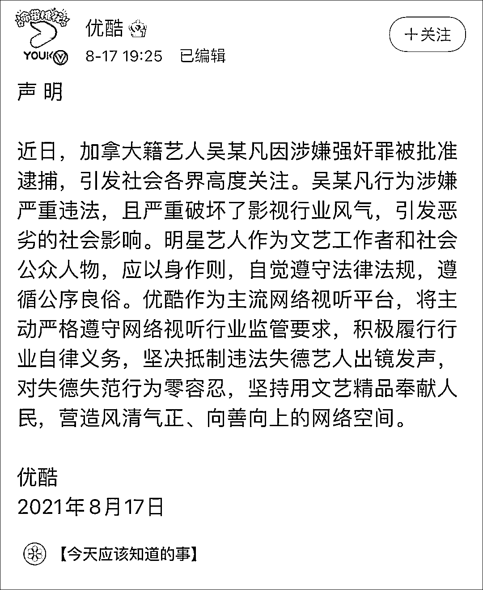
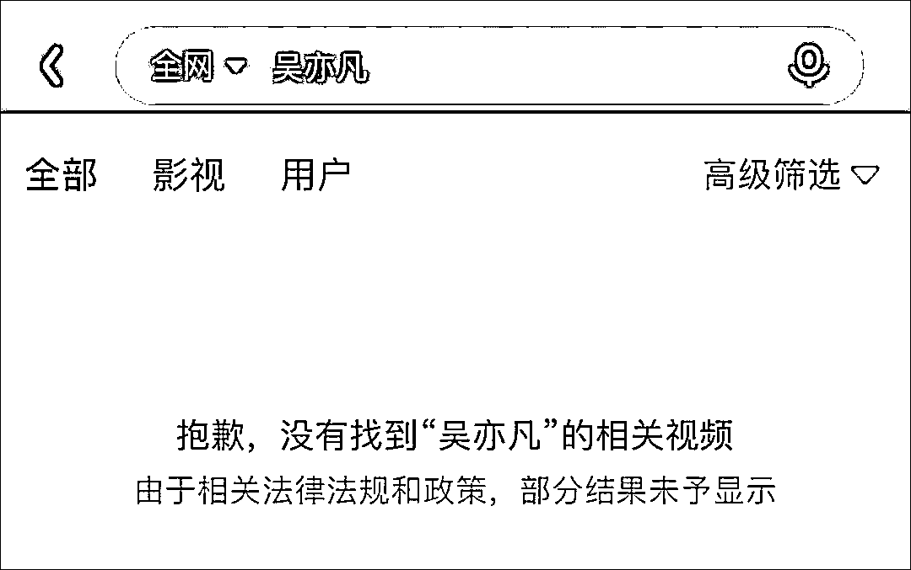
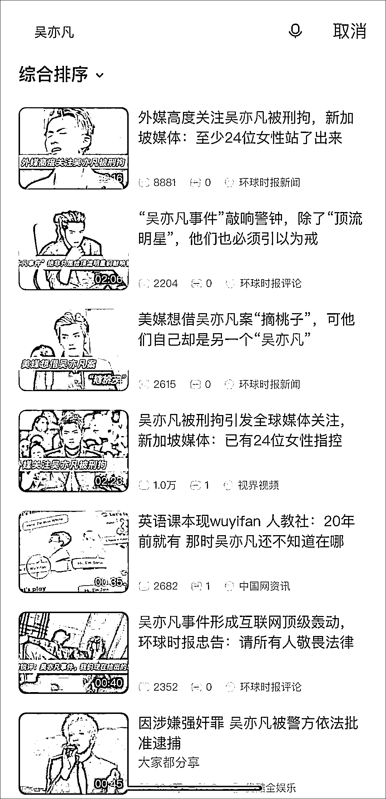
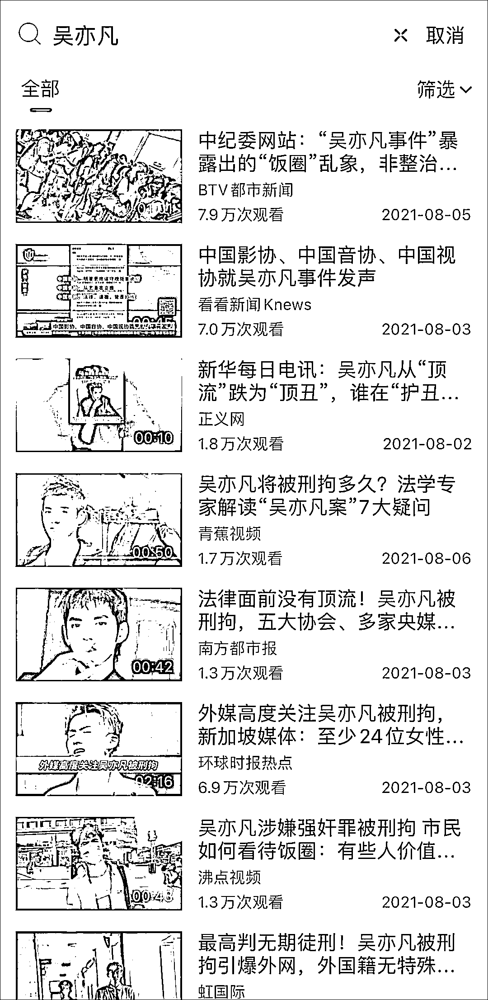
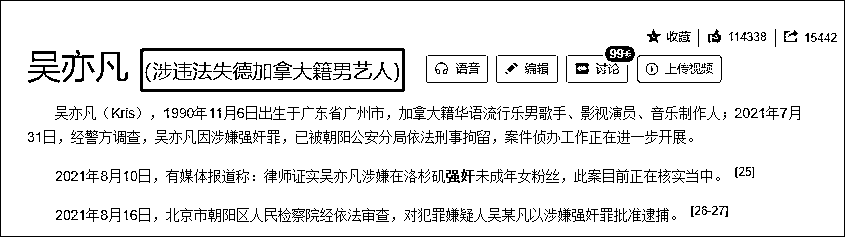

# 吴亦凡作品，全面下架！

> 原文：[`mp.weixin.qq.com/s?__biz=MzIyMDYwMTk0Mw==&mid=2247519085&idx=2&sn=86697bf835f43dbeb72d23a80d701e9a&chksm=97cb4055a0bcc94390c787d0d26d3606c2bd48f76cc94da517fa49caa711bd22d9a66dd23eb0&scene=27#wechat_redirect`](http://mp.weixin.qq.com/s?__biz=MzIyMDYwMTk0Mw==&mid=2247519085&idx=2&sn=86697bf835f43dbeb72d23a80d701e9a&chksm=97cb4055a0bcc94390c787d0d26d3606c2bd48f76cc94da517fa49caa711bd22d9a66dd23eb0&scene=27#wechat_redirect)

吴亦凡涉嫌强奸罪被批捕后，今天傍晚，国内三大视频平台腾讯、爱奇艺、优酷先后发表声明，**下架吴亦凡参演的影视综艺节目，****坚决抵制违法失德艺人出镜发声！**

查询发现，目前爱优腾三平台上，**吴亦凡的影视作品均已被下架。**

# **中国网络视听节目服务协会：**

# **支持下架吴某凡参演影视综艺节目** 

## 

中国网络视听节目服务协会秘书处负责人于 8 月 17 日就吴某凡作品下架一事回答了记者提问。

**问：我们注意到 8 月 16 日，吴某凡的作品已从多个网络视听平台下线，协会今天上午也就此事发声，请介绍一下协会对此事的看法。**

**答：**中国网络视听节目服务协会坚决支持会员单位采取的联合行动，**支持下架吴某凡参演的影视综艺节目。协会重申，绝不为违法失德人员提供出镜发声的机会和平台，绝不让这些人员和作品在网络视听行业有立足之地。**娱乐圈不是恣意妄为的法外之地。一些明星艺人不讲职业道德，缺乏艺术操守，突破法律道德底线，金玉其外，败絮其中，理应受到严厉的惩罚，必须付出应有的代价。 

文艺的使命在于铸造灵魂，文艺作品的价值在于启迪思想、温润心灵、陶冶人生。中国网络视听节目服务协会号召网络视听从业人员，把为人、做事、从艺统一起来，以德养艺、率先垂范，以高尚的职业操守、良好的社会形象、优质的文艺作品为社会做出正面榜样。全体会员单位要切实承担起社会责任，进一步严格演员与嘉宾选用，坚决抵制追星炒星、“泛娱乐化”等不良倾向，坚决抵制违法失德人员发声出镜，坚决杜绝“流量至上”、拜金主义等畸形价值观传播，切实树立行业新风正气，共同营造向上向善的网络空间。

**问：请问网络视听业界机构对此有何反应？**

**答：****优酷、爱奇艺、腾讯等各大网络视听平台已经下架了吴某凡的相关作品；与吴某凡有品牌合作的腾讯视频更是在事件发生伊始便迅速向其发出解除合作通知、终止一切合作；芒果 TV 日前联合 80 余位艺人签署了《自觉践行崇德尚艺努力做新时代文艺工作者承诺书》；百度已经给吴某凡打上了“违法失德艺人”数据标签；微博已经禁言了吴某凡个人和工作室的帐号等等。**

## 

百度百科“吴亦凡”词条截图

## 

根据会员单位反馈数据，**截至上午 10 时，全网合计处理短视频节目达 190 万条、影视综艺节目 7000 部次。目前仍在继续开展有关节目内容的排查和处置。**“多平台下架吴亦凡作品”迅速登上微博热搜榜，引发用户热议，得到社会舆论广泛支持。

这充分说明，各会员单位越来越重视自身所担负的社会责任，坚决将社会效益放在首位，自觉抵制违法失德艺人。我们相信，全体会员单位一定能承担滋心涵情、成风化人的使命责任，共同维护网络视听清朗空间，始终做社会主义核心价值观的坚定守护者和践行者。

**问：下一步协会在提升从业人员素质、加强行业自律方面有哪些举措？**

**答：**风清气正的良好生态，需要行业各方共同维护。下一步，协会将从宣传教育、人员培训、自教自律等三个方面着手。一是继续加强对各会员单位的宣传教育，及时宣讲中央精神和行业政策法规，进一步增强各网络视听平台的主体责任意识和做好工作的使命感。二是加强从业人员培训，加强思想积累、知识储备、艺术训练，提高学养、涵养、修养，努力追求真才学、好德行、高品位，做到德艺双馨。三是更加有力地推进行业自教自律，完善规则，健全机制，引导业界机构和从业人员自觉遵守法律法规和道德规范，共同抵制失德失信行为，坚持用明德引领风尚，推动行业高质量健康发展。

来源：观察者网

← 向右滑动与灰产圈互动交流 →

