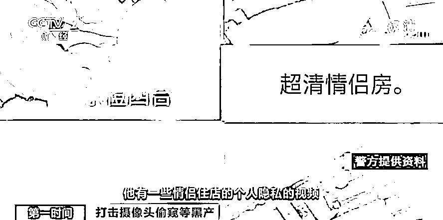
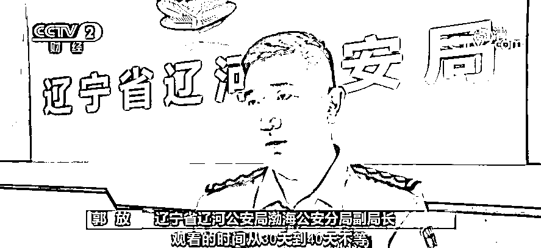
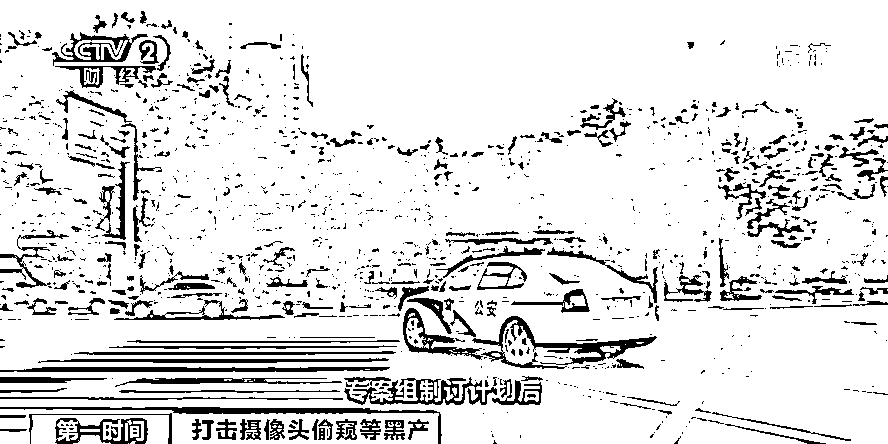
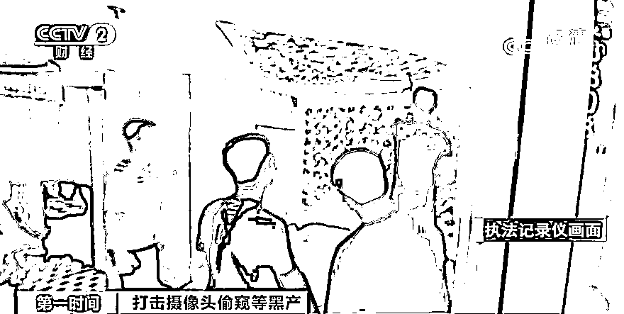
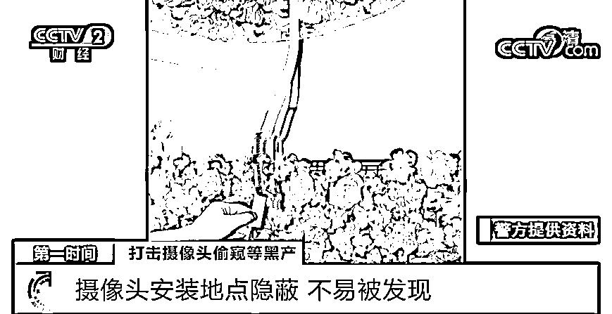
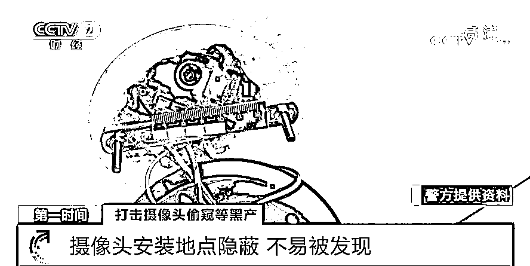
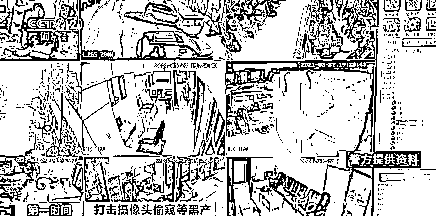
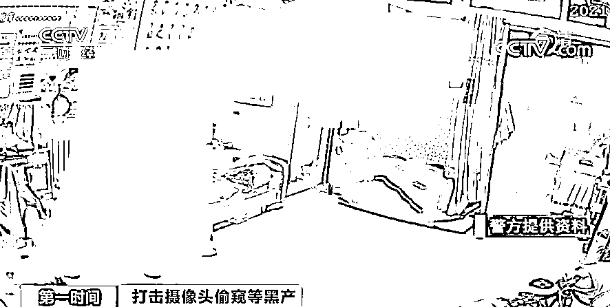

# 酒店暗藏摄像头，“隐私视频”300 元被卖！你的生活，可能被人“盯”着...

> 原文：[`mp.weixin.qq.com/s?__biz=MzIyMDYwMTk0Mw==&mid=2247519085&idx=3&sn=0f4f28fe5d0d4a0f11e70c1fcf9e6885&chksm=97cb4055a0bcc9435390fad223f77cfa4db85fb0e4b3c86afef929b9891a81ba83a11417bb0e&scene=27#wechat_redirect`](http://mp.weixin.qq.com/s?__biz=MzIyMDYwMTk0Mw==&mid=2247519085&idx=3&sn=0f4f28fe5d0d4a0f11e70c1fcf9e6885&chksm=97cb4055a0bcc9435390fad223f77cfa4db85fb0e4b3c86afef929b9891a81ba83a11417bb0e&scene=27#wechat_redirect)

今年 5 月以来，中央网信办会同工业和信息化部、公安部、市场监管总局深入推进摄像头偷窥等黑产集中治理工作，对人民群众反应强烈的非法利用摄像头偷窥个人隐私画面、交易隐私视频、传授偷窥偷拍技术等侵害公民个人隐私行为进行集中治理。

近日，辽宁警方就斩断了一条利用偷装摄像头窥探他人隐私的黑色产业链。

犯罪嫌疑人利用摄像头窥探隐私 贩卖偷拍视频获利

[`mp.weixin.qq.com/mp/readtemplate?t=pages/video_player_tmpl&action=mpvideo&auto=0&vid=wxv_2006197386758389763`](https://mp.weixin.qq.com/mp/readtemplate?t=pages/video_player_tmpl&action=mpvideo&auto=0&vid=wxv_2006197386758389763)

△央视财经《第一时间》栏目视频

今年 3 月，辽宁省辽河公安局网安支队在工作中发现，当地一网民在网上打着**“酒店偷拍”“实时直播”**等关键词噱头，吸引用户购买观看各种隐私视频。

警方随后展开了进一步的调查，发现这些大尺度的偷拍视频，确实真实存在。

**辽宁省辽河公安局渤海公安分局副局长 郭放：**这个视频的摄像头，观看的时间从 30 天到 40 天不等，他卖的是一个摄像头或一组摄像头，以 300 到 600 元对购买的客户进行销售，购买者可以通过手机看摄像头的直播，也可以看七天内的回放，后续提取出来视频之后，做了一个相关的技术鉴定，鉴定它为淫秽视频。

 警方随即对兜售偷拍视频的网民展开了调查，发现此人身后还隐藏着完整的产业链团队。 

三个团伙提供偷拍视频 警方赴多地侦查

为了让网络虚拟世界里的账号地址，与现实中的犯罪嫌疑人相互对应，警方对这名卖家背后的犯罪团伙进行调查。警方没有想到，**卖家背后竟然有三个来自不同地区的犯罪团伙**，在为他提供偷拍视频。掌握线索后，辽宁警方赶赴山东、安徽、广东、山西等多地展开侦查。

[`mp.weixin.qq.com/mp/readtemplate?t=pages/video_player_tmpl&action=mpvideo&auto=0&vid=wxv_2006198079825182726`](https://mp.weixin.qq.com/mp/readtemplate?t=pages/video_player_tmpl&action=mpvideo&auto=0&vid=wxv_2006198079825182726)

△央视财经《第一时间》栏目视频

专案组制定了详细的抓捕方案，警方首先锁定了藏身在山东省的两个犯罪团伙。

**辽宁省辽河公安局渤海公安分局副局长 郭放：**我们专案组制定计划后决定对嫌疑人，在凌晨休息的时间进行破门抓捕，我们在对他家中进行搜查时，也发现了他在酒店安装的摄像头的外包装盒，以及作案的手电钻等安装摄像头的工具，我们通过他的手机，也发现了他所安装的摄像头，在对应的手机中也有相关的直播的视频。

 据警方介绍，2021 年初开始，山东的郭某以住店为由，先后在山东省菏泽市、曲阜市等地酒店偷装摄像头，出售隐私视频，并发展了矫某、闫某等多名“代理”。而在警方调查中还发现，郭某为了躲避侦查，使用他人的账户进行转账收款。 

警方随后对生活在山东聊城的孙某展开了抓捕，发现其在作案过程中，为了避免引起怀疑还找来了帮手。民警在广东实施抓捕的过程中发现，广东阳江的李某、曹某从 2020 年 10 月以来开始从事此违法犯罪活动，因为两人平时联系比较紧密，为了防止打草惊蛇，警方兵分两路，同时实施抓捕。

截止到目前，**专案组民警辗转全国十余个省市，共抓获涉案犯罪嫌疑人 11 人**。 

、

摄像头安装地点隐蔽 不易被发现

三个团伙中的 11 名嫌疑人目前已被检察院批准逮捕，在这起案件中，警方对犯罪嫌疑人的作案手法展开了调查，他们发现，这些犯罪嫌疑人选择安装摄像头的地方十分隐蔽，几乎让人无法察觉。

[`mp.weixin.qq.com/mp/readtemplate?t=pages/video_player_tmpl&action=mpvideo&auto=0&vid=wxv_2006265988358406145`](https://mp.weixin.qq.com/mp/readtemplate?t=pages/video_player_tmpl&action=mpvideo&auto=0&vid=wxv_2006265988358406145)

△央视财经《第一时间》栏目视频

**辽宁省辽河公安局渤海公安分局副局长 郭放：**发现他们共同的作案手法，都是将从网上购买的摄像头，经过自己的私下改装之后，隐蔽地藏在各个酒店的空调处、插座处或者是出风口处，都以这样隐蔽的形式进行安装，而且不容易被发现。他们先会挑选目标性比较强的一个酒店，用自己的身份或者他人的身份进入酒店开房，开房后他们在大家都睡觉的时候，进行摄像头的安装。 

 因为安装十分隐蔽，一般很难被察觉。据警方介绍，在这三个犯罪团伙非法安装的这些摄像头中，只有 3 个被住客发现并报了警。 

在安装好摄像头之后，犯罪嫌疑人就可以通过网络查看酒店房间内的视频了。

**辽宁省辽河公安局渤海公安分局副局长 郭放：**其他人如果想购买该视频，就会发送邀请码，如果在 App 中下载这个邀请码，就会看到该摄像头的实时直播的视频，也可以回看，他通过固定的几名代理，来兜售他自己的直播视频，再由代理来发展客户，来与代理联系。

在调查过程中，犯罪嫌疑人手机和电脑中隐藏的一些视频，引起了专案组成员的注意。

**辽宁省辽河公安局渤海公安分局副局长 郭放：**我们发现嫌疑人手机中，**还存在一些其它的家用摄像头，而且不是他自己安装的**，经过询问和调查，我们发现这个摄像头，都是嫌疑人通过下载扫台的工具，来破解的社会上家用的或者商用的摄像头，他们会把这些摄像头拍摄到的视频，以商品的形式再对外进行贩卖。

 警方提示，**在安装家用摄像头时，一定要记得更改密码，提高安全防范意识**。 

**辽宁省辽河公安局渤海公安分局副局长 郭放：**他们的破解方式，主要就是因为安装摄像头之后的初始密码，不进行及时地更改，所以就造成了他们的初始密码很容易就被破获。

 目前，此案还在进一步侦办中。

*   **管好摄像头 斩断偷窥黑色产业链**

[`mp.weixin.qq.com/mp/readtemplate?t=pages/video_player_tmpl&action=mpvideo&auto=0&vid=wxv_2006196683172282370`](https://mp.weixin.qq.com/mp/readtemplate?t=pages/video_player_tmpl&action=mpvideo&auto=0&vid=wxv_2006196683172282370)

△央视财经《第一时间》栏目视频

不法分子把个人隐私当做商品买卖，将偷窥行径视为生财之道，严重侵害了个人隐私，给社会秩序带来巨大隐患。 

遏制摄像头偷拍产业，不仅需要严查严管生产、销售微型摄像设备的厂商，以及曾经发生过相关事件的酒店宾馆，加强资质管理、登记备案，并建立违法黑名单制度，给消费者进行安全警示。只有多管齐下，每一个环节筑牢数据安全防护责任，才能给个人隐私上一把锁。

来源：央视财经（ID：cctvyscj）

← 向右滑动与灰产圈互动交流 →

