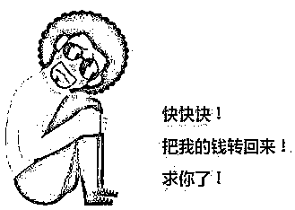

# 身份信息泄露真的会被贷款吗？

> 原文：[`mp.weixin.qq.com/s?__biz=MzIyMDYwMTk0Mw==&mid=2247519085&idx=5&sn=c43d767e7384391d65b54b1f5fbb97ec&chksm=97cb4055a0bcc943b4fdb9916d33e6cdbbcb517bbe84e07f83f3a8b4f6d0c3c5315462d03311&scene=27#wechat_redirect`](http://mp.weixin.qq.com/s?__biz=MzIyMDYwMTk0Mw==&mid=2247519085&idx=5&sn=c43d767e7384391d65b54b1f5fbb97ec&chksm=97cb4055a0bcc943b4fdb9916d33e6cdbbcb517bbe84e07f83f3a8b4f6d0c3c5315462d03311&scene=27#wechat_redirect)

如果有一天 

你的银行卡突然多出一笔钱

仿佛一夜之间天降大财

你会怎么样

是开心得忘乎所以

还是着急忙慌地马上归还

又或是保持理性仔细核实

**当心！**

这可能是一种新型的

**网络诈骗手段！**

**最高端的骗局**

**可能是以“送钱”的方式出现**

**↓↓↓**

**1**

**真实案例** 

最近，正在读大学的小刘就遇到了这么一件怪事。有一天早上起来，他突然收到一条短信，**有一笔 6000 块的银行入账通知**。问了亲戚朋友，都说不是他们转的。思来想去，小刘也没有想明白，怎么就白白得了 6000 块呢。**还没等小刘想好怎么花这 6000 块，他就收到了自称是转错账的一位大姐发来的短信**。

**骗子：**不好意思啊，一不小心把钱错转到你的银行卡上了，麻烦看看你的卡上今天早上是不是有一笔 6000 块的转入。 

**小刘**：是的，确实有一笔。 

**骗子**：我上午在银行转账，不太会操作，转错了，转到了你的卡上，这钱是转给我儿子交学费的，家里好不容易才凑够了这笔钱，能不能把钱还给我？

**小刘**：大姐您别急，君子爱财，取之有道，放心我马上就转回去。 

**骗子**：谢谢小兄弟了，太谢谢你了。

**小刘**：不客气，这是我应该做的。

小刘一看，原来是转错账了，那当然应该“物归原主”。紧接着，在大姐的指示下，小刘麻溜地把银行卡那笔还没有“捂热”的 6000 块钱，转回到“原主”的账户。

半个月后，小刘收到一个陌生男子的电话，**电话称，小刘在他们的网站上借了钱，约定期限是 15 天，本金 6000，月利率 2%，现在到期了，要求小刘还款本金利息一共 6060 元**。

小刘瞬间懵了，联想起半个月前的“转错账”事件，立即报警。警方找网贷公司调取了情况，发现在半个月前，确实有人利用小刘的身份资料和证件照片申请了贷款。

原来，**骗子通过非法渠道，获取了小刘的个人信息后，以他的个人名义向网贷公司申请贷款。而申请贷款的钱，当然会打到本人的账户**。之后骗子再以转错账的说法，请求当事人把钱转给自己……

对于网贷

很多人心里已经有所防备

然而万万没想到的是

躲过了网贷平台的坑

**还有可能遇到这种新型诈骗**

**莫名地背上了“被贷款”的债务**

**2**

**骗术分析**

**❶骗子通过非法手段获取了受害人的信息****❷利用受害人的名义在贷款公司贷款****❸骗子利用一般人的侥幸心理以及疏忽大意的心态，编造转账错误的理由，再让受害人将那笔钱转到他们提供的账号上**

这个骗局看起来非常可怕

如果真的碰上了“**被贷款**”

账户里莫名其妙多了一笔钱

我们该怎么办？

反诈中心提醒

**1.如遇类似银行账户突然多出一笔钱，对方又要求你退还的情况，一定要查清这笔钱的来源。具体可通过手机银行或者直接到银行柜台查询。**

**2.在日常生活中，大家一定要注意保护个人信息，避免个人信息的泄露，以免不法分子利用个人信息进行非法活动。**

**3.绝大多数网贷公司贷款都需要进行人脸识别和验证码，贷款也只能放款到自己名下的银行卡，因此这种骗贷的情况并不多见，保持警惕，无需过于担忧。如果遇到被诈骗的情况请保留好转账记录，及时报警。**

## 来源：反诈骗先锋

← 向右滑动与灰产圈互动交流 →

