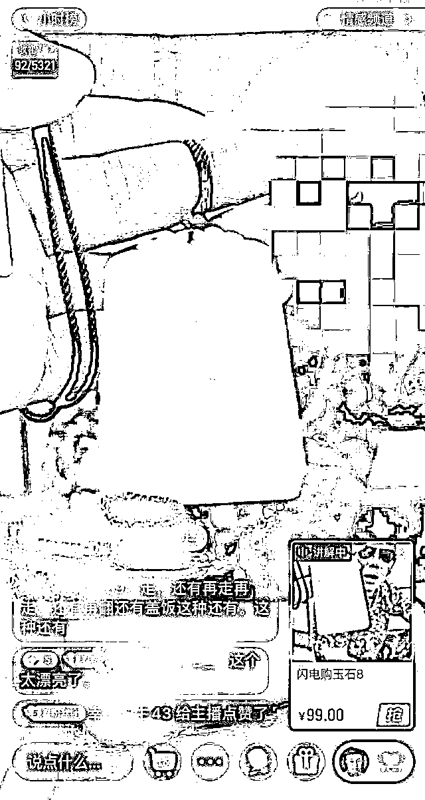
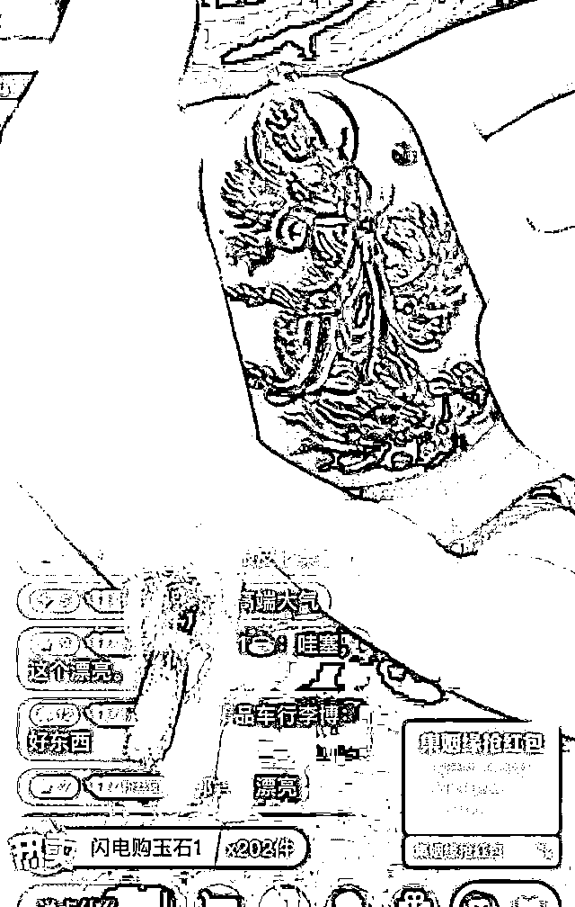
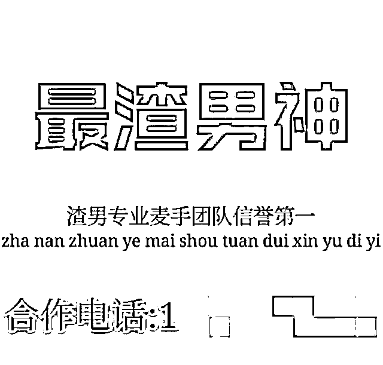
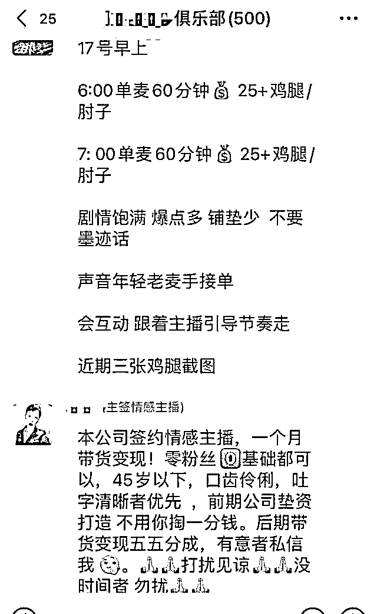
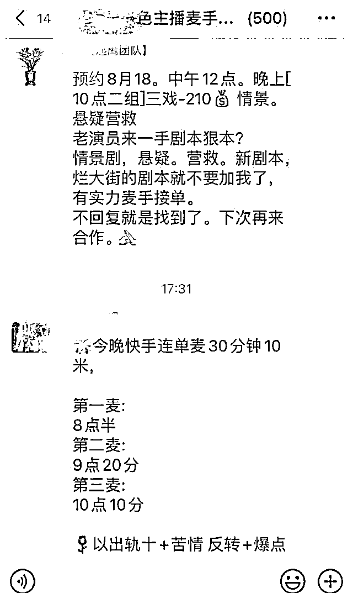
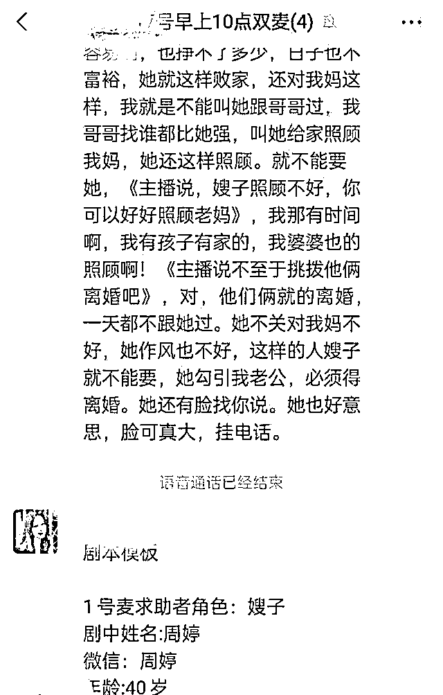

# 出轨、矛盾调解、抢珠宝店……情感直播间里的故事有多野？

> 原文：[`mp.weixin.qq.com/s?__biz=MzIyMDYwMTk0Mw==&mid=2247519121&idx=1&sn=387e59b0809affe56cc8e1ce6aa56cba&chksm=97cb40a9a0bcc9bfbf4c9d05367d56034174b11198788525df8d16cb6df4109b2175a4a4aa73&scene=27#wechat_redirect`](http://mp.weixin.qq.com/s?__biz=MzIyMDYwMTk0Mw==&mid=2247519121&idx=1&sn=387e59b0809affe56cc8e1ce6aa56cba&chksm=97cb40a9a0bcc9bfbf4c9d05367d56034174b11198788525df8d16cb6df4109b2175a4a4aa73&scene=27#wechat_redirect)

价值 4 万元的玉石 99 元卖出，原价 6999 元的手机只要 999 元，主播一口一个“家人们”“爸爸妈妈们”，要粉丝们下单……在短视频平台，当你搜索正在直播的“情感主播”，进入他们的直播间，你可能瞬间进入了怒斥渣男、抓小三、寻亲等各种情感纠纷现场，当你正忿忿不平，主播收缴了渣男的珠宝玉石，大声喊着“低价卖！”“解气！”

这样魔幻的剧情，在不少情感主播的直播间热闹上演。

“渣男”的珠宝在直播间低价卖出，

你信吗？

“这块玉石是特别罕见的，如果我没记错，我老公以前告诉过我这个玉是云南产的，几年前的价格是 4 万……” 8 月 17 日，在一直播间里，一名女子分析着一块玉的价值，另一名光头男子则在愤怒地斥骂。这场直播已经开始很久，从主播和男子的对骂中，可以看出基本剧情：光头男子干了缺德事，主播低价出售他的财产，是在替天行道。“家人们，爸爸妈妈们，99 块钱值不值！为了解气，买！”主播大声吆喝着。 

虽然直播间里双方在互相对骂，但对于这块玉的夸赞是共同的。而这样一块“罕见”的玉，直播间里居然有 100 块。几分钟后，玉石售罄，主播又从男子家中找到了一串珍珠钻石手链，以 888 元的“低价”出售，而这样一条手链，直播间显示 300 条。随着主播与光头男子的矛盾进一步升级，主播“愤怒”地以 99 元的价格卖出男子的手链，而手链数量增加到了 500 条。

一名网友曾在投诉平台举报一位叫“老刘”的情感主播。网友称，老刘在直播间卖惨，称自己被人恶意投诉，恢复直播后找人查到幕后黑手是一名珠宝商人，他直播了自己带人抢珠宝铺的“实况”，称自己抢得两大行李珠宝，其中一箱低价回馈给自己的粉丝。在直播中，老刘甚至带着“抢来”的珠宝到鉴定中心进行鉴定，进一步欺骗粉丝。“强烈建议立刻封杀并处罚该主播，避免更多的老人家上当受骗。”网友投诉后，老刘的账号因违规行为被平台拦截。记者在平台上进行搜索，没有发现老刘的账号，但还有不少老刘的小号。

在直播间里，还有不少人与主播连麦，倾诉情感，请主播支招。

记者随机选了一个正在进行直播的情感主播直播间，这名主播自称是婚姻律师，专门给女人支招。短短半小时内，几乎不间断有网友和主播连麦，每人十分钟左右，都是老公出轨。

“老师你好，我今年 6 月发现我老公跟别的女的在外开房。他的月收入一万左右。我发现他每三个月就会出去跟这个女的开房，大概每个月给她 2000 块钱。我该怎么办？”直播间里，一名女子连麦倾诉。“你是弱者，弱者也有弱者的活法。只要你老公没跟你砸锅，你就能忍。一个月 2000 块，你省大钱了，换取和谐的夫妻关系。”主播这样“支招”。

“老师，我跟我老公是二婚，我们 16 年结婚的，18 年他去买了房子，房子归他名下。他年收入 20 多万，每隔个一两年就要换车，手机也总是用最新款。我却省吃俭用。我因为身体原因，怀不上孕……”又有一名女子连麦倾诉。这次主播表示：“你怀不上孕，那我建议你不要想以后了，就过好当下。你赶紧离婚，自己出去找工作。”

“老师，我 2019 年结了婚，我老公在 2018 年给他的前女友买了房子。他工资不高，在成都有两套房。但是给前女友买房是用的现金，没有任何证据，我能不能把他给前女友买房的钱要回来？”……这些情感故事，总是大同小异，总是有一个不靠谱的男人，和一个处于弱势的女人。而每次连麦间隙，主播都不忘推荐一次商品。

真的有这么多人在直播间里找主播帮忙解决问题吗？

连麦一小时 25 元

线下出演一小时 1000 元

与情感主播们互动的人，在行业内被称之为“麦手”。

记者以招募麦手的名义，与一名介绍人取得联系，介绍人将记者拉进了好几个群里。在近五百人的麦手群里，不断有人发布着招麦手信息，有招募线上连麦的，也有招募线下演员的。“今晚八点，三人戏，剧情内容丰富的，苦情带情景剧的，加营救必须硬手来，烂大街的本子别来！”“今天到，线下需要一名 50-55 岁（演员）饰演老板，必须有沧桑感，戴口罩 400 元，不戴口罩 800 元，餐补 50 元。”“剧本类型是渣女、出轨、搞笑，能吵吵的优先，有合适的麦手加我直接对戏。”在群里，一名叫做“雪飞记者”的主播招募“看着就让人同情的女一号，30 岁；渣男，30 岁，明晚 7 点开始线下连续剧”。而在短视频平台，这位主播有上万粉丝，定期进行直播。

随后，记者以新手的身份添加了一名麦手培训师。这名麦手培训师告诉记者，成为麦手没有门槛，只要敢于连麦、敢于说话，熟练之后月收入上万不成问题。“你可以兼职或全职，单麦指单人连麦，一小时内 25 元，双麦指两个人连麦，80-90 元一次，三人连麦 200-300 元一次，比如三个人分别扮演老公、婆婆、小三等。”

培训师在微信里将记者备注为“ 16 号学习麦手”，并给记者发来一份 8 月 17 日上午使用过的剧本。在这个长达 3000 字的故事中，刁蛮不讲理的小姑子，为了病重母亲手里的老物件不落到哥嫂一家人手里，处处陷害嫂子，导致哥嫂一家要离婚，于是嫂子致电求助。通过主播的连麦，最终将矛盾圆满解决。

“一般四五天你就能熟悉了，就能接双麦、三麦的单。你还可以接线下单，主播需要你参与拍摄，如果你愿意露脸，工资更高，一小时一千元都有。”培训师说。

事实上，在情感主播这个领域，几乎是一个相互欺骗、造假的领域。培训师表示，新手付款 198 元他就能拉新人进去麦手群，并帮助新人制作虚假的好评截图，凭借好评截图，新人麦手就能接到主播的单。主播们在群里发布的招聘信息往往要求麦手自带剧本，这又催生了剧本生意，在电商平台上，情感剧本、段子、文案打包出售，5.9 元就能买到一个压缩包的文案。“麦手赚主播的钱，主播赚电商的钱，电商赚粉丝的钱。这个过程中，只有粉丝花费了自己的时间，还要花钱。”培训师说。

“干这一行的有几十万人，情感主播 99% 的连麦可以说都是靠麦手。”

上当者多是中老年人

剧本是假的，情感咨询是假的，不少主播带的货也是假的。

消费者赵先生表示，上个月，他在一名情感直播间购买了主播拍卖的雪花开口手镯，拍卖时，主播承诺这个手镯是宝贝，价值五位数。赵先生以 199 元的价格拍得手镯后，在线下进行了鉴定：手镯是镀金的假货。“我相信主播的办事和为人，也相信他的话，但我找珠宝店和相关检测机构鉴定后才知道是假货。”虽然上当了，但赵先生对主播依然有好感。

记者注意到，不少消费者投诉是因为家里的老年人上当。“家中老人关注了平台上一个情感主播，有 40 多万粉丝，每天就是看情感故事。直播中，主播诱导老人购买了假和田玉项链，金额 1200 元。”王先生说。

网上，年轻人对情感主播的吐槽十分普遍，认为不少情感主播素质低，在直播中说脏话，情感故事总是出轨、卖惨，但无奈家里的老人喜欢看。“谁还没有个沉迷快手的爸爸妈妈、爷爷奶奶呢？”“奶奶把快手放到最大音量，泼妇破音骂街我耳朵要炸了，但其实我也能理解她老人家，也没什么娱乐方式”“我给我爸妈说这些东西有剧本，或者雇人打电话，他们不信”……

的确越来越多的老年人会上网。行研机构发布的《银发人群洞察报告》显示，老年人平均每天至少有 4 小时在使用互联网，有关数据在未来仍将呈上升趋势。除了触网时间变长，老年人也越来越热衷在线上购买产品。艾媒咨询数据显示，2021 年中国有 24% 的老年人通过线上渠道购买保健品，而通过直销和商场超市购买到保健品的老年人均占 8%。

但这不代表“数字鸿沟”的填平。虽然老年人懂得网上购物，但辨别能力、处理售后纠纷的能力相对缺乏，往往成为不良商家围猎的对象。“我母亲看情感主播的直播，买了 3 瓶叶黄素，后来想要退货，但平台购物十分繁琐，我母亲 70 岁了根本搞不懂里面的规则。”“我父亲听主播说买保险首月 1 元，每个月扣 13.3 元，他给自己和我母亲都买了，结果后来直接扣一百多元，根本不知道怎么回事。”网友们表示。

律师：主播在直播间通过自己的名义推荐商品，可能会被认定为广告代言人

一些网络平台已经注意到此类问题。今年 3 月，抖音安全中心发布的《“卖惨带货、演戏炒作”违规行为处罚公示》显示，平台已对卖惨带货、编造离奇故事、演戏炒作等行为进行违规处罚，在 30 天内，处理相关违规直播间 446 个，封禁违规账号 33 个，包含“权哥讲情感”、“光头哥”等 10 个粉丝超百万主播，另有“金牌调解玲姐”等多位主播被封禁直播权限。当时抖音安全中心相关负责人表示：“这些行为不仅不会起到正面作用，反而会造成严重违规的后果。直播中的卖惨炒作带有欺骗性质，违背直播行为规范，影响达人和商家形象，平台会持续加大对此类违规行为的打击力度。”

尽管如此，在短视频平台，依然活跃着大量情感主播，不间断的连麦讲述着大同小异的出轨故事，好几小时的直播过程中，主播以“解气”的名义出售着廉价的玉石珠宝。

湖南金州律师事务所律师易旭表示，主播在平台卖货属于销售行为。根据《广告法》第二条规定，本法所称广告发布者，是指广告主以外的，在广告中以自己的名义或者形象对商品、服务作推荐、证明的自然人、法人或其他组织，如果主播在直播间通过自己的名义、形象对商品表达出对商品的推荐，可能会被认定为广告代言人。而新广告法对广告代言人有相关规定，如“广告代言人必须使用过推荐的商品或服务”“不得代言医疗、药品、医疗器械、保健食品”“代言人须连带损害赔偿”等。

“主播在平台卖货要遵守《广告法》、《消费者权益保护法》《产品质量法》、《食品安全法》等法律中关于生产者、销售者的有关规定。”易旭说。

易旭表示，根据《电子商务法》的规定，电子商务平台经营者应当明确商品和服务质量保障、消费者权益保护、个人信息保护等方面的权利义务。因此，对于主播带货的商品品质问题，电子平台有相应的监管义务。

来源 ：潇湘晨报

← 向右滑动与灰产圈互动交流 →

