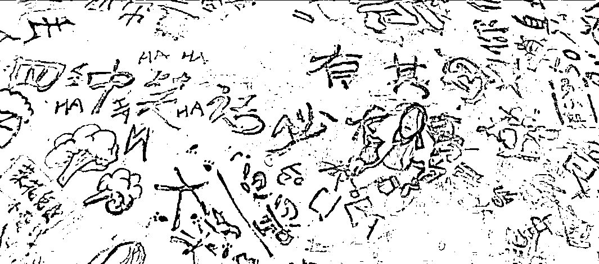

# 14 岁女孩被连扇 20 多个耳光：她还是个孩子，千万别放过她！

> 原文：[`mp.weixin.qq.com/s?__biz=MzIyMDYwMTk0Mw==&mid=2247519121&idx=2&sn=1fdc461c5afbf8a48abe1d8b9f27e16a&chksm=97cb40a9a0bcc9bf2e3bcc4a8f0d2ffab8800a601899c51bc7e2e23ddced7a0d0c6972a18423&scene=27#wechat_redirect`](http://mp.weixin.qq.com/s?__biz=MzIyMDYwMTk0Mw==&mid=2247519121&idx=2&sn=1fdc461c5afbf8a48abe1d8b9f27e16a&chksm=97cb40a9a0bcc9bf2e3bcc4a8f0d2ffab8800a601899c51bc7e2e23ddced7a0d0c6972a18423&scene=27#wechat_redirect)

**1**

****14 岁少女被一群少女扇耳光****

这两天，网上突然开始流传一段未成年欺凌视频，先是在朋友圈里流传开，再接着发酵到了更大的网络平台，这才引起警方的注意。

很多家长都不敢看，太气愤也太心疼了。

网传视频显示，一个女孩在厕所内先后被两个女孩扇耳光，其中一个身着红衣的女孩连扇了 20 下，打完后还让其他女生继续，并说：**“出了事我扛着”。**

**同时，有一个女孩全程微笑拿手机在旁边拍摄。**

**第一个女生打完后，一个穿红色吊带的女生上前，假装为被打女孩擦眼泪，然后迅速又恶狠狠地连续扇了她二十几个巴掌。** 

网友们看到视频后，震惊伴随着愤怒，并且希望相关部门，不要就此结束对孩子们的关注，还要对后续情况多留意。

随后，@歙县公安 发布通报称，警方对此高度关注，辖区派出所已受案调查。

最终的处罚决定是：对 1 人处以行政拘留十四日的处罚；对王某某等 3 人分别处以九日至六日不等的行政拘留处罚，因该 3 人已满 14 周岁不满 16 周岁，依法不执行行政拘留处罚；2 人因不满 14 周岁，依法不予处罚，责令其监护人严加管教；其他 4 人因情节轻微依法不予处罚。

**说实话，这样的处罚力度真的很让人担忧，拘留几天后，这些孩子出来了真的能改吗？会不会继续报复？被打的孩子心理会不会出现问题？......**

没有解决的问题太多太多，必须引起我们足够的重视。因为，校园欺凌现象已经不是新鲜事了。

记得之前也看过类似让人心痛的新闻：在一公园凉亭下，几名女子围着一名身着白衣齐肩短发的女生，在辱骂女生后，开始轮番掌掴该女生，并撕扯女生头发等。

**女生手拿着手机背靠凉亭一柱子，未作反抗，多次遭掌掴后掩面哭泣。**

打人女生全程有说有笑，表现轻松，还在比剪刀手、嘟嘴等姿势，而边上，则还有人用手机帮忙拍视频。

视频传出后引发当地网友关注及热议。

人民日报也曾经披露了一起校园霸凌事件，湖北嘉鱼县某中学女生被人轮流掌掴。

**短短 40 秒，被扇了不下 20 次，被打女生一动不敢动，表情呆滞，满脸通红。**

**而当地教育局的工作人员表示，只是同学之间开玩笑而已。**

而河北保定的一起校园霸凌事件中，一名女孩遭逼迫下跪、打耳光、拽头发、脚踹、棍打以及逼迫脱衣等。

2019 年甘肃陇西一 14 岁少年，因为一副耳机，遭到 5 名同学围殴致死。

2019 年西安一初中男生，被 5 个年龄相仿的孩子围住拳打脚踢，毫无反抗能力。

河南焦作，一女初中生被逼用嘴叼垃圾桶中的冰棍。

……

校园欺凌已经成为了一个不容忽视的社会问题，再不重视，我们不能保证，**下一个被欺负的孩子会不会是我们的孩子。**

、

**2**

****孩子，不要乖乖地挨打****

记得曾经有这样一则新闻，南京地铁上，一位中年男子给老人让座。

当他站起身之后，突然开始对一旁的十七岁男孩发难：“你为什么不让座？”

没等男孩回应，男子一边骂骂咧咧，一边用脚猛踹男生胸口。

从头到尾，17 岁的男孩像只乖顺的小羊羔，不还口、也不还手，无力地面对着陌生人的拳脚相加。

男孩“乖乖”挨打的样子，让人又气愤，又心疼！

台湾 15 岁的少年叶永志，因长相清秀，性格内向被同学嘲讽太娘，常常欺负他，殴打他，甚至脱他裤子检查「是不是男生」。

他曾给妈妈写纸条求救：「妈妈，你要救救我。」

叶永志的母亲向学校反映，学校却一直没有进行处理。

**最后一次被打中要害，这个少年倒下后再也没起来。**

我们常教育孩子，不要打人，要有礼貌，要宽容大度。

但却忘了教孩子，当别人侵犯他时，只有勇敢地反击，才能保护自己。

而保护好自己，才是这世间生存最重要的法则呀！

别再说什么“打人的是坏孩子”。

**我宁愿我的孩子做个“坏孩子”，也不想看到他老老实实地遍体鳞伤。**

当孩子被欺负时，家长的信任和支撑真的很重要。 

看过一个故事。

一位妈妈在上班时，突然接到老师的电话，说女儿在学校欺负同学，都打出血了。当她匆匆赶到学校时，老师、年级主任、被打同学的父母，正在那批评着她女儿。

她到了后没有第一时间责怪女儿，而是询问了女儿的具体事情经过，原来，是这个男生一直弹女孩的内衣肩带，女儿让他停止他不仅没有，反而弹得更起劲了。直到最后忍无可忍了女儿才动手打了他。

这位妈妈顿时觉得三观被颠覆，反问道：**“所以你们叫我过来，是想要知道我是否要以性骚扰罪起诉这个男同学，并且以管理失当的原因起诉学校吗？”**

老师以及被打同学的父母被这位妈妈的气势吓到，连忙道歉，保证一定好好教育男孩，请求原谅。

**身为父母，当你的孩子被欺负了，请记住你是他最坚实的依靠，是最坚固的堡垒。**

**你站在他身后，他才有勇气去反抗所有不公正的待遇。**

我老公就经常教育女儿，当你碰到好的事情时，可以自己偷着乐，不一定要爸爸妈妈，但遇到不好的事，一定要记得告诉我们。

************

**3**

****少年的你，请大胆往前走****

《少年的你》原著里有这样一段话：

**嘲笑和排斥从幼儿园开始，谁说人之初性本善呢？谁说他们只是孩子呢？**

孩子的等级划分、拉帮结派和打压异己，偏偏是最原始、最残酷的。

他们不像成年人那样伪善，所以他们看不起谁，讨厌谁，就光明正大地表现出来，光明正大地欺压他，嘲笑他，孤立他，打击他。

不要再说那些加害者还是孩子，不懂是非。

就是因为他还是个孩子，千万不要放过他。

**如果继续变本加厉，毁掉的不只是自己，还有别的孩子光辉灿烂的一生。**

****

作为家长，如何让孩子免于被欺负，以及孩子被欺负之后我们该怎么做？ 

第一，给孩子强大的心理支持

百度百科对“校园欺凌”的解释中有一句让人印象深刻：**“校园欺凌实际上通常被称作小孩子不懂事而模糊化，外国则要受惩罚。”**

“大事化小，小事化了”这种社会观念，是校园欺凌案件最大的绊脚石。在孩子遭受欺凌的时候，如果我们成年人——无论是家长还是老师——只把“欺负”当成“小矛盾”掩盖下去，那么只会让孩子无处可诉，更加绝望。

> 没什么大不了的！
> 
> 你怎么这么没骨气呢！
> 
> 为什么人家就欺负你？你怎么就不合群？
> 
> 有本事你打回去啊！
> 
> 别哭哭啼啼的真没出息！ 
> 
> ……

请不要对孩子说这类话！这样以后哪怕欺凌升级，孩子也不会再说了——因为说了也没用。家是孩子安全的港湾、最后的壁垒，如果连这里都失守了，他还能到哪里去呢？

还记得《未择之路》里，二勇对尕娃说的几句话让我印象很深刻。

尕娃在学校被几个坏同学打得脸上一片淤青，二勇问他怎么不还手，他说：“打不过，还手也没用。”

二勇听到后，立马对他说：**“打不打得过是能力问题，打不打是态度问题。态度决定命运，知不知道？”**

深以为然。沉默是被霸凌者的宿命，发声才是改变命运的开始。

第二，具备一定自我保护的能力 

打架当然不是什么值得提倡的事情，强身健体却是没错的。我们不主动伤害他人，但至少具备自我保护的能力。

不过，学武不一定真的能保护好孩子。一方面儿童成长期发育快慢不同，身体素质的差异、人数的悬殊，都可能让孩子有限的“花拳绣腿”没什么用武之地，甚至惹来更猛烈的报复。

**而且就像前面说的，很多欺凌是非常隐秘的，并不一定是殴打，更多的是对人心理上的打击。**

**所以我们在教孩子“自卫”观念的同时，一定也要注意传递“抗挫”观念，以及一些应对的技巧，让孩子万一遭遇欺凌时有敏感度，知道怎么处理。**

校园欺凌的案子发生在学校，却远远不止在学校这么简单，需要家庭、学校、社会、法律多方形成合力，制定出完善的保护和预防、惩戒机制，让每个少年少女都能够拥有灿烂而美好的青春。

**没有一个孩子生来就该深陷泥潭，哪怕生活在阴沟里，也要给他们仰望星空的机会。**

愿所有的孩子都能被温柔以待，

愿学校真的是我们拥有的乐园。

孩子不能碰，这是我们的底线。

我们保护得了少年，才能保护世界。

**希望所有家长们能做孩子最坚实的城堡，告诉孩子：你往前走，我们一定在你的后面，给你力量，陪你成长。**

*文中图片素材来源：微博、豆瓣等网络

来源：大茉莉家油站,反诈骗先锋

← 向右滑动与灰产圈互动交流 →

