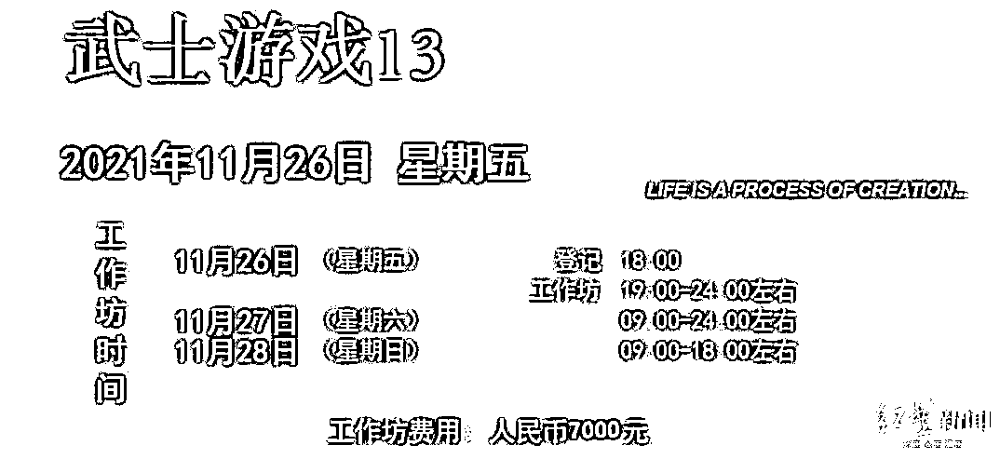

# 才 32 岁！知名女投资人突然离世…家属最新回应：网传信息失实，对家人伤害很大

> 原文：[`mp.weixin.qq.com/s?__biz=MzIyMDYwMTk0Mw==&mid=2247519121&idx=3&sn=200cf3f3e9ffef6646f81cf25855d533&chksm=97cb40a9a0bcc9bfdb953063d8fa7e54ef5382ceca1a0439ff679abe5f9d4fd16c26a68e25e5&scene=27#wechat_redirect`](http://mp.weixin.qq.com/s?__biz=MzIyMDYwMTk0Mw==&mid=2247519121&idx=3&sn=200cf3f3e9ffef6646f81cf25855d533&chksm=97cb40a9a0bcc9bfdb953063d8fa7e54ef5382ceca1a0439ff679abe5f9d4fd16c26a68e25e5&scene=27#wechat_redirect)

**年仅 32 岁****知名女投资人、DCM 董事总经理魏萌****因意外突然去世** 

**引发网友关注**

**（此前报道：[32 岁女投资人之死：精英课程还是精神控制？](http://mp.weixin.qq.com/s?__biz=MzIyMDYwMTk0Mw==&mid=2247519085&idx=1&sn=0cd46a0c97b07e0662e0dd945b379d54&chksm=97cb4055a0bcc943e13f84aa8282cada0eb10e43ff9d06e95f04056b84ce61c58696c3d7f056&scene=21#wechat_redirect)）**

公开资料显示，DCM 是一家专注早期投资的风险投资公司，投资案例包括当当网、易车网、小马智行、途牛、唯品会、丁香园、58 同城等。

魏萌于 2014 年 7 月加入 DCM，专注于消费互联网、O2O 服务、定位年轻人的移动应用，**曾入选 2019 福布斯中国 30 岁以下精英榜。**

资料还显示，魏萌喜欢潜水、滑雪、跳莎莎舞、设计明信片、画油画，是个重度戏剧爱好者。**她“对世界保持好奇”，曾搭车从上海到北京旅行 1200 公里。**

**这样一位热爱生活的创投精英****怎么会突然离世的呢？**据了解，魏萌曾参加由北京诚泉文化发展有限公司开设的 LEGACY 飞跃力工作坊课程**在上课过程中晕倒送往医院紧急救治**▽8 月 15 日，LEGACY 诚泉北京曾通过官方微信公众号发布消息，一个卓越的职业女性、两个孩子的妈妈在飞跃力工作坊课室中意外晕倒，现场紧急呼叫了 120，送至朝阳医院救治，寻求征集有关脑部、心血管方面的专家资源以备会诊。

* * *

这名学员被证实就是魏萌，公告发布时，她仍在 ICU 救治中。之后不幸的消息传来，经抢救无效，魏萌于 8 月 16 日离世。**有部分媒体采访知情者称：**

**魏萌是在程课“互相辱骂”环节中**

**因情绪激动发生突发状况**

**不幸离世**

▽据 LEGACY 官网显示，LEGACY 是一家致力于提升个人成长及企业永续的咨询顾问公司，在香港、北京和深圳都设有办公室，**参与者多为行业内的卓越人士。**官网信息显示，LEGACY 共开设有八个工作坊，其中，“飞跃力工作坊”专注于自我突破，是一个强而有力、很具挑战性的体验式工作坊，需要五个整天百分百的参与。“它是一个重新肯定真实生活轨迹的有力机会，借此，您将连结热情满盈的生命时刻。”在 LEGACY 微信公众号上，可以看到的课程有四种，并且报名费都不低，具体为：

*   里程：**16000 元**

*   飞跃力：**16500 元**

*   自觉力：**9800**

*   武士游戏：**7000 元**

据界面新闻报道，在社交平台参与过相关课程的学员反映，**这个课程给人精神洗脑很厉害。**课程中夹杂很多心理学相关的理论和心理学的活动环节，但是老师和机构并没有心理学相关的资格。**据红星新闻报道：****目前，涉事机构已部分停课****至于什么时候恢复****对方表示：“等恢复了我再通知你”**

# **投资圈高知也被精神洗脑？**

**网友既叹息又迷惑** **不过，魏萌的丈夫昨天深夜发布讣告称：****网络内容失实，****对家人伤害很大**▽据澎湃新闻消息，8 月 17 日晚，魏萌的丈夫李博发布讣告称，其挚爱的妻子、两个幼子的母亲魏萌女士不幸离世，家人深陷悲痛。逝者已逝，生者需要鼓起勇气，扛起肩上的责任，面对接下来的生活。“我非常理解和感激朋友们的关心，但**目前网络上的信息已经严重失实，对魏萌造成了极大的误解，也对家人造成了伤害。**在此恳请朋友们不要听信、传播未经家人证实的信息，给予魏萌及家人充分的尊重与保护。”与此同时，LEGACY 官方微信号推送两篇内容，第一篇为《LEGACY 声明》，第二篇为《讣告》。《LEGACY 声明》称，魏萌在课室意外晕倒，经两天全力救治，于 8 月 16 日晚 22 时由朝阳医院急诊部宣布医治无效。“因悲剧发生以来，**家属要求暂不对外公开，****以至目前为止出现了很多与事实不符的报道或猜测，对逝者家属、LEGACY 学员等造成了很大伤害。**”来源 ：澎湃新闻、界面新闻、红星新闻、新闻晨报、每日经济新闻、网友评论等

← 向右滑动与灰产圈互动交流 →

