# 骗子最爱冒充的几个人，就在我们身边！

> 原文：[`mp.weixin.qq.com/s?__biz=MzIyMDYwMTk0Mw==&mid=2247519121&idx=4&sn=32b9ae25472ed615cd50646eeecbae32&chksm=97cb40a9a0bcc9bf74b7ea1e5b046df017541a0b620069ca48d678443cd1cd8b1256faa463cc&scene=27#wechat_redirect`](http://mp.weixin.qq.com/s?__biz=MzIyMDYwMTk0Mw==&mid=2247519121&idx=4&sn=32b9ae25472ed615cd50646eeecbae32&chksm=97cb40a9a0bcc9bf74b7ea1e5b046df017541a0b620069ca48d678443cd1cd8b1256faa463cc&scene=27#wechat_redirect)

编者按：本文根据电信网络诈骗类型中比较高发的“三冒充”诈骗类型（冒充领导或熟人诈骗、冒充“公检法”诈骗、冒充客服退款诈骗）选择经典案例进行了编辑。请广大群众仔细阅读，擦亮眼睛，避免上当。

喜欢演艺圈里面的大明星吗？有扮演成功商业人士的、有扮演领导的、有扮演七大姑六大婆的……小编这里也发现了一群不为名、且没有粉丝后援会的大演员！

作为一个演员（**骗子**），敬业（**成功骗取钱财**）是最基本的素质（**诈骗目的**）和职业操守，作为演员，演戏就要到位！

现在，小编就带你看一看

到底有哪些演员让你着迷（**被套路**）……

***01***

****扮演****老板****

****指示财务转账****

****剧情：****

**近日，宜宾市高县某公司何某通过 QQ 添加了一个名为“宜宾商业银行年检员”的人为好友，随即对方发送了一份授权书及 2021 年银行企业年检须知。同时，自己也被拉进一个名叫“****公司群”的 QQ 群，刚一进群，就看到有人@自己，询问其是否添加了“宜宾商业银行年检员”，并让其尽快准备资料去银行办理。何某看到 QQ 头像是自己的老板，还未仔细斟酌，群里另外一位总经理问公司的款什么时候付过去，并以对方公司催的很紧为由，让何某联系公司财务人员先后 6 次向指定账户转账 29 万元。**

**何某按照老板指示，转账完后，在 QQ 群内@老板，结果显示已被踢出聊天群。何某才意识到被骗，立即报警。**

**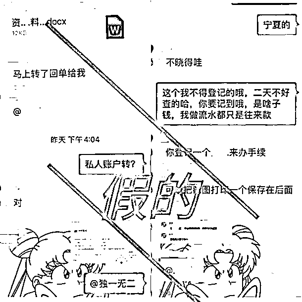**

**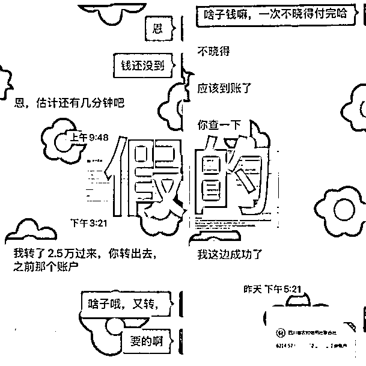**

**△（骗取信任）**

****

**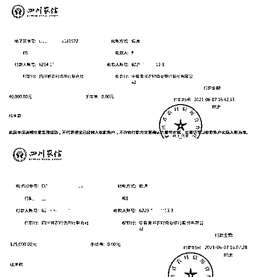**

**△（转账凭证）**

****演技分析：****

****第一步****

**“演员”扮演“银行年检员”联系公司财务负责人，添加 QQ 并发送资料，获取信任。**

****第二步****

**将受害人拉入虚假“公司内部 QQ 群”或“微信群”，设置仿真办公聊天情景，编造支付“合同保证金、业务款”等理由催促财务人员尽快转账汇款。**

*****02*****

****

******扮演****领导******

******让下属帮忙汇款******

******剧情：******

****7 月 6 日，高县郑某添加一个自称是“**书记”的微信，对方说转一笔钱在郑某银行卡上过一下，并发来转账截图让其信以为真，郑某东拼西凑给对方转账两次共 8 万元，最后，对方以高县账户严查为由，让其把微信聊天删除。第二天，郑某发现钱没有到账，发消息也被拉黑，打电话核实后发现被骗。****

****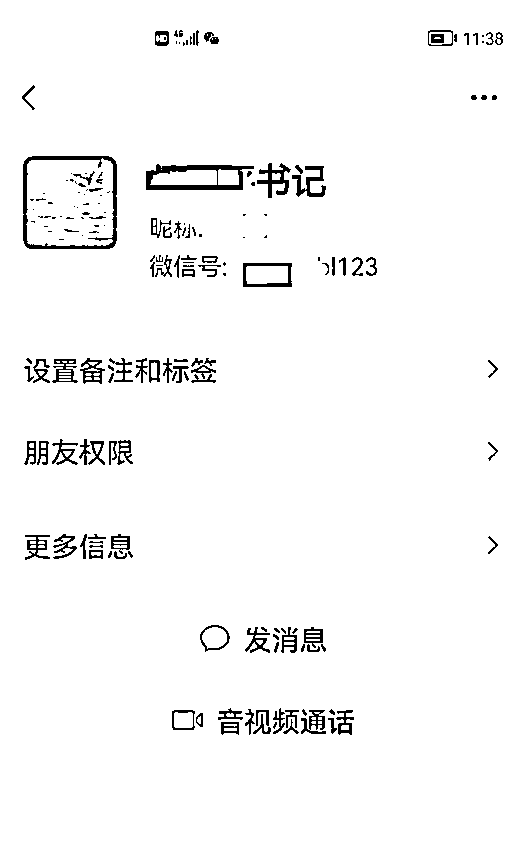****

****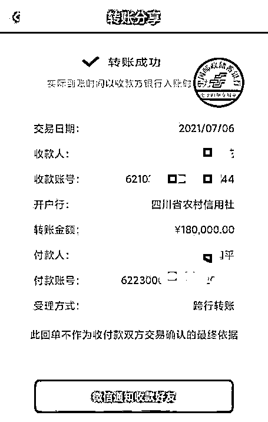****

****△（扮演领导微信号，微信转账）****

******演技分析：******

******第一步******

****“演员”盗用领导头像、微信账号，用真实照片头像和身份头衔伪装成“高仿号”。****

******第二步******

****“寒暄”“慰问”，拉近关系，以各种理由为由，请你帮忙转账。****

******第三步******

****等你答应请求后，便伪造转账凭证，谎称自己已经把钱转到你的账户，并催促你打钱给提供的银行账户。****

*******03*******

********

********扮演****熟人********

********让朋友汇款********

********剧情：********

******      6 月 20 日，高县李某在 QQ 上收到“高中同学”发来的消息，称其朋友在医院急需用钱，让李某帮忙转 5900 元给朋友。在李某转入对方的指定账户后，迟迟未等到“高中同学”转来的 5900 元，才意识到被骗，随即报警。******

******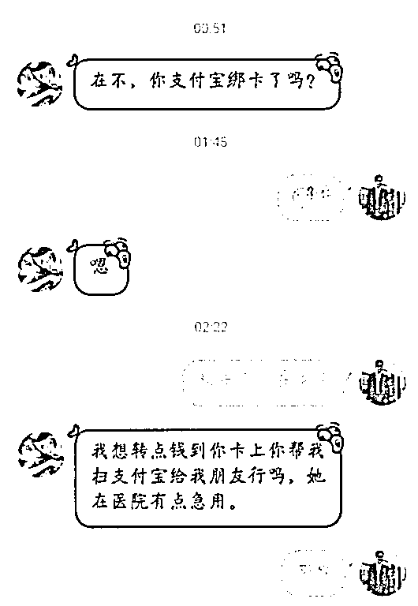******

******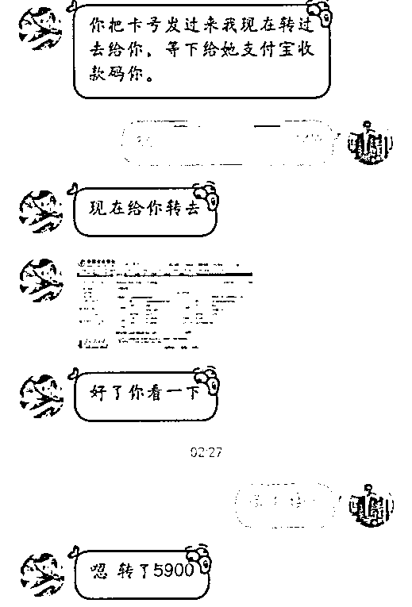******

******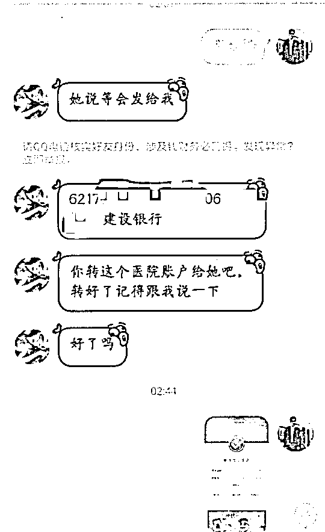******

******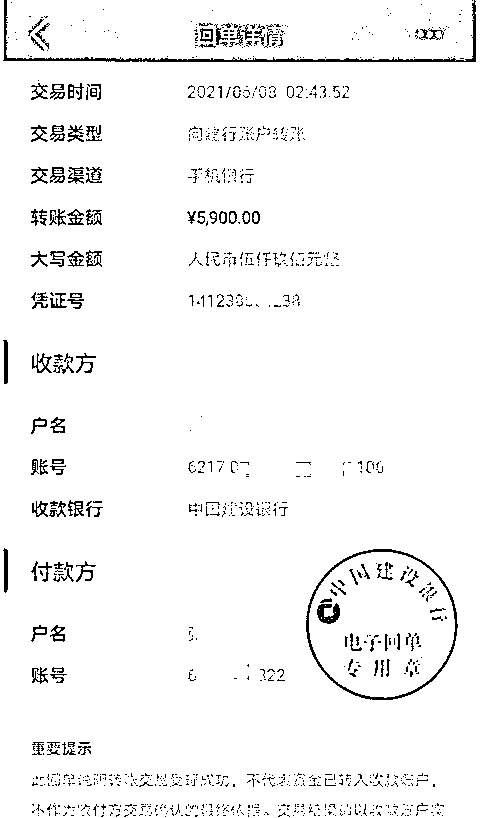******

******△**（QQ 已提示核实对方账号）      （转账回单）********

********演技分析：********

********第一步********

******“演员”盗用受害人 QQ、微信等聊天工具，冒充受害人的亲戚朋友、同事等熟人。******

********第二步********

******“演员”以遇到急事、还钱、交学费等借口，编造各种剧情，骗取受害人信任后，要求受害人转账。******

*********04*********

********************扮演****客服****************向客户“退款”********

********剧情：********

******5 月 25 日，高县杨女士接到电话，自称是某宝客服，因近期购买的口红有质量问题，需要给其退款 138 元（口红原价），并称已经退还到杨女士的支付宝备用金上（官方大平台，让人放心），但因理赔员操作失误多退了几百，要求杨女士将多余的钱退还到对方指定账户中。****** 

******随后，客服引导杨女士打开支付宝备用金（借贷金额 500 元），让其将多退的 362 元转到对方的银行账户上。转账完成后，客服又多次以“验证身份”为由要求杨女士继续转款，声称验证完后会全部退还（看你慢慢演）。杨女士信以为真，先后三次转款 7 万余元给对方。最后意识被骗。 ******

******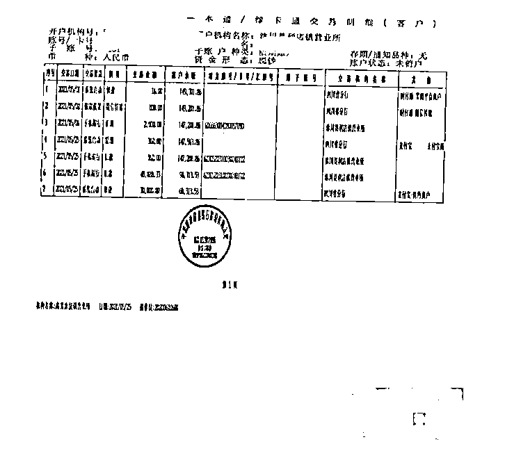******

******（△汇款记录）****** 

********演技分析：********

********第一步********

******“演员”通过非法途径获得客户的网购订单信息后，扮演平台客服、店家客服或支付宝客服。******

********第二步********

******“演员”谎称网购商店存在质量问题，主动提出退款、赔偿。******

********第三步********

******引导客户到支付宝，让你误以为通过支付宝平台进行理赔。******

********第四步********

******谎称支付宝备用金为赔偿款，骗你点击，一旦点击，提取到的 500 元比你应得的赔偿金额多，便以不归还会产生高额利息、影响征信等为由，诱导你到 QQ“退还”多余款项。******

********第五步********

******以信誉度不高为由，骗你到各借贷平台贷款，并将贷款所得转到他们的账户。******

*********05*********

********************扮演****警察****************恐吓“嫌疑人”转账********

********剧情：********

******4 月，嘉乐小文接到一陌生电话，对方自称是腾讯微信客服中心的江霞，询问小文是否在北京贩卖过口罩和体温枪，尽管小文极力否认，但江霞称北京延庆警方已经立案，若要自证清白就联系延庆警方，并将电话转接。******

******      随后自称是该警方的民警徐义通过电话让小文**配合调查**她在北京贩卖口罩一事，并要求小文到一个**很安静的地方**进行询问并录音。徐义询问了小文**银行卡余额和使用情况**，并让其先后下载**“安全防护”APP**和**虚假“邮政银行”APP**，将银行卡上的余额全部转到这两个“安全账户”上。转账完后，又要求在**网上贷款**继续转账，小文最后才意识被骗。******

******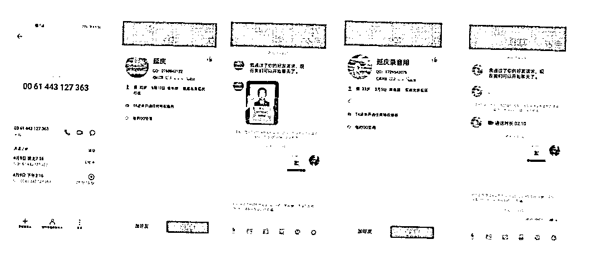******

******（△造假凭据）******

******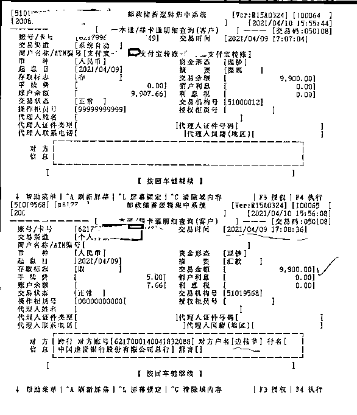******

******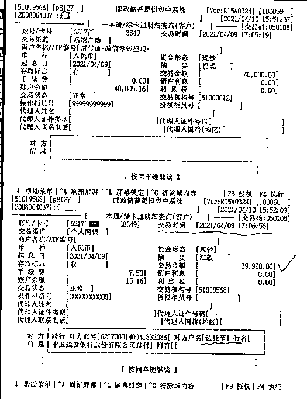******

******（△转账明细）******

********演技分析：********

********第一步********

******“演员”首先扮演通信部门、金融单位、物流公司、政府机关等与“嫌疑人”（受害人）取得联系，之后以“嫌疑人”涉案为由，转接扮演“公检法”单位的工作人员，要求“嫌疑人”配合调查。******

********第二步********

******发送印有“嫌疑人”照片、身份信息的虚假通缉令、法律文书及虚假警官证，以增加可信度。******

********第三步********

******以案件涉密为由，威胁、恐吓“嫌疑人”不得将此事告知任何人，阻止“嫌疑人”与外界联系交流，并引导受害人通过各种渠道筹钱。******

********第四步********

******诱导“嫌疑人”通过手机按键拨号将手机设置呼叫转移或其他状态，要求“嫌疑人”去宾馆开房间或到其他人流量稀少的地方接听电话接受调查（排除外界干扰）。******

************

********导演（民警******** ********）温馨提示：**************    一. 96110 的电话一定要接！************    二. 12381 的短信一定要看！************    三. 撕开“演员”外衣，请牢记“五个凡是”：******

********★**凡是“公检法”部门在电话中要求您配合调查并汇款到“安全账户”的，一律是诈骗。******

********★**凡是领导、亲属通过 QQ、微信、短信要求您汇款或付款的，未经您电话核实的，一律不要轻信。******

********★**凡是“淘宝客服”“京东客服”“航空公司客服”等电话或短信告知您订单异常的，一律是诈骗。******

********★**凡是在网络（QQ、微信）或短信上向您发送网址链接或付款二维码的，一律是诈骗。******

********★**凡是不认识的人需要您提供短信验证码的，一律是诈骗。******

******不论“演员”以何种身份出现（诈骗花样千千万），请广大群众一定要谨记“三不一多”原则，即：未知链接不点击,陌生来电不轻信,个人信息不透露,转账汇款多核实。只有了解更多的反诈防诈知识，才能识破“敬业演员”的拙劣演技！******

******来源：宜宾市反诈中心、熊猫反诈、反诈骗先锋******

************

******← 向右滑动与灰产圈互动交流 →******

************