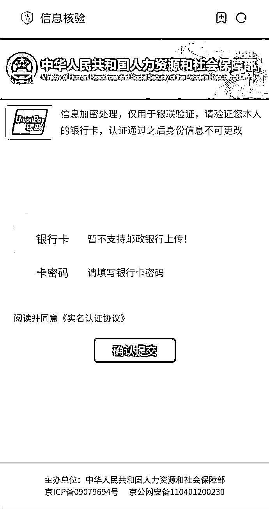

# 你也收到社保局短信了？

> 原文：[`mp.weixin.qq.com/s?__biz=MzIyMDYwMTk0Mw==&mid=2247519121&idx=5&sn=f9ff31739b7385a6dd2b0c4ba5a7a702&chksm=97cb40a9a0bcc9bf23f501d9c6694384624c1bf747c792e67afd267f560a8a68e65bafd6a8ca&scene=27#wechat_redirect`](http://mp.weixin.qq.com/s?__biz=MzIyMDYwMTk0Mw==&mid=2247519121&idx=5&sn=f9ff31739b7385a6dd2b0c4ba5a7a702&chksm=97cb40a9a0bcc9bf23f501d9c6694384624c1bf747c792e67afd267f560a8a68e65bafd6a8ca&scene=27#wechat_redirect)

这两天发现

貌似又有不少人收到这种**“社保中心短信”**

短信附带了一个链接

通知你要赶紧上传身份资料

还说**逾期社保账户将被注销**

有些同学也确实正在办理社保业务

就顺手点开了链接

发现虽然**链接的格式很奇怪**

但页面做得和真正的社保网站别无二致

还“贴心”地放了通知和办理步骤

点击在线办理

地址栏会显示信息核验的字眼

并让你填自己的个人信息

但这个页面就让人蚌埠住了

怎么填个验证信息

**还需要我的银行卡密码、支付账户密码？**

不如直接说是要我存款得了

摆明就是个诈骗网站

虽说这种骗局本身是有不少破绽的

但假冒网站页面模仿得越来越像官方

赌的就是我们一不留神就

所以大家收到此类带链接的短信时

一定要多加鉴别，不能轻易点开

对此类短信可以通过以下几点甄别： 

1、政府部门官网的后缀名多为"xxx.gov.cn"；

2、查询发布短信的号码是否为官方号码；

3、任何需要输入金融账户密码的，都为诈骗。

来源：微信 110

← 向右滑动与灰产圈互动交流 →

