# LEGACY 亲历者自述：“骂人环节”存在，有人当场失控，推荐人往往是最信任的人

> 原文：[`mp.weixin.qq.com/s?__biz=MzIyMDYwMTk0Mw==&mid=2247519184&idx=1&sn=4c336316da7cd1a2d3a68983b64c7e27&chksm=97cb40e8a0bcc9fee0f78c14d4c415cebc8e8b5c9cabbc185514331ded316f5bb044e4a491fe&scene=27#wechat_redirect`](http://mp.weixin.qq.com/s?__biz=MzIyMDYwMTk0Mw==&mid=2247519184&idx=1&sn=4c336316da7cd1a2d3a68983b64c7e27&chksm=97cb40e8a0bcc9fee0f78c14d4c415cebc8e8b5c9cabbc185514331ded316f5bb044e4a491fe&scene=27#wechat_redirect)

消息，近日 32 岁女投资人魏萌在 LEGACY 培训课上晕倒后意外去世，引发广泛讨论。
尽管 LEGACY 贴出了魏萌家属的声明，否认了媒体报道中提到的精神控制、辱骂等内容。外界对 LEGACY 质疑声仍然不断出现，尤其是几位 LEGACY 工作坊课程以及类似课程的亲历者纷纷发声。在这些亲历者的描述中，LEGACY 课程给他们带来了严重的心理创伤，也表示存在“辱骂环节”，有人直接称之为“PUA 课程”。**值得注意的是，不止一位媒体或大 V 收到了 LEGACY 官方或者陌生人的私信，被要求删除相关的讨论信息。这又是为何？**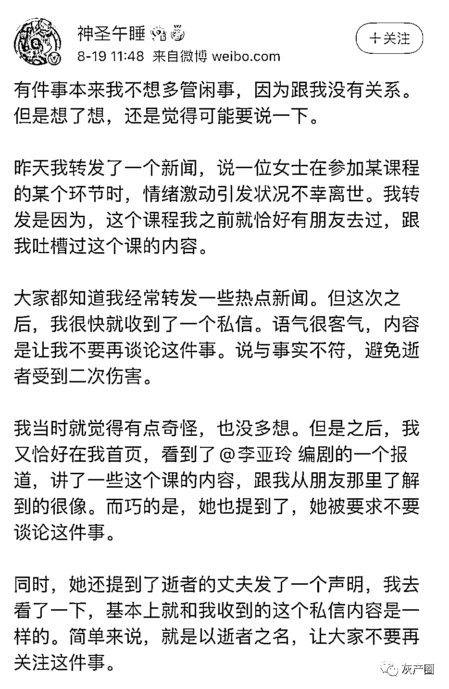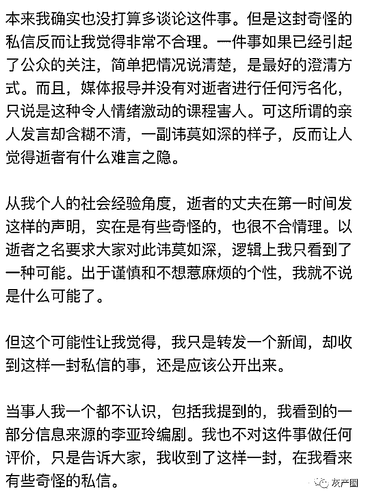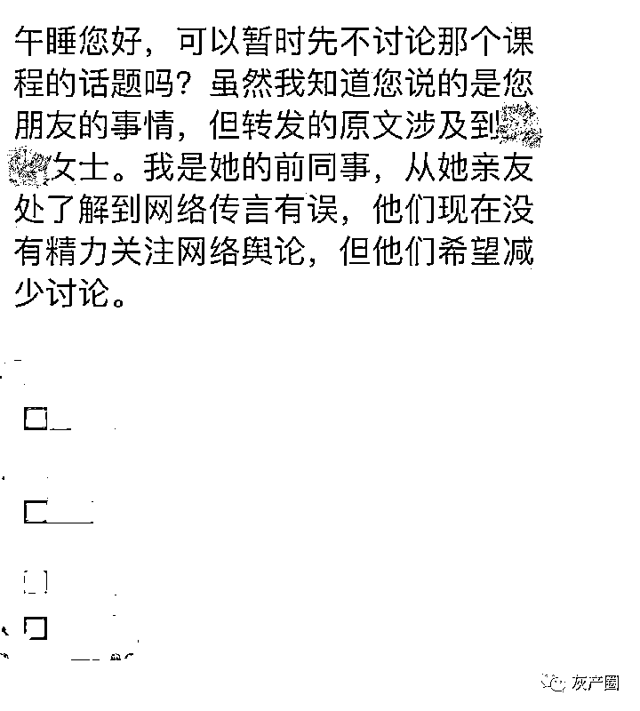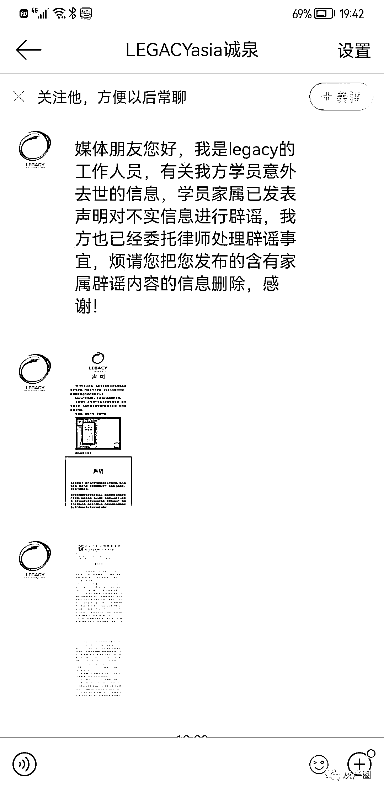**在看似寻求“拯救”的游戏课程中，这些亲历者到底得到了什么？****LEGACY 学员回忆课程细节****希望大家远离这种课程**一位 LEGACY 学员在腾讯新闻写下了课程的详细内容，其中诸多细节，值得我们深思。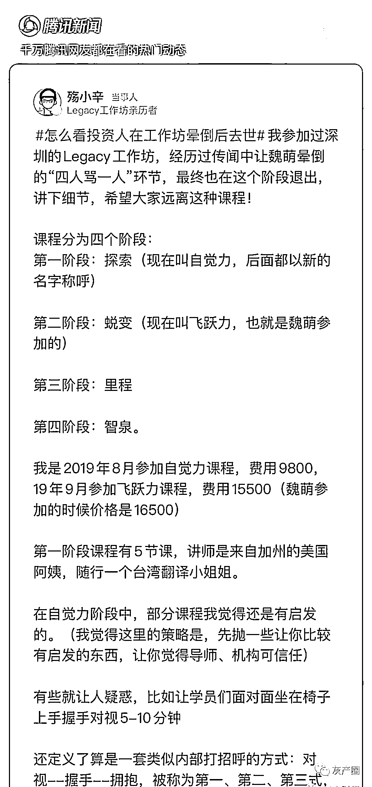这位学员描述自己在 2019 年 8 月参加课程，费用 15500 元，魏萌参加的时候价格是 16500 元。课程分为四个阶段： 第一阶段是探索（现在称自觉力）， 第二阶段是蜕变（现在称飞跃力）， 第三阶段是里程，第四阶段是智泉。最终在第二阶段飞跃力后，他选择了退出。值得注意的是，魏萌发生意外也是在这个阶段。**学员透露上课环境：关窗帘，放音乐****重新定义打招呼方式，对视--握手--拥抱**第一阶段课程有 5 节课，讲师是来自加州的美国阿姨。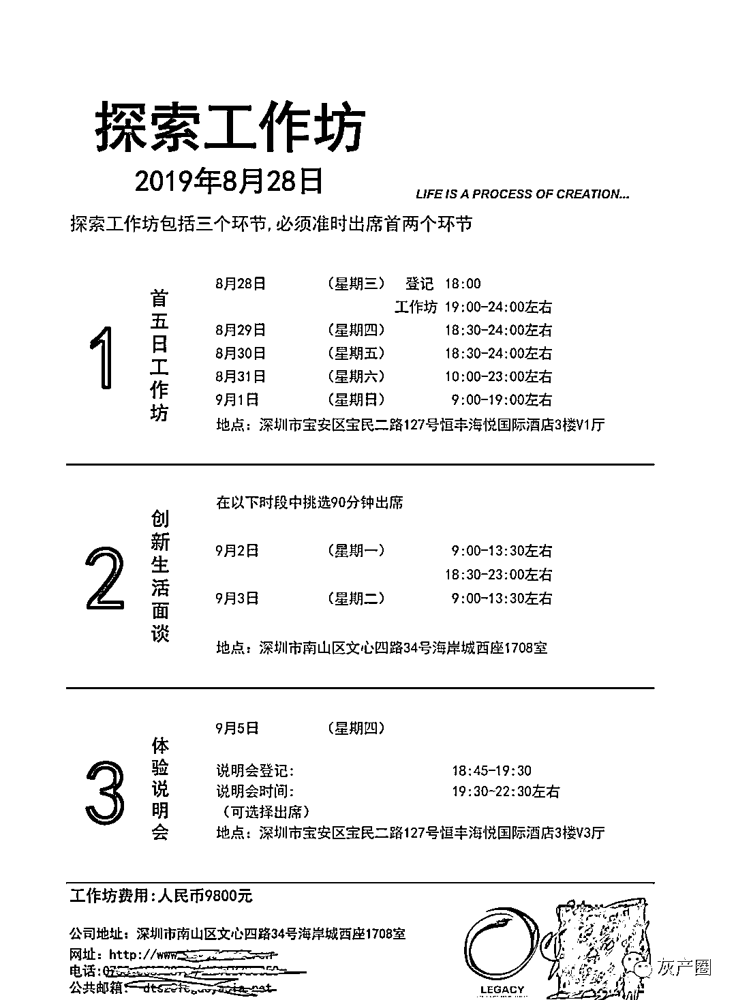**参加课程被要求绝对保密，不能做笔记、拍照、录影或录音。电话也会被关掉，不能坐在参加课程之前就认识的朋友旁边。**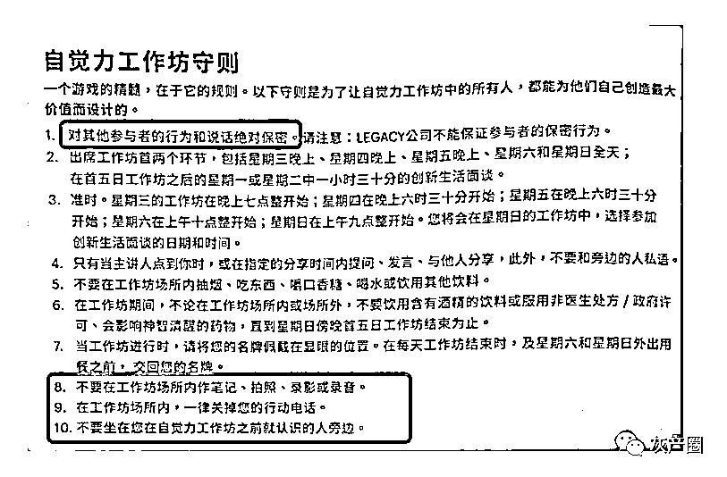该学员指出，在自觉力阶段中，自己感觉部分课程还是有启发的。他认为这是一种策略，先抛一些让你比较有启发的东西，让你觉得导师、机构可信任。为此他举了几个例子。比如导师会让学员关注自己身体的小声音，“为什么会逃避一些事情不愿意做，内心在想什么？在担心什么……”该学员表示，这些活动是引导去思考，自己也有一些启发。再比如，他还透露导师讲了一个故事，这个故事大概就是导师找搬家公司搬家，但是家里的珠宝却丢了。但是故事却有两个版本，一个是导师抱怨搬家公司没有职业道德，另一个版本则是导师剖析自己，没有找正规搬家公司，没有看好贵重物品，才导致了珠宝丢失。导师引导学员思考第二个版本，意思是出问题了要从自己身上找原因。**该学员指出上课的环境也很有“讲究”，上课时整个房间都是用遮光窗帘遮住的，室内只有昏暗的灯光，以及一些音响设备。**授课时导师用马克笔和白纸教授，互动环节会配合灯光和音乐渲染。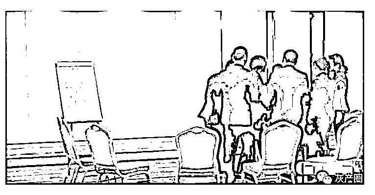在该学员看来，课程里定义了算是一套类似内部打招呼的方式：对视--握手--拥抱，被称为第一、第二、第三式。**第二阶段“飞跃力课程”是十二级龙卷风****连续 5 天从早 10 点到晚 12 点****有人当场失控**在导师眼里，第一阶段自觉力只不过是像风吹**，第二阶段的飞跃力课程就是十二级龙卷风。**这样说有根据的，据该学员描述，在飞跃力课程上，情绪起伏非常大，甚至失控。这一阶段的课程强度非常大，要连续 5 天从早上 10 点到晚上 12 点甚至更晚才能结束。这首先是体力上的一种考验，有的学员甚至低血糖。其次，课程对心理产生的波动是强度大的另一方面。**该学员详细介绍了 5 天的课程内容，其中有几个环节很有代表性。**该学员介绍，有个环节叫做回顾，让学员回顾童年的一些经历。有些童年不幸的同学会当场尖叫失控。还有一个“**救生艇游戏”**，假设都坐在一条船上，每个人手里只有两张船票，但是要决定把另外一张船票给谁。同时，还要注视那个不救的人的眼睛，并大声喊他的名字：xx，你死！对方则要大声回应：我死！**该学员表示，在那种密闭的环境加上音乐的渲染之下，会让人觉得很真实，大家后面就哭得稀里哗啦，好像真的在抹杀一条生命。**还有骂人环节，这个环节不会骂脏字，而是用过分的语言去打击对方，比如说你懦弱自私，不敢争取自己想要的等等。该学员指出，有些人被骂会很反感，但对自己却没用，这时候小组长就会去质问骂人者“你们为什么不百分百去骂？他都没有反应！”然后让加大力度。**为什么推荐人都是最亲近的人？****学员们都听到了一个“海星的故事”**该学员指出，在自觉力课程最后有毕业典礼环节，灯光关闭，音乐响起，睁开眼，会发现之前推荐你来的人就站在你的对面。据该学员的说法，有很多是妻子进来后，推荐了老公、婆婆、女儿（Legacy 有少年班），也有同事、同学、朋友，关系大都是很亲密的。**事实上，那么为什么推荐人都是最亲近的人？****在第二阶段的第 5 天，导师向学员讲述了一个“海星的故事”。**导师告诉学员，“你是个小女孩/小男孩，暴晒在沙滩上有很多被冲上来的海星，你把一个一个海星扔进海里，就是拯救一个一个人”。在 LEGACY 里，推荐人就是海滩上的小女孩/小男孩，被介绍来的人就是海星。**拯救海星这种行为在内部叫做贡献，还说“只有做贡献才是唯一出路”。**第二阶段结束也有毕业典礼，需要穿正装出席。该学员这样描述当时的情景，“学员们再次看到推荐人，再想到海星的故事就痛哭流涕，想见了亲人一样”。**调查记者曾卧底类似课程****称经历过“辱骂”游戏环节****直言是“PUA 课程”**在众多类似课程的亲历者中，编剧李亚玲的经历比较特殊。因为在 2007 年，还是调查记者的她，曾卧底到了类似课程中。所以在体验过程中，她有意识地让自己保持清醒，试图理性去体验课程的各个环节。**她称自己也经历了“多人辱骂”环节，并且这是她印象最深的几个游戏环节之一。**李亚玲表示，“当时我们一个班 20 多个人，所有人，包括身家上亿的企业家，都被骂的瑟瑟发抖，泪流满面”。她却坚持不认错，并且拿眼直视回瞪每个骂她的人。导师用了一招，最后她还是崩溃了。**李亚玲称，当时导师和学员以孝道来质问她，而当时感情特别深厚的婆母刚刚去世。**还有当时有所谓“强力突破”的环节，就是做自己最害怕的事。**她被要求从高空往下跳，否则其他学员就不能下课，最后她妥协了。**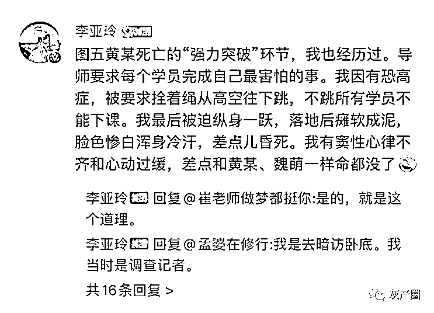**李亚玲这样描述当时她的反应**，“落地之后，整个人都瘫软成泥，脸色惨白，浑身冷汗，差点儿昏过去。我有窦性心律不齐和心动过缓，不算严重的心脏病否则就和黄某、魏萌一样，可能命都没了”。在李亚玲的个人公众号上，她贴上了当年自己写的调查文章，详细讲述了课程的全过程。在她看来这就是 PUA 课程，并表示“99.9%的人在上这课后，都会受到不同程度的心理创伤。”在李亚玲分享了自己的经历后，也有不少人袒露了自己深埋已久的心声。**一位 20 多岁的年轻人在李亚玲的微博下，分享了自己的经历。**她称在四年前曾经参加类似课程，那时候刚成年不久，加上亲人去世，**在一位远方亲戚的介绍下参加了两期的课程。**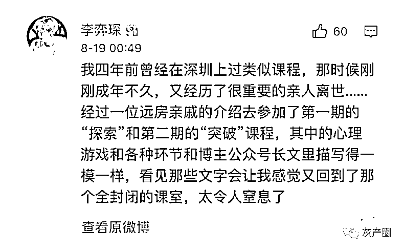她指出，课程中的心理游戏和环节和李亚玲曾经的经历“一模一样”，“看见那些文字会让我感觉又回到了那个全封闭的课室，太令人窒息了”。她讲述了一个细节，当时在第二期课程中，因为迟到她成了“众矢之的”，在一连串的引导和责问以后她把自己的秘密捅出来了，她说“**在一群陌生人面前痛哭尖叫，被当众撕开伤口的感觉真的特别崩溃，然后导师意味深长地宣布我重生了……**”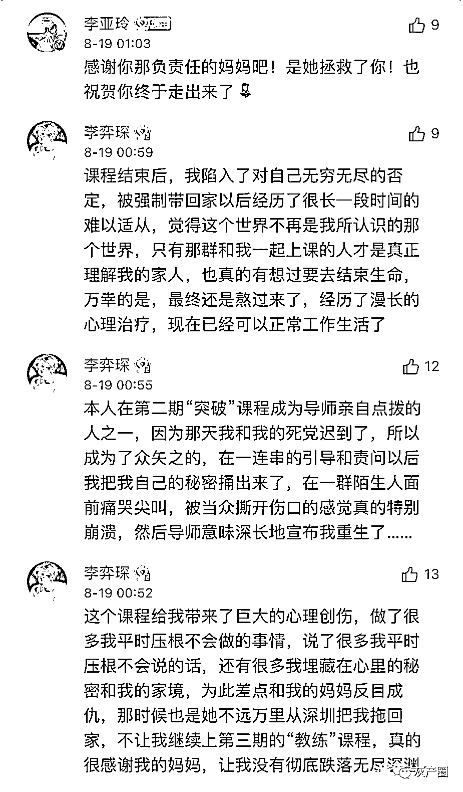当时她差点和妈妈反目成仇，但妈妈还是不远万里从深圳把她拖回了家，她感慨“真的很感谢我的妈妈，让我没有彻底跌落无尽深渊”。课程结束很久，她都没有走出来，经历了漫长的心理治疗，现在已经可以正常工作生活了。**另一 LEGACY 学员讲述“对骂环节”****若退课会有其他学员敲门相劝****还有男学员穿内裤，拿避孕套做节目**李亚玲分享了一位一 LEGACY 学员的亲身经历。该学员表示是最信任的人推荐上课的，上完了三个阶段。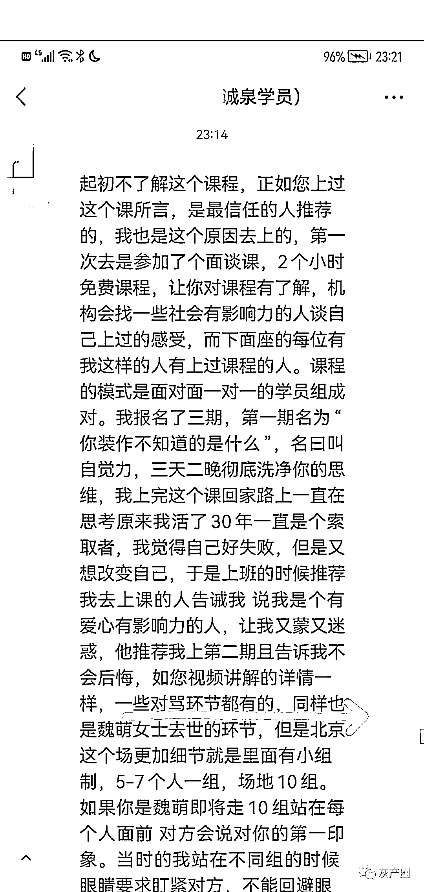**在整个课程三个阶段，会做各种游戏，也包括所谓的“对骂环节”。**这位学员分享了其中的一些细节，“对方会说对你的第一印象。当时我站在不同组的时候眼睛要求盯紧对方，不能回避眼神，他们说我自私等等很摧毁一个人的所有词汇”。甚至还有环节，要求学员到街上要钱，如果要不到就会被说没能力。**据该学员描述，还有一些“解放天性”的环节，比如男性穿内裤，拿避孕套做节目。**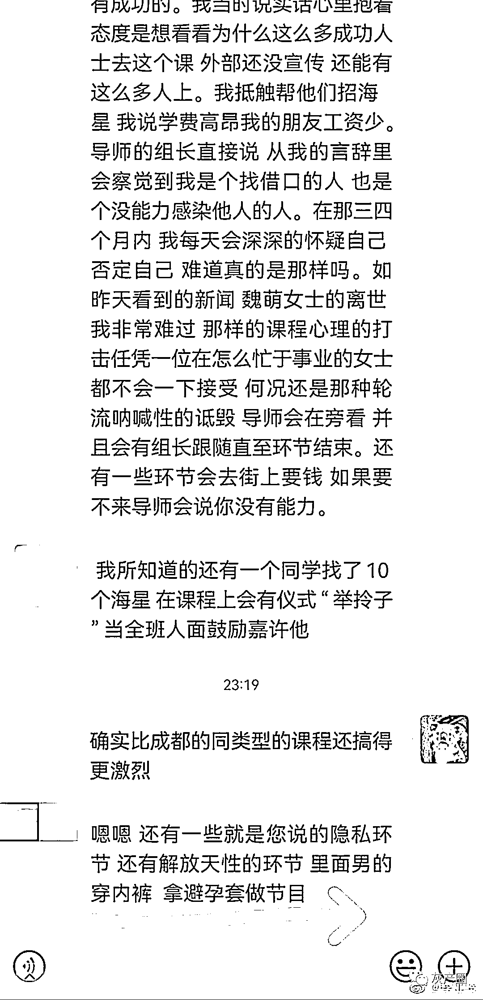该学员还提到，“课程会拿道德绑架你”，课程内有人要退课，导师会当面诋毁你。还有细节是，当时有人退课，导师称缺人无法开课，就让全班同学出去找那个退课的同学。该学员自己也在第三阶段退课了，当时就有同学上门劝他回去上课。**导师还会要求学员帮忙介绍新学员，这种新学员被称为“海星”。**该学员回忆称，当时一天会被要求定三个闹钟，每次向导师的小组长汇报找到了几个“海星”。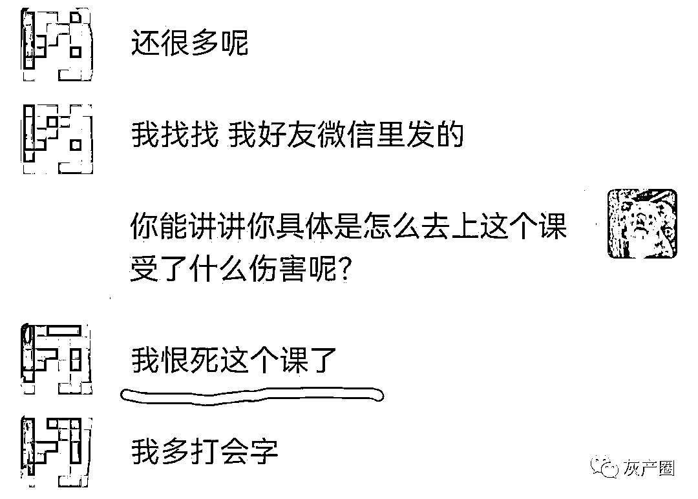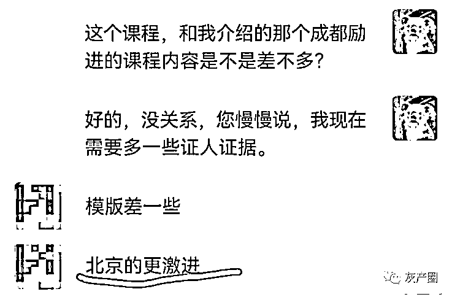“在那三四个月内，我每天会深深的怀疑自己，否定自己”，该学员坦言“我恨死这个课了”。最后还有一个疑问：为什么魏萌在 LEGACY 意外去世，家人却不让提 LEGACY 课程，甚至还有人以逝者之名让各媒体、自媒体等不再关注此事？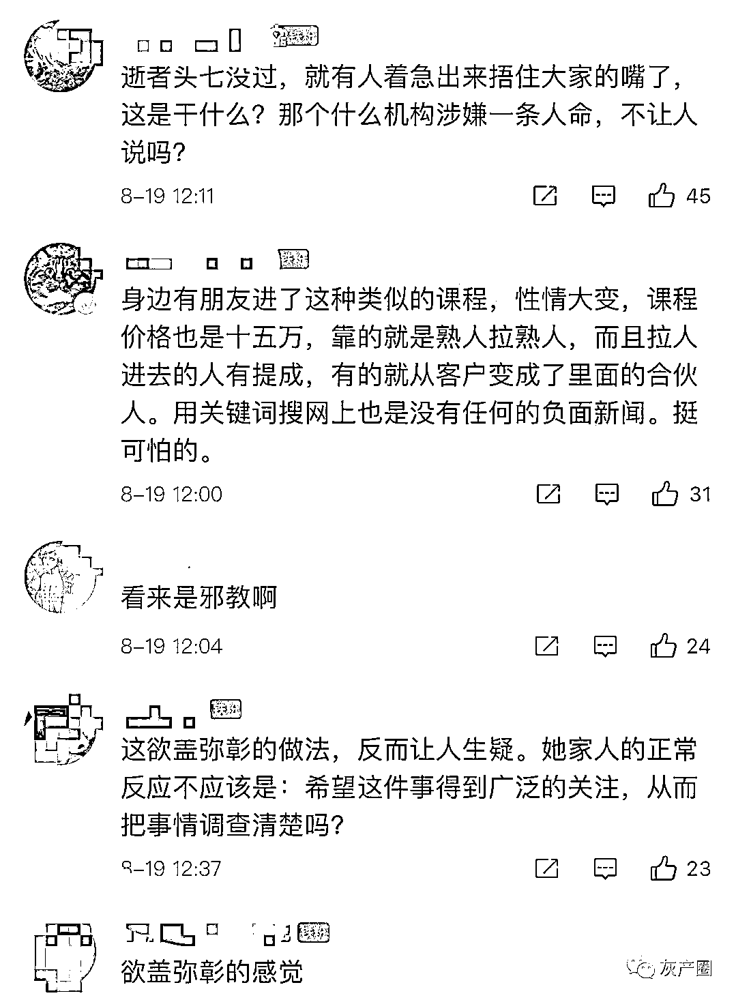来源：三言财经

← 向右滑动与灰产圈互动交流 →

