# 除了吴亦凡，北京警察还抓了 14 位明星

> 原文：[`mp.weixin.qq.com/s?__biz=MzIyMDYwMTk0Mw==&mid=2247519184&idx=2&sn=d3a93af32efaf977a0263ea294891122&chksm=97cb40e8a0bcc9fe60c8f3034b9f7753401996ea1910596c873076e5749994b533be3bfe9cb5&scene=27#wechat_redirect`](http://mp.weixin.qq.com/s?__biz=MzIyMDYwMTk0Mw==&mid=2247519184&idx=2&sn=d3a93af32efaf977a0263ea294891122&chksm=97cb40e8a0bcc9fe60c8f3034b9f7753401996ea1910596c873076e5749994b533be3bfe9cb5&scene=27#wechat_redirect)

我们的青春就像命运恩赐的一枚青涩的果子，我们迫不及待地塞进嘴里，却酸涩得流下泪来，无可救赎。青春，是一本太仓促的书。常去的书城，一转角，遇上小学同学的几率是万分之一吧，就那么巧，我碰见了余珉瑶。我们坐在茶吧里，点了两份奶昔，她放下书包，拿出一本辅导书在写。珉瑶说自己最近在学吉他，“呵，手指头有时都能被弦勒出痕来。”如果是我，我便不会有这毅力，我怕痛。几年前，我报了跆拳道班，只不过试学几天，便直不起腰了，更不用说脚背一阵一阵的生疼，我的跆拳道生涯便在我的哭声中落下帷幕。“只是觉得谭杰希能把吉他弹那么有劲、那么帅，便有了一股学到底的干劲呢。我还年轻，可以多尝试、多追求自己所向往的东西。”珉瑶说道，又拿出了好几本辅导书，她的包还是鼓鼓的。“学习压力重吗?”我疑惑地看着她迅速的填满书上的空白。“呵。”她的微笑有些僵硬，只是叹了口气，轻描淡写的一句“还好吧。直到我们走出茶吧，她终究是说了，“当初曾经说要在一起的朋友，勾勾手说永远的时光，到现在好像有些苍白。”这与学习压力有什么关系?我看向她。“以前背地里说句谁的坏话，朋友的那句‘不跟你好了’好像有些幼稚呢。与现在比，与她们有话掖着比，那些都显得万分珍贵。”我下意识地点头。“没有朋友，一个人在角落里学习，就像平行线永不交集那般孤单……小学的时候，我并未付出多少，却有很多奖状、有好成绩，连上下学都有人陪着……现在想想，当时对那一切的不屑多么可笑!”她摇着头，低下了眼眸，看不出喜怒。“没有老师关注，没有优秀的成绩。突然想挽回曾经那一切，可是再努力也没有收获，于是更着急去付出。可是，遥遥无期的感觉太过痛苦，每日活在痛苦之中，我也变成令人讨厌的人……”于是，我明白，这便是压力了。她不过换了一个角度讲述我们去买了很多吃食，在一家店里看见一个男孩子在哭泣，只不过为了一根棒棒糖。我对珉瑶说，“我嫉妒他。”向大人撒娇的年龄已经过了，赌气和朋友闹别扭的时光不复返了，青春的列车将往何处停靠?余珉瑶看着我的双眼，笑了。我望向天空，天上的浮云那么遥远，那么自由。我渴望是浮云之一。青春励志作文 1000 字：永恒的青春 青春，就像一条川流不息的小河。当你想拉住它的时候，它只会走地更快、更急促。青春是稍纵即逝的，你一不留神，它就会从的手指缝中溜走。青春也可以是永恒的，可以让你的整个生命旅程绽放光芒。青春能否永恒关键还在于你这样和时间做好这场买卖。奋斗的青春永远不会缺少光芒。一个人在这个时期如果能坚持不懈地奋斗下去，就能够使自己的人格更加完美。奋斗可以让一个人对生活充满热情，信心来源于奋斗后的那一份喜悦。当前社会的许多青年就缺少这种吃苦耐劳、努力奋斗的精神，频频发生入屋盗窃、当街抢劫。这些无疑助长了自己懒惰的毛病，更让自己的青春蒙上了一层阴影。能吃苦、敢于拼搏的人只不过是他们对自己克制得好，不让懒惰有喘息的机会。所以他们的青春没有让懒惰所吞噬，而使奋斗成了他们青春的主旋律。舞动的青春释放着满腔激情。青春，是多姿多彩的，承载着梦想与激情。对自己不必太拘束，大胆张扬自己的个性，让青春碰撞出火花。每个人在这个时期思维是最活跃的，所以大家应当敢于像权威发起挑战，阐述自己的观点，把“书里说”变成“我认为”。发散自己的思维，做一个具有创新意识的时代新人才，许多伟大的发明都是科学家在这个时期用激情与梦想去创造出来。青春之所以让人向往，正那敢于创新、不甘人后的精神所造就的。这种激情在人生的正个旅程永远不会缺少发光点。无悔的青春用奉献去担当。奉献，多么熟悉而由不够亲近的字眼。熟悉是因为许多人常挂在嘴边，不够亲近是因为只有少数人做到了。把青春奉献给社会，青春便在社会开花，沁人心脾的芳香使别人愉悦，更使自己无悔于自己的青春。正所谓“赠人玫瑰，手留余香。”大树从土里获得了养分，它也将落叶会赠给大地，是社会养育了我们，我们理所应当将青春奉献给社会。科学家将自己的青春奉献乃至生命都奉献给了社会，使社会得以快速发展。他们可以无悔了，因为他们的青春已经绽放出最耀眼的光芒。青春虽是短暂的，但当你为之奋斗、将激情奉献于社会时，青春便是永恒的! 青春励志作文 1000 字：珍惜青春 青春是人生中最锦绣的一道风景，是一生中最真切的回忆。它像一幅绚丽的画，色泽夺目;又如天上的流星，一闪而过。短暂而夸姣的青春，标志着成长与未来，记载着掌声与微笑。青春如一次漫长的旅程。旅途遥远，道路崎岖。我们背着梦的行囊，踏上了旅程的第一步。时间好像在冷笑我们是如斯的轻狂，信念就像易碎的花瓶。年青的我们还不懂，面前是一条铺满荆棘的道路等着我们去走。退缩的信念在我们心中荡漾，缕缕清风好像在提醒我们：要经得起青春的考验。正如我们看到了单调的马路，却不曾留意到马路边还盛开着锦绣的野花。甩甩头，大步迈向远方，一路歌声，一路欢笑，胜利的喊声回眸于我们的笑容之中。不知大家有没有听过这样一则故事：一个平时游手好闲的年轻人梦见自己随着时光的流逝变成了白发苍苍的老人，等他醒悟到自己一生碌碌无为时，却已是悔之晚矣。于是他痛苦地仰天大喊：“青春啊，回来吧!回来吧!我的青春!”这一喊把青年从梦中惊醒，他暗自庆幸自己还未沦落到那种地步，因此便奋发图强了。这则故事告诉我们：每个人都要珍惜青春，因为，青春逝去不再来。是呀,青春只有一次……..过后就再也没有了……… 那么，这宝贵的青春时光，我们何以度过?答案是：让青春与责任为伴，让理想带我们腾飞。莎士比亚曾经说过:"青春是不耐久藏的东西.”对于每个人都一样,青春只有一次,也没有人可以让青春永远停留在自己身上,青春匆匆而过,但青春是可以决定我们以后的成功与否,所以我们应该抓紧青春期的每一分每一秒,向着自己的目标,自己的梦想一步步前进.一个人如果你失去了青春期拼搏的机会,你让青春白白流逝,那么可以说你是一无所有.伟大的爱国诗人屈原说过:"白金买骏马,千金买美人,万金买高爵,何处买青春?”不错,如果失去了青春是怎么也无法弥补的.没有人感觉到青春正在消逝,任何人都会感觉到青春已经消逝.人们总是失去了才懂得珍惜,才会后悔当初,但是那些已经是无济于事了,时间不可能让你再回到从前世界上也没有后悔药吃.，所以珍惜手中的猎枪，去赢得美好的青春。我们要趁着青春努力拼搏,朝着自己的目标一步步前进,在青春时,我们要播撒下绿色的希望,放飞自己的希望与梦想,让自己的蓝天更宽广,更悠远,让青春在自己身上发出万丈光芒!我们的青春就像命运恩赐的一枚青涩的果子，我们迫不及待地塞进嘴里，却酸涩得流下泪来，无可救赎。青春，是一本太仓促的书。常去的书城，一转角，遇上小学同学的几率是万分之一吧，就那么巧，我碰见了余珉瑶。我们坐在茶吧里，点了两份奶昔，她放下书包，拿出一本辅导书在写。珉瑶说自己最近在学吉他，“呵，手指头有时都能被弦勒出痕来。”如果是我，我便不会有这毅力，我怕痛。几年前，我报了跆拳道班，只不过试学几天，便直不起腰了，更不用说脚背一阵一阵的生疼，我的跆拳道生涯便在我的哭声中落下帷幕。“只是觉得谭杰希能把吉他弹那么有劲、那么帅，便有了一股学到底的干劲呢。我还年轻，可以多尝试、多追求自己所向往的东西。”珉瑶说道，又拿出了好几本辅导书，她的包还是鼓鼓的。“学习压力重吗?”我疑惑地看着她迅速的填满书上的空白。“呵。”她的微笑有些僵硬，只是叹了口气，轻描淡写的一句“还好吧。直到我们走出茶吧，她终究是说了，“当初曾经说要在一起的朋友，勾勾手说永远的时光，到现在好像有些苍白。”这与学习压力有什么关系?我看向她。“以前背地里说句谁的坏话，朋友的那句‘不跟你好了’好像有些幼稚呢。与现在比，与她们有话掖着比，那些都显得万分珍贵。”我下意识地点头。“没有朋友，一个人在角落里学习，就像平行线永不交集那般孤单……小学的时候，我并未付出多少，却有很多奖状、有好成绩，连上下学都有人陪着……现在想想，当时对那一切的不屑多么可笑!”她摇着头，低下了眼眸，看不出喜怒。“没有老师关注，没有优秀的成绩。突然想挽回曾经那一切，可是再努力也没有收获，于是更着急去付出。可是，遥遥无期的感觉太过痛苦，每日活在痛苦之中，我也变成令人讨厌的人……”于是，我明白，这便是压力了。她不过换了一个角度讲述我们去买了很多吃食，在一家店里看见一个男孩子在哭泣，只不过为了一根棒棒糖。我对珉瑶说，“我嫉妒他。”向大人撒娇的年龄已经过了，赌气和朋友闹别扭的时光不复返了，青春的列车将往何处停靠?余珉瑶看着我的双眼，笑了。我望向天空，天上的浮云那么遥远，那么自由。我渴望是浮云之一。青春励志作文 1000 字：永恒的青春 青春，就像一条川流不息的小河。当你想拉住它的时候，它只会走地更快、更急促。青春是稍纵即逝的，你一不留神，它就会从的手指缝中溜走。青春也可以是永恒的，可以让你的整个生命旅程绽放光芒。青春能否永恒关键还在于你这样和时间做好这场买卖。奋斗的青春永远不会缺少光芒。一个人在这个时期如果能坚持不懈地奋斗下去，就能够使自己的人格更加完美。奋斗可以让一个人对生活充满热情，信心来源于奋斗后的那一份喜悦。当前社会的许多青年就缺少这种吃苦耐劳、努力奋斗的精神，频频发生入屋盗窃、当街抢劫。这些无疑助长了自己懒惰的毛病，更让自己的青春蒙上了一层阴影。能吃苦、敢于拼搏的人只不过是他们对自己克制得好，不让懒惰有喘息的机会。所以他们的青春没有让懒惰所吞噬，而使奋斗成了他们青春的主旋律。舞动的青春释放着满腔激情。青春，是多姿多彩的，承载着梦想与激情。对自己不必太拘束，大胆张扬自己的个性，让青春碰撞出火花。每个人在这个时期思维是最活跃的，所以大家应当敢于像权威发起挑战，阐述自己的观点，把“书里说”变成“我认为”。发散自己的思维，做一个具有创新意识的时代新人才，许多伟大的发明都是科学家在这个时期用激情与梦想去创造出来。青春之所以让人向往，正那敢于创新、不甘人后的精神所造就的。这种激情在人生的正个旅程永远不会缺少发光点。无悔的青春用奉献去担当。奉献，多么熟悉而由不够亲近的字眼。熟悉是因为许多人常挂在嘴边，不够亲近是因为只有少数人做到了。把青春奉献给社会，青春便在社会开花，沁人心脾的芳香使别人愉悦，更使自己无悔于自己的青春。正所谓“赠人玫瑰，手留余香。”大树从土里获得了养分，它也将落叶会赠给大地，是社会养育了我们，我们理所应当将青春奉献给社会。科学家将自己的青春奉献乃至生命都奉献给了社会，使社会得以快速发展。他们可以无悔了，因为他们的青春已经绽放出最耀眼的光芒。青春虽是短暂的，但当你为之奋斗、将激情奉献于社会时，青春便是永恒的! 青春励志作文 1000 字：珍惜青春 青春是人生中最锦绣的一道风景，是一生中最真切的回忆。它像一幅绚丽的画，色泽夺目;又如天上的流星，一闪而过。短暂而夸姣的青春，标志着成长与未来，记载着掌声与微笑。青春如一次漫长的旅程。旅途遥远，道路崎岖。我们背着梦的行囊，踏上了旅程的第一步。时间好像在冷笑我们是如斯的轻狂，信念就像易碎的花瓶。年青的我们还不懂，面前是一条铺满荆棘的道路等着我们去走。退缩的信念在我们心中荡漾，缕缕清风好像在提醒我们：要经得起青春的考验。正如我们看到了单调的马路，却不曾留意到马路边还盛开着锦绣的野花。甩甩头，大步迈向远方，一路歌声，一路欢笑，胜利的喊声回眸于我们的笑容之中。不知大家有没有听过这样一则故事：一个平时游手好闲的年轻人梦见自己随着时光的流逝变成了白发苍苍的老人，等他醒悟到自己一生碌碌无为时，却已是悔之晚矣。于是他痛苦地仰天大喊：“青春啊，回来吧!回来吧!我的青春!”这一喊把青年从梦中惊醒，他暗自庆幸自己还未沦落到那种地步，因此便奋发图强了。这则故事告诉我们：每个人都要珍惜青春，因为，青春逝去不再来。是呀,青春只有一次……..过后就再也没有了……… 那么，这宝贵的青春时光，我们何以度过?答案是：让青春与责任为伴，让理想带我们腾飞。莎士比亚曾经说过:"青春是不耐久藏的东西.”对于每个人都一样,青春只有一次,也没有人可以让青春永远停留在自己身上,青春匆匆而过,但青春是可以决定我们以后的成功与否,所以我们应该抓紧青春期的每一分每一秒,向着自己的目标,自己的梦想一步步前进.一个人如果你失去了青春期拼搏的机会,你让青春白白流逝,那么可以说你是一无所有.伟大的爱国诗人屈原说过:"白金买骏马,千金买美人,万金买高爵,何处买青春?”不错,如果失去了青春是怎么也无法弥补的.没有人感觉到青春正在消逝,任何人都会感觉到青春已经消逝.人们总是失去了才懂得珍惜,才会后悔当初,但是那些已经是无济于事了,时间不可能让你再回到从前世界上也没有后悔药吃.，所以珍惜手中的猎枪，去赢得美好的青春。我们要趁着青春努力拼搏,朝着自己的目标一步步前进,在青春时,我们要播撒下绿色的希望,放飞自己的希望与梦想,让自己的蓝天更宽广,更悠远,让青春在自己身上发出万丈光芒!我们的青春就像命运恩赐的一枚青涩的果子，我们迫不及待地塞进嘴里，却酸涩得流下泪来，无可救赎。青春，是一本太仓促的书。常去的书城，一转角，遇上小学同学的几率是万分之一吧，就那么巧，我碰见了余珉瑶。我们坐在茶吧里，点了两份奶昔，她放下书包，拿出一本辅导书在写。珉瑶说自己最近在学吉他，“呵，手指头有时都能被弦勒出痕来。”如果是我，我便不会有这毅力，我怕痛。几年前，我报了跆拳道班，只不过试学几天，便直不起腰了，更不用说脚背一阵一阵的生疼，我的跆拳道生涯便在我的哭声中落下帷幕。“只是觉得谭杰希能把吉他弹那么有劲、那么帅，便有了一股学到底的干劲呢。我还年轻，可以多尝试、多追求自己所向往的东西。”珉瑶说道，又拿出了好几本辅导书，她的包还是鼓鼓的。“学习压力重吗?”我疑惑地看着她迅速的填满书上的空白。“呵。”她的微笑有些僵硬，只是叹了口气，轻描淡写的一句“还好吧。直到我们走出茶吧，她终究是说了，“当初曾经说要在一起的朋友，勾勾手说永远的时光，到现在好像有些苍白。”这与学习压力有什么关系?我看向她。“以前背地里说句谁的坏话，朋友的那句‘不跟你好了’好像有些幼稚呢。与现在比，与她们有话掖着比，那些都显得万分珍贵。”我下意识地点头。“没有朋友，一个人在角落里学习，就像平行线永不交集那般孤单……小学的时候，我并未付出多少，却有很多奖状、有好成绩，连上下学都有人陪着……现在想想，当时对那一切的不屑多么可笑!”她摇着头，低下了眼眸，看不出喜怒。“没有老师关注，没有优秀的成绩。突然想挽回曾经那一切，可是再努力也没有收获，于是更着急去付出。可是，遥遥无期的感觉太过痛苦，每日活在痛苦之中，我也变成令人讨厌的人……”于是，我明白，这便是压力了。她不过换了一个角度讲述我们去买了很多吃食，在一家店里看见一个男孩子在哭泣，只不过为了一根棒棒糖。我对珉瑶说，“我嫉妒他。”向大人撒娇的年龄已经过了，赌气和朋友闹别扭的时光不复返了，青春的列车将往何处停靠?余珉瑶看着我的双眼，笑了。我望向天空，天上的浮云那么遥远，那么自由。我渴望是浮云之一。青春励志作文 1000 字：永恒的青春 青春，就像一条川流不息的小河。当你想拉住它的时候，它只会走地更快、更急促。青春是稍纵即逝的，你一不留神，它就会从的手指缝中溜走。青春也可以是永恒的，可以让你的整个生命旅程绽放光芒。青春能否永恒关键还在于你这样和时间做好这场买卖。奋斗的青春永远不会缺少光芒。一个人在这个时期如果能坚持不懈地奋斗下去，就能够使自己的人格更加完美。奋斗可以让一个人对生活充满热情，信心来源于奋斗后的那一份喜悦。当前社会的许多青年就缺少这种吃苦耐劳、努力奋斗的精神，频频发生入屋盗窃、当街抢劫。这些无疑助长了自己懒惰的毛病，更让自己的青春蒙上了一层阴影。能吃苦、敢于拼搏的人只不过是他们对自己克制得好，不让懒惰有喘息的机会。所以他们的青春没有让懒惰所吞噬，而使奋斗成了他们青春的主旋律。舞动的青春释放着满腔激情。青春，是多姿多彩的，承载着梦想与激情。对自己不必太拘束，大胆张扬自己的个性，让青春碰撞出火花。每个人在这个时期思维是最活跃的，所以大家应当敢于像权威发起挑战，阐述自己的观点，把“书里说”变成“我认为”。发散自己的思维，做一个具有创新意识的时代新人才，许多伟大的发明都是科学家在这个时期用激情与梦想去创造出来。青春之所以让人向往，正那敢于创新、不甘人后的精神所造就的。这种激情在人生的正个旅程永远不会缺少发光点。无悔的青春用奉献去担当。奉献，多么熟悉而由不够亲近的字眼。熟悉是因为许多人常挂在嘴边，不够亲近是因为只有少数人做到了。把青春奉献给社会，青春便在社会开花，沁人心脾的芳香使别人愉悦，更使自己无悔于自己的青春。正所谓“赠人玫瑰，手留余香。”大树从土里获得了养分，它也将落叶会赠给大地，是社会养育了我们，我们理所应当将青春奉献给社会。科学家将自己的青春奉献乃至生命都奉献给了社会，使社会得以快速发展。他们可以无悔了，因为他们的青春已经绽放出最耀眼的光芒。青春虽是短暂的，但当你为之奋斗、将激情奉献于社会时，青春便是永恒的! 青春励志作文 1000 字：珍惜青春 青春是人生中最锦绣的一道风景，是一生中最真切的回忆。它像一幅绚丽的画，色泽夺目;又如天上的流星，一闪而过。短暂而夸姣的青春，标志着成长与未来，记载着掌声与微笑。青春如一次漫长的旅程。旅途遥远，道路崎岖。我们背着梦的行囊，踏上了旅程的第一步。时间好像在冷笑我们是如斯的轻狂，信念就像易碎的花瓶。年青的我们还不懂，面前是一条铺满荆棘的道路等着我们去走。退缩的信念在我们心中荡漾，缕缕清风好像在提醒我们：要经得起青春的考验。正如我们看到了单调的马路，却不曾留意到马路边还盛开着锦绣的野花。甩甩头，大步迈向远方，一路歌声，一路欢笑，胜利的喊声回眸于我们的笑容之中。不知大家有没有听过这样一则故事：一个平时游手好闲的年轻人梦见自己随着时光的流逝变成了白发苍苍的老人，等他醒悟到自己一生碌碌无为时，却已是悔之晚矣。于是他痛苦地仰天大喊：“青春啊，回来吧!回来吧!我的青春!”这一喊把青年从梦中惊醒，他暗自庆幸自己还未沦落到那种地步，因此便奋发图强了。这则故事告诉我们：每个人都要珍惜青春，因为，青春逝去不再来。是呀,青春只有一次……..过后就再也没有了……… 那么，这宝贵的青春时光，我们何以度过?答案是：让青春与责任为伴，让理想带我们腾飞。莎士比亚曾经说过:"青春是不耐久藏的东西.”对于每个人都一样,青春只有一次,也没有人可以让青春永远停留在自己身上,青春匆匆而过,但青春是可以决定我们以后的成功与否,所以我们应该抓紧青春期的每一分每一秒,向着自己的目标,自己的梦想一步步前进.一个人如果你失去了青春期拼搏的机会,你让青春白白流逝,那么可以说你是一无所有.伟大的爱国诗人屈原说过:"白金买骏马,千金买美人,万金买高爵,何处买青春?”不错,如果失去了青春是怎么也无法弥补的.没有人感觉到青春正在消逝,任何人都会感觉到青春已经消逝.人们总是失去了才懂得珍惜,才会后悔当初,但是那些已经是无济于事了,时间不可能让你再回到从前世界上也没有后悔药吃.，所以珍惜手中的猎枪，去赢得美好的青春。我们要趁着青春努力拼搏,朝着自己的目标一步步前进,在青春时,我们要播撒下绿色的希望,放飞自己的希望与梦想,让自己的蓝天更宽广,更悠远,让青春在自己身上发出万丈光芒!我们的青春就像命运恩赐的一枚青涩的果子，我们迫不及待地塞进嘴里，却酸涩得流下泪来，无可救赎。青春，是一本太仓促的书。常去的书城，一转角，遇上小学同学的几率是万分之一吧，就那么巧，我碰见了余珉瑶。我们坐在茶吧里，点了两份奶昔，她放下书包，拿出一本辅导书在写。珉瑶说自己最近在学吉他，“呵，手指头有时都能被弦勒出痕来。”如果是我，我便不会有这毅力，我怕痛。几年前，我报了跆拳道班，只不过试学几天，便直不起腰了，更不用说脚背一阵一阵的生疼，我的跆拳道生涯便在我的哭声中落下帷幕。“只是觉得谭杰希能把吉他弹那么有劲、那么帅，便有了一股学到底的干劲呢。我还年轻，可以多尝试、多追求自己所向往的东西。”珉瑶说道，又拿出了好几本辅导书，她的包还是鼓鼓的。“学习压力重吗?”我疑惑地看着她迅速的填满书上的空白。“呵。”她的微笑有些僵硬，只是叹了口气，轻描淡写的一句“还好吧。直到我们走出茶吧，她终究是说了，“当初曾经说要在一起的朋友，勾勾手说永远的时光，到现在好像有些苍白。”这与学习压力有什么关系?我看向她。“以前背地里说句谁的坏话，朋友的那句‘不跟你好了’好像有些幼稚呢。与现在比，与她们有话掖着比，那些都显得万分珍贵。”我下意识地点头。“没有朋友，一个人在角落里学习，就像平行线永不交集那般孤单……小学的时候，我并未付出多少，却有很多奖状、有好成绩，连上下学都有人陪着……现在想想，当时对那一切的不屑多么可笑!”她摇着头，低下了眼眸，看不出喜怒。“没有老师关注，没有优秀的成绩。突然想挽回曾经那一切，可是再努力也没有收获，于是更着急去付出。可是，遥遥无期的感觉太过痛苦，每日活在痛苦之中，我也变成令人讨厌的人……”于是，我明白，这便是压力了。她不过换了一个角度讲述我们去买了很多吃食，在一家店里看见一个男孩子在哭泣，只不过为了一根棒棒糖。我对珉瑶说，“我嫉妒他。”向大人撒娇的年龄已经过了，赌气和朋友闹别扭的时光不复返了，青春的列车将往何处停靠?余珉瑶看着我的双眼，笑了。我望向天空，天上的浮云那么遥远，那么自由。我渴望是浮云之一。青春励志作文 1000 字：永恒的青春 青春，就像一条川流不息的小河。当你想拉住它的时候，它只会走地更快、更急促。青春是稍纵即逝的，你一不留神，它就会从的手指缝中溜走。青春也可以是永恒的，可以让你的整个生命旅程绽放光芒。青春能否永恒关键还在于你这样和时间做好这场买卖。奋斗的青春永远不会缺少光芒。一个人在这个时期如果能坚持不懈地奋斗下去，就能够使自己的人格更加完美。奋斗可以让一个人对生活充满热情，信心来源于奋斗后的那一份喜悦。当前社会的许多青年就缺少这种吃苦耐劳、努力奋斗的精神，频频发生入屋盗窃、当街抢劫。这些无疑助长了自己懒惰的毛病，更让自己的青春蒙上了一层阴影。能吃苦、敢于拼搏的人只不过是他们对自己克制得好，不让懒惰有喘息的机会。所以他们的青春没有让懒惰所吞噬，而使奋斗成了他们青春的主旋律。舞动的青春释放着满腔激情。青春，是多姿多彩的，承载着梦想与激情。对自己不必太拘束，大胆张扬自己的个性，让青春碰撞出火花。每个人在这个时期思维是最活跃的，所以大家应当敢于像权威发起挑战，阐述自己的观点，把“书里说”变成“我认为”。发散自己的思维，做一个具有创新意识的时代新人才，许多伟大的发明都是科学家在这个时期用激情与梦想去创造出来。青春之所以让人向往，正那敢于创新、不甘人后的精神所造就的。这种激情在人生的正个旅程永远不会缺少发光点。无悔的青春用奉献去担当。奉献，多么熟悉而由不够亲近的字眼。熟悉是因为许多人常挂在嘴边，不够亲近是因为只有少数人做到了。把青春奉献给社会，青春便在社会开花，沁人心脾的芳香使别人愉悦，更使自己无悔于自己的青春。正所谓“赠人玫瑰，手留余香。”大树从土里获得了养分，它也将落叶会赠给大地，是社会养育了我们，我们理所应当将青春奉献给社会。科学家将自己的青春奉献乃至生命都奉献给了社会，使社会得以快速发展。他们可以无悔了，因为他们的青春已经绽放出最耀眼的光芒。青春虽是短暂的，但当你为之奋斗、将激情奉献于社会时，青春便是永恒的! 青春励志作文 1000 字：珍惜青春 青春是人生中最锦绣的一道风景，是一生中最真切的回忆。它像一幅绚丽的画，色泽夺目;又如天上的流星，一闪而过。短暂而夸姣的青春，标志着成长与未来，记载着掌声与微笑。青春如一次漫长的旅程。旅途遥远，道路崎岖。我们背着梦的行囊，踏上了旅程的第一步。时间好像在冷笑我们是如斯的轻狂，信念就像易碎的花瓶。年青的我们还不懂，面前是一条铺满荆棘的道路等着我们去走。退缩的信念在我们心中荡漾，缕缕清风好像在提醒我们：要经得起青春的考验。正如我们看到了单调的马路，却不曾留意到马路边还盛开着锦绣的野花。甩甩头，大步迈向远方，一路歌声，一路欢笑，胜利的喊声回眸于我们的笑容之中。不知大家有没有听过这样一则故事：一个平时游手好闲的年轻人梦见自己随着时光的流逝变成了白发苍苍的老人，等他醒悟到自己一生碌碌无为时，却已是悔之晚矣。于是他痛苦地仰天大喊：“青春啊，回来吧!回来吧!我的青春!”这一喊把青年从梦中惊醒，他暗自庆幸自己还未沦落到那种地步，因此便奋发图强了。这则故事告诉我们：每个人都要珍惜青春，因为，青春逝去不再来。是呀,青春只有一次……..过后就再也没有了……… 那么，这宝贵的青春时光，我们何以度过?答案是：让青春与责任为伴，让理想带我们腾飞。莎士比亚曾经说过:"青春是不耐久藏的东西.”对于每个人都一样,青春只有一次,也没有人可以让青春永远停留在自己身上,青春匆匆而过,但青春是可以决定我们以后的成功与否,所以我们应该抓紧青春期的每一分每一秒,向着自己的目标,自己的梦想一步步前进.一个人如果你失去了青春期拼搏的机会,你让青春白白流逝,那么可以说你是一无所有.伟大的爱国诗人屈原说过:"白金买骏马,千金买美人,万金买高爵,何处买青春?”不错,如果失去了青春是怎么也无法弥补的.没有人感觉到青春正在消逝,任何人都会感觉到青春已经消逝.人们总是失去了才懂得珍惜,才会后悔当初,但是那些已经是无济于事了,时间不可能让你再回到从前世界上也没有后悔药吃.，所以珍惜手中的猎枪，去赢得美好的青春。我们要趁着青春努力拼搏,朝着自己的目标一步步前进,在青春时,我们要播撒下绿色的希望,放飞自己的希望与梦想,让自己的蓝天更宽广,更悠远,让青春在自己身上发出万丈光芒!我们的青春就像命运恩赐的一枚青涩的果子，我们迫不及待地塞进嘴里，却酸涩得流下泪来，无可救赎。青春，是一本太仓促的书。常去的书城，一转角，遇上小学同学的几率是万分之一吧，就那么巧，我碰见了余珉瑶。我们坐在茶吧里，点了两份奶昔，她放下书包，拿出一本辅导书在写。珉瑶说自己最近在学吉他，“呵，手指头有时都能被弦勒出痕来。”如果是我，我便不会有这毅力，我怕痛。几年前，我报了跆拳道班，只不过试学几天，便直不起腰了，更不用说脚背一阵一阵的生疼，我的跆拳道生涯便在我的哭声中落下帷幕。“只是觉得谭杰希能把吉他弹那么有劲、那么帅，便有了一股学到底的干劲呢。我还年轻，可以多尝试、多追求自己所向往的东西。”珉瑶说道，又拿出了好几本辅导书，她的包还是鼓鼓的。“学习压力重吗?”我疑惑地看着她迅速的填满书上的空白。“呵。”她的微笑有些僵硬，只是叹了口气，轻描淡写的一句“还好吧。直到我们走出茶吧，她终究是说了，“当初曾经说要在一起的朋友，勾勾手说永远的时光，到现在好像有些苍白。”这与学习压力有什么关系?我看向她。“以前背地里说句谁的坏话，朋友的那句‘不跟你好了’好像有些幼稚呢。与现在比，与她们有话掖着比，那些都显得万分珍贵。”我下意识地点头。“没有朋友，一个人在角落里学习，就像平行线永不交集那般孤单……小学的时候，我并未付出多少，却有很多奖状、有好成绩，连上下学都有人陪着……现在想想，当时对那一切的不屑多么可笑!”她摇着头，低下了眼眸，看不出喜怒。“没有老师关注，没有优秀的成绩。突然想挽回曾经那一切，可是再努力也没有收获，于是更着急去付出。可是，遥遥无期的感觉太过痛苦，每日活在痛苦之中，我也变成令人讨厌的人……”于是，我明白，这便是压力了。她不过换了一个角度讲述我们去买了很多吃食，在一家店里看见一个男孩子在哭泣，只不过为了一根棒棒糖。我对珉瑶说，“我嫉妒他。”向大人撒娇的年龄已经过了，赌气和朋友闹别扭的时光不复返了，青春的列车将往何处停靠?余珉瑶看着我的双眼，笑了。我望向天空，天上的浮云那么遥远，那么自由。我渴望是浮云之一。青春励志作文 1000 字：永恒的青春 青春，就像一条川流不息的小河。当你想拉住它的时候，它只会走地更快、更急促。青春是稍纵即逝的，你一不留神，它就会从的手指缝中溜走。青春也可以是永恒的，可以让你的整个生命旅程绽放光芒。青春能否永恒关键还在于你这样和时间做好这场买卖。奋斗的青春永远不会缺少光芒。一个人在这个时期如果能坚持不懈地奋斗下去，就能够使自己的人格更加完美。奋斗可以让一个人对生活充满热情，信心来源于奋斗后的那一份喜悦。当前社会的许多青年就缺少这种吃苦耐劳、努力奋斗的精神，频频发生入屋盗窃、当街抢劫。这些无疑助长了自己懒惰的毛病，更让自己的青春蒙上了一层阴影。能吃苦、敢于拼搏的人只不过是他们对自己克制得好，不让懒惰有喘息的机会。所以他们的青春没有让懒惰所吞噬，而使奋斗成了他们青春的主旋律。舞动的青春释放着满腔激情。青春，是多姿多彩的，承载着梦想与激情。对自己不必太拘束，大胆张扬自己的个性，让青春碰撞出火花。每个人在这个时期思维是最活跃的，所以大家应当敢于像权威发起挑战，阐述自己的观点，把“书里说”变成“我认为”。发散自己的思维，做一个具有创新意识的时代新人才，许多伟大的发明都是科学家在这个时期用激情与梦想去创造出来。青春之所以让人向往，正那敢于创新、不甘人后的精神所造就的。这种激情在人生的正个旅程永远不会缺少发光点。无悔的青春用奉献去担当。奉献，多么熟悉而由不够亲近的字眼。熟悉是因为许多人常挂在嘴边，不够亲近是因为只有少数人做到了。把青春奉献给社会，青春便在社会开花，沁人心脾的芳香使别人愉悦，更使自己无悔于自己的青春。正所谓“赠人玫瑰，手留余香。”大树从土里获得了养分，它也将落叶会赠给大地，是社会养育了我们，我们理所应当将青春奉献给社会。科学家将自己的青春奉献乃至生命都奉献给了社会，使社会得以快速发展。他们可以无悔了，因为他们的青春已经绽放出最耀眼的光芒。青春虽是短暂的，但当你为之奋斗、将激情奉献于社会时，青春便是永恒的! 青春励志作文 1000 字：珍惜青春 青春是人生中最锦绣的一道风景，是一生中最真切的回忆。它像一幅绚丽的画，色泽夺目;又如天上的流星，一闪而过。短暂而夸姣的青春，标志着成长与未来，记载着掌声与微笑。青春如一次漫长的旅程。旅途遥远，道路崎岖。我们背着梦的行囊，踏上了旅程的第一步。时间好像在冷笑我们是如斯的轻狂，信念就像易碎的花瓶。年青的我们还不懂，面前是一条铺满荆棘的道路等着我们去走。退缩的信念在我们心中荡漾，缕缕清风好像在提醒我们：要经得起青春的考验。正如我们看到了单调的马路，却不曾留意到马路边还盛开着锦绣的野花。甩甩头，大步迈向远方，一路歌声，一路欢笑，胜利的喊声回眸于我们的笑容之中。不知大家有没有听过这样一则故事：一个平时游手好闲的年轻人梦见自己随着时光的流逝变成了白发苍苍的老人，等他醒悟到自己一生碌碌无为时，却已是悔之晚矣。于是他痛苦地仰天大喊：“青春啊，回来吧!回来吧!我的青春!”这一喊把青年从梦中惊醒，他暗自庆幸自己还未沦落到那种地步，因此便奋发图强了。这则故事告诉我们：每个人都要珍惜青春，因为，青春逝去不再来。是呀,青春只有一次……..过后就再也没有了……… 那么，这宝贵的青春时光，我们何以度过?答案是：让青春与责任为伴，让理想带我们腾飞。莎士比亚曾经说过:"青春是不耐久藏的东西.”对于每个人都一样,青春只有一次,也没有人可以让青春永远停留在自己身上,青春匆匆而过,但青春是可以决定我们以后的成功与否,所以我们应该抓紧青春期的每一分每一秒,向着自己的目标,自己的梦想一步步前进.一个人如果你失去了青春期拼搏的机会,你让青春白白流逝,那么可以说你是一无所有.伟大的爱国诗人屈原说过:"白金买骏马,千金买美人,万金买高爵,何处买青春?”不错,如果失去了青春是怎么也无法弥补的.没有人感觉到青春正在消逝,任何人都会感觉到青春已经消逝.人们总是失去了才懂得珍惜,才会后悔当初,但是那些已经是无济于事了,时间不可能让你再回到从前世界上也没有后悔药吃.，所以珍惜手中的猎枪，去赢得美好的青春。我们要趁着青春努力拼搏,朝着自己的目标一步步前进,在青春时,我们要播撒下绿色的希望,放飞自己的希望与梦想,让自己的蓝天更宽广,更悠远,让青春在自己身上发出万丈光芒!“靠前面的那只是头狼，主意都是他出的。”我们激动极了，一起给狼鼓掌，并用力地向它们挥手致意。但是这 8 只可爱的狼对我们的举动并没有什么反应，只是定定地望了望我们，然后，头狼在前，其余随后，缓缓朝山上走去，消失在松林中......看完不忍思考：连凶猛的狼都懂得报恩，我们是否应该反思自身？自诩为“万物灵长”的人类，我们是不是应当让这个世界充满

***吴亦凡*** 

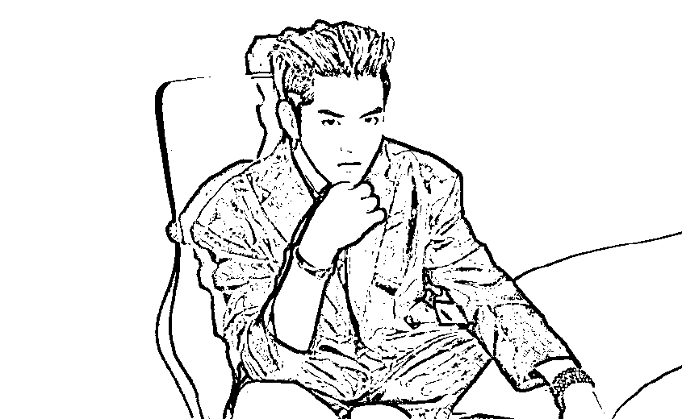*2021 年 7 月 31 日，吴亦凡因**涉嫌强奸罪**，被朝阳公安分局依法刑事拘留，案件侦办工作正在进一步开展。****房祖名***

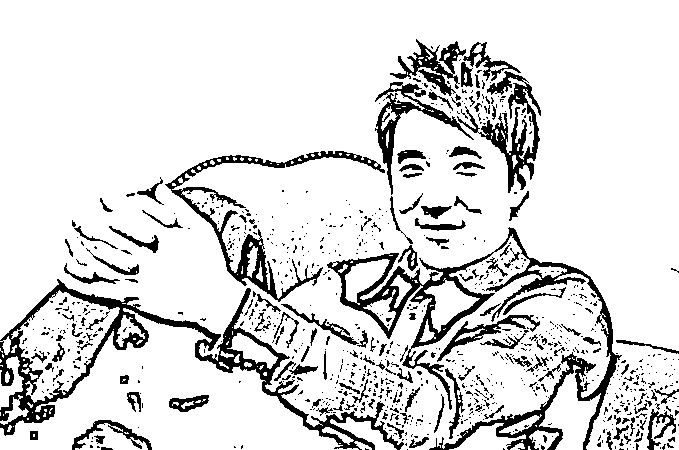

*2014 年 8 月 14 日，北京警方在东城区将艺人房祖名、柯震东等**涉毒**人员查获。房祖名因**涉嫌容留他人吸毒罪**被刑事拘留。后被判处**有期徒刑 6 个月，罚金 2000 元。*

***尹相杰***

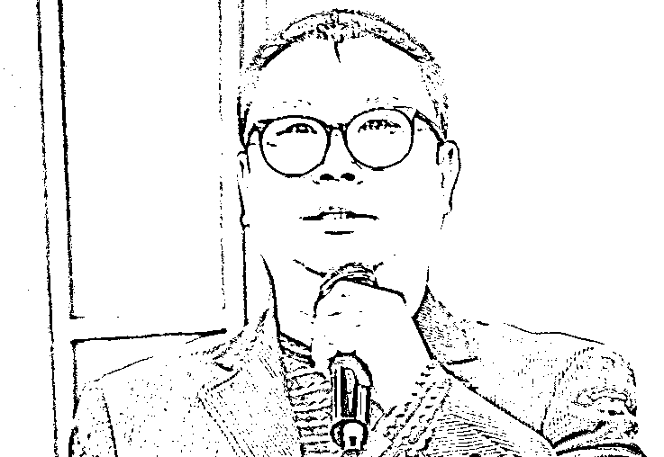

*2014 年 12 月 25 日尹相杰因**涉毒**被抓。后被**判处有期徒刑 7 个月，罚金 2000 元。2015 年**11 月 12 日，尹相杰**又因吸毒被抓**。*

***李代沫***

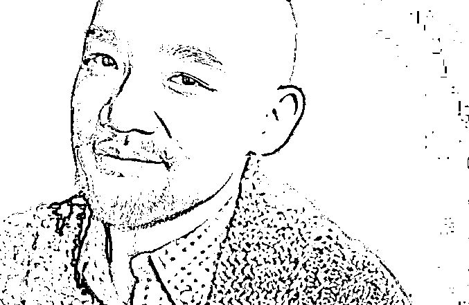

*2014 年 3 月 17 日，北京市公安局禁毒总队会同朝阳分局查获一个**吸贩毒团伙**，抓获 8 名嫌疑人，其中包括李代沫。之后，**李代沫**因容留他人吸毒罪**获刑 9 个月，并处罚金 2000 元。*

***宁财神***

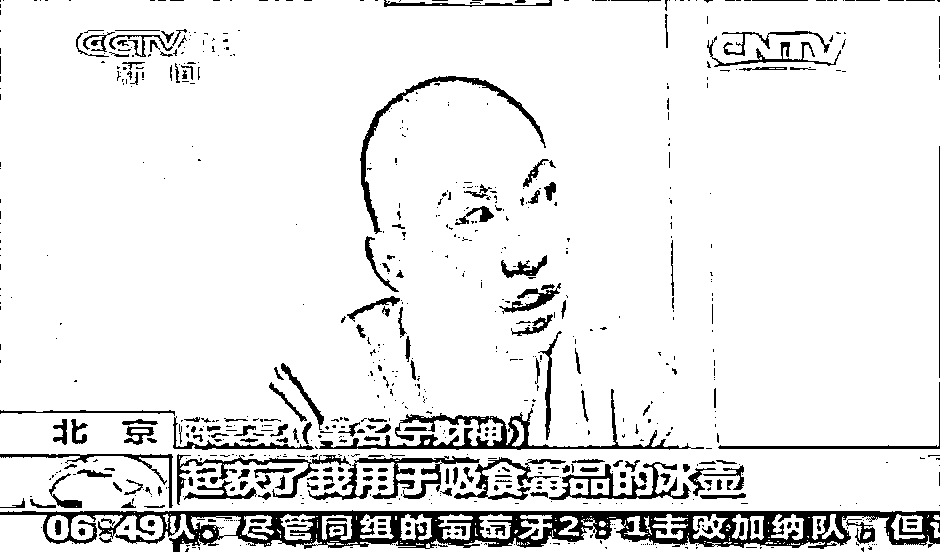

*2014 年 6 月 24 日，北京市公安总局禁毒总队会同朝阳公安分局，在朝阳区工体北路一公寓内将**涉嫌吸食毒品**的宁财神查获。最终宁财神被行政拘留 15 天。*

***毛宁***

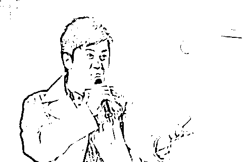

*2015 年 11 月 27 日，北京警方在朝阳某小区查获**涉毒**人员毛宁。*

***陈羽凡***

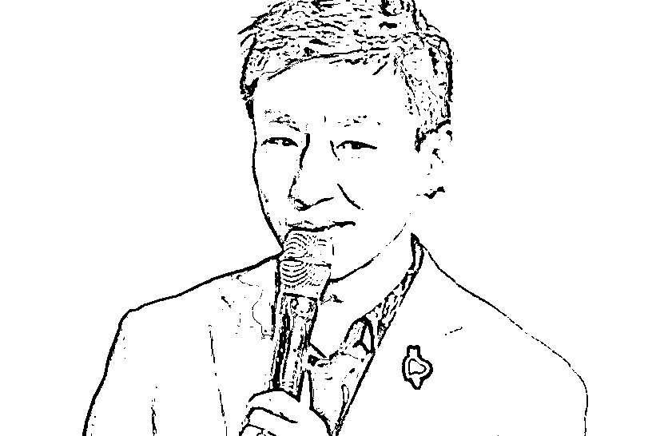

*2018 年 11 月 26 日，羽泉组合的歌手陈羽凡**涉嫌非法持有毒品**被北京市石景山公安分局依法拘留。*

***傅艺伟***

*2016 年 2 月 26 日，傅艺伟因**涉毒**被北京警方带走，后被警方处以行政拘留。*

***高虎***

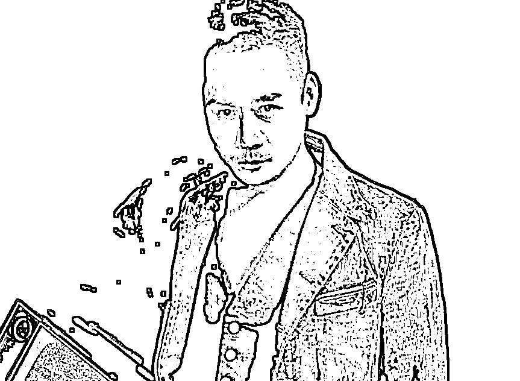*2014 年的 8 月 4 日，北京警方在朝阳区将**涉嫌吸食毒品**的演员高虎等 4 人查获。*

***张耀扬***

*2014 年 7 月 2 日，北京市公安局禁毒总队与朝阳分局在朝阳区某酒店内将**涉嫌吸毒**的张耀扬查获。*

***张默*** 

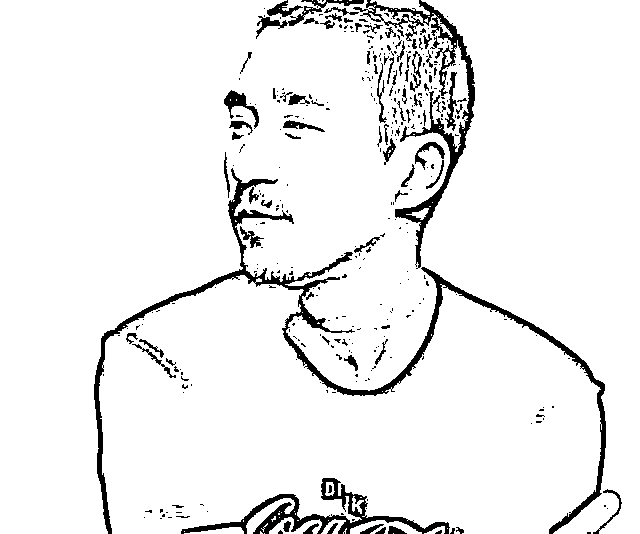

*• 2012 年 1 月 31 日，顺义警方接到群众举报，随后在天竺别墅区内抓获**涉嫌吸食大麻**的张默。**• 2014 年 7 月 29 日，张默因**吸毒**再次被北京警方查获，对吸食大麻的违法事实供认不讳。**• 2015 年 1 月 27 日，张默**容留他人吸毒罪**获刑 6 个月罚金 5000。*

***黄海波***

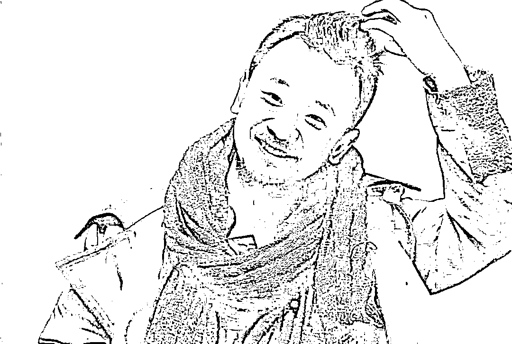

*2014 年 5 月 15 日，黄海波因**嫖娼**被北京警方抓获，行政拘留十五日后被转为收容教育 6 个月。*

***宋冬野*** 

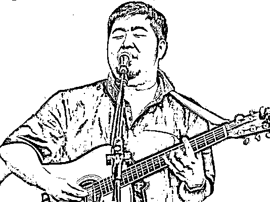

*2016 年 10 月 13 日，著名歌手宋冬野因**涉毒**被北京警方控制。*

***莫少聪***

*2011 年 4 月 15**日，香港演员莫少聪因**涉嫌****吸毒**，*被北京警方*在朝阳一居民区查获。*

***柯震东***

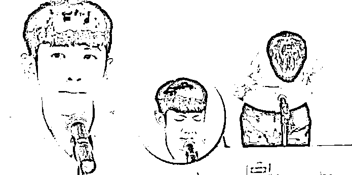

*2014 年 8 月 14 日，北京警方在东城区将艺人房祖名、柯震**东等**涉毒**人**员查获。柯震东因吸食毒品被行政拘留 14 天。*

来源：清晨阅读

← 向右滑动与灰产圈互动交流 →

