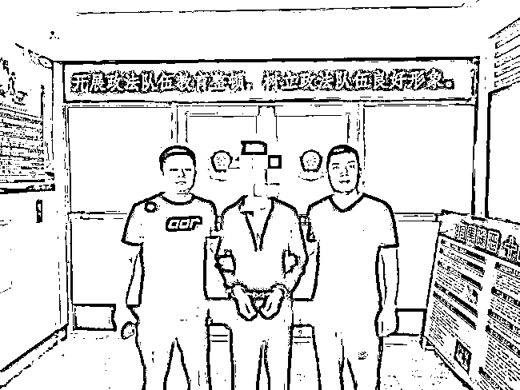
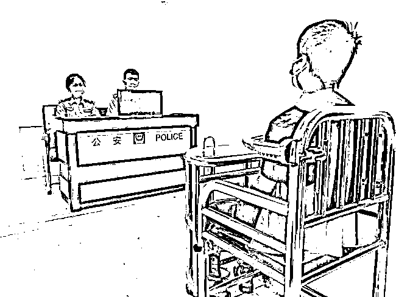

# 电诈洗钱遭黑吃黑赔了 13 万，偷渡出国欲翻盘最后一场空！

> 原文：[`mp.weixin.qq.com/s?__biz=MzIyMDYwMTk0Mw==&mid=2247519252&idx=2&sn=aa324ea0401b209d0c564cf849882a3b&chksm=97cb472ca0bcce3a4df5fdc50fbb26c69248f7418cbc9a32c954a4aa3d7ce36d5514d67ecea5&scene=27#wechat_redirect`](http://mp.weixin.qq.com/s?__biz=MzIyMDYwMTk0Mw==&mid=2247519252&idx=2&sn=aa324ea0401b209d0c564cf849882a3b&chksm=97cb472ca0bcce3a4df5fdc50fbb26c69248f7418cbc9a32c954a4aa3d7ce36d5514d67ecea5&scene=27#wechat_redirect)

本是事业有成的“小老板”，却做暴富梦走上电诈洗钱路，在遭遇“黑吃黑”赔了 13 万元后，王刚（化名）铤而走险偷渡到缅北继续洗钱。

面对着被人监视、压抑的生活环境，王刚不但没有赚到钱，还把自己带去的钱全部花光，无奈偷渡回国。

经过长时间的惶恐度日，心怀愧疚的王刚最终选择向警方自首。

日入数千元，“小老板”走上洗钱路

今年 25 岁的王刚原本是一个励志创业的小老板，老家在江苏徐州，后来在朋友的介绍下到了广州。

他利用自己的特长开了一家门店，平时帮人做一些小程序，每个月也有上万元的收入。

王刚平时喜欢打游戏，网上认识了不少朋友，经常有人向他咨询业务。

2019 年 3 月份，一名网友张强（化名）通过微信群添加了好友。

对方说想做个网络平台，看看能不能合作一下。王刚说了一下报价，对方觉着价格太高就没谈拢。

之后，张强时不时就找王刚聊天，一来二去就熟了。

过了一段时间后，张强问王刚有个兼职感不感兴趣，工作内容很简单，帮他收钱转账就行，每笔转账都给他 5%左右的提成。

张强说这些钱都是境外游戏厅转过来的，老板在国内收钱不方便，就想找人走个账。

王刚思考了一下，很多国家赌博是合法的，替别人收钱也不算犯法。

而且，他不用给张强交押金，钱到账以后再转账给上家，自己的工作是稳赚不赔。

他抱着试试看的心态，就答应了下来。

王刚提供银行卡号，钱款陆续转了过来，金额从一千到一万不等。

张强会将受害人的转账记录截图发过来，王刚通过手机查询是否到账。

随后，他将这些钱转到一张银行卡里，凑够 1 万或者 2 万的时候，就去 ATM 机取出现金，再通过无卡存款的方式给上线汇过去。

王刚说，自己是一个比较讲信用的人，钱款到账以后，凑够一个整数就给对方转过去。

刚开始，每笔转账大概四五千元，一次提成就两三百。“来钱太快了，比给人做平台挣太多了，”面对金钱的诱惑，王刚直接放弃了原本的网络平台业务，每天等着上线的通知。

转账的金额从开始每天几千元到后来的十几万。每天坐在家里动动手指，就能挣两三千。

面对巨大的收入，王刚也曾担心过是否来路不正。

有些受害者在转账以后，通过微信转账留言说自己被骗了，希望好心给转回去。

但张强告诉王刚，这是一些赌徒输了以后胡言乱语装可怜，王刚也没过多在意。

后来因为转账过于频繁，王刚的银行卡被冻结了，还有两万多没有取出来。

这个兼职确实来钱太快了，还是想继续干下去，就自己拿钱补上了亏空。

张强就给他想了一个办法，可以继续发展下线。

遭遇“黑吃黑”，欠下 13 万元外债

王刚学着上线一样的方式，通过网络寻找下线。

网友吴某（化姓）曾到他的公司玩过，两人有过一面之缘。

王刚问对方有没有卡，只要转账就能有 2%的提成。对方说自己有渠道，他就把对方发展成了自己的下线。

“双方之间都是基于信任关系，也不需要交任何佣金”。

王刚说，下线收钱以后，扣留 2%的佣金转过来，自己扣除 3%后再转给上家。

事情的转折发生在 2019 年 4 月份，也就是干了一个月左右。

下线吴某干了一段时间以后，慢慢转账越来越不及时。金额累积到 7 万的时候，他开始频繁催促对方转账。

对方总是编造各种理由，一会说正在路上开车，还用手机拍过来一段视频证明自己，一会又说办完业务就回来。

王刚催了几次以后，对方直接把他拉黑了。

但是，自己的上线一直催这笔钱。不舍得放弃这条挣钱路，王刚拿出所有的积蓄，又跟亲戚朋友借了 4 万，凑够了 7 万元给了上线。

王刚说，这些钱来得太快，很多都被自己挥霍了。

虽然被骗了 7 万，但想着每天收入不少，很快就能赚回来。

同时，他也在想方设法寻找下线，找到对方以后钱款早就被挥霍一空，留下一张欠条后不了了之。

有了这次的教训以后，王刚不甘心被骗。

他通过朋友的介绍，又认识了浙江的一个朋友宋某（化姓）。

宋某一开始不愿来，王刚给他订好机票在广州见了面。

朋友一开始也提示要小心，但王刚觉着疑人不用，用人不疑。

让他没想到的是，对方收了钱以后也把他拉黑了，6 万元被坑走。“很多钱都是借了别人的，总想着继续干下去就能快速回本”，王刚狠了狠心跟朋友借钱，按照约定转给了上家。

王刚说，他一共发展过 4 个下家，虽然挣了点钱，但是大部分被自己挥霍一空。

两次被骗了 13 万，差不多有 10 万元是从亲戚朋友那里借来的。

“赌徒”心态的王刚琢磨着如何才能回本，这个时候上线张强又给他指了一条“出路”。

日赚过万发财梦，冒险偷渡“干大活”

上线张强跟王刚说，如果想每天的金额更大一点，要么交 5 万元押金，要么偷渡去缅甸跟他一块干。

被人骗了两次以后，王刚担心自己的押金也被骗走，再加上自己欠了一屁股外债，考虑了一下，最后选择偷渡到缅甸干一笔大的。

上线承诺，到了缅甸以后，每天的转账金额可以达到几十万，而且佣金的提成也高，大概 8%。

王刚算了一下，如果情况好的话，每天收入至少过万。

自己去缅甸干个十几天，捞回本来以后就回国不干了。

2019 年 4 月底，王刚跟上线张强取得联系，在对方的安排下，开车到了缅甸边境。之后有接头的人引导，他开始了自己的偷渡旅程。

“听到一点声响都心惊肉跳，”王刚心里虽然有过准备，真正在山林里穿行，去往一个陌生地方的时候心里还是非常害怕。

王刚一直安慰自己，只需待个十几天，把赔进去的 13 万赚够了就回国，之后就洗手不干了。

身居“黑店”被人监视，生活压抑无规律

本以为过了铁围栏，出了国境就自由了，但是接下来的日子，并不像王刚想得那样好过。

在接头人的带领下，王刚赶到缅甸北部小勐拉城内，并入住到一家酒店内。

就在酒店的楼下，王刚第一次见到了张强。

据王刚回忆，张强是一名 90 后安徽男子，从对方的言谈举止以及对当地环境的熟悉程度来判断，张强干这一行已经有个两三年了。

当晚，张强带着他到当地的一家 KTV 唱歌，KTV 里让王刚大开眼界，“那些人有吸毒的，有赌博的。”

作为一个“新来的”，王刚显得很老实，他并不想引起这些人的过度关注。

双方深入沟通后，王刚曾经以为张强会让他加入到一个团伙中，或者去一个比较大的窝点，但是，张强似乎对他不是很放心，还是让他住在酒店内。

同时，张强还安排了另外一名男子和王刚同住一个酒店，除了配合王刚洗钱外，该男子还在暗中监视着他，每天向张强汇报王刚的行踪。

每天起床后，王刚就开始洗钱，“进钱收钱，进钱收钱”。

干完活后，为了打发无聊的时间，王刚就去游戏厅打游戏机，游戏机玩腻了，再到附近市场溜达溜达，在浑浑噩噩中消遣时间。

王刚所在的位置白天挺荒凉，晚上人多，他住的酒店有四五层高，里面住的什么人都有，“诈骗的、卖淫的、赌钱的，到处都是犯罪”。

作为一个没有“身份”的人，人生地不熟的王刚心中满是孤独、空虚、压抑，同时还掺杂着紧张、恐惧。

4 个月啥钱没挣到，想靠赌博“拼一把”

本以为出境后会挣到大钱，但实际并不顺利。“有时候一天几万，有时候十多万，一天挣个一两千，干了五六天就不好干了，挣的钱也不多，慢慢地开始不够花的了。”王刚说，在境外洗钱的日子里，所有的生活费用都是他自己支付，仅吃住的费用一天就三四百元。

在境外期间，王刚没有接触过张强的核心团伙，对他们的核心信息了解很少，只是隐约打听到这个团伙应该有四五十人。

他们通过特殊渠道，购买一些浏览过网贷平台或借款网页的信息，这些信息里有提交过的手机号码，这种号码“几块钱一个”。

团伙买完之后挨个打电话，向受害者推荐贷款，有人想贷款后就加 QQ，诈骗分子给他们发一个链接，下载 APP，而这个 APP 是该团伙制作的假 APP。

受害人想借多少钱，诈骗分子在后台操作审批。

“手续费 600 元，交钱后，团伙成员在后台改错当事人的一个身份证号码，然后再以修改手续费，让受害人交两三千元，反正各种借口一直要钱，直到受害人给不出钱或者发现上当，他们会删掉受害者。”王刚说。

除了这种贷款诈骗，他还听说过不法分子冒充女网友和受害人谈恋爱，之后引导玩期货、彩票、股票等，先让受害人尝点甜头，之后输个大的。

“那里的电诈团伙不少，多的几十号人，少的也就两三个人。没事出去溜达的时候，经常遇到这些人。”王刚说，他在上线的介绍下，曾接触过一个驻扎在山里的小团伙，**他们所处的位置较为偏僻，生活条件也很简陋，但是为了诈骗，那些人从不叫苦**。

“在缅北的 4 个月时间内，洗钱的时间一个多月，其他的时间都在那边玩了。当时没赚着钱，之所以迟迟没有回国，是因为当地赌博的多，想碰碰运气，看能否通过赌博赚一笔再回国。”王刚说，但是最终竹篮打水一场空。

偷渡回国惶恐度日，心怀愧疚向警方自首

“在那里玩了几个月，觉着没意思了，也赚不到钱，而且国内的女儿也快出生了，就想到回国。”下定决心后，王刚再次通过偷渡的方式，潜入到国内。

在偷渡过程中，王刚心里非常紧张，但是想到在境外的时间越长，风险就越大，他还是掏空口袋，花大价钱偷渡回国。

“如果我当时不误入歧途，不走上这条洗钱的道路，也许我现在在广州小有成就了。我非常后悔，骗子骗来的这些钱都是来自普通人的钱。我现在的想法就是，天上掉馅饼的事不要干了。”王刚说，他通过洗钱先后赚的钱只有三四万元，但是搭进去了 13 万元。

“一点违法的心思都没有了，有了小孩什么都不想了。”回国后，王刚在家看了大半年的孩子，因为没有生活来源，他和朋友摆过水果摊、蔬菜摊，也做过二房东。“只想尽自己最大努力补偿家人”。

2019 年 2 月份，一名外地来青岛打工男子报警称，他在网上办理贷款的时候，被对方以交手续费、流水费、解冻费等各种理由，诈骗了两万多元。

民警第一时间展开工作，通过层层研判和到外地摸排，落实了当时一部分嫌疑人的身份，陆陆续续抓捕到洗钱团伙的几名嫌疑人。

根据团伙供述上线的信息，最终锁定参与洗钱的王刚。

在强大侦查压力下，王刚主动投案自首。

“直到自首，家里人才知道我洗钱的事。我希望通过自首，主动交代，改过自新，弥补自己犯下的错。”王刚说。

来源：半岛全媒体

← 向右滑动与灰产圈互动交流 →

