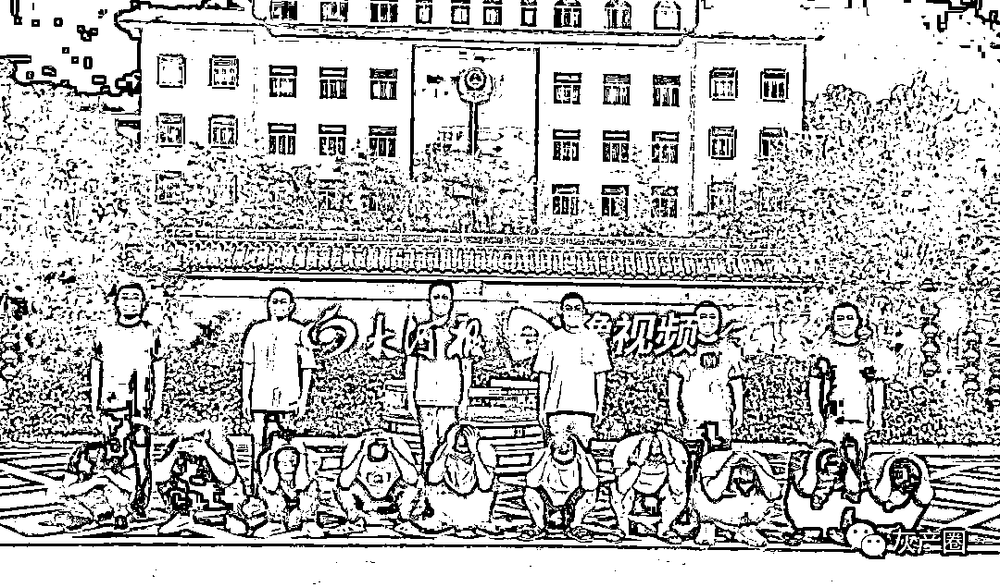
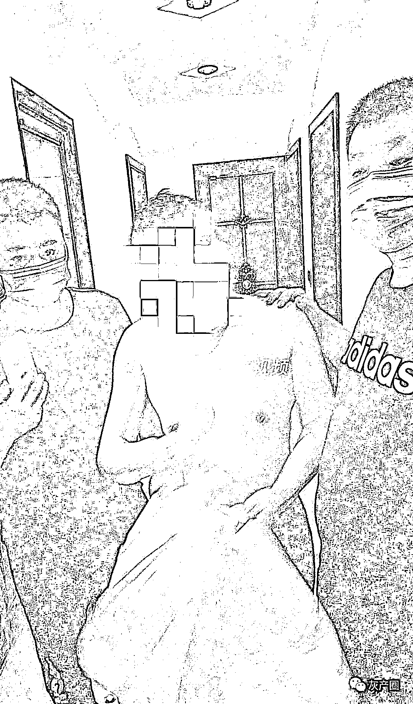
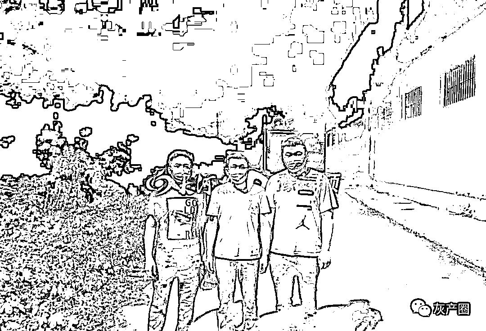
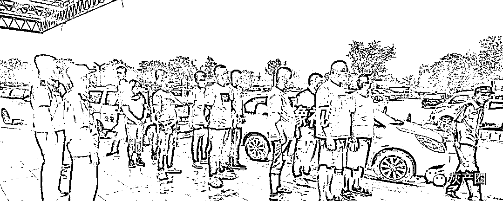

# 一伙人下乡收银行卡，帮国外电信诈骗团伙洗钱，涉案 1000 多万，被警方“团灭”

> 原文：[`mp.weixin.qq.com/s?__biz=MzIyMDYwMTk0Mw==&mid=2247519252&idx=3&sn=ca50e250252e3f740763bb40b6f3db1a&chksm=97cb472ca0bcce3abddd3ba7d341bdde33b320afab748ea8d4a88db71f71b914942497da54e3&scene=27#wechat_redirect`](http://mp.weixin.qq.com/s?__biz=MzIyMDYwMTk0Mw==&mid=2247519252&idx=3&sn=ca50e250252e3f740763bb40b6f3db1a&chksm=97cb472ca0bcce3abddd3ba7d341bdde33b320afab748ea8d4a88db71f71b914942497da54e3&scene=27#wechat_redirect)

8 月 19 日，顶端新闻·大河报记者从新密市公安局获悉，一个藏匿在当地与境外分子勾结从事收贩银行卡、洗钱的犯罪团伙被该局打掉，高某、刘某、肖某等 15 名犯罪嫌疑人被抓获，查获涉案银行卡 80 余张，涉案价值高达 1000 多万元。

棋牌室里抓了一个网上逃犯

8 月 14 日，新密市公安局巡特警大队民警在市区一家棋牌室内进行检查时，发现一伙人在里面玩耍。民警在核实他们的身份时，发现其中一名姓冯的男子，竟是被重庆警方上网追逃的涉电信诈骗的嫌疑人冯某。

在抓捕冯某时，与冯某在一起的几名男子神情十分紧张，这引起了民警的怀疑。民警将该情况反馈到局刑侦大队后，刑侦大队立即对这几人进行调查，发现他们与冯某的关系非同寻常，与刑侦大队正在侦查的一起网络电信诈骗案件有交叉。经过进一步侦查，这些涉案人员多为超化镇人，近期银行卡的开卡时间比较集中。民警判断，这其中可能存在一个专门为电信诈骗提供“两卡”的犯罪产业链。

仅用 36 个小时，团伙 15 名成员全部落网

为尽快查明此案，避免更多的银行卡、手机卡流入犯罪分子手中用于电信网络诈骗，新密市公安局迅速组织该局刑侦、巡特警、法制、案审等部门的精干警力成立专案组，多方位进行摸排。

通过对冯某等人进行突击讯问，发现该团伙头目为三名外地男子，其中一人为带队，下分两名卡商，每个卡商到所负责的乡村发展二级卡商，再逐级向下渗透，寻找开卡人。该团伙层级分明，为逃避打击，作案时单线联系，收卡后当面付款，随即使用，速度快、分布广，有很强的反侦查意识。

通过全面收集证据、固定案件相关资料，办案民警经过 36 小时的不间断奋战，陆续将以高某、刘某、肖某为首的 15 名犯罪嫌疑人抓捕归案。

在大量证据面前，高某等犯罪团伙成员对自己所犯罪行供认不讳。据高某供述，自 2021 年 7 月份以来，因汛情和疫情防控措施严密，导致该团伙收售银行卡、手机卡十分困难。

近段时间，境外上线不断催促他们交卡，他们便准备以“扫镇扫村”方式，在新密市每个乡镇的每个村开展收卡业务。短短一周时间内，该团伙以高额获利为诱饵，发展了一些二级下线，收到 12 人银行卡 30 余张，为境外网络电信诈骗团伙转账洗钱 1000 多万元。

目前，该案 15 名犯罪嫌疑人均被新密市公安局依法采取刑事强制措施，案件正在进一步办理中。

来源：大河报，利箭在行动

← 向右滑动与灰产圈互动交流 →

