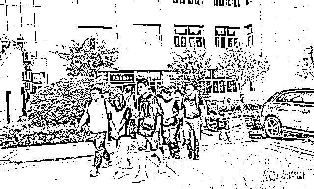
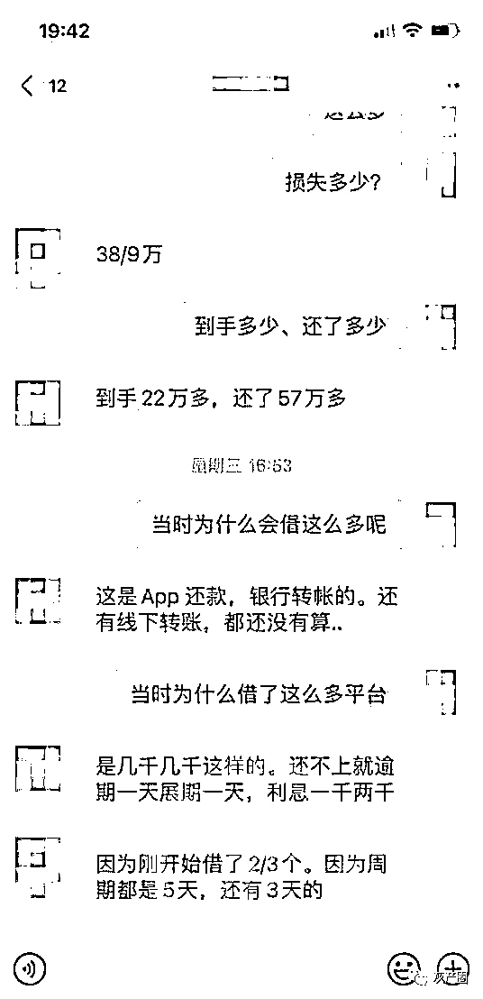
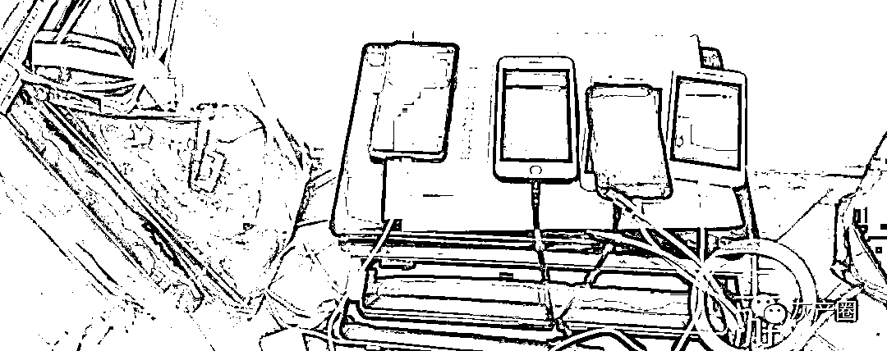
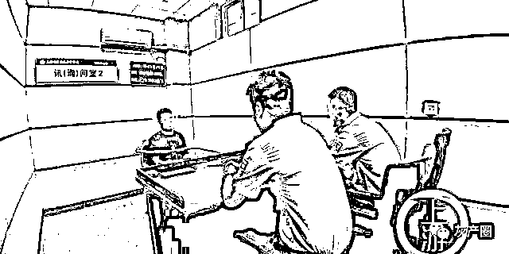

# 猖狂！86 人操控 23 个贷款 APP，一年诈骗 6.3 亿，恐吓女被害人，发裸照催债

> 原文：[`mp.weixin.qq.com/s?__biz=MzIyMDYwMTk0Mw==&mid=2247519252&idx=5&sn=db65cd6df2d22e3a2eae69c2b6a9b7eb&chksm=97cb472ca0bcce3a359d4991f3541c4287ced744067fc07e55f100b00972ae256a0381144647&scene=27#wechat_redirect`](http://mp.weixin.qq.com/s?__biz=MzIyMDYwMTk0Mw==&mid=2247519252&idx=5&sn=db65cd6df2d22e3a2eae69c2b6a9b7eb&chksm=97cb472ca0bcce3a359d4991f3541c4287ced744067fc07e55f100b00972ae256a0381144647&scene=27#wechat_redirect)

“通过工商登记查询、入侵贷款平台软件等方式获取到有过借款记录的客户信息后，我就会通过电话号码添加微信，然后推荐他们下载 APP 借钱。”一句简单的供述，背后却隐藏着一个涉案 6.3 亿元的网络贷款诈骗团伙。落网后警方发现，仅运营一年时间，就已在全国 1 万多人落入网贷诈骗陷阱。 

8 月 19 日，上海市公安局公布了这起利用网络借贷实施诈骗案件的办案情况，记者了解到，案件共涉及到 23 个贷款 APP，参与诈骗人员达 86 人，目前违法 APP 均已被关闭。

▲7 月 22 日，86 名犯罪嫌疑人在五地相继落网。图片来源/上海警方

借新还旧 上海女子被逼卖房还债

今年 2 月，上海市的汪女士收到一个陌生 QQ 号添加好友。聊天中，对方推送“是否有资金需求？不要求征信，放款快” 的广告引起了汪女士的兴趣。

在对方的指引下，汪女士下载了一款名为“大南瓜”的贷款 APP，根据要求上传身份证照片、联系方式等资料后成功贷款 2000 元。但汪女士发现，放款实际金额只有 1400 元。借到第一笔钱后，汪女士又陆续在该平台借了几次款，前后加起来在万元左右。

随着还款时间到来，汪女士意识到，高额的服务费和极短的还款期限让她无法承担。此时，该团伙开始违约变更还款时间，并在汪女士逾期后开始每天收取 20%的展期费。与此同时，汪女士的微信、QQ 上不断出现陌生人添加好友，并向她推荐了“爱吧”“爱疯”“借贷宝”等十余个借贷 APP，引导她借新还旧。仅两个月的时间，汪女士的欠款就达到了 147 万元。

期间，汪女士自己和亲戚、同事、朋友不断收到骚扰电话，在清明节时还收到了讣告和恐吓信息。不堪其扰的汪女士只能将房子卖掉偿还债务，并向警方报案。警方调查发现，汪女士的遭遇并非个例，还有受害人遭遇了半夜电话骚扰、向女性被害人恐吓发送 PS 的裸照、使用“呼死你”软件进行 24 小时轰炸等催收手段。

记者获取的受害人聊天记录显示，这类贷款平台借款周期在 3 到 5 天左右，借款人看到利息计算方式和总额，借款 30 多万元，然而到手仅 22 万元，本息加起来要还款 57 万元左右，逾期一天利息就要收取一到两千元。

▲聊天记录显示，贷款期限在 3 到 5 天，逾期一天就要收一两千元利息。图片来源/上海警方

精准挑选客户，86 人一年诈骗 6.3 亿

在梳理该团伙的 41 个银行账户后警方发现，该团伙不仅有运营团队负责维护多款网络贷款 APP，还存在一个为涉案 APP 提供资金结算的团伙。

办案民警介绍，涉案 APP 的开发和维护是江苏省的一家科技公司，其法定代表人顾某龙开发多款 APP 后，寻找以郑某、杨某苗等为首的“贷款运营团伙”进行网上推销，寻找目标诱骗其安装 APP 进行贷款。同时，顾某龙又寻找晏某、赵某等人为首的“支付结算团伙”进行资金转移及结算，以实现规模化结算资金及快速转移资金。

7 月 22 日，上海警方在五地警方的配合下，抓获该团伙成员 86 人，当场查获作案手机 200 余部、电脑 60 余台、车辆 10 余部。

▲警方在现场查获手机 200 余部、电脑 60 余台。图片来源/上海警方

经查，该犯罪团伙的作案过程全部在网上远程操作实施，郑某、杨某苗等人先以线上办理“短期无抵押贷款”为诱饵物色贷款人，实际以收取高额“服务费”的方式进行放贷。一旦借款人无法如约偿还，便通过“借新还旧”及引导收取展期费（延长归还时间的手续费）等方式诱导借款人继续借钱，并配合电话轰炸、滋扰辱骂等“软暴力”索债方式施压。

“很多借款人在安装 APP 时不知不觉中就已授信获取通讯录信息及被收取了高额‘服务费’，实际拿到钱款仅为所申请款额的六至七成左右，却又被要求短期内全额还款。而当借款人偿还不出时，又会被收取每天 20%的展期费，这一点被害人事先并不被告知。”奉贤区公安分局刑侦支队民警郭宇表示，这些贷款 APP 均掌控在犯罪团伙手中。

▲嫌疑人供述称，放款会选择精准优质客户，并通过盗取其它平台用户信息获取资源。图片来源/上海警方

如何保证营销成功并能回款？

负责 APP 营销的犯罪嫌疑人郑某称：“我们通过技术黑入其它借款平台，会获取到该平台有借款及还款记录的优质客户，并进行筛查。比如我们查询到有客户近期在借款平台有过借款和还款记录，那大概率是有借款需求。我们不会随意营销，如果随便营销说不定会营销到警察、老人或小孩。所以不仅要精准还要保证还款安全。”

而另一名营销人员杨某苗则表示，允许放款的名单都是老板提供的优质客户，只有名单上的人员才可以放款，不在名单上的不放款。

记者了解到，2020 年 4 月起，该团伙成员各自筹集几十万资金不等开始作案，至案发前，涉案金额已达 6.3 亿元。案发后，已查证到全国各地被害人 1 万余名，由该团伙开发的蓝蜻蜓、青苹果、小超人、大南瓜、红魔方、爱疯、快吧、皮皮虾、一家、爱吧、红梅子、窝尔窝、斑头雁、二郎神、大将军、谷雨、金雕、金戒指、水晶杯、铁观英、大富豪、银杏树、爱玛狮等 23 个网贷 APP 平台均已被关闭。目前，以顾某龙、郑某等人为首的 86 名犯罪团伙成员因涉嫌诈骗罪、帮助信息网络犯罪活动罪，均已被依法采取刑事强制措施，案件正在进一步审理中。

来源：利剑在行动、反欺诈金钟罩、反诈骗先锋

← 向右滑动与灰产圈互动交流 →

