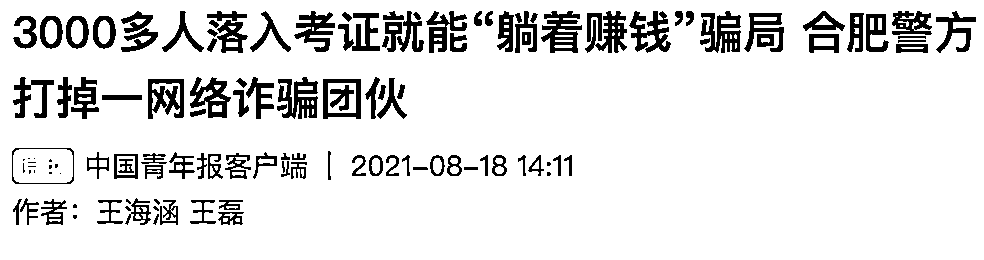

# 考这些证能轻松“躺赚”？3000 多人中招！两个套路曝光……

> 原文：[`mp.weixin.qq.com/s?__biz=MzIyMDYwMTk0Mw==&mid=2247519252&idx=6&sn=d946bad4825dd8d745c60b8354258ce7&chksm=97cb472ca0bcce3af62fa1d8a6b15af38e7210abfd8418359d13a41e036692e474dd8993eb79&scene=27#wechat_redirect`](http://mp.weixin.qq.com/s?__biz=MzIyMDYwMTk0Mw==&mid=2247519252&idx=6&sn=d946bad4825dd8d745c60b8354258ce7&chksm=97cb472ca0bcce3af62fa1d8a6b15af38e7210abfd8418359d13a41e036692e474dd8993eb79&scene=27#wechat_redirect)

**考证轻轻松松年入 8 万？**

**考不过全额退学费！**

这样的套路熟悉吗

近日

安徽合肥警方曝光了

**一起特大电信网络诈骗案** 

**↓↓↓**

案件涉及全国**25 个****省市**

受害者多达**3000 余人**

涉案金额**800 多万元**

落网犯罪嫌疑人**43 名**

**考证就能“躺赚大钱”？**

记者了解到

2021 年 6 月

合肥经开公安分局接群众报警

称在网上**报考健康管理师证**

**被诈骗 21380 元**

经警方缜密侦查

**一个犯罪团伙浮出水面！**

该团伙设立培训机构，诱骗受害人

报考健康管理师、营养师、心理师证等

“国家权威部门认证”的证书

收取**报考费甚至包过费** 

**套路①**

**“躺赚大钱”诱人“充值”**

当受害人与之联系后

犯罪嫌疑人

以证件有国家资质、

安排到医院或体检中心就业、

挂靠公司年入上万元、

不过包退学费等“花言巧语”

诱骗受害人

**套路②**

**“假照 P 图”包你“放心”**

与此同时

为了让受害人进一步打消疑虑

该团伙还特别制作统一的“图片”

如“学员”在优渥环境中工作

或收到挂靠公司打款的截图

以欺骗受害人

事实上 

受害人实际取得的证书含金量很低

多是由行业协会颁发

仅需**几百元**就可报考

**“挂靠”就可拿钱**更无从说起

**“包过”“躺赚”不可靠**

记者注意到

近年来 

**类似的诈骗案件频发**

所谓“包过”“包退”“挂靠”

被不法分子吹得天花乱坠

**反诈民警提醒**

 **   一分耕耘一分收获，学习考证没有捷径可走。浏览宣传广告时，请多方核实真伪，切勿盲目相信。**

来源：中国青年报、合肥警方、中安在线、昆明反电信网络诈骗中心

← 向右滑动与灰产圈互动交流 →

