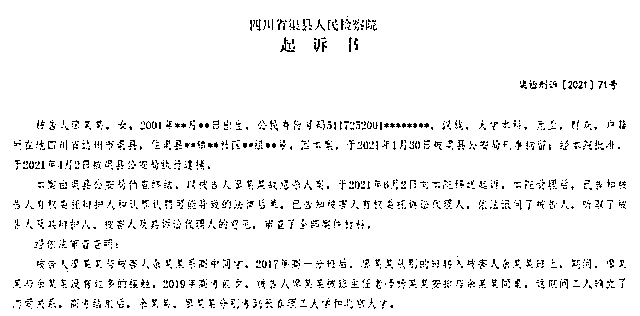
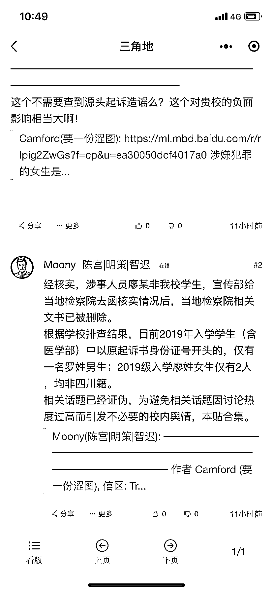

# 乌龙？传北大女生网上雇凶谋害前男友被起诉，检察院：我们搞错了，不是北大学生

> 原文：[`mp.weixin.qq.com/s?__biz=MzIyMDYwMTk0Mw==&mid=2247519252&idx=7&sn=17445a2928653d42f15e3d381b77a714&chksm=97cb472ca0bcce3a02f05c38f2752375aacc3f53a9dc583bb27e935e0fca94e160037ac2e344&scene=27#wechat_redirect`](http://mp.weixin.qq.com/s?__biz=MzIyMDYwMTk0Mw==&mid=2247519252&idx=7&sn=17445a2928653d42f15e3d381b77a714&chksm=97cb472ca0bcce3a02f05c38f2752375aacc3f53a9dc583bb27e935e0fca94e160037ac2e344&scene=27#wechat_redirect)

8 月 19 日，有新闻媒体援引 12309 中国检察网报道，一名北大女学生廖某某因与男友分手后，意图杀害该男生，并在网上雇凶将男友捅伤。报道引发关注，不过有消息传出，北京大学方面经过核查并没有这名学生。

8 月 20 日，记者从四川达州渠县人民检察院方面获悉，目前他们已经复函北京大学，此事确实是他们搞错了，廖某某并非北大学生。

**一女学生因分手网络雇凶杀人，起诉书称涉事女学生为北大学生**

根据此前 12309 中国检察网的起诉书，涉嫌犯罪的女生是廖某某，四川达州渠县人，2021 年 1 月 30 日被警方刑拘时才 20 岁。受害人则是其前男友余某某，两人曾是高中同学，还是同桌。

据渠检刑诉（2021）71 号起诉书，廖某某与余某某系高中同学，2017 年高一分班后，廖某某从别的班转入余某某班上，期间，两人没有过多的接触。2019 年高考前夕，在班主任老师安排下，两人同桌，这期间两人确立了恋爱关系。高考结束后，余某某、廖某某分别考到长春理工大学和北京大学。

2019 年 11 月，廖某某前往长春理工大学见余某某，并在学校附近的宾馆居住约一个月时间，期间二人多次发生性关系，后二人从长春返回渠县。

2020 年新冠肺炎疫情爆发后，廖某某便一直留在余某某家中居住，期间二人又多次发生性关系。2020 年 7 月，二人因感情不和开始冷战，廖某某于是使用余某某 QQ 四处给朋友发消息称自己被余某某强奸。2020 年 11 月，廖某某前往长春理工大学跳楼自杀未遂，后经双方家长在长春市的派出所进行调解才解决纠纷。

2020 年 12 月，廖某某在网上搜索下载了一款聊天软件，并向一名叫“李齐”的纹身男子告知了自己的遭遇。2021 年 1 月 10 日“李齐”将马某某的微信推送给廖某某，她通过微信添加马某某为好友，自称“李齐”的妹妹，并提出叫马某某到渠县杀余某某一家三口，还向马某某提供了余某某的身份证号码、家庭住址、电话号码等信息。

2021 年 1 月 11 日，马某某、保某某从云南到渠县。廖某某为两人预定了宾馆，还通过微信转账支付给两人车费、饭钱以及购买作案工具的钱。随后廖某某与马某某经过协商最后约定只杀害余某某一人，后两名凶手在余某某楼下进行蹲守。

据起诉书，1 月 13 日下午 2 时 15 分许，马某某、保某某两人进入渠县某小区，并全程与廖某某视频连线，确认余某某一人在家后，二人敲开了余某某家的门，余某某从卧室出来并打开房门。马某某、保某某两人经询问确认是余某某无误后，马某某左脚踢在余某某的腹部，两人又上前持折叠匕首对余某某连捅多刀，后两人下楼，逃离路上将视频关掉并将身上沾血的外套脱掉丢弃在附近草丛内。

马某某二人在渠江大桥处乘坐出租车到达渠县火车站。廖某某则分 3 次给马某某转账 550 元用于二人购买回云南的火车票等费用。

据悉，经鉴定，被害人余某某人体损伤程度评定为轻伤二级。作案的马某某、保某某二人均为未成年人，将另案起诉，而那名叫“李齐”的纹身男子，身份仍有待调查。

廖某某归案后，有关部门对她进行了精神鉴定。今年 3 月，经过司法鉴定所鉴定，虽然廖某某有混合性焦虑抑郁障碍，但 1 月 13 日作案时具有完全刑事责任能力。

今年 6 月，渠县人民检察院对廖某某提起公诉，对于该案件，该院认为，被告人廖某某雇凶杀人，其行为触犯了《中华人民共和国刑法》第二百三十二条，犯罪事实清楚，证据确实、充分，应当以故意杀人罪追究其刑事责任。因未造成被害人死亡的后果，系未遂，应适用《中华人民共和国刑法》第二十三条，比照既遂犯从轻或减轻处罚。

**渠县检察院：我们搞错了，已经复函北大**

相关文书经媒体披露后，引发极大关注。

不过 8 月 20 日，有网络消息传出，经北大方面核实，涉事女生廖某某并非该校学生，根据学校排查结果，目前 2019 年入学学生（含医学部）中以原起诉书身份证开头的，仅有一名罗姓男生；2019 年入学廖姓女生仅有 2 人，均非四川籍。相关上网文书已经被删除。

8 月 20 日，记者致电渠县检察院，对方工作人员称，“我们搞错了，廖某某不是北大学生”。工作人员称，目前已经复函北大党委宣传部。

记者登录 12309 中国检察网，发现相关文书目前已经被删除。

来源 ：潇湘晨报

← 向右滑动与灰产圈互动交流 →

