# "人类高质量男性"粉丝群月收费 2 万 5？还被扒出约 p+杀猪盘？

> 原文：[`mp.weixin.qq.com/s?__biz=MzIyMDYwMTk0Mw==&mid=2247519406&idx=2&sn=0e0dbaf0c58fc6ad084e7c989927d7f3&chksm=97cb4796a0bcce809dacce26244a3ed08ba6c7dd9f073b68bc8ee2d3196f14159d250479135d&scene=27#wechat_redirect`](http://mp.weixin.qq.com/s?__biz=MzIyMDYwMTk0Mw==&mid=2247519406&idx=2&sn=0e0dbaf0c58fc6ad084e7c989927d7f3&chksm=97cb4796a0bcce809dacce26244a3ed08ba6c7dd9f073b68bc8ee2d3196f14159d250479135d&scene=27#wechat_redirect)

“人类高质量男性”徐勤根靠着怪异的妆容、雷人的言论出圈近一个月后，毫不意外，开始收费了：**想要进入粉丝群，一个月 2 万 5，包年 7 万 5,**在社交媒体引发争议。  

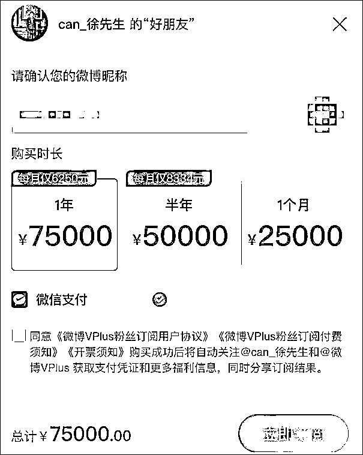

徐勤根的走红要从一则“求偶视频”说起

7 月 21 日，徐勤根在其个人微博发布的一段长达 3 分钟的视频中，自称“人类高质量男性”，介绍自己“29 岁，是国内少数高净值的男性之一，非常有潜力，智力比较高，身体素材好，有国外工作经验”，想要“求偶人类高质量女性”。

他称，自己可以给女方带来各种经济支持、精神支持，比如，不定期的财务上的支持、奢侈品、旅游可以帮忙拍照、翻译，并基于平等的前提和对方交流。

视频中，他画着惨白的妆容，戴着眼镜、头发紧贴头皮，梳着侧分，面对镜头，整个人看起来非常正式、拘谨，为了说明自己英语很好，突然来了一句，“Of course，I can speak English”。

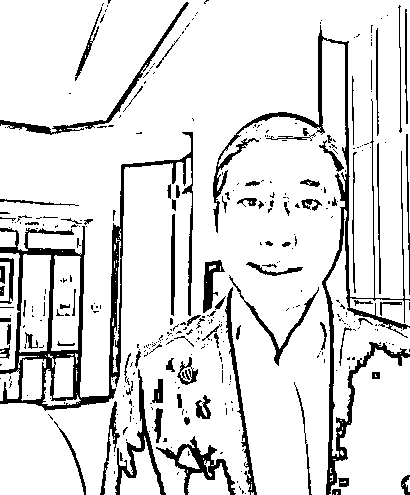

怪异的妆容、奇葩的言论、不太协调的动作，这条视频吸引吃瓜群众围观后又被搬运到各类视频平台，引发了二次“创作”，徐勤根突然红了。与此前的拘谨不同，走红后，徐勤根很自然地与粉丝们互动，不仅发布了此前“求偶视频”的英文版本，还多次重复着自己的“高质量”属性：

“我是一个正直的人，但也具备驾驭人性的能力，我从事全球资本市场投资，准确地讲是金融衍生品市场，其实准确地讲我从大一就开始接触资本市场了，到现在一直接触这块，快 10 年了吧。”

还有网友发现，徐勤根之前的微博，也无不透露着他所谓的“高质量”：五星酒店、奢侈品服饰、名表、私人飞机内拍照……

他还经常使用一个侧身半蹲的姿势拍照，走红后，他为其命名“高质量男性自拍姿势解锁”，称这个姿势“最可以体现出我们中华民族男性和女性的自信”。

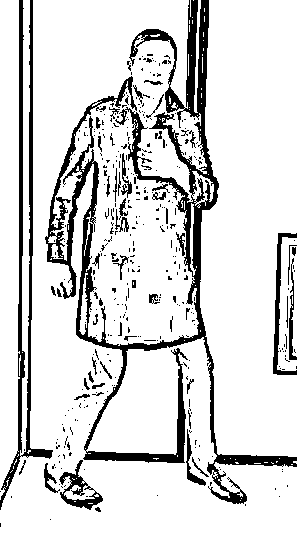

这个姿势也迅速出圈，一开始，一些网友用了同样的姿势拍照并@徐勤根，叫他“老公”，杨超越、刘涛、迪丽热巴等艺人也曾在微博拍了相同姿势的照片，并使用了“高质量”等关键词，徐勤根还与她们积极互动。

后来，不少网友开始给“高质量”加上各种后缀，“高质量玩具”“高质量舞蹈”“高质量倒追”等等。

虽然不少网友是以戏谑的姿态围观这位徐先生，但这毫不影响他的“商业之路”。虎牙直播给他开设了“求偶专场”，与各种主播连麦；

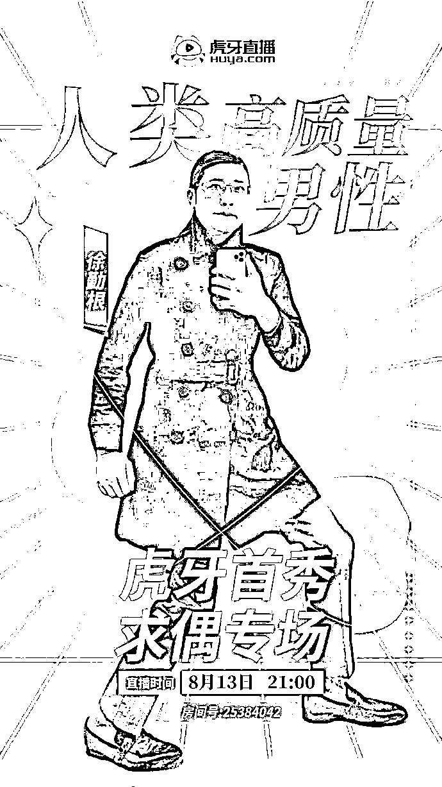

某电商平台以及啤酒厂商也邀请他做广告，目前，他的微博置顶也是一条接受商业推广的帖子。

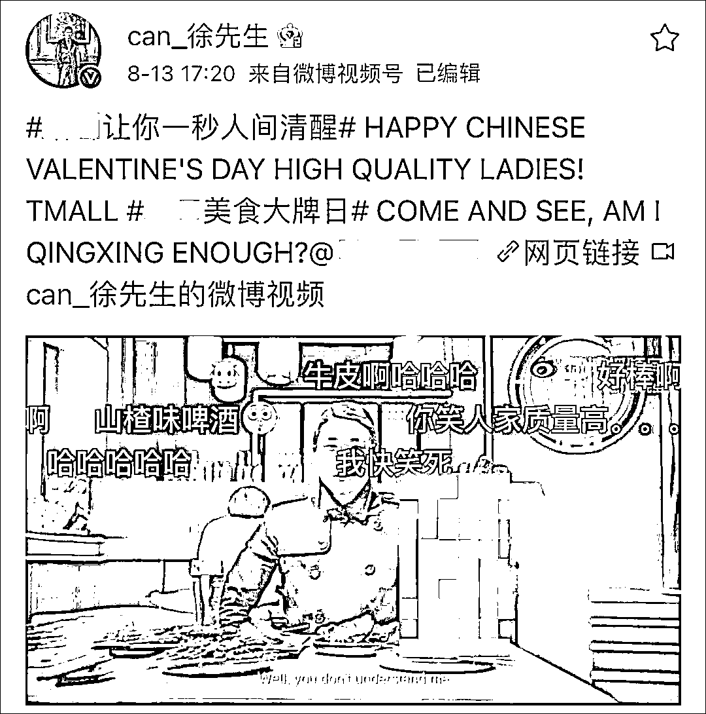

近日，又有网友爆料，**徐勤根已经开粉丝群了，而且收费还十分高昂：想要进入粉丝群，一个月 2 万 5，包年 7 万 5。**

那么，这么贵的群有什么好处呢？徐勤根称，自己可以提供高价值的金融经济信息和情报，主要涉及全球及国内金融衍生品交易方面，还可以提供咨询服务。

徐勤根还曾发帖提醒，称粉丝群价格较高，大家需要认真权衡自己的经济情况、谨慎购买。

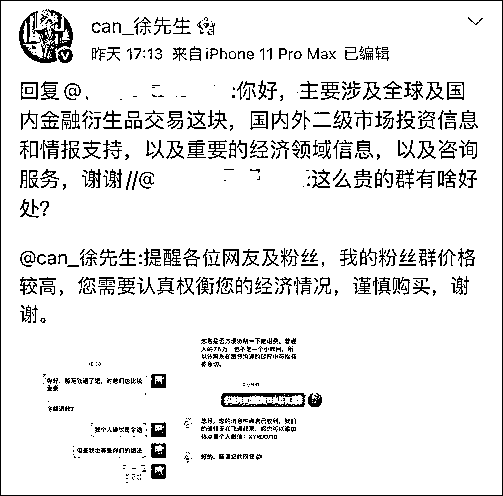

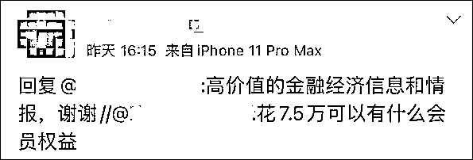

该群允许 1000 人加入，目前有 12 人。

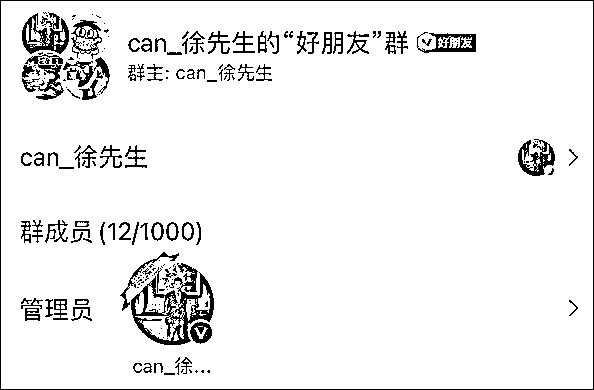

更令人诧异的是，他开始在视频里推销产品，很有可能就是个骗子。比如说他在视频里大力推的“某某集团”，

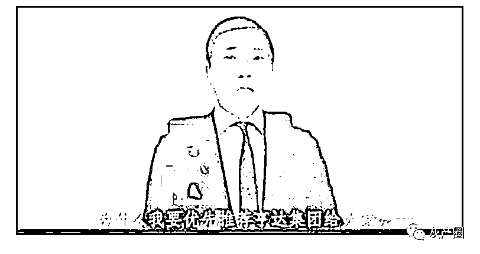

在网上随意一搜，负面消息一大堆。明显是把韭菜们往杀猪盘里引。

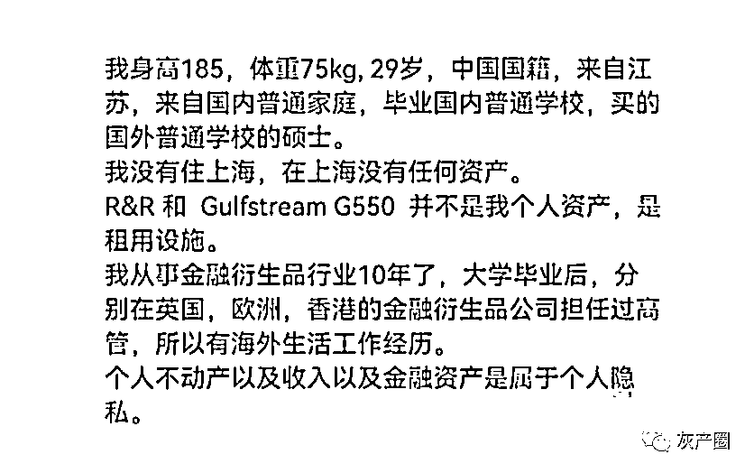

网友们更是发现他还在正常的时候，参加了智库 Horasis 举办的中国峰会，这个峰会 2017 年正好在英国谢菲尔德举办。

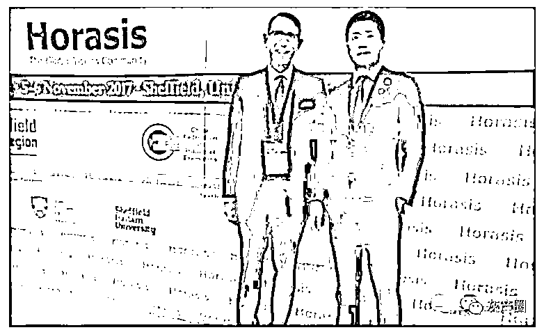

而通过 Horasis 的宣传手册也可以坐实徐勤根是 SCG 这家黑平台的创办人。

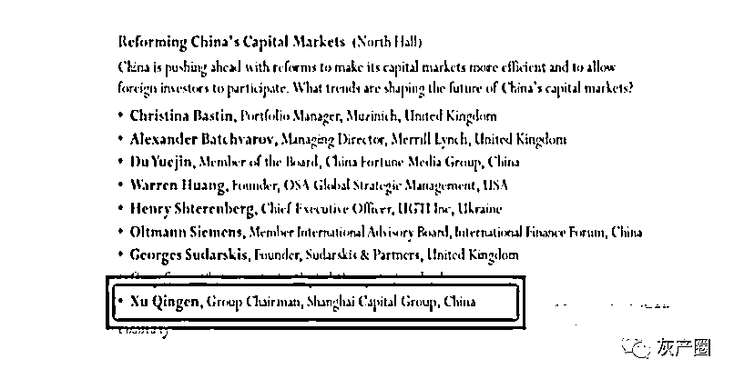

而徐勤根正是在英国注册了 SCG 这家黑平台，相关的文件可以在英国政府网站上查到，而通过注册文件可以看到，SCG 的注册资本只有 1 英镑（没错只有 1 英镑）。

实际上，在英国任何人只需要花费 15 英镑的注册费都能成立一家公司。

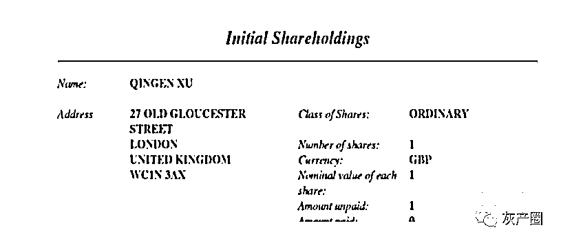

而网友们经过仔细的搜索发现，徐勤根一共担任过两家公司的高管，典型的黑平台。所谓黑平台就是未经任何部门监管的交易平台，通过虚假的高额回报吸引用户，诱使用户加大投资金额，而当用户想要提现时，却以各种理由拒绝，最终骗走用户所有的投资，也就是所谓的杀猪盘。

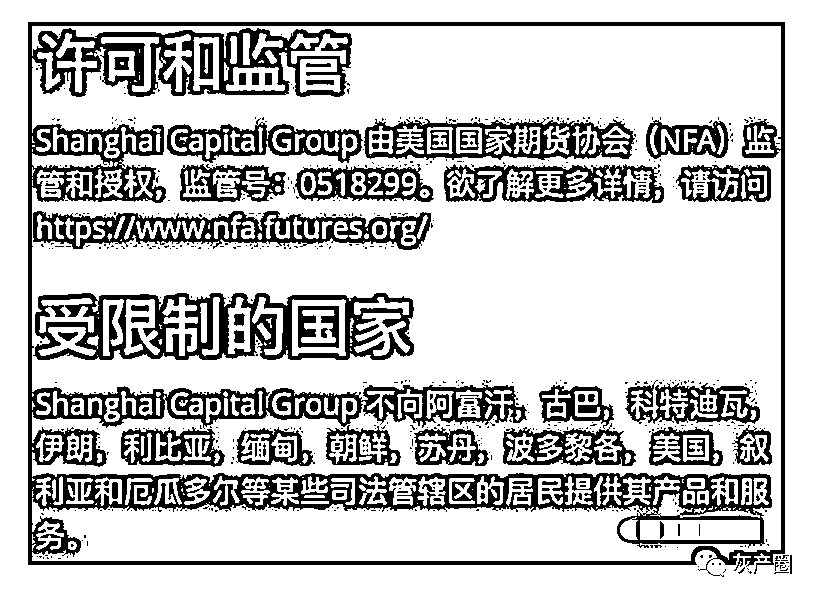

在今年 4 月份才走红时候，就爆出大量聊天记录，指责他骚扰女性。、

刚加上联系方式的网友聊天，一上来就直接要对方照片，还猥琐地发一些打擦边球的图片。

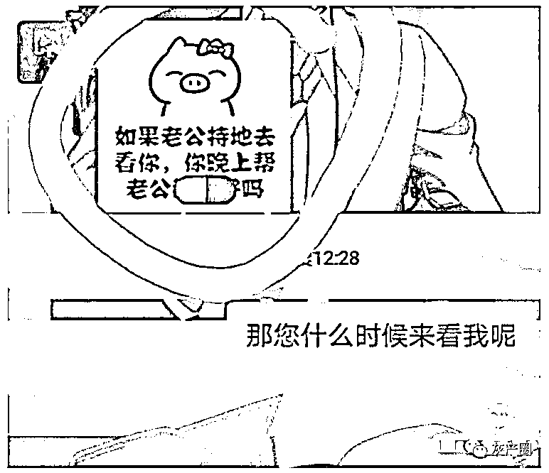

不停在网上勾搭样貌姣好的女性，声称给对方准备了很贵重的礼物，希望能够加联系方式见面。

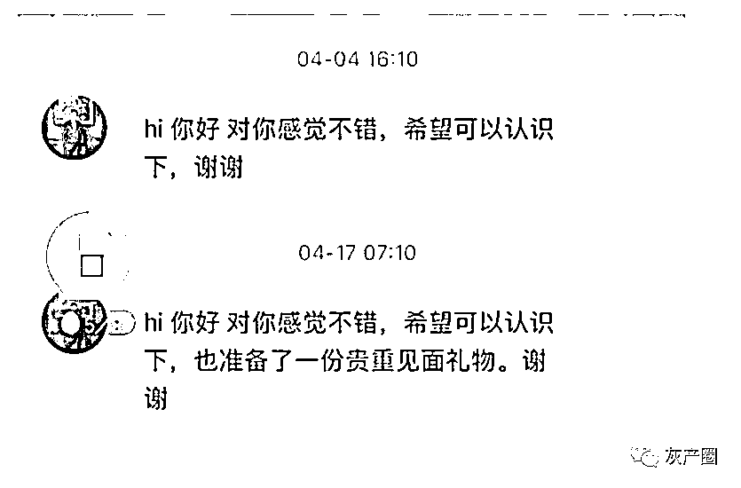

对于外貌不符合自己要求的女性，徐勤根就果断拒绝。但当他听到女方收入高，又会立马转变自己的态度，声称他有生理需求。

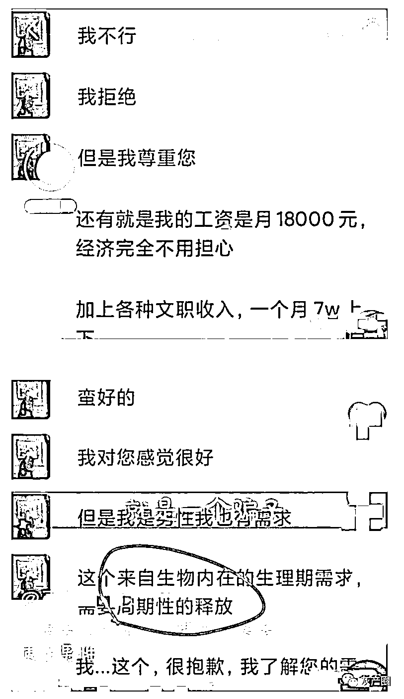

还周期性释放，也可以说自己是泰迪啊。

还有消息指出他还在网上包养网红，而女网红才只有 20 多岁的年龄，他们在背后做过什么，已经是不得而知了。

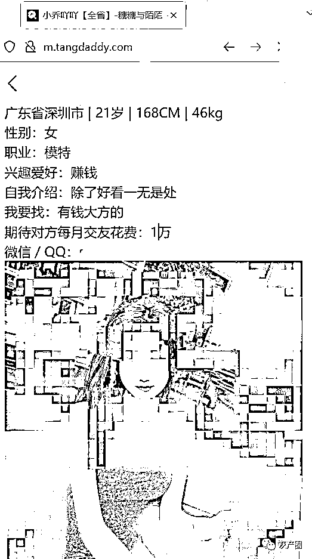

像上图勾当，他都能做得出，但是依然不碍于他成为热流网红，真是说明我们这个时代，真是过于泛娱乐化了。只要视频导向是符合情感抒发的缺口，满足个体以及社会的心理诉求，只要受众能在评论区获得评论完成自我表达，他就可以成为网红。

没人关心他做过什么，没人去考核他的品性如何。于是成千上百的明星，网红看起来冠冕堂皇的，结果反复地被扒出黑历史。网红应该牛在他能为受众提供社会价值的话题，而不是哗众取宠，长期以往老比谁更会演，只会变成一片沼泽地吧？

我们需要的是作品，而不是装傻装坏的流量。

来源：观察者网、墨秋游戏、反诈骗先锋

← 向右滑动与灰产圈互动交流 →

