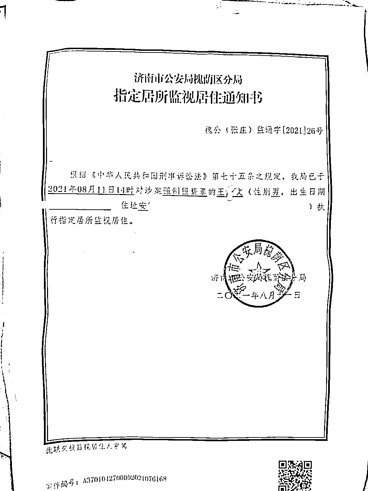

# “阿里女员工案”嫌疑人被指定居所监视居住，妻子：他是冤枉的

> 原文：[`mp.weixin.qq.com/s?__biz=MzIyMDYwMTk0Mw==&mid=2247519406&idx=3&sn=16cb0209746462ce9c67a318fe03b286&chksm=97cb4796a0bcce808d461117a7f4b7a845e9ee89dc961a87fe94c761cab51e4fb1f755893d90&scene=27#wechat_redirect`](http://mp.weixin.qq.com/s?__biz=MzIyMDYwMTk0Mw==&mid=2247519406&idx=3&sn=16cb0209746462ce9c67a318fe03b286&chksm=97cb4796a0bcce808d461117a7f4b7a845e9ee89dc961a87fe94c761cab51e4fb1f755893d90&scene=27#wechat_redirect)

**此前报道：**

[阿里巴巴女员工遭领导性侵及商家猥亵？现场视频冲上热搜！](http://mp.weixin.qq.com/s?__biz=MzIyMDYwMTk0Mw==&mid=2247518670&idx=1&sn=69f5b8ed79fe03065a7d00caeb62dab0&chksm=97cb42f6a0bccbe0bd7aae0613b9fb97367ba5a063e5cc4d173e062c13a32faa15ca0cf097b9&scene=21#wechat_redirect)

[阿里的破冰文化：把性骚扰当破冰，把低俗当文化](http://mp.weixin.qq.com/s?__biz=MzIyMDYwMTk0Mw==&mid=2247518778&idx=1&sn=ac2ab47aa33ef4b876ff9bb4fb6c4363&chksm=97cb4102a0bcc814e1922713f0fc43c76f3d40a827642f9196b6a7ce29c97d104e55f80a3c16&scene=21#wechat_redirect)

[阿里巴巴领导性侵女同事事件反转？坐等蓝底白字通报！](http://mp.weixin.qq.com/s?__biz=MzIyMDYwMTk0Mw==&mid=2247518940&idx=2&sn=30f37990dcccc13600256440a9b36612&chksm=97cb41e4a0bcc8f2b21a8d16348b7d5591c88c4d884506fa5ffad0cc98fefde365f77959268b&scene=21#wechat_redirect)

[梳理阿里女员工案件时间轴后，六大疑问待解！](http://mp.weixin.qq.com/s?__biz=MzIyMDYwMTk0Mw==&mid=2247518982&idx=2&sn=e3e09393e573dd07c3d8c5836e0e5b61&chksm=97cb403ea0bcc9280dd25cd49e1a0392dc90667b5d9036e94e109a0f7b3e0087a206a91e2ccf&scene=21#wechat_redirect)

“阿里女员工被侵害案”又有新进展。

据澎湃新闻，济南市公安局槐荫区分局已对涉嫌猥亵的当事人王某文下达指定居所监视居住的通知。

王某文被指定居所监视居住

据此前济南市公安局槐荫区分局通报，经查证，2021 年 7 月 27 日晚至 28 日凌晨，王某文先后四次进入周某房间。7 月 27 日 23 时 16 分，王某文返回酒店前台，持周某及本人身份证，经前台电话联系征得周某同意后，办理了周某房间的房卡，于 23 时 23 分进入周某房间。在房间内，王某文对周某实施了强制猥亵行为。

王某文的妻子称，她已向济南的检察、公安机关递交了一份材料，她认为丈夫是被冤枉的。她还称，事发后，丈夫王某文给她讲了整个过程，称受害人周某存在主动，这一点与警方通报的情况不同。

除了王某文事后的讲述，王某文的妻子未提供相关证据来证实其丈夫的说法。

王某文妻子称，7 月 28 日周某报案当天，王某文于下午去了当地公安局接受调查，调查了 24 个小时。7 月 30 日号凌晨 5 点多到家（安徽）。8 月 1 日，王某文再次被叫去了济南，这次大约询问了四五个小时，当天夜里回来的。8 月 2 日晚上，王某文赴杭州接受公司调查，直至 8 月 6 日公司作出停职处理后回家。8 月 7 日，周某的网帖爆出。8 月 9 日早上，她送王某文到去济南的车站，此后再未与丈夫联系。随后，她接到丈夫被刑拘的通知，11 日，丈夫被指定居所监视居住。

我国刑事诉讼中强制措施包括拘传、取保候审、监视居住、拘留和逮捕。根据刑事诉讼法规定，公安机关对被拘留的人，认为需要逮捕的，应当在拘留后的三日以内，提请人民检察院审查批准。在特殊情况下，提请审查批准的时间可以延长一日至四日。对于流窜作案、多次作案、结伙作案的重大嫌疑分子，提请审查批准的时间可以延长至三十日。人民检察院应当自接到公安机关提请批准逮捕书后的七日以内，作出批准逮捕或者不批准逮捕的决定。

“简单说，从拘留到作出批捕决定的最长期限有几种，一种是 10 天的，一种是 14 天的，一种是 37 天的。”王某文的律师郑晓静说。澎湃新闻获悉，王某文于 8 月 10 日被刑事拘留，8 月 11 日被指定居所监视居住。目前，律师已向检方提交“不予批捕”申请书。

刑诉法规定，人民检察院不批准逮捕的，公安机关应当在接到通知后立即释放，并且将执行情况及时通知人民检察院。对于需要继续侦查，并且符合取保候审、监视居住条件的，依法取保候审或者监视居住。

来源：澎湃新闻客户端

← 向右滑动与灰产圈互动交流 →

