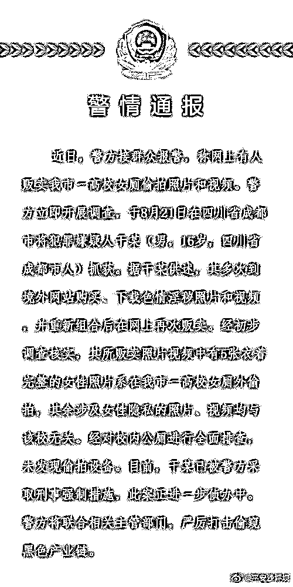
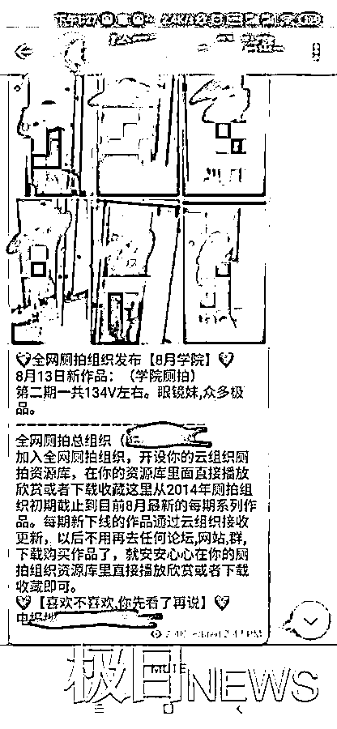
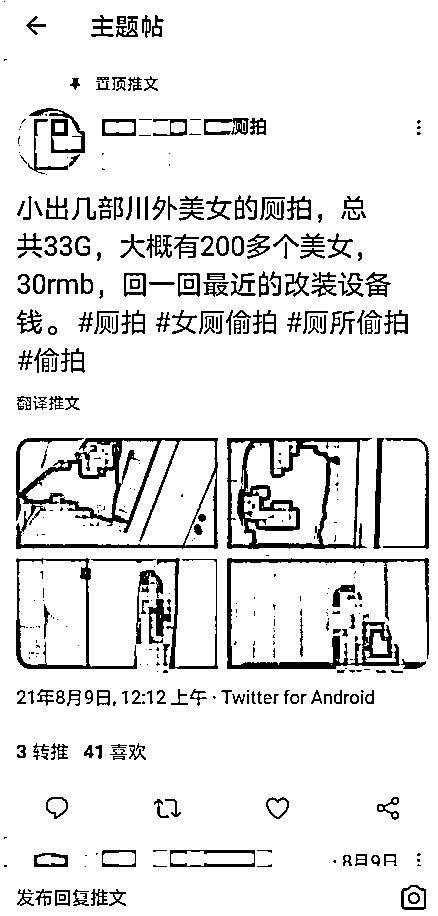
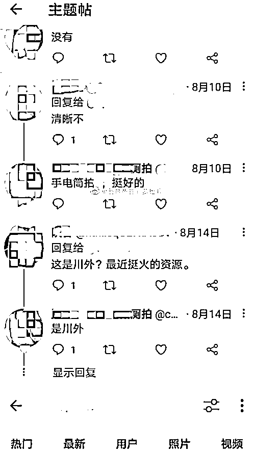
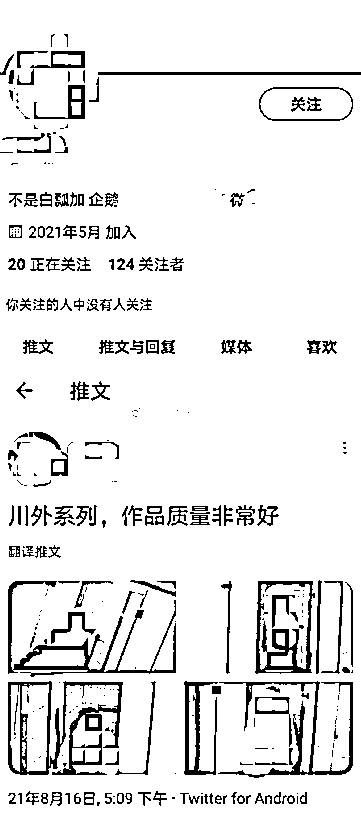

# 某高校女生如厕视频被兜售？警方通报：16 岁嫌疑人已被采取刑事强制措施

> 原文：[`mp.weixin.qq.com/s?__biz=MzIyMDYwMTk0Mw==&mid=2247519406&idx=4&sn=d04de13e74c5a7f52b8c09e9452c6404&chksm=97cb4796a0bcce809a584ef005ac71a0c3db8819445ecc2eef458efd1b93a3e12258aad02a4d&scene=27#wechat_redirect`](http://mp.weixin.qq.com/s?__biz=MzIyMDYwMTk0Mw==&mid=2247519406&idx=4&sn=d04de13e74c5a7f52b8c09e9452c6404&chksm=97cb4796a0bcce809a584ef005ac71a0c3db8819445ecc2eef458efd1b93a3e12258aad02a4d&scene=27#wechat_redirect)

该公众号已被封禁

近日，有网友举报暗网有人公开出售女生如厕视频，被指偷拍地点在四川外国语大学校园内。

8 月 22 日，重庆市公安局沙坪坝区分局发布通报称，警方于 8 月 21 日在四川省成都市将犯罪嫌疑人干某（男，16 岁）抓获。据干某供述，其多次到境外网站购买、下载色情淫秽照片和视频，并重新组合后在网上再次贩卖。

经初步调查核实，其所贩卖照片视频中有 5 张衣着完整的女性照片系在重庆市一高校女厕外偷拍，其余涉及女性隐私的照片、视频均与该校无关。经对校内公厕进行全面排查，未发现偷拍设备。

目前，干某已被警方采取刑事强制措施，此案正进一步侦办中。

此前据极目新闻消息，8 月 21 日，有网友反映，有人在网上兜售重庆两所高校女生如厕的视频，对此校方表示，已经报警。

[`v.qq.com/iframe/preview.html?width=500&height=375&auto=0&vid=i32702h0hrm`](https://v.qq.com/iframe/preview.html?width=500&height=375&auto=0&vid=i32702h0hrm)

▲四川外国语大学女生校园内如厕视频被在暗网兜售 校保卫处：已报警。新京报我们视频

网传视频贩卖介绍

极目新闻记者注意到，网友称“多所高校女厕偷拍视频，在外网推特上散播盈利……”“有人在推上发现有人偷拍川外女厕所，把偷拍照片当做‘资源贩卖’，还不止一个账号”。

有博主进行举报，该博主还发布多张截图，其中一张截图显示，一推特博主在账号称，“小出几部川外美女的厕拍……”，该推特账户还称视频内容共 33G，售卖价格为 30 元。该账户还在与其他网友对话中称，是用改装过的手电筒拍的。

推特博主截图

博主回复网友，照片是用改装后的手电筒拍的

通过网传图片上信息，极目新闻记者查找发布视频或者声称有这些视频的推特账号，但多个账号已经停用，或者显示“此账号不存在”。

22 日下午，极目新闻记者在网上搜索发现，目前网上还有多人正在兜售该视频。他们普遍以“精品厕所拍摄资源”作为关键词，视频售价也从 5 元到 20 元不等。记者梳理发现，早在 8 月 13 日便有用户售卖该视频。

网传一用户主页发布的偷拍照片

记者进入一用户主页，发现如想观看视频，则需下载一个软件进入内部群聊才可观看。记者下载该软件并进入群聊，发现该视频下方留有简介。简介称，该系列视频系第二期，一共偷拍了 134 名女生。

极目新闻记者尝试下载，但在该群聊内并无下载链接。随后，记者注意到，在群聊上方有一通知。通知显示，在该群聊内发布的只是“冰山一角”，如果想要完整观看，需要向群主付费后加入其组织。

下午 1 时 40 分许，记者私信该群主，想要尝试加入组织，但并未收到回复。

根据群聊内展示的组织网址，极目新闻记者查询到名为“115 组织”的网站。记者尝试注册，但被提示“因平台内部调整升级需要，暂停注册。”

记者联系上该网站所有者广东某科技股份有限公司，工作人员介绍，115 组织网类似于网盘。记者询问内部调整升级是否与厕所偷拍组织有关，工作人员表示不知情。

极目新闻记者注意到，除了四川外国语大学，还有网友提醒称，“重庆工商大学的同学也要注意厕所偷拍情况”。

四川外国语大学位于重庆。22 日，极目新闻记者联系该校保卫处，工作人员称，学校已经报警，一切以警方通报为准。

此外，重庆工商大学保卫处工作人员表示，几年前，学校倒是发现过偷拍者，但最近没有学生向学校反映被偷拍，不知道网传信息是否真实，对于网传的信息，学校多个部门已经介入，正在进行调查。保卫处已经检查了学校的厕所等地方，尚未发现偷拍设备。

来源  新京报、极目新闻、重庆市公安局沙坪坝区分局微博

← 向右滑动与灰产圈互动交流 →

