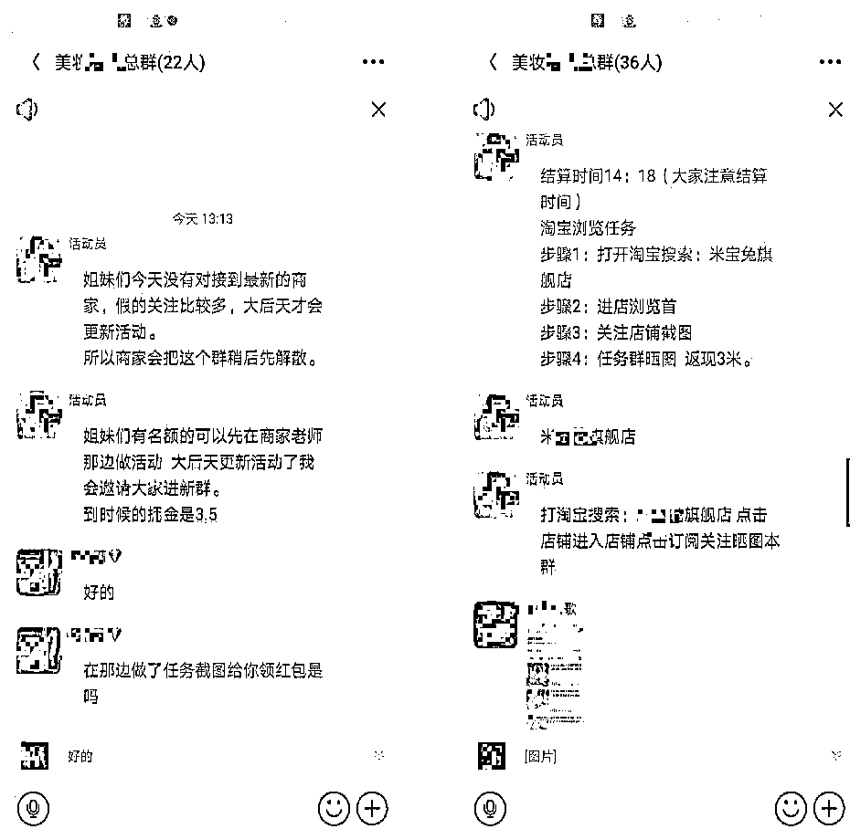
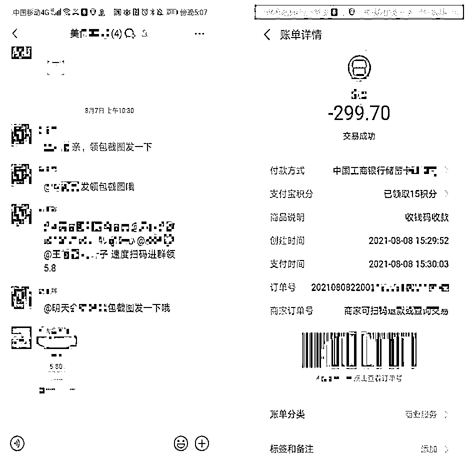
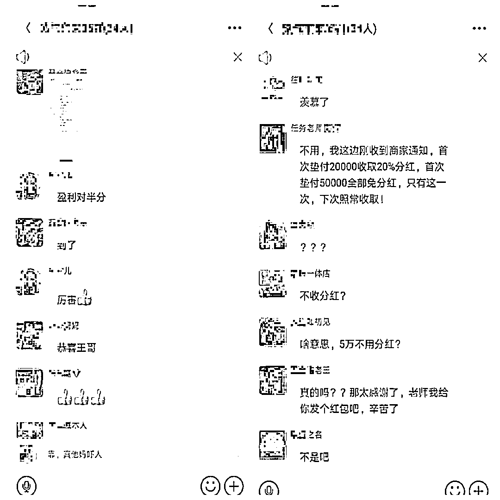
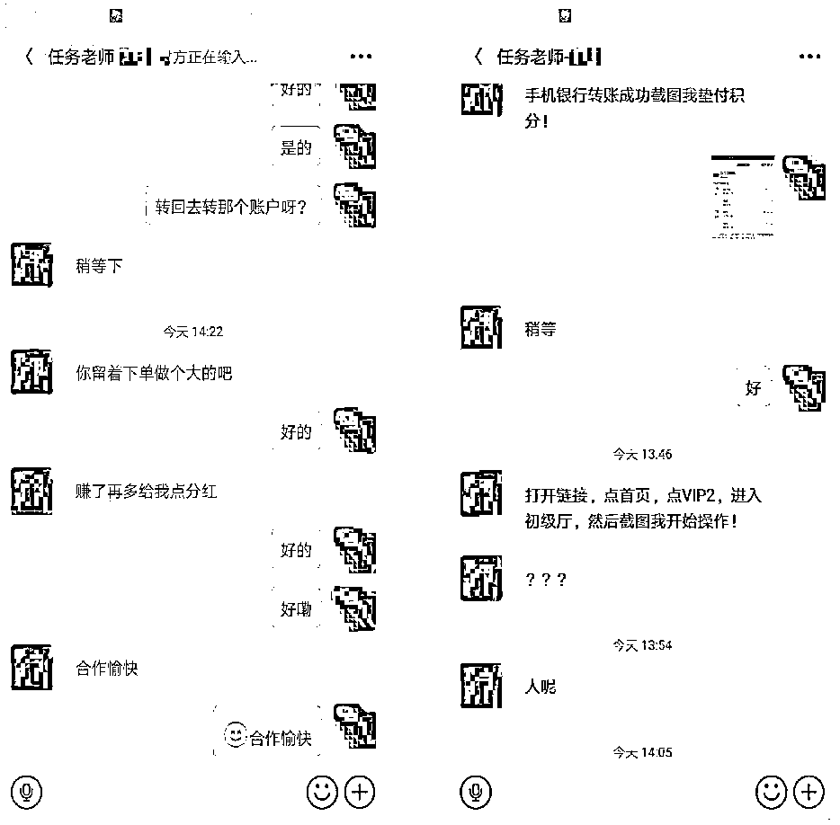
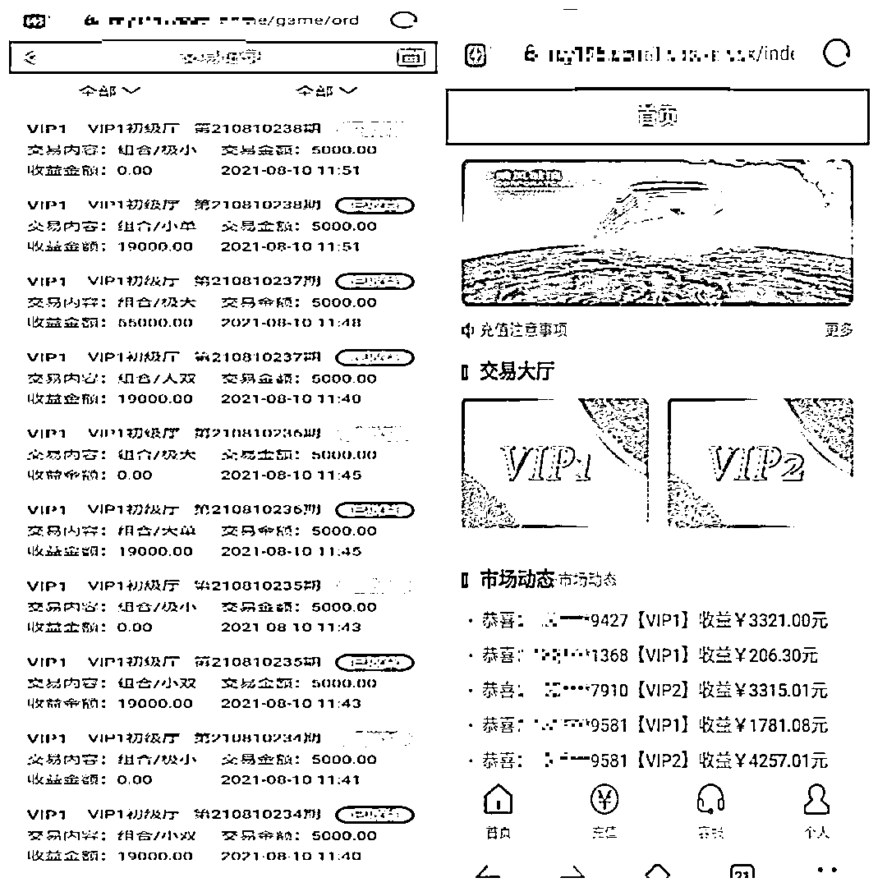
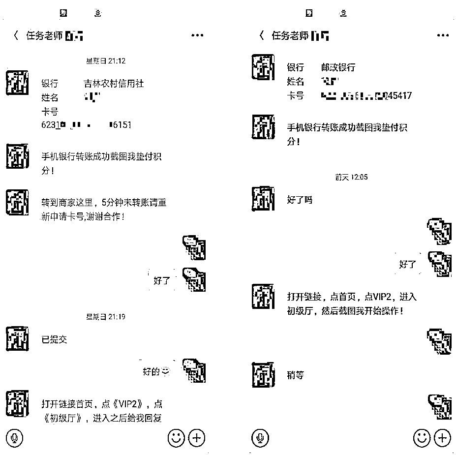

# 为了骗她，“客服”多给她转了 6250 元

> 原文：[`mp.weixin.qq.com/s?__biz=MzIyMDYwMTk0Mw==&mid=2247519406&idx=7&sn=a56bfb0ff7ed6c10b05109882921cdd0&chksm=97cb4796a0bcce804bdb501fa668b3069d0aae800a86ba9901819c827e4f0de6f12153260e05&scene=27#wechat_redirect`](http://mp.weixin.qq.com/s?__biz=MzIyMDYwMTk0Mw==&mid=2247519406&idx=7&sn=a56bfb0ff7ed6c10b05109882921cdd0&chksm=97cb4796a0bcce804bdb501fa668b3069d0aae800a86ba9901819c827e4f0de6f12153260e05&scene=27#wechat_redirect)

如今随着互联网的发展 

网络平台的引流

动动手指，看看新闻

刷刷视频，就能赚钱的事

早已不新鲜了

但是世上真有那么多天上掉馅饼的事吗

其中暗藏的骗局也是比比皆是

哪个又是骗子设置好的陷阱呢

……

刷单赚零钱

刚工作不久的小美（化名）最近在网上找兼职，之后一个网友将她拉进了一个工作群，这是一个刷单群，每单投入金额较小，一单可赚 2-3 元不等，小美看群内大家都很积极地做任务，于是也利用空闲时间接起了刷单任务，收入虽少但很稳定。

第二天，群主在工作群内发了一个链接及邀请码，让大家下载一个叫“美 X”app 继续做任务，并宣布该群即将解散。小美下载了“美 X”app 并完成了注册，之后又被拉进了一个新的工作群，新任务金额有所提高，每单收益在 5-10 元。

大概过了半天，群主在群内发布了一条投资任务，并发了一个网址链接，称有兴趣的可以自己报名参加，收益可观。 

等小美打开连接完成注册后就接到了一个 299 元的任务，小美做完后赚了 75 元，此时一个自称任务老师的人添加了小美好友，对方告诉小美，该网站平台是一个长期任务，让其记住自己的帐号密码，方便下次登入。

“失误”多返 6000 多元

之后小美继续回到工作群内做小额刷单任务，直到群内第二次发布投资任务，小美再次报名。报完名后，小美又被拉进了一个投资任务群，在群内小美做了一单 500 元和一单 3000 元的任务。等收到钱后，小美又做了一单 5000 元的任务，最终返利了 1250 元，其中 350 元分红给了任务老师。

第二天，小美又做了一单 5000 元的任务，可是账户内却收到了 2 笔 6250 元的转账，小美询问任务老师是不是转错了，该怎么还回去？任务老师回复小美钱不用还，下次接几个大单做，也好给他多分点红。此时的小美，通过 3 天刷单已经收入了 9800 元。

没过多久，小美再次报名了一个 10000 元的任务，并再次被拉进了一个专做万元任务单的小群，管理员在群内指导群员操作方式，小美按照要求完成了任务，但当操作提现时却被平台驳回了。

永远提不出来的“钱”

发现无法提现后，群内纷纷向管理员反映，管理员告诉大家，是由于操作失误导致的账号异常，根据平台要求，需要充值与平台账户余额相同的金额才能解除账户异常。

小美根据平台账户的余额，转账了 24000 元给管理员，让其帮忙解除账号异常。一会儿后，小美再次进行提现操作，没想到还是被平台驳回了。管理员告诉小美还是操作错误的原因，这次解除需要充值 48000 元。小美称自己没有那么多钱，需要去筹钱。

第二天，只筹到了 33000 元的小美让管理员帮忙想想办法，管理员称可以先帮小美垫上剩余的，让其提现后再还她。充值完后，小美再次进行提现操作，此时平台却提示会员等级不够，无法全额提现，需要充值提升会员等级。

面对这个充值的无底洞，小美才意识到自己被骗，立即报警。接到报警后，石桥派出所迅速将小美带回派出所进行调查取证，目前案件正在进一步侦办中。

**警方提醒：**

首先，“刷单”本身就是违法行为；其次，切勿相信网上类似“轻轻松松赚钱”等兼职刷单广告，想要兼职请通过正规渠道。

针对各种新型骗局，要提高警惕，多学防诈知识。谨记，天上不会掉馅饼，不要轻易加入陌生微信群，不要轻易点击陌生人发来的链接，不要下载陌生的软件平台。如果被骗，一定要在第一时间报警。

来源：平安拱墅、杭州防诈骗、反诈骗先锋

← 向右滑动与灰产圈互动交流 →

