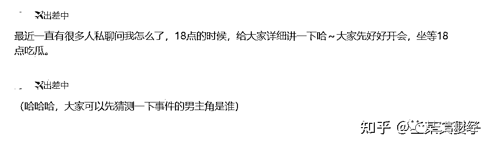
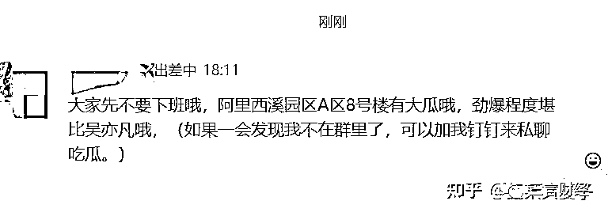
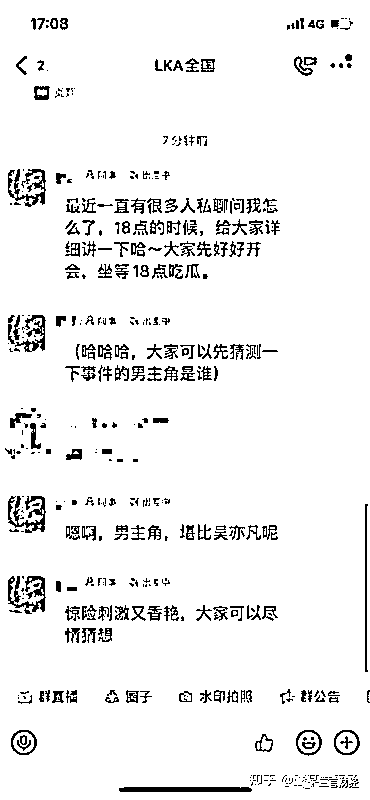
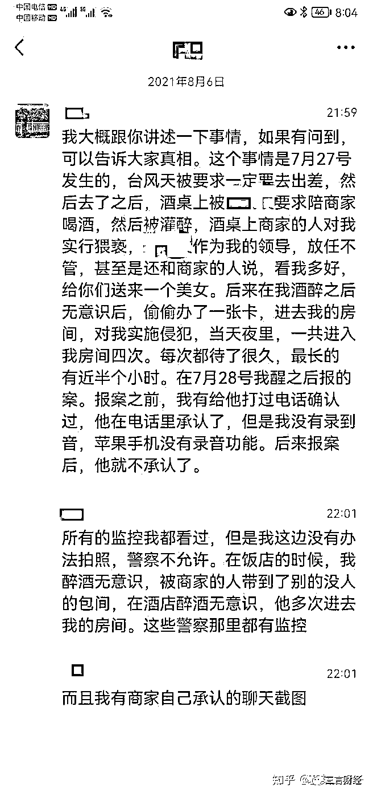
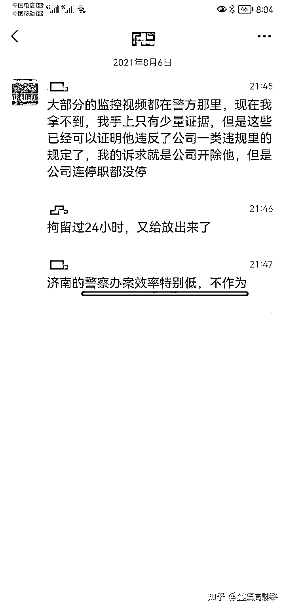

# 阿里女员工事件王某文妻子：周某主动勾引我丈夫，其酒量极好

> 原文：[`mp.weixin.qq.com/s?__biz=MzIyMDYwMTk0Mw==&mid=2247519457&idx=4&sn=0e250cbbed0c8f1c20f41553418521f0&chksm=97cb47d9a0bccecfe553cae769749f1fc6a201ba0bff39dd8387b7d88e4501195dd5e42bd5c6&scene=27#wechat_redirect`](http://mp.weixin.qq.com/s?__biz=MzIyMDYwMTk0Mw==&mid=2247519457&idx=4&sn=0e250cbbed0c8f1c20f41553418521f0&chksm=97cb47d9a0bccecfe553cae769749f1fc6a201ba0bff39dd8387b7d88e4501195dd5e42bd5c6&scene=27#wechat_redirect)

三言财经消息，今日阿里女员工事件中王某文的妻子发文，称周某涉嫌虚假陈述，甚至诬陷。

她指出，周某在出租车上有主动勾引王某文的行为，“主动搂抱、乱摸、亲吻我丈夫，算不算强制猥亵？”

她表示，路上周某借酒劲搂抱王某文，摸他胸、全身甚至 XT，并强吻，在脖子左侧留下了明显的吻痕（俗称草莓印）。王某文明确表示拒绝：“XX，别这样，别这样”，周某回应“对不起”。

她还表示，自己给陈某丽打了电话，得到了陈某丽的证实，陈某丽确实听到了“别这样”、“对不起”的对话。还因为，我丈夫回家后，脖子上确实有很大一块红的发紫的吻痕，五天才消下去。

以下是全文：

我是“阿里女员工案”中王某文的妻子。

近日，警方已经就本案发布“情况通报”，内容与我丈夫跟我的坦白基本一致，不过有很多对我丈夫有利的情节尚未披露。但周某在网络上的自述却与此严重不符，周某涉嫌虚假陈述，甚至诬陷。

案发时，周某虽然喝了 350ml 的低度白酒，但意识清醒，要不然周某怎么会先后两次主动亲、搂、抱、摸我丈夫，怎么能给我丈夫脖子上吸出“草莓印”五天才消下去，要不然周某怎么还能给其他人发微信、发视频、接电话，怎么能独立完成洗澡、换睡衣？

我丈夫犯了错，我起初非常愤怒，但了解来龙去脉后，情感变得复杂。从我的角度讲，他对不起我，我辛辛苦苦的工作，我也在赚钱养家，把全部精力都花在这个家里，他竟然和其他女人发生了亲密接触，我对他非常失望，我难以原谅他的！他应该为他犯的错受到道德的惩罚！但他的错远不及犯罪，我也不能眼睁睁看着他被周某污蔑成“猥亵犯”！所以，我要站在客观中立尊重事实的立场，把我知道的都说出来！

我们从大学恋爱至今已有 15 年，作为妻子我认为他是犯了错，但是他的错远不及犯罪，不应该因为酒后冲动回应了周某的勾引，就被贴上涉嫌强制猥亵的标签。

现我以王某文妻子的身份就以下问题提出质疑，恳请公安机关依法查证，尽快还原案件真相，主持正义，还王某文一个公道！如有恶意构陷，我甘愿接受警方依法处理，也请广大网友予以监督。

1、周某在出租车上有主动勾引我丈夫的行为，主动搂抱、乱摸、亲吻我丈夫，算不算强制猥亵？

我丈夫是和华联陈某丽（女性，未饮酒）共同搭乘出租车送周某回酒店的。我丈夫和周某坐在后座，陈某丽在副驾驶。路上周某借酒劲搂抱我丈夫，摸他胸、全身甚至 XT，并强吻我丈夫，在脖子左侧留下了明显的吻痕（俗称草莓印）。我丈夫明确表示拒绝：“XX，别这样，别这样”，周某回应“对不起”。

我之所以相信我丈夫的说法，是因为我给陈某丽打了电话，得到了陈某丽的证实，陈某丽确实听到了“别这样”、“对不起”的对话。还因为，我丈夫回家后，脖子上确实有很大一块红的发紫的吻痕，五天才消下去。吻痕出现的时间也得到了陈某丽、阿里同事胡某敏的证实，吃饭时还没有，送周某酒店后发现有了。

恳请警方调取出租车和酒店监控、录音以及出租车司机和陈某丽的证词作为证据，查证是否属实。如果属实，请问女方未经王某文同意擅自主动搂抱亲摸王某文，算不算强制猥亵？

2、周某是否真的因为醉酒而没有意识？

周某声称在醉酒状态下被“强制猥亵”，但从我丈夫离开到接到胡某电话，仅 6 分钟时间，周某准确地感知到送她的人离开，并迅速准确拨通胡某敏（了解当晚我丈夫送她回酒店的男同事，非闺蜜）电话哭闹，第二次从我丈夫离开到接到胡某鹏（女）的视频电话，10 分钟内，又迅速准确的联系胡某鹏（依然是认识我丈夫和周某的同事），试问，哪个处于醉酒无意识状态能做出这些目的性明确，准确性极高，反应性极快的行为？

周某有明确的意识主导行为能力的情况下，我丈夫如何毫无痕迹和异常动静的“强制猥亵”周某？如若真的被“强制猥亵”，为什么这个时候不会哭闹反抗，不会打电话？（警方通报也证实周某没有受伤）

据我丈夫描述：胡某敏 23：04 来电，通话时长 1 分 31 秒，请他上去看周某，23:08 取消滴滴订单。他给周某打通了电话，并经过前台电话确认后登记了身份证办理了房卡上去。他上去之后，周某躺在床上，他给她盖好被子，拿了瓶矿泉水放在她床头柜上。这时周某拉住他，还亲他、摸他胸、XT，这时我丈夫进行了回应。几分钟后，周某主动要求我丈夫买避孕套和洗澡。我丈夫去洗了澡，手机下单避孕套，等待美团送货，几分钟后猛然惊醒，认为不能这么做，便立马于 23:43 主动离开了房间，并且我丈夫在胡某鹏要求查看周某情况第三次进入周某房间是开着微信视频通话进去的，这些行为明确表明了态度和立场。哪里看的出来他有“强制猥亵”周某的动机？

试问，如果周某酒醉到没有意识的程度，怎么可能给胡某敏等人发微信、发视频？怎么可能接我丈夫电话？怎么可能对酒店前台工作人员的询问做出同意答复？怎么可能独自完成洗澡、换睡衣这些动作？怎么可能还会有性冲动并主动做出类似出租车上的那些行为？

恳请公安机关向胡某敏、胡某鹏、酒店前台取证，向酒店保洁取证，看周某房间使用过几个浴巾，向第二天一早到周某房间的张某取证，看周某第二天穿的是睡衣还是什么衣服，

调取周某的手机，看她除了给胡某敏、胡某鹏发微信、发视频之外还给哪些人发了发过微信、打过电话。相信会有大量的的证据可以证明周某说了谎，可以证明周某在事发时意识是清醒的。

3、周某为什么会在退完房之后才报警？

周某在 7 月 28 日上午就认为自己可能在醉酒状态下被侵害，还给丈夫打了电话，但是为什么在退房后才报警？并且声称报警目的是查看监控，核实前一晚“醉酒记不清”发生了什么事报警，但对于当日自己在清醒状态下主动联系张某同处一室一个半小时只字不提，直到事发过去 7 天后才补充报警指控张某“强制猥亵”？失忆了吗？在退房后报警是怕证据太多还是怕现场又不利于自己的证据？

周某与张某联系，告知房间号码，张某单独带避孕套前来周某房间一个半小时，在周某清醒状态下带走其内裤（注意不是偷走，抢走），还移花接木到我丈夫身上。在长达一个半小时的“强制猥亵”过程当中，周某为何毫无反抗？还是反抗了未留下任何伤痕？

周某为何在退房之后报警，报警还刻意隐瞒主动联系张某的事实，期待公安机关对这种迷幻操作予以公正审查，给出符合基本逻辑，令人信服的公正判断。

4、周某在 8 月 6 日大闹阿里食堂是被逼“豁出去”，还是想引导舆论？

周某对外宣称“豁出去”是因为公司不予处理，但据我所知，周某仅联系 HR 和上级主管，从未主动、单独联系公司高管。而且 8 月 6 日下午 5 点，公司就明确告知周某已将我丈夫停职的处理结果（开除需等待警方的调查结果），周某 6 点多就开始在各大内部群发布消息，7 点多大闹公司食堂，晚上 9 点多开始主动对外传播谣言。

她的言行（下方有图），哪一句看的出来她被逼无奈“豁出去”？而且这一系列行为连贯但情绪断层的操作，完全没有给公司留处理问题的时间，她的目的是什么？当晚主动发布的内容明确提出对警方不满，刑事案件为什么会要求公司为她主持公道？她要的公道是开除？够了吗？要求开除就算主持公道了吗？并且公司并不是拒绝开除的请求，明确告知已停职，等待警方的调查结果再开除。为什么等不了要立刻马上采取行动？是因为对警方办案的公正不信任？还是因为心虚对警方的调查结果没信心？

以下是周某个人在公司内部群和对外发布的部分信息截图：

5、另据我获知，周某的酒量极好在同事里是公认的（望警方调查取证），喝 350ml 的低度酒并且吐掉的情况下，是难以醉到失去行动能力的。并且周某自己的打电话发消息的对象之明确，时间拿捏之准确，第二天主动联系张某的行为之诡异，与自己在网上杜撰的人设之差异，也表明她是意识清醒并且意图明显的。希望司法机关予以明察！

以上是基于警方通报对于周某我丈夫涉嫌“强制猥亵”提出的的几个疑问，接下来是整个事件的时间线和周某自述中的谎言：

事件概述：

7 月 27 日晚事发。

7 月 28 日周某报案（未提张某），我丈夫先后在 7 月 28 日下午和 8 月 1 日接受两次调查，时间分别是 24 小时和 4 个小时，警方均未立案。

8 月 2 日晚，周某单方面以“被强奸”为由，告知公司并要求即刻开除王某文。我丈夫 2 日当晚赶回杭州接受公司调查，直到 6 日被停职后回到老家。

8 月 6 日晚周某 “因不满公司的停职处罚”，在公司发传单，主动对外传播大量编造的信息，构陷我丈夫“强奸”。

8 月 7 日又在公司内网发布长达 8000 字，一部情节几乎全是虚构的“小说”作品，诬陷公司管理层“不作为不处理”给公司施压，要求公司开除我丈夫。

本案因为周某的自述和蓄意大闹阿里食堂引爆网络，引发了舆论对周某同情，但周某对我丈夫和对阿里巴巴公司的愤怒指控，几乎全是谎言：

1、“台风天强制出差”系谎言——周某负责对接工作，一个礼拜之前就规划好出差行程，且在系统内报备，并无强制出差；

2、“有预谋的安排”系谎言——8 个人的工作聚餐，并且饭店是周某本人自己选择和预定的，别人怎么预谋？

3、“灌酒”、“酒桌上被亲、被摸”系谎言——济南警方通报已明确说明，同桌其他女性并没有饮酒，周某若不想喝酒完全可以不喝，故不存在强迫饮酒一说；

4、“偷办房卡”、“多次潜入”、“带避孕套偷偷潜入”、“一个塑料膜拆封过的避孕套”系谎言——酒店前台电话（注意是电话！）周某取得本人同意后才办的房卡，符合规范流程；

我丈夫在已经打车准备离开之时，接到胡某敏（同出差男同事，非周某闺蜜）电话请求查看周某安全才取消打车返回周某房间，第三次返回是和胡某鹏开着微信视频通话，并非潜入！

避孕套是周某 28 日晨睡醒清醒后主动联系的张某带来的，事实已证实与我丈夫无关，并且未开封！

5、“一觉醒来全身赤裸”、“找不到内裤”系谎言——我丈夫第三次进入房间是应胡某（女同事）开着微信视频电话进入查看周某情况，周某盖着被子，周围未见周某衣物，也无其他异常。

内裤系张某带走，周某刻意隐瞒 28 日早晨主动联系张某，清醒程度可准确联系张某并主动开门，却忘记自己是否穿内裤？

6、“公司无人问管”、“阿里男高管强奸女下属”系谎言——周某 8 月 2 日告知公司后，公司一直在积极处理，先“停职”等待警方调查结果，只是处理结果“停职”未达到周某要求“开除”我丈夫的目的。不处理和处理结果不满意是一回事吗？

周某大闹公司食堂里说的每句话都是谎言。我丈夫和周某同属基层员工，都汇报给一个领导，并非高管。周某自己作为阿里员工明知内情，刻意夸大我丈夫级别，抹黑公司背后到底是什么动机，恳请警方查证。

我和我丈夫是大学同学，是彼此的初恋，从恋爱到结婚 15 年，感情始终很好。我丈夫的为人，我和我们共同同学和朋友都有目共睹，他从未有任何不良行为记录，我相信他做不出“强奸”、“强制猥亵”的事。

根据警方通报以及我丈夫 7 月 30 日对我坦白的情况，我丈夫确实做错了事，他对周某的诱惑没有做到“坐怀不乱”。

他是对不起我，但一码归一码，错误不等于犯罪，我也不能眼睁睁看着周某恶意诬陷我的丈夫。

反观周某，利用网络散布谣言，引爆网络舆论，引发了严重的网络暴力、透支了社会对女性的信任与同情，伤害了真正需要被帮助的女性。同时，这个事件对于所有有责任、有担当的男性也造成极大的困扰，试问以后有真正需要帮助的醉酒的女性同胞，男同胞还敢伸出援手吗？

现已证实，周某的网络自述，散布谣言、误导舆论、构陷他人。虚假信息传播量巨大，多日持续微博热搜榜，恳请公安机关对此也公正客观地依法查处，给公众一个交待。法律不允许任何人强制猥亵他人，更不能容忍任何人可以编造谎言陷害他人！

最后，也深深的感谢在过去的两个礼拜被道德绑架深陷舆论漩涡中，依然理性看待问题，尊重事实追求真相，支持我和家人的每一位朋友，表示由衷的感谢。正是因为你们的存在，让我在挣扎多日后，决定擦干眼泪，不再软弱，鼓起勇气，积极与警方和司法机关配合，说出真相！我相信公安机关不会冤枉一个好人，也不会放过一个坏蛋，为我的丈夫讨回公道，还他清白！

陈述人：王某文妻子 

2021 年 8 月 22 日

来源：三言财经

← 向右滑动与灰产圈互动交流 →

