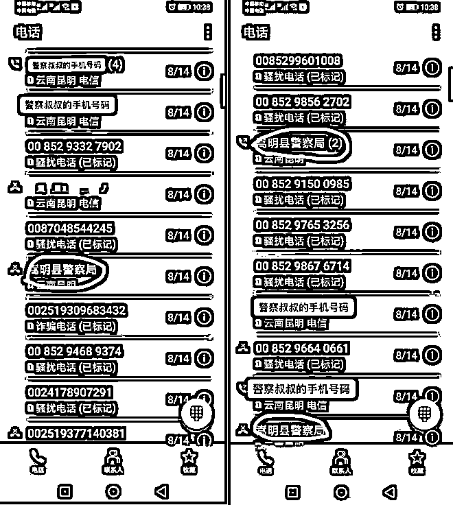
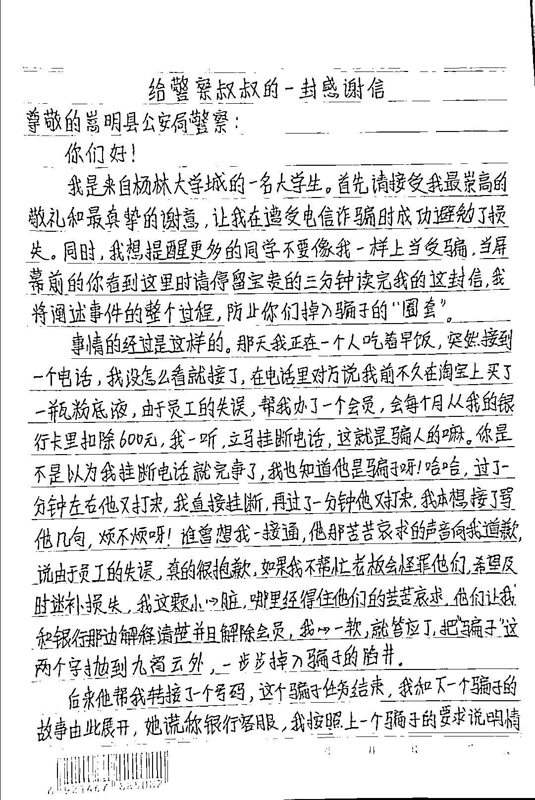
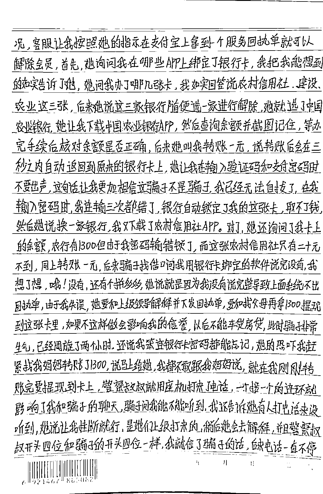
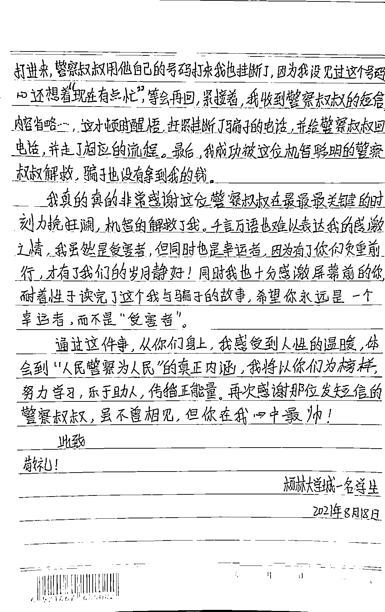
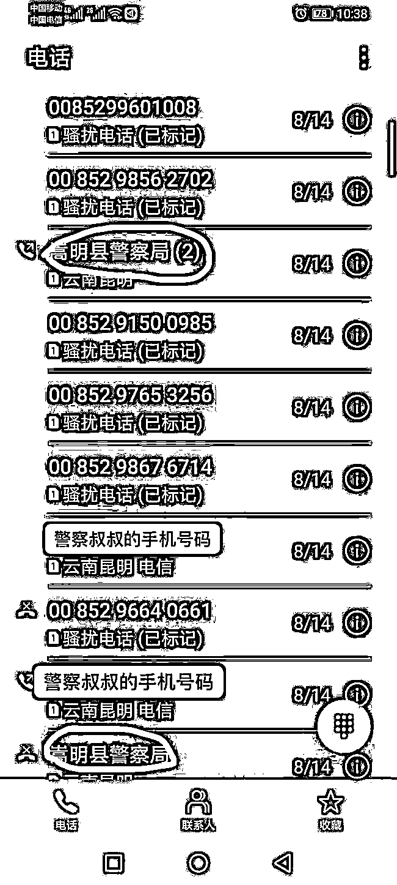
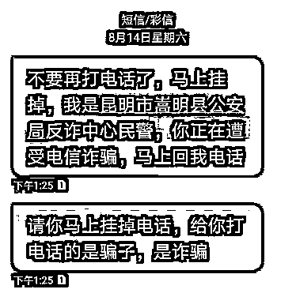
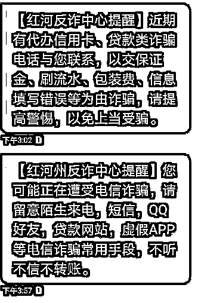
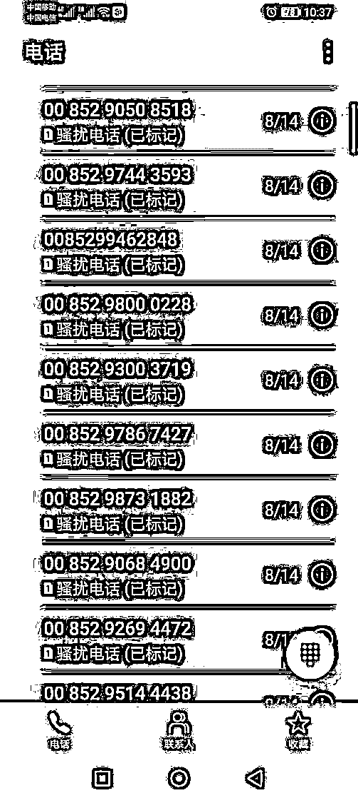

# 跟骗子聊了 2 小时，骗子骂我笨……请花 3 分钟读完它！

> 原文：[`mp.weixin.qq.com/s?__biz=MzIyMDYwMTk0Mw==&mid=2247519457&idx=5&sn=3b38b43a573eb1c06b2a6876235074cd&chksm=97cb47d9a0bccecfcbcf8802afddc15a73b9b5ed7194f1dccdfe2f546bdf00d510b1b3e5347e&scene=27#wechat_redirect`](http://mp.weixin.qq.com/s?__biz=MzIyMDYwMTk0Mw==&mid=2247519457&idx=5&sn=3b38b43a573eb1c06b2a6876235074cd&chksm=97cb47d9a0bccecfcbcf8802afddc15a73b9b5ed7194f1dccdfe2f546bdf00d510b1b3e5347e&scene=27#wechat_redirect)

第一次来电

她成功识破、果断挂掉

第二次来电

她态度坚决、干脆不接

可第三次来电

对方一句

**“真的很抱歉，如果你不帮忙**

**老板会怪罪我们”**

她心软了

……

8 月 14 日

昆明市嵩明县杨林大学城大二学生小叶

（化名）

接到一个冒充淘宝客服的电话

差点给骗子转去所有的生活费

好在嵩明县公安局反诈中心的警察叔叔

**用“夺命连环 Call”**

在她即将提现的关键时刻

成功阻止了她

事后

小叶特意手写感谢信

足足三页纸

**<左右滑动查看更多>**

除了表达对警察叔叔的感谢

还详细讲述了自己遭遇诈骗的

详细经过和心理历程

**希望**

**屏幕前的你**

**停留宝贵的三分钟**

**读完她的故事**

**防止掉入子骗子的圈套**

**以下是小叶的自述：**

**Part1 ****骗子来电装可怜，我心软了**

那天我正一个人吃着早饭，突到接到一个电话，我没怎么看就接了。

在电话里，对方说我前不久在淘宝上买了一瓶粉底液，由于员工失误，帮我办了个会员，每个月会从我的银行卡里自动扣除 600 元。

**我一听，立马挂断电话，这就是骗人的嘛。**

哈哈哈~我也知道她是骗子呀！但你是不是以为挂断电话就完事了？

过了一分钟左右，他又打过来。我本想接了骂他几句：烦不烦呀！

谁曾想我一接通，他那苦苦哀求的声音一直向我道歉说：由于员工的失误，真的很抱歉，如果我不帮忙，老板会怪罪他们。

他让我跟银行那边解释清楚并且解除会员。

**我这颗小心脏哪里经得住苦苦哀求，我心一软，就答应了，把骗子二字抛到了九霄云外，一步步掉入骗子的陷阱。**

**Part2 ** **三次输错支付密码，骗子骂我笨** 

后来他帮我转接了一个号码，这个骗子任务结束，我和下一个骗子的故事由此展开。

她谎称自己是银行客服，我按照上一个骗子的要求跟她说明了情况，客服让我按照她的指示操作，就可以在支付宝上拿到服务回执单并解除会员。

首先，她询问我哪些 APP 上绑定了银行卡，我把我能想到的都告诉了她。

她问我办了那几张卡，我如实回答说有农村信用社、建行、农行这三张。

后来，她说这三家银行随便选一家进行解除，我就选了中国农业银行。她让我下载中国农业银行 APP，查询余额并截图，等办完手续后核对余额是否正确。

后来她叫我转账 1 元，说转账后会在三秒之内自动返回到原来的银行卡上。

她让我输入密码和支付密码，期间不要出声，这句话让我相信这骗子不是骗子，我已经无法自拔了。

在我输入密码时，我连续输了三次都错了，银行自动锁定了我的这张卡，取不了钱。

然后她说换一家银行，我又下载了农村信用社 APP。

对了，她还询问了我银行卡上的余额。

**农行卡上有 1300 元，但由于我密码输错，锁了。**

而这张农村信用社卡只有 20 元不到，同上也转账了 1 元。

后来骗子找借口问我还有没有用银行卡绑定的其他软件。

我想了想，哦，还有个拼多多。

她说就是我没有将绑定的软件都告诉她，所以就出不了回执单。由于我的失误，她要和上级领导解释并下发回执单。

她让我跟父母要 1300 元，并提现这张农村信用社卡。如果我不这样做的话，会影响我的信誉，以后我就不能进行车贷、房贷。

**此时，骗子非常生气，因为已经“周旋”了两个小时，还说我笨，连银行卡密码都能忘记。**

在她的恐吓下，我赶紧向妈妈要了 1300 元，还不敢将事情原委告诉妈妈。

**Part3****警察叔叔的夺命连环 Call，我被拯救了**

就在我刚转完账，并要提现到卡上时，警察叔叔就用座机打来了电话。

一个接一个的连环 Call 影响了我和骗子的聊天。

骗子问我能不能听到，我还告诉她有人打电话来。

听不到，她让我挂断就行，说是她们上级打来的，稍后她会去解释。

因为警察叔叔来电座机号码的开头 4 位，和她的是一样的，我就信了骗子的话。虽然后来电话一直不停打进来，但连警察叔叔用他自己手机打来的电话，我也给挂断了。

因为我没见过这个号码，心里还想着：现在有点忙，等会再回。

紧接着，我收到了警察叔叔的短信。

这才幡然醒悟，赶紧挂断了骗子的电话，并给警察叔叔回了电话，走了相应的流程。

最后，我成功被这位机智聪明的警察叔叔解救。

骗子没能拿到我的钱。

事后，小叶也进行了深刻的自我反省。她表示希望大家遇到骗子时及时报警，也希望耐着性子读完这个事件的人，永远是一个幸运者，而不是受害者。

**小叶口中聪明机智的警察叔叔是谁？** 

她口中使用“夺命连环 Call”的警察正是嵩明县公安局反诈中心的值班辅警土巨山。

**他表示因为小叶的手机上安装注册了****金钟罩和国家反诈中心 APP****，所以她一接到骗子电话，反诈中心就及时收到预警信息，然后第一时间打电话进行劝阻。**

为了让小叶免于被骗，土巨山也真的可谓是“费尽心机”。

“由于小叶一直在跟骗子通话，我用座机一直不停地打，打了大概 15 个电话但一直没有接通。我很着急，又用自己的手机又打，打了好几个，其中有两三个，刚一接通就被挂断了。我又急忙用手机给她发短信，好在她看到短信，回了电话过来。”

小叶在跟骗子通话时，骗子也一直用不同的号码给小叶不停地拨打她的电话，阻止她接通其他来电。

**最后，反诈民警也提醒大家：**

**1**

天上不会掉馅饼，切勿贪图小便宜，**一定要做到不听不信不转账。**

**2**

凡陌生来电中涉及个人身份信息的一定要警惕，特别是涉及银行账号信息的一定是骗子，因为真正的公检法和客服是不会通过电话询问这些个人隐私的。

**3**

如果拿不准对方是否是骗子，千万别转账，可及时到最近的派出所咨询警察，也可以拨打 96110 进行咨询。

来源：昆明反电信网络诈骗中心

← 向右滑动与灰产圈互动交流 →

