# “大师”教你学投资，最后遭的就是你！

> 原文：[`mp.weixin.qq.com/s?__biz=MzIyMDYwMTk0Mw==&mid=2247519457&idx=6&sn=a2984c8715ed5ff911b43219820daba7&chksm=97cb47d9a0bccecf76bd3de1a4dc7a9dfd527449bd6d6ca0f79ad29c85f7ac7826e2d375577a&scene=27#wechat_redirect`](http://mp.weixin.qq.com/s?__biz=MzIyMDYwMTk0Mw==&mid=2247519457&idx=6&sn=a2984c8715ed5ff911b43219820daba7&chksm=97cb47d9a0bccecf76bd3de1a4dc7a9dfd527449bd6d6ca0f79ad29c85f7ac7826e2d375577a&scene=27#wechat_redirect)

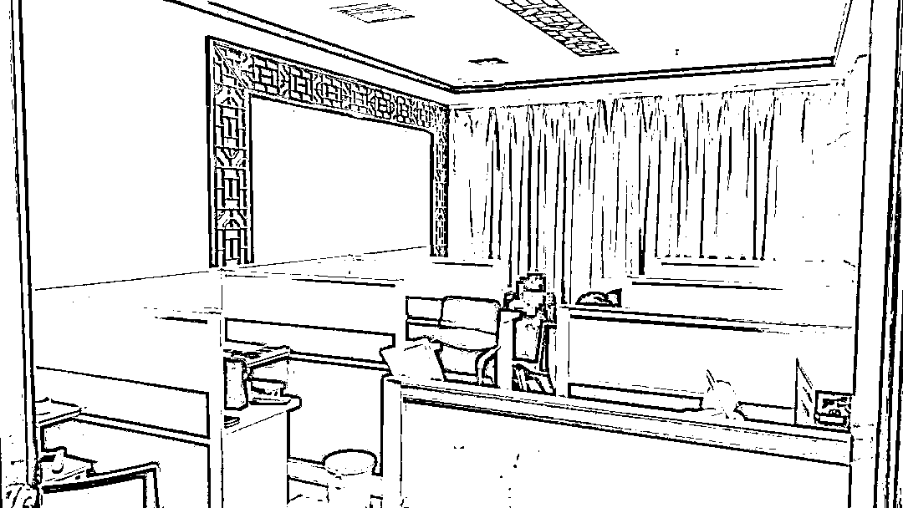

干净的办公环境 

有序的工作分区

丰厚的薪资待遇

如果不说

你能看出这样的地方

**是一个****诈骗窝点****吗？**

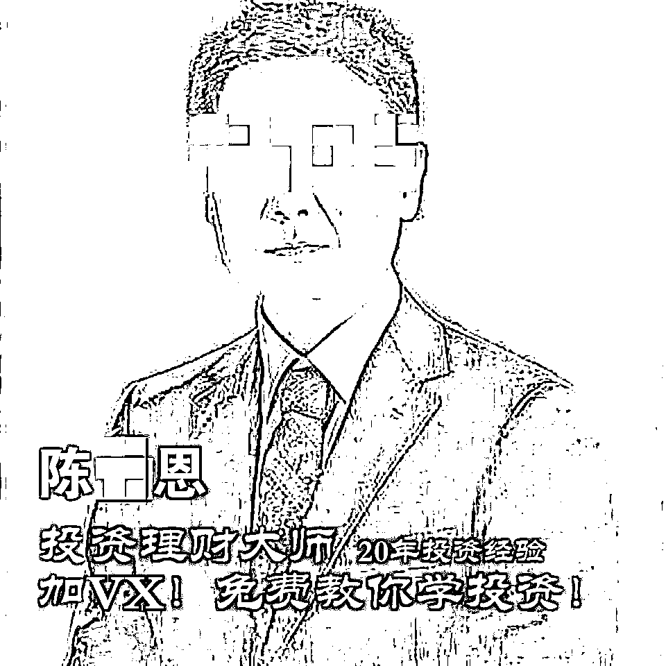**投资理财大师陈某恩**就出道于此**“你不理财 财不理你”**
**“只赚不亏 免费教学”**吸睛字眼 精准投放 入脑入心正为**股票跌停**愁眉苦脸的你病急乱投医就可能成了陈大师的学员****先听听一位“学员”的自述****

[`mp.weixin.qq.com/mp/readtemplate?t=pages/video_player_tmpl&action=mpvideo&auto=0&vid=wxv_2009119201084391425`](https://mp.weixin.qq.com/mp/readtemplate?t=pages/video_player_tmpl&action=mpvideo&auto=0&vid=wxv_2009119201084391425)

********

2021 年 3 月 20 日，四川省泸州市公安局江阳区分局在安徽省合肥市成功抓获某电信诈骗团伙头目徐某。至此，一个涉案**1000 万元**的特大电信诈骗团伙逐步浮出水面。

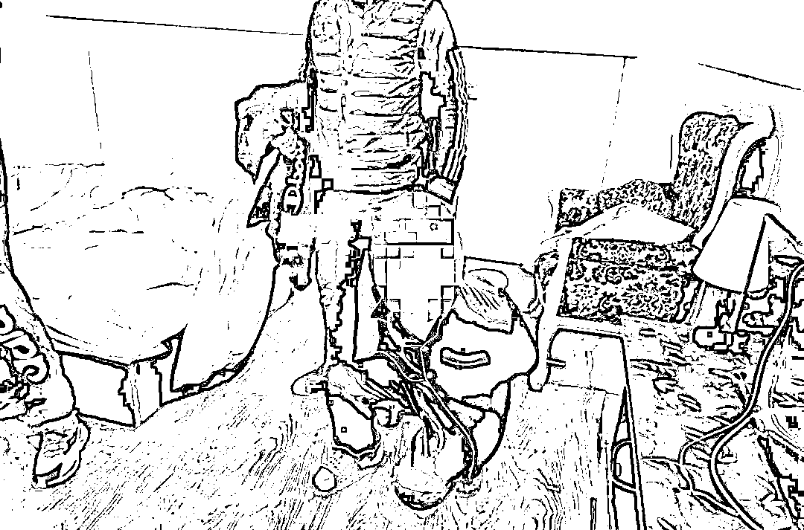徐某在家中被抓获**一人一群一软件**— 除了你群里全是“演员” —

2021 年 2 月 3 日，泸州市公安局江阳区分局接到群众黄某(化名)报警，称其被诈骗了**60 余万元**。

据黄某回忆，他于 2020 年 12 月在网上了解投资理财时，**添加了一名理财大师陈某恩的微信并被其拉进了一个炒股群**。群里有不少投资者爱好者，时不时会在群里晒出自己当天的收益。

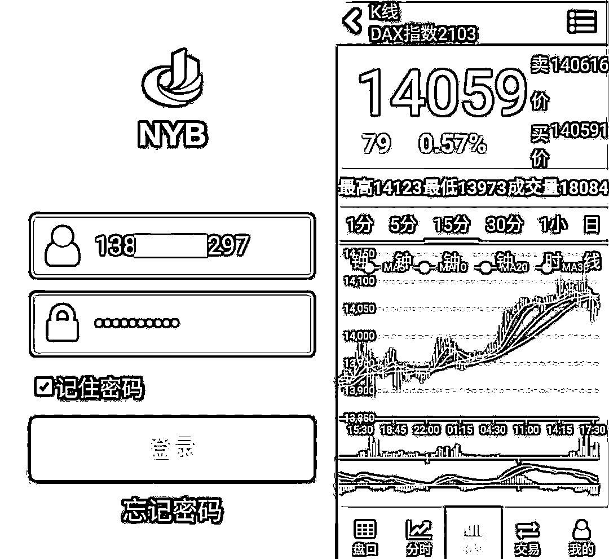

看到这里，黄某心动了，在陈大师的推荐下下载了一款名叫＂NYB＂的投资理财 APP 并注册登陆。在陈大师的“指导”下，**仅用了 20 天，黄某就陆续向“平台****客服****”提供的银行账户转账 62 万余元用于“投资”**。

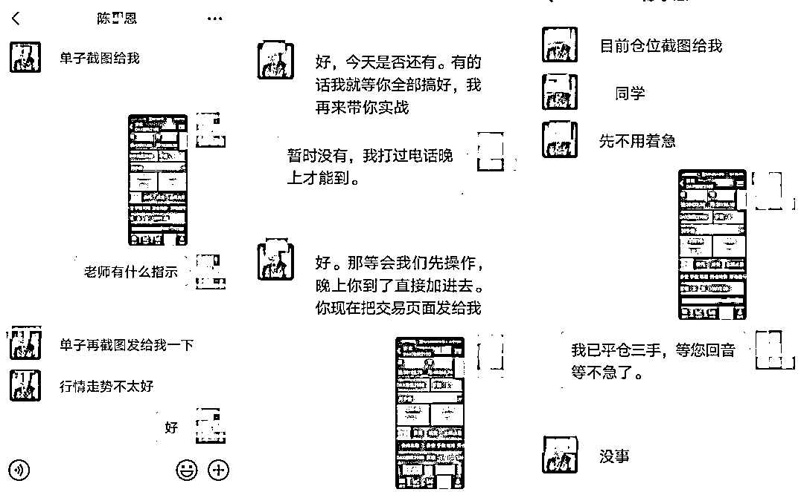

2 月 3 日，黄某发现其投资的所有本金和利润**无法提现，也联系不上陈大师和平台客服**，这才发现自己被骗。

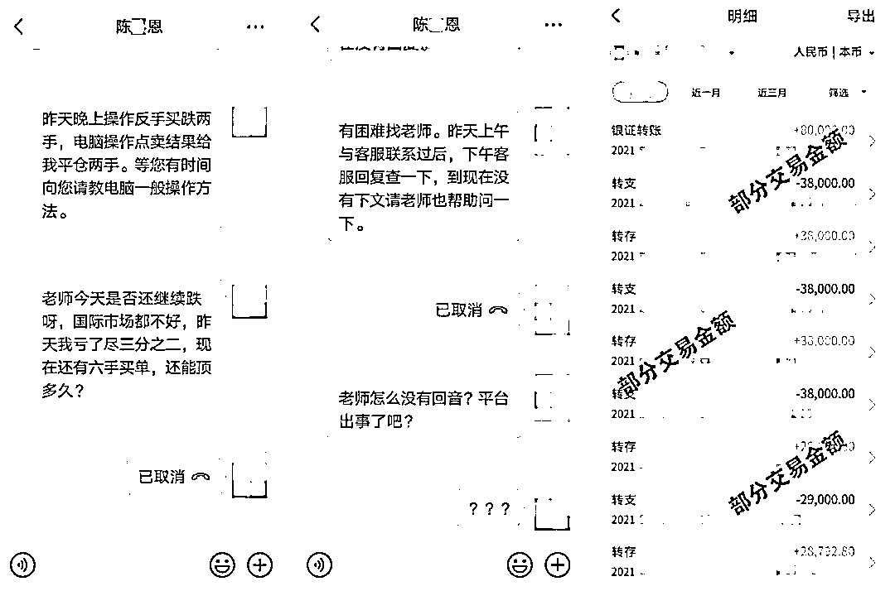

**精干警力协同作战**
— 拨开迷雾案情浮出水面 —

接警后，江阳公安立即抽调精干警力成立专案组展开侦查，通过分析研判、深挖线索、抽丝剥茧，逐步梳理、突出了一个**利用虚假投资理财 APP 实施网络电信诈骗**的犯罪团伙。

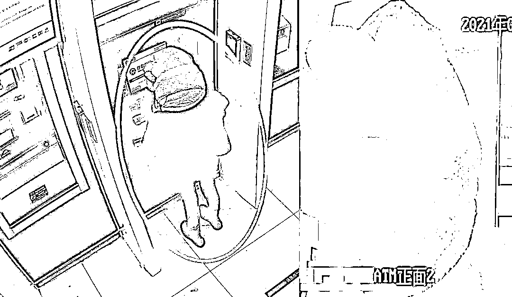

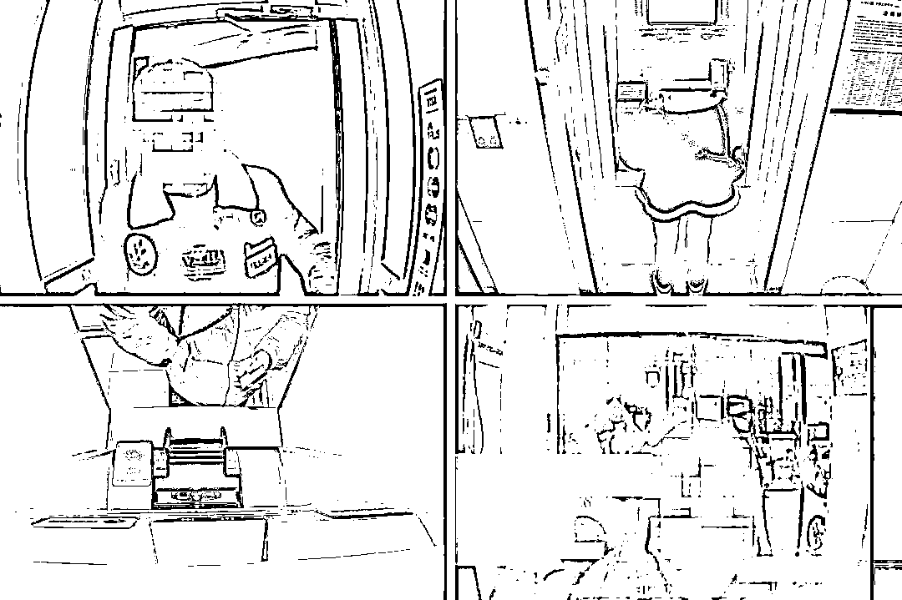经调查，该团伙以先进的电子设备为依托，利用网络电信手段发布虚假投资理财信息，进行网络授课，引导受害人注册登录 APP，待取得受害人的信任后，一步步诱导其在该 APP 中进行投资。**雷霆出击多管齐下**— 犯罪嫌疑人悉数落网 —

3 月 20 日，经过大量的基础工作，专案组在详细掌握了该诈骗团伙资金流向后，果断出击，在当地警方的密切协助下展开抓捕工作，将盘踞在合肥市的团伙骨干成员徐某、汪某成功抓获。

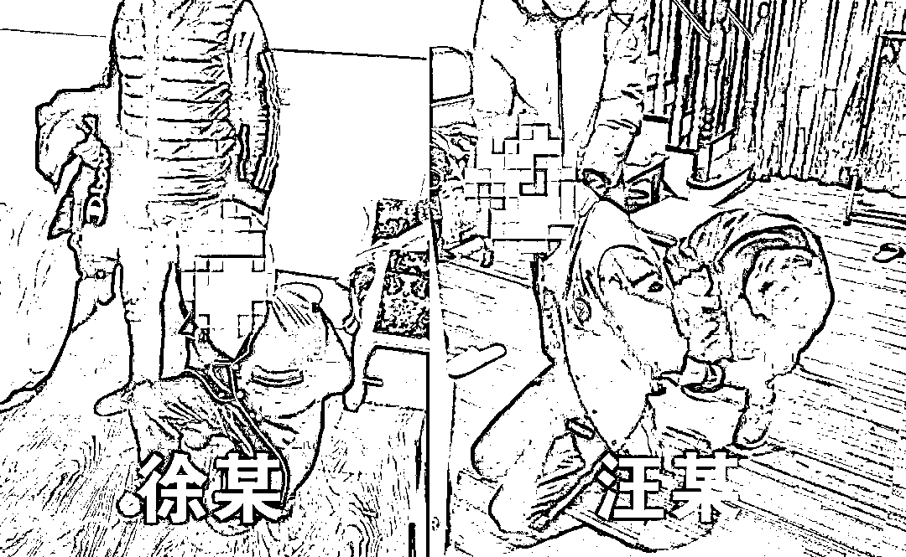

4 月 15 日，专案组在成功抓获刘某等**7 名犯罪嫌疑人**后，通过审讯深挖、研判扩线，进一步成功锁定多名犯罪嫌疑人，多地抓捕组同时展开收网行动，现场查获大量涉案银行卡、电话卡、手机等作案工具，一举捣毁犯罪窝点。

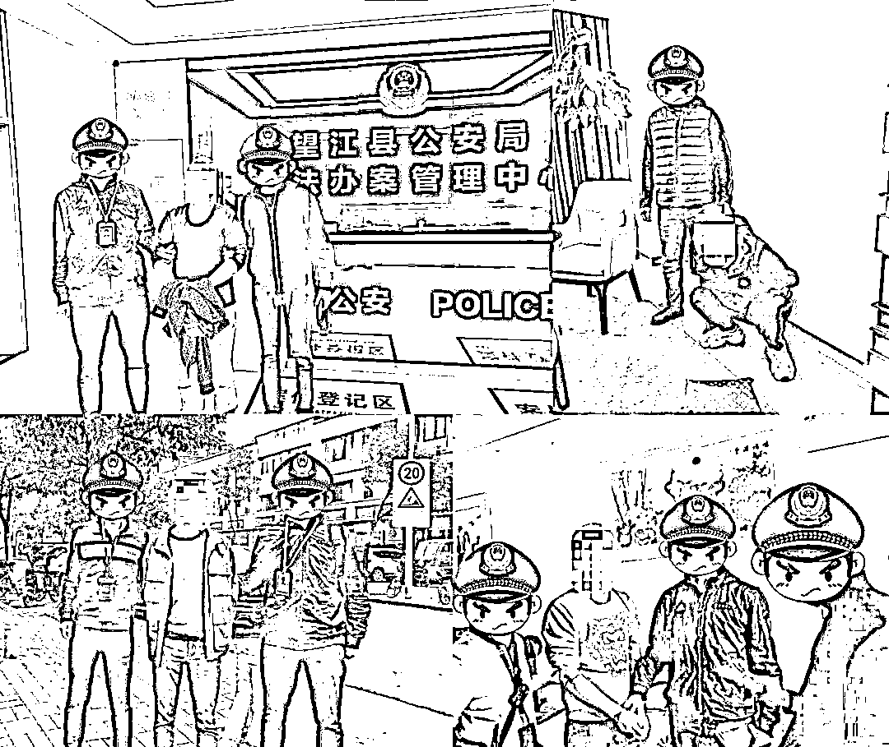

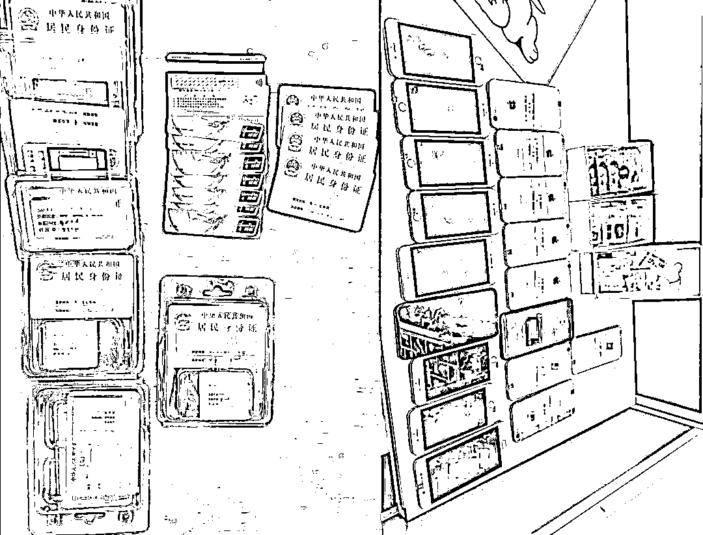

**诈骗手法环环相扣**
— 案情真相水落石出 —

据嫌疑人徐某供述，他在 2019 年起组织该团伙从事电信诈骗犯罪活动，招募团伙成员**组建诈骗窝点**，对国内不特定股民实施作案，诈骗金额**1000 余万元****。**

**引流：**先把作案微信号投放到各大网站，吸引关注

**布局：**拉人进群，组织“水军”在群里扮演投资者，晒出收益情况误导受害者

**诱导：**在受害者成功上钩下载 APP 后，通过“老师”诱导进行投资

**消失：**利用假数据骗取受害者信任，如果受害者发现本金和利息无法提现便直接消失

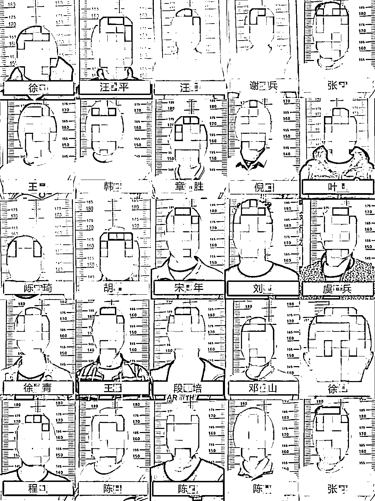

**目前，涉案的 25 名犯罪嫌疑人已被江阳警方依法采取刑事强制措施，案件正在进一步侦办中。**

来源 ：泸州市反诈中心，熊猫反诈，省反电信网络诈骗中心

← 向右滑动与灰产圈互动交流 →

