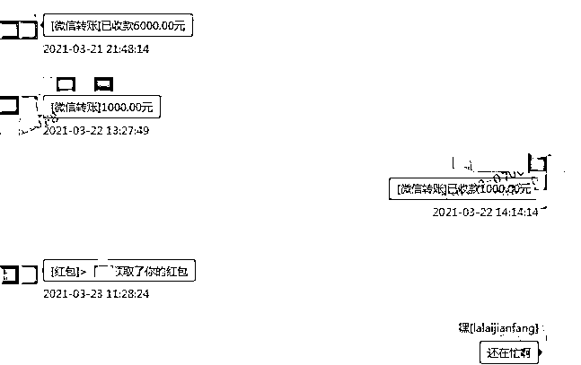

# “甜甜的恋爱”太伤人了……

> 原文：[`mp.weixin.qq.com/s?__biz=MzIyMDYwMTk0Mw==&mid=2247519506&idx=2&sn=4423c8f70bfd26713c61b8a9475550e8&chksm=97cb462aa0bccf3c69be8a9beaf933283617bb8c2f027618cf31af69ac2500622720887e7699&scene=27#wechat_redirect`](http://mp.weixin.qq.com/s?__biz=MzIyMDYwMTk0Mw==&mid=2247519506&idx=2&sn=4423c8f70bfd26713c61b8a9475550e8&chksm=97cb462aa0bccf3c69be8a9beaf933283617bb8c2f027618cf31af69ac2500622720887e7699&scene=27#wechat_redirect)

**“想找个本地人结婚”** 

****“正常的真心谈恋爱的来一个”****

******这是**某交友网站**上头像靓丽的**女网友“彤彤”**发布的签名动态。**

****

**“彤彤”的签名动态。**

****一时间不少****网友纷纷留言**：****“小姐姐，认真的吗，给个机会！”****“我是浙江杭州本地的。”****“杭州哪里的？”****……**

****

**网友们对“彤彤”的留言。**

**杭州萧山小伙小志（化名，27 岁）便是其中一个仰慕者，然而随着交往的深入，接下来的事令他彻底傻眼……****“人财两空”******

**今年 3 月，小志在某交友网站上结识了名为“彤彤”的女网友，**对方的动态大多晒着健身、美食、旅游等照片**，偶尔秀下大长腿、好身段，**俨然“白富美”人设**。**

****

**“彤彤”发布的照片。**

**见对方签名是“想找个本地人结婚”，所在地区写的是萧山。身为萧山本地人且一直相亲没有成功的小志顿感心动，于是主动发消息给对方，一来二去两人互加了微信，**开始****在****网络上交往。********彤彤自称是服装设计行业的，随着交往的深入，两人感情逐渐升温，言语越来越亲昵。彤彤便不再“见外”，**以开店、垫付租金、购买设备、化妆品等理由向小志借钱。******

************

************

******“彤彤”多次让小志转账。******

******对于“女友”的请求，**被爱情迷晕头脑的小志欣然应允，**先后通过微信红包、转账，京东白条扫码等方式向对方**转账 21718 元。**************可付出了那么多，**小志却连对方的面都没见到。**除了偶尔语音，两人大多时候都是通过文字交流。每次约线下见面，**对方便以工作忙、****临时有急事等各种理由推脱。**************渐渐地，小志也失去了耐心，要求对方还钱，**谁知对方却直接将他拉黑了**。惊觉上当受骗的小志急忙到派出所报案。******

********

****对方将小志拉黑。****

****“抠脚大汉”************

****接警后，萧山公安分局**义桥派出所**立即组织警力开展调查，民警孙涛根据受害人提供的账号等信息，对涉案资金流进行梳理分析，经过多方查证，终于明确了嫌疑人的身份。****

****7 月 2 日上午，民警在蜀山街道某小区将嫌疑人**赵某某（化姓，男，26 岁，萧山人）**抓获。**********现实中的赵****某某不是什么“白富美”，而是一名“抠脚大汉”。******************据赵某某交代，**因为没有工作手头拮据**，便在交友网站注册了一个女号，**通过网络获取的美女图片进行包装，吸引网友前来搭讪，借机骗取钱财。************随着警方调查的深入，赵某某又陆续供述出其他几名受害人，相关受害人遭遇跟小志大同小异，被赵某某以办理贷款、推销口罩等理由诈骗钱财，只是因为被骗金额较少等原因，当时未向警方报案。**义桥派出所民警一一联络相关受害人，在民警敦促下，相关受害人已全部报案。**************目前，**嫌疑人赵****某某因涉嫌诈骗罪已被依法****逮捕**，案件正在进一步侦办中。**********警方提醒：******************1、****网络交友要谨慎****，网上信息真假难辨，在无法甄别对方真实身份的情况下，不可轻信其甜言蜜语和各种说辞。**************2、****不要轻易添加陌生人 QQ、微信****，凡是涉及转账汇款都要提高警惕，保持理性，避免因一时冲动而造成经济损失。****************3、一旦发觉遭遇诈骗，应当妥善保存转账凭据、聊天记录等证据，****及时拨打 110 报警或 0571-96110 杭州反欺诈中心止损。**************准备网络相亲交友的看过来************一定要擦亮眼睛************你以为的清纯美女************很可能是个“抠脚大汉”************网恋有风险，交友需谨慎******

****来源：中国警察网、杭州公安、反诈骗先锋****

********

****← 向右滑动与灰产圈互动交流 →****

********